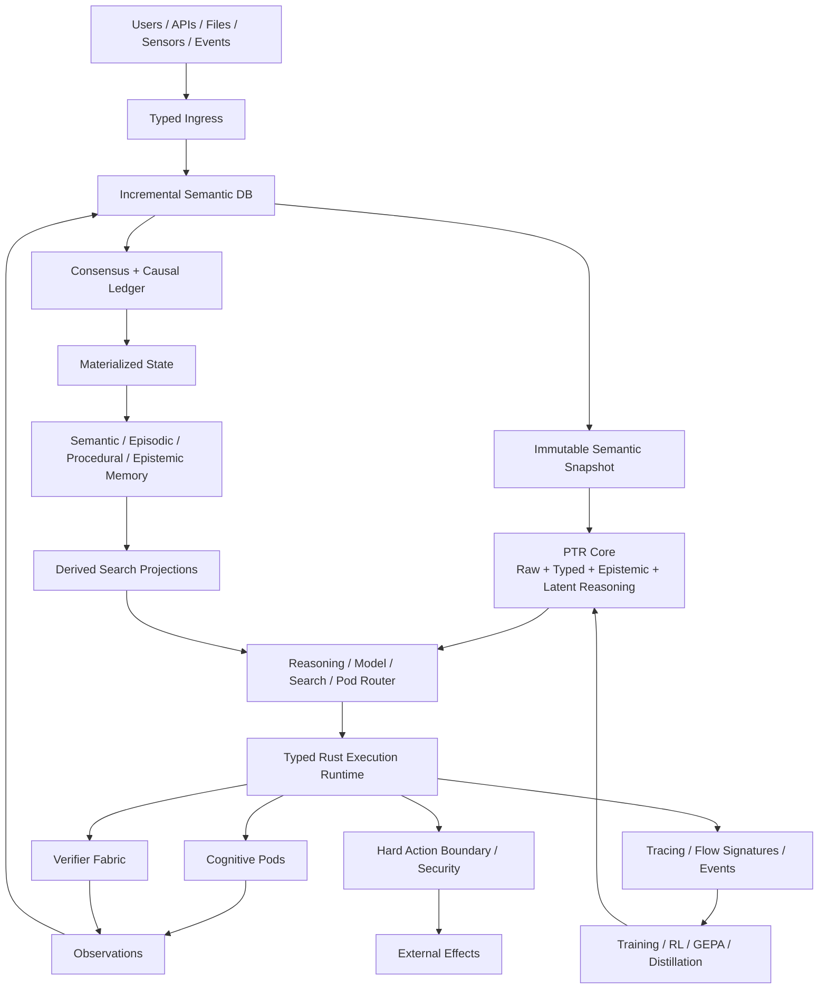

# PTR — Probabilistically Typed Reasoning

PTR is a research-first Rust monorepo for a **typed cognitive runtime and model architecture**. It is not intended to be another LLM tool wrapper. PTR makes language, typed semantic state, uncertainty, reasoning operators, external cognitive modules, lifecycle authority and verification separate first-class layers.

## Core architecture

## Core thesis

A PTR system keeps **raw language and typed semantics in parallel**, reasons over a **probabilistically typed latent workspace**, routes tasks to the most appropriate reasoning operator or specialist Pod, and permits external effects only after a **hard typed action boundary**.

## Architecture principles

1. **Hard shell, soft core.** Reasoning may be uncertain; effects require hard validity.
2. **Raw is never replaced by typed.** Typed state is a revisable interpretation.
3. **Revision is not Generation.** One scopes observed world state; the other scopes object lifecycle.
4. **Search is derived.** Retrieval produces evidence candidates, not truth.
5. **Committed causal state is authoritative.**
6. **Pods expose semantic contracts, not fragile tool names.**
7. **Backends are replaceable behind PTR-owned interfaces.**
8. **Unknown is a valid state.**
9. **Every architecture claim must be falsifiable through baselines and ablations.**

## Documentation map

- [Technical architecture](docs/TECHNICAL_ARCHITECTURE.md)
- [Architecture index](docs/architecture/README.md)
- [Component index](docs/components/README.md)
- [Live component status](docs/components/STATUS.md)
- [Technology stack](docs/TECH_STACK.md)
- [Component contracts](docs/COMPONENT_CONTRACTS.md)
- [Global invariants](docs/INVARIANTS.md)
- [Diagram index](docs/diagrams/README.md)
- [Definition of Done](docs/DEFINITION_OF_DONE.md)
- [Roadmap](docs/ROADMAP.md)
- [Development environment](docs/DEVELOPMENT_ENVIRONMENT.md)

## Component map

| Crate | Responsibility |
|---|---|
| [ptr-config](crates/ptr-config/README.md) | Parses and validates typed PTR configuration. |
| [ptr-runtime](crates/ptr-runtime/README.md) | Orchestrates the end-to-end PTR request, authority and effect lifecycle. |
| [ptr-types](crates/ptr-types/README.md) | Defines the stable semantic vocabulary shared across model, runtime, storage, verification, and network boundaries. |
| [ptr-protocol](crates/ptr-protocol/README.md) | Defines PodWire semantics and converts versioned wire messages into validated PTR domain values. |
| [ptr-ingress](crates/ptr-ingress/README.md) | Preserves raw evidence while building a provisional typed interpretation that can be cross-verified before reasoning. |
| [ptr-semdb](crates/ptr-semdb/README.md) | Maintains revisioned ground state and dependency-aware derived semantics using an incremental-compiler model. |
| [ptr-core](crates/ptr-core/README.md) | Research implementation of the model architecture: raw token states plus typed semantic slots, epistemic state, latent recurrence and operator routing. |
| [ptr-model-api](crates/ptr-model-api/README.md) | Keeps the runtime independent of any single inference server or model implementation. |
| [ptr-exec](crates/ptr-exec/README.md) | Runs PTR subsystems as supervised state machines with bounded typed mailboxes, explicit backpressure, cancellation and replay semantics. |
| [ptr-pods](crates/ptr-pods/README.md) | Defines specialist computational modules through semantic contracts rather than fragile tool names. |
| [ptr-router](crates/ptr-router/README.md) | Chooses how a task should be solved: neural reasoning, search, statistics, simulation, symbolic methods, Pods or combinations. |
| [ptr-verifier](crates/ptr-verifier/README.md) | Combines deterministic, executable, statistical and learned checks into explicit verification reports. |
| [ptr-feedback](crates/ptr-feedback/README.md) | Implements candidate populations, critique, patch/rewrite, selection and trajectory capture for test-time and training-time improvement. |
| [ptr-ledger](crates/ptr-ledger/README.md) | Records the authoritative ordered lifecycle of semantic changes and, in cluster mode, applies distributed consensus before state materialization. |
| [ptr-state](crates/ptr-state/README.md) | Projects committed ledger events into queryable current-state views without replacing the ledger as causal authority. |
| [ptr-memory](crates/ptr-memory/README.md) | Stores validated semantic, episodic, procedural and epistemic memory as lifecycle-managed domain objects. |
| [ptr-search](crates/ptr-search/README.md) | Routes queries across lexical, semantic, GPU, multimodal, distributed and structural search backends while keeping retrieval non-authoritative. |
| [ptr-storage](crates/ptr-storage/README.md) | Provides typed, content-addressed artifact references while abstracting physical storage locations. |
| [ptr-net](crates/ptr-net/README.md) | Connects PTR nodes and remote Pods with authenticated transport while leaving protocol semantics to ptr-protocol. |
| [ptr-events](crates/ptr-events/README.md) | Projects committed and runtime events into scalable streams for analytics, materializers, telemetry and training collectors. |
| [ptr-observe](crates/ptr-observe/README.md) | Records structured runtime execution without requiring natural-language chain-of-thought logging. |
| [ptr-inspect](crates/ptr-inspect/README.md) | Allows generic inspection and rendering of typed Rust values without collapsing the runtime into untyped JSON. |
| [ptr-security](crates/ptr-security/README.md) | Enforces the hard shell around uncertain reasoning: capabilities, permissions, trust levels, effects, secrets and sandbox requirements. |
| [ptr-server](crates/ptr-server/README.md) | Exposes PTR to clients through stable APIs without leaking internal crate boundaries or provider-specific interfaces. |

## Repository areas

- `crates/` — Rust domain/runtime/model crates; every crate has a README + diagram
- `bins/` — daemon, CLI, worker and benchmark binaries
- `model/` — model configs, modification specs, kernels and architecture experiments
- `training/` — SFT/RL/distillation/GEPA/DSPy/QAT workspace
- `datasets/` — schemas, cards, splits and versioned bundles
- `experiments/` — falsifiable architecture/system experiments
- `evaluations/` — technology evaluation per replaceable architecture slot
- `benchmarks/` — reusable suites
- `integrations/` — adapters and candidate technologies
- `research/` — novelty, prior art, baselines, falsification and ADRs
- `docs/` — architecture and diagrams
- `proto/` — wire schemas; domain types remain separate
- `sdk/` — client contracts; TypeScript SDK is CI-tested on Node 22/24
- `docs-site/` — dependency-free static documentation landing page
- `hardware/` — benchmark hardware profiles
- `fuzz/` — protocol fuzz targets kept outside the production workspace
- `release/` — release/SBOM/provenance configuration
- `tooling/` — optional editor/developer tooling; never runtime authority

## Current implementation phase

The Rust workspace is a compiling contract/scaffold baseline. Documentation intentionally describes the **target architecture** as well as current contracts. A documented subsystem is not considered implemented merely because a README exists; completion is tracked through tests, experiments and the Definition of Done.

## First implementation sequence

1. Strengthen `ptr-types`, `ptr-semdb`, `ptr-exec`, `ptr-protocol`, `ptr-ledger`, `ptr-state`.
2. Implement deterministic standalone lifecycle and chaos invariants.
3. Add baseline model backend and end-to-end request loop.
4. Implement PTR-Core A0: semantic slots, typed attention, latent recurrence and routing.
5. Run ablations before scaling.
6. Add cluster consensus after standalone correctness is proven.

## Reproducibility and evidence

- Rust is pinned by `rust-toolchain.toml` and `Cargo.lock`; CI tests Rust 1.85 MSRV plus current stable on Linux and Windows.
- Python training utilities are locked through `training/uv.lock`.
- Component and experiment registries are validated in CI.
- L001 currently has a scoped five-seed reference crash-tail run under `experiments/lifecycle/L001-revocation-crash/results/`; it remains `running`, not completed.
- Release builds generate CycloneDX SBOMs and GitHub/Sigstore attestations.
