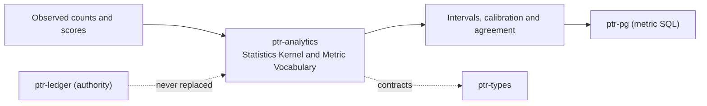

# ptr-analytics — Statistics Kernel and Metric Vocabulary

> **Role:** Computes every interval, calibration score and agreement coefficient the platform reports, and defines platform metrics in PTR terms for backends to compile.  
> **Maturity:** prototype; claims beyond the automated checks must be proven by the linked experiments and component evaluations.

<!-- PTR:STATUS:BEGIN -->
## Current implementation status

> **Generated section.** Source of truth: [`component.toml`](component.toml) plus code-derived metrics from `src/`. Run `python3 scripts/update_component_docs.py --write` after editing implementation metadata. Do not hand-edit inside this block.

**Maturity:** `prototype`  
**Last reviewed:** 2026-09-26  
**Code footprint:** 8 Rust source files · 883 nonblank source lines · 1 integration-test files · 37 `#[test]` markers

### Implemented now

- Wilson score interval and one-sided Clopper-Pearson upper bound by bisection over the full unit interval on an exact binomial tail; the public binomial CDF refuses a p that is NaN, infinite or outside [0, 1] rather than answering a confident 0 or 1
- Self-normalised Horvitz-Thompson rate with a Wilson interval on the Kish effective sample size, for calibration slices audited at a known rate; computed on the weights divided by the largest, so finite positive weights of any magnitude neither overflow nor underflow it
- Brier score and expected calibration error with equal-width or equal-mass binning; only occupied bins are materialised, so any positive bin count, usize::MAX included, is computed in memory proportional to the predictions
- Krippendorff's alpha for nominal data with missing values and direct single-category refusal
- Welford running moments with an exact parallel merge whose cross term is evaluated so that no intermediate overflows unless the merged sum of squared deviations does; a value or merge that would make the mean or the sum of squared deviations nonfinite, or count more than u64::MAX values, is refused and leaves the summary unchanged
- Metric vocabulary (auto-propose share, escalation share, conflict rate, adjudicated harm rate, revert share) with grouping and an optional trailing window of days, compiled to SQL by ptr-pg and to intervals here; revert share is documented as a descriptive operational signal, not a harm rate
- Every estimator refuses empty, non-finite or out-of-range input, including a quantile whose square overflows, with a typed StatsError code; no interval is built from a nonfinite intermediate

### Missing for the target architecture

- Stratified and sequential (anytime-valid) estimators
- A versioned metric catalog shared with dashboards

### Next milestones

- Add confidence sequences for continuously monitored rates
- Version the metric catalog and record the version with every reported number

### Linked experiments

- [F002](../../experiments/feedback/F002-weak-supervision/README.md) — `planned`
- [F003](../../experiments/feedback/F003-calibrated-arbiter/README.md) — `planned`

### Technology evaluations

- [analytics-mirror](../../evaluations/components/analytics-mirror/README.md) — `open`

### Decision records

- [ADR-0017-certified-agent-branches.md](../../research/decisions/ADR-0017-certified-agent-branches.md)
- [ADR-0019-adapter-lineage-and-weak-supervision.md](../../research/decisions/ADR-0019-adapter-lineage-and-weak-supervision.md)

### Current automated checks

- unit tests beside every estimator
- tests/metrics.rs interval and metric-row integration tests
- workspace fmt/check/test/clippy

<!-- PTR:STATUS:END -->

## Position in PTR

Dedicated diagram source: [`docs/diagrams/components/ptr-analytics.mmd`](../../docs/diagrams/components/ptr-analytics.mmd)

**Upstream:** none (pure computation)  
**Downstream:** ptr-branch, ptr-labeling, ptr-pg

## Mission

Keep one implementation of every statistic the platform reports, so a harm rate, a calibration score and an agreement coefficient mean the same thing wherever they appear.

PTR keeps this responsibility in its own crate so the semantics remain stable even when an external library or implementation is replaced.

## Responsibilities

- binomial and weighted rate intervals
- calibration and agreement scores
- running moments
- metric definitions and their meaning

## Explicit non-responsibilities

- SQL or any storage dialect
- deciding thresholds (ptr-branch)
- semantic state

## Data flow

| Direction | Contract |
|---|---|
| Input | Counts, weighted outcomes, predicted probabilities and codings |
| Output | Point estimates with intervals, calibration and agreement scores, metric rows |
| Failure | Explicit typed error / rejected state; no silent fallback that changes semantics |
| Observability | Standard PTR tracing fields and a stable component span |

## Technical approach

- closed-form or bisection estimators with no numeric dependency
- metric IR compiled by each backend
- typed refusal of degenerate input

External projects are **candidates**, not architectural authority. The PTR-owned types must remain usable with a replacement backend.

## Core invariants

1. An interval always contains its point estimate.
2. No estimator silently accepts non-finite input.
3. A metric's meaning is defined here and nowhere else.

These invariants are executable through the unit and integration tests listed in the status block.

## Failure model

The component fails closed for semantic or effect-safety violations. Infrastructure failures surface as typed errors that preserve revision, generation and provenance context. Retries must be idempotent whenever the operation may cross a process or network boundary.

## Security and privacy

- Treat external inputs and backend outputs as untrusted until validated.
- Do not put raw secrets or private evidence into generic tracing or inspection.
- Derived artifacts are as sensitive as the inputs they were derived from.
- External effects pass through `ptr-security` even if this component already performed local validation.

## Experiments

- [F002](../../experiments/feedback/F002-weak-supervision/README.md)
- [F003](../../experiments/feedback/F003-calibrated-arbiter/README.md)

## Technology evaluation

- [analytics-mirror](../../evaluations/components/analytics-mirror/README.md)

## Related architecture

- [35 — Agentic substrate](../../docs/architecture/35-agentic-substrate.md)
- [System architecture](../../docs/architecture/00-system.md)
- [Component contracts](../../docs/COMPONENT_CONTRACTS.md)
- [Global invariants](../../docs/INVARIANTS.md)
