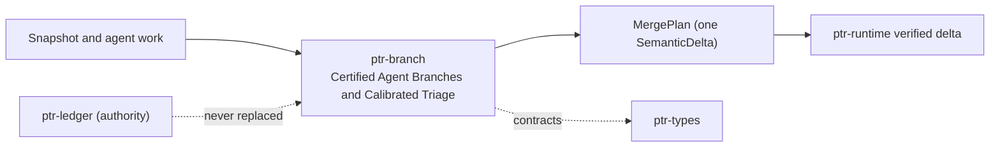

# ptr-branch — Certified Agent Branches and Calibrated Triage

> **Role:** Lets agents speculate on private overlays of an immutable semantic snapshot and merges their work only as certified, verified semantic deltas.  
> **Maturity:** prototype; claims beyond the automated checks must be proven by the linked experiments and component evaluations.

<!-- PTR:STATUS:BEGIN -->
## Current implementation status

> **Generated section.** Source of truth: [`component.toml`](component.toml) plus code-derived metrics from `src/`. Run `python3 scripts/update_component_docs.py --write` after editing implementation metadata. Do not hand-edit inside this block.

**Maturity:** `prototype`  
**Last reviewed:** 2026-09-26  
**Code footprint:** 7 Rust source files · 2336 nonblank source lines · 4 integration-test files · 79 `#[test]` markers

### Implemented now

- Branch overlay on one SemanticSnapshot recording value digests of every read, range digests of every scanned prefix, input-set digests of every touched key and every relied-on lifecycle generation
- Value digests hash the canonical journal bytes neural-state admission digests, so a branch and an admitted neural state never disagree about whether an input changed
- Put and Remove only on keys the branch read; commutative counter additions and set insertions/removals rebase onto the target value at merge time; a refused operation records nothing, not even the reads of its key's inputs; a set whose encoding is longer than the journal's MAX_DELTA_BYTES is refused (InvalidValue, set_value returns None) rather than encoded with truncated lengths; staging checks the set alone, and a merge delta longer than that limit with its keys and framing is refused by MergePlan::digest and at commit, never truncated
- A branch relies on at most one generation of a lifecycle target: declaring another is refused (ConflictingReliance) and keeps the first, since two generations are never live together
- Reserved request: and pod-output: namespaces cannot be written by a branch: staging, SealedBranch::from_parts and certification each refuse an operation on one (ReservedNamespace), however well the declared digests match the store
- SealedBranch has private fields and is built only by Branch::seal and SealedBranch::from_parts (sealing goes through it, storage rebuilds with it); the constructor refuses an operation on a reserved key (ReservedNamespace), a Put or Remove of an unread key (UnreadTarget), a set operation with an empty member (InvalidMember), and an operated key without a recorded base value or input set, a base value or input set for a key no operation touches, or a touched key whose base value differs from its read (MalformedSeal); relied holds one generation per target by type
- Digest types keep public constructors, which storage needs to rebuild them: a digest commits to data anyone who can read it can compute and authenticates nothing, so what a sealed branch may write is bounded by the sealing invariants and certification, not by keeping digests hard to make
- Certification refuses a changed read, a phantom under a scanned prefix, a touched key whose input set changed (a merge keeps the target's dependency set, so a value never stands under inputs it was not computed from), a revoked or superseded relied-on generation, or a snapshot older than the base; it rechecks every sealing invariant (SealedBranch::recheck) before consulting the target, so a branch that skipped the constructor is still refused, and refuses an unread input of an operated key (Conflict); otherwise it yields one SemanticDelta plus the revision it was certified against, and MergePlan::digest binds the branch id and every declared dependency including touched keys' input sets, so an approval cannot be replayed for another branch
- End-to-end test commits a certified plan through Runtime::apply_verified_semantic_delta and shows a plan certified before another commit is refused; using that path is the caller's obligation, because MergePlan exposes its delta and PtrRuntime::apply_semantic_delta is public and unverified
- Verifier-bounded triage: only a Pass at full-semantic or deterministic level with no hard finding is eligible for auto-proposal
- Uniform calibration slice of eligible branches with a deterministic per-branch draw, logged auto-propose propensities and adjudication samples; a draw outside [0, 1) is refused
- Threshold selection on a fixed grid by conformal risk control or by Learn-then-Test with Clopper-Pearson bounds; Learn-then-Test skips exactly the thresholds its own bound cannot pass with no harm, so it never certifies nothing because a closed-form start fell one sample short
- Every policy, including one rebuilt from storage by PolicyRecord::from_parts, holds a threshold that is a finite score in [0, 1]; NaN, infinite or out-of-range thresholds are refused (InvalidThreshold) rather than silently never or always auto-proposing
- PolicyRecord names a policy's version, threshold rule and levels and exactly which adjudicated calibration-slice branches chose its threshold; held_out returns the adjudications it was not calibrated on, the only ones its harm rate may be estimated from
- Off-policy evaluation by IPS, SNIPS and doubly robust estimates with a positivity check; a log with a propensity outside [0, 1], a propensity so small that its importance weight is infinite, or a nonfinite reward is refused rather than estimated; SNIPS and the effective sample size are computed on weights divided by the largest, the doubly robust estimate on weights divided by the largest and residuals divided by twice the log's length before any product, so no intermediate overflows an estimate that is itself finite, and an estimate that is still not finite is refused (NonFiniteEstimate) rather than returned

### Missing for the target architecture

- A merge plan consumable only by a verifying runtime entry point, so committing one without verification is impossible rather than a caller obligation
- Opening a branch only through an entry point that takes its author from the admitted execution session; Branch::open records whatever PrincipalId its caller passes, so naming the admitted principal is a caller obligation
- Branch leases, expiry and garbage collection
- Typed merge operators beyond counters and sets
- Predicate digests beyond key prefixes
- An optional intent per sealed branch, written by its agent and shown to whoever reviews an escalated or calibration-slice branch; certification, triage and verification never read it
- The reason behind a verification-decided triage (status, level, hard-finding codes) and behind a certification refusal (conflicting keys, changed lifecycle targets, an unread overwritten key), stored as structured fields with the triage row and the outcome rather than as free text

### Next milestones

- Run S003 against serial execution and last-writer-wins baselines
- Run F003 on adjudicated calibration slices

### Linked experiments

- [S003](../../experiments/semdb/S003-certified-branches/README.md) — `planned`
- [F003](../../experiments/feedback/F003-calibrated-arbiter/README.md) — `planned`

### Technology evaluations

- None recorded.

### Decision records

- [ADR-0017-certified-agent-branches.md](../../research/decisions/ADR-0017-certified-agent-branches.md)
- [ADR-0002-authority-hierarchy.md](../../research/decisions/ADR-0002-authority-hierarchy.md)

### Current automated checks

- tests/certification.rs conflict, phantom, input-set and lifecycle cases
- tests/sealing.rs and certify unit tests: every sealing invariant refused by the constructor and by certification on its own
- tests/pipeline.rs end-to-end verified merge through ptr-runtime
- tests/triage.rs eligibility, calibration and off-policy evaluation
- workspace fmt/check/test/clippy

<!-- PTR:STATUS:END -->

## Position in PTR

Dedicated diagram source: [`docs/diagrams/components/ptr-branch.mmd`](../../docs/diagrams/components/ptr-branch.mmd)

**Upstream:** ptr-semdb, ptr-verifier, ptr-analytics, ptr-types  
**Downstream:** ptr-runtime (verified delta publication), ptr-pg (branch store)

## Mission

Let many agents work concurrently without any of them writing state: each proposes, certification decides whether the proposal still applies, verification decides whether it is correct, and the runtime publishes it.

PTR keeps this responsibility in its own crate so the semantics remain stable even when an external library or implementation is replaced.

## Responsibilities

- branch overlays and dependency declarations
- certification against newer snapshots
- merge plans
- triage, calibration and off-policy evaluation

## Explicit non-responsibilities

- publishing semantic state
- producing verification reports
- storage of branches (ptr-pg)

## Data flow

| Direction | Contract |
|---|---|
| Input | SemanticSnapshot, staged operations, VerificationReport, adjudications |
| Output | SealedBranch, Certification, MergePlan, TriageOutcome, calibrated thresholds |
| Failure | Explicit typed error / rejected state; no silent fallback that changes semantics |
| Observability | Standard PTR tracing fields and a stable component span |

## Technical approach

- optimistic certification over value, range and lifecycle digests
- commutative rebase for counters and sets
- finite-sample calibrated thresholds with a uniform audit slice

External projects are **candidates**, not architectural authority. The PTR-owned types must remain usable with a replacement backend.

## Core invariants

1. A branch never writes semantic state.
2. A merge plan is committed through verified delta publication. This is the caller's obligation, not a type-level guarantee: the runtime's unverified `apply_semantic_delta` is public.
3. Triage never moves a branch past verification.

These invariants are executable through the unit and integration tests listed in the status block.

## Failure model

The component fails closed for semantic or effect-safety violations. Infrastructure failures surface as typed errors that preserve revision, generation and provenance context. Retries must be idempotent whenever the operation may cross a process or network boundary.

## Security and privacy

- Treat external inputs and backend outputs as untrusted until validated.
- Do not put raw secrets or private evidence into generic tracing or inspection.
- Derived artifacts are as sensitive as the inputs they were derived from.
- External effects pass through `ptr-security` even if this component already performed local validation.

## Experiments

- [S003](../../experiments/semdb/S003-certified-branches/README.md)
- [F003](../../experiments/feedback/F003-calibrated-arbiter/README.md)

## Technology evaluation

- No backend slot of its own; the algorithm is PTR-owned and measured by its experiments.

## Related architecture

- [35 — Agentic substrate](../../docs/architecture/35-agentic-substrate.md)
- [System architecture](../../docs/architecture/00-system.md)
- [Component contracts](../../docs/COMPONENT_CONTRACTS.md)
- [Global invariants](../../docs/INVARIANTS.md)
