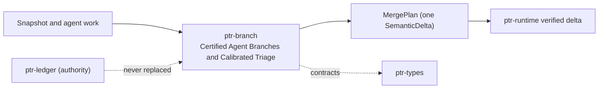

# ptr-branch — Certified Agent Branches and Calibrated Triage

> **Role:** Lets agents speculate on private overlays of an immutable semantic snapshot and merges their work only as certified, verified semantic deltas.  
> **Maturity:** prototype; claims beyond the automated checks must be proven by the linked experiments and component evaluations.

<!-- PTR:STATUS:BEGIN -->
## Current implementation status

> **Generated section.** Source of truth: [`component.toml`](component.toml) plus code-derived metrics from `src/`. Run `python3 scripts/update_component_docs.py --write` after editing implementation metadata. Do not hand-edit inside this block.

**Maturity:** `prototype`  
**Last reviewed:** 2026-09-25  
**Code footprint:** 7 Rust source files · 1462 nonblank source lines · 3 integration-test files · 38 `#[test]` markers

### Implemented now

- Branch overlay on one SemanticSnapshot recording value digests of every read, range digests of every scanned prefix and every relied-on lifecycle generation
- Value digests hash the canonical journal bytes neural-state admission digests, so a branch and an admitted neural state never disagree about whether an input changed
- Put and Remove only on keys the branch read; commutative counter additions and set insertions/removals rebase onto the target value at merge time
- Reserved request: and pod-output: namespaces cannot be written by a branch
- Certification refuses a changed read, a phantom under a scanned prefix, a revoked or superseded relied-on generation, or a snapshot older than the base; otherwise it yields one SemanticDelta plus the revision it was certified against
- End-to-end test commits a certified plan only through Runtime::apply_verified_semantic_delta and shows a plan certified before another commit is refused
- Verifier-bounded triage: only a Pass at full-semantic or deterministic level with no hard finding is eligible for auto-proposal
- Uniform calibration slice of eligible branches with a deterministic per-branch draw, logged auto-propose propensities and adjudication samples
- Threshold selection on a fixed grid by conformal risk control or by Learn-then-Test with Clopper-Pearson bounds
- Off-policy evaluation by IPS, SNIPS and doubly robust estimates with a positivity check

### Missing for the target architecture

- Branch leases, expiry and garbage collection
- Typed merge operators beyond counters and sets
- Predicate digests beyond key prefixes

### Next milestones

- Run S003 against serial execution and last-writer-wins baselines
- Run F003 on adjudicated calibration slices

### Linked experiments

- [S003](../../experiments/semdb/S003-certified-branches/README.md) — `planned`
- [F003](../../experiments/feedback/F003-calibrated-arbiter/README.md) — `planned`

### Technology evaluations

- None recorded.

### Decision records

- [ADR-0017-certified-agent-branches.md](../../research/decisions/ADR-0017-certified-agent-branches.md)
- [ADR-0002-authority-hierarchy.md](../../research/decisions/ADR-0002-authority-hierarchy.md)

### Current automated checks

- tests/certification.rs conflict, phantom and lifecycle cases
- tests/pipeline.rs end-to-end verified merge through ptr-runtime
- tests/triage.rs eligibility, calibration and off-policy evaluation
- workspace fmt/check/test/clippy

<!-- PTR:STATUS:END -->

## Position in PTR

Dedicated diagram source: [`docs/diagrams/components/ptr-branch.mmd`](../../docs/diagrams/components/ptr-branch.mmd)

**Upstream:** ptr-semdb, ptr-verifier, ptr-analytics, ptr-types  
**Downstream:** ptr-runtime (verified delta publication), ptr-pg (branch store)

## Mission

Let many agents work concurrently without any of them writing state: each proposes, certification decides whether the proposal still applies, verification decides whether it is correct, and the runtime publishes it.

PTR keeps this responsibility in its own crate so the semantics remain stable even when an external library or implementation is replaced.

## Responsibilities

- branch overlays and dependency declarations
- certification against newer snapshots
- merge plans
- triage, calibration and off-policy evaluation

## Explicit non-responsibilities

- publishing semantic state
- producing verification reports
- storage of branches (ptr-pg)

## Data flow

| Direction | Contract |
|---|---|
| Input | SemanticSnapshot, staged operations, VerificationReport, adjudications |
| Output | SealedBranch, Certification, MergePlan, TriageOutcome, calibrated thresholds |
| Failure | Explicit typed error / rejected state; no silent fallback that changes semantics |
| Observability | Standard PTR tracing fields and a stable component span |

## Technical approach

- optimistic certification over value, range and lifecycle digests
- commutative rebase for counters and sets
- finite-sample calibrated thresholds with a uniform audit slice

External projects are **candidates**, not architectural authority. The PTR-owned types must remain usable with a replacement backend.

## Core invariants

1. A branch never writes semantic state.
2. A merge plan reaches state only through verified delta publication.
3. Triage never moves a branch past verification.

These invariants are executable through the unit and integration tests listed in the status block.

## Failure model

The component fails closed for semantic or effect-safety violations. Infrastructure failures surface as typed errors that preserve revision, generation and provenance context. Retries must be idempotent whenever the operation may cross a process or network boundary.

## Security and privacy

- Treat external inputs and backend outputs as untrusted until validated.
- Do not put raw secrets or private evidence into generic tracing or inspection.
- Derived artifacts are as sensitive as the inputs they were derived from.
- External effects pass through `ptr-security` even if this component already performed local validation.

## Experiments

- [S003](../../experiments/semdb/S003-certified-branches/README.md)
- [F003](../../experiments/feedback/F003-calibrated-arbiter/README.md)

## Technology evaluation

- No backend slot of its own; the algorithm is PTR-owned and measured by its experiments.

## Related architecture

- [35 — Agentic substrate](../../docs/architecture/35-agentic-substrate.md)
- [System architecture](../../docs/architecture/00-system.md)
- [Component contracts](../../docs/COMPONENT_CONTRACTS.md)
- [Global invariants](../../docs/INVARIANTS.md)
