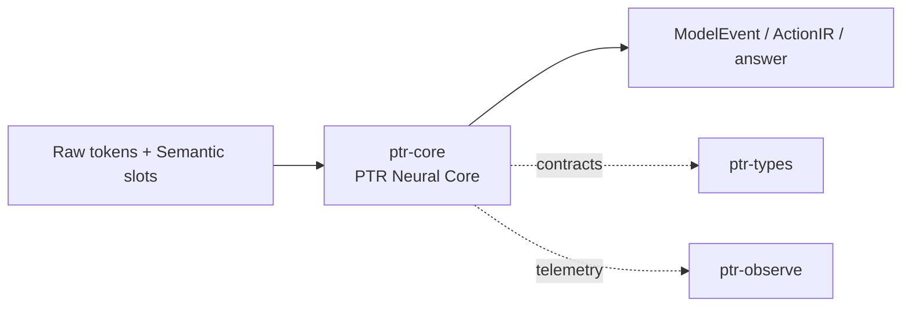

# ptr-core — PTR Neural Core

> **Role:** Research implementation of the model architecture: raw token states plus typed semantic slots, epistemic state, latent recurrence and operator routing.  
> **Maturity:** architecture + contract scaffold; production behavior must be proven by the linked experiments and component evaluations.

<!-- PTR:STATUS:BEGIN -->
## Current implementation status

> **Generated section.** Source of truth: [`component.toml`](component.toml) plus code-derived metrics from `src/`. Run `python3 scripts/update_component_docs.py --write` after editing implementation metadata. Do not hand-edit inside this block.

**Maturity:** `research-scaffold`  
**Last reviewed:** 2026-09-19  
**Code footprint:** 13 Rust source files · 211 nonblank source lines · 1 integration-test files · 1 test markers (`#[test]`, `#[tokio::test]`)

### Implemented now

- PTR-Core family/config structures for AR and diffusion research paths
- SemanticSlot uses orthogonal shared SemanticRole, EpistemicState and UncertaintyKind axes plus generation, validity, confidence, latent vector and provenance
- EpistemicWorkspace and live-slot filter
- ReasoningBudget and latent-step accounting scaffold
- Shared ptr-types ReasoningOperator taxonomy with weighted neural router decision
- Branch frontier pruning and probability normalization helpers
- ActionIr with explicit target/generation/revision plus CoreVerification output contracts
- External model/burn-a0 research package implements trainable raw↔typed cross-attention, epistemic/validity/provenance metadata, typed attention bias, latent refinement and router gradients

### Missing for the target architecture

- Production-integrated Burn/CubeCL PTR model beyond the isolated A0 research package
- Role/epistemic/uncertainty/lifecycle-specific embeddings, masks and typed attention constraints beyond the current learned metadata bias
- Task-trained recurrent latent reasoning beyond the current shared refinement layer
- Task-trained operator router plus ActionIR/verifier neural heads
- PTR-Diff denoising implementation and training objective
- Checkpoint/load/save and numerical parity reference

### Next milestones

- Integrate Burn A0 with dataset-backed training and matched no-slot baseline for M001
- Build matched plain-transformer baseline at equal parameter/compute budget
- Run M001–M005 ablations before scaling model size

### Linked experiments

- [M001](../../experiments/model/M001-semantic-slots/README.md) — `planned`
- [M002](../../experiments/model/M002-typed-attention/README.md) — `planned`
- [M003](../../experiments/model/M003-latent-recurrence/README.md) — `planned`
- [M004](../../experiments/model/M004-operator-router/README.md) — `planned`
- [M005](../../experiments/model/M005-epistemic-calibration/README.md) — `planned`
- [M006](../../experiments/model/M006-ptr-diff/README.md) — `planned`
- [M007](../../experiments/model/M007-model-event-stream/README.md) — `planned`
- [E001](../../experiments/system/E001-end-to-end/README.md) — `planned`
- [E003](../../experiments/system/E003-token-efficiency/README.md) — `planned`
- [E004](../../experiments/system/E004-long-horizon/README.md) — `planned`

### Technology evaluations

- [model-framework](../../evaluations/components/model-framework/README.md) — `open`
- [inference-serving](../../evaluations/components/inference-serving/README.md) — `open`

### Decision records

- [ADR-0003-raw-and-typed.md](../../research/decisions/ADR-0003-raw-and-typed.md)
- [ADR-0007-model-event-stream.md](../../research/decisions/ADR-0007-model-event-stream.md)
- [ADR-0004-backend-independence.md](../../research/decisions/ADR-0004-backend-independence.md)

### Current automated checks

- Burn A0 NdArray forward/autodiff/synthetic optimizer tests run in separate model workflow
- workspace fmt/check/test/clippy

<!-- PTR:STATUS:END -->

## Position in PTR

Dedicated diagram source: [`docs/diagrams/components/ptr-core.mmd`](../../docs/diagrams/components/ptr-core.mmd)

**Upstream:** ptr-semdb, ptr-model-api  
**Downstream:** ptr-router, ptr-exec, ptr-verifier

## Mission

Research implementation of the model architecture: raw token states plus typed semantic slots, epistemic state, latent recurrence and operator routing.

PTR keeps this responsibility in its own crate so the semantics remain stable even when an external library or implementation is replaced.

## Responsibilities

- semantic slots that encode shared ptr-types cognitive axes
- role/epistemic/uncertainty/lifecycle-aware typed attention
- epistemic workspace
- latent recurrent reasoning
- operator router
- branch/probabilistic reasoning primitives
- action/verifier heads
- PTR-AR and PTR-Diff research families

## Explicit non-responsibilities

- durable truth
- permissions
- external side effects
- distributed consensus

## Data flow

| Direction | Contract |
|---|---|
| Input | Semantic snapshot, raw token stream, observations, model configuration |
| Output | ModelEvent stream, typed hypotheses, operator requests, ActionIR candidates, natural-language output |
| Failure | Explicit typed error / rejected state; no silent fallback that changes semantics |
| Observability | Standard PTR tracing fields and a stable component span |

## Technical approach

- Burn/CubeCL Rust-native research path
- PyTorch reference implementation path
- SGLang/vLLM used only as serving backends for compatible models

External projects are **candidates**, not architectural authority. The PTR-owned traits and domain types must remain usable with a replacement backend.

## Core invariants

1. The model may be uncertain; effects may not bypass the hard runtime boundary.
2. Typed slots remain distinguishable from raw language states.
3. Every architectural modification must support ablation.

These invariants should be executable wherever possible through unit, property, lifecycle or chaos tests.

## Failure model

The component must fail closed for semantic or effect-safety violations. Infrastructure failures should surface as typed errors that preserve request, revision, generation and provenance context. Retries must be idempotent whenever the operation may cross a process or network boundary.

## Performance model

Measure before optimizing. Benchmarks should record at least latency distribution, throughput, allocations/resident memory, queue depth or working-set size where relevant, and the cost of verification. Performance optimizations may not bypass generation, revision, capability or evidence checks.

## Security and privacy

- Treat external inputs and backend outputs as untrusted until validated.
- Do not put raw secrets/private evidence into generic tracing or inspection.
- Preserve provenance on every promotion from raw/possible evidence to stronger semantic state.
- External effects pass through `ptr-security` even if this component already performed local validation.

## Technology evaluation

- [model-framework](../../evaluations/components/model-framework/README.md)
- [inference-serving](../../evaluations/components/inference-serving/README.md)

A new candidate should be added with a reproducible benchmark and failure-semantics analysis rather than replacing the default ad hoc.

## Tests required before production use

- Contract/unit tests for all domain transitions.
- Invalid, stale-generation and stale-revision cases.
- Cancellation/retry behavior.
- Property tests for invariants where practical.
- Cross-backend equivalence if more than one backend exists.
- Observability and redaction checks.

## Related architecture

- [System architecture](../../docs/architecture/00-system.md)
- [Technical architecture](../../docs/TECHNICAL_ARCHITECTURE.md)
- [Component contracts](../../docs/COMPONENT_CONTRACTS.md)
- [Global invariants](../../docs/INVARIANTS.md)

