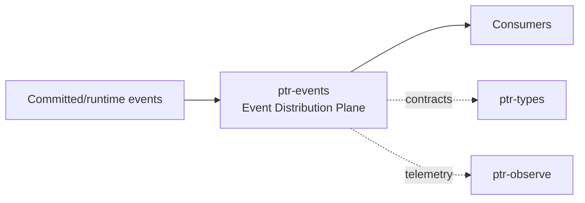

# ptr-events — Event Distribution Plane

> **Role:** Projects committed and runtime events into scalable streams for analytics, materializers, telemetry and training collectors.  
> **Maturity:** architecture + contract scaffold; production behavior must be proven by the linked experiments and component evaluations.

## Position in PTR

Dedicated diagram source: [`docs/diagrams/components/ptr-events.mmd`](../../docs/diagrams/components/ptr-events.mmd)

**Upstream:** ptr-ledger, ptr-observe  
**Downstream:** training collectors, analytics, materializers

## Mission

Projects committed and runtime events into scalable streams for analytics, materializers, telemetry and training collectors.

PTR keeps this responsibility in its own crate so the semantics remain stable even when an external library or implementation is replaced.

## Responsibilities

- event envelope
- stream/topic abstraction
- subscriber offsets
- projection from authoritative events

## Explicit non-responsibilities

- authoritative ordering of semantic writes
- request execution
- model reasoning

## Data flow

| Direction | Contract |
|---|---|
| Input | Committed events and non-authoritative telemetry events |
| Output | Persistent event streams for consumers |
| Failure | Explicit typed error / rejected state; no silent fallback that changes semantics |
| Observability | Standard PTR tracing fields and a stable component span |

## Technical approach

- Apache Iggy primary candidate
- in-process reference bus
- future enterprise bridges such as RocketMQ/Kafka

External projects are **candidates**, not architectural authority. The PTR-owned traits and domain types must remain usable with a replacement backend.

## Core invariants

1. Event streaming cannot create authority.
2. Consumer replay is idempotent.
3. Authoritative and telemetry event classes remain distinguishable.

These invariants should be executable wherever possible through unit, property, lifecycle or chaos tests.

## Failure model

The component must fail closed for semantic or effect-safety violations. Infrastructure failures should surface as typed errors that preserve request, revision, generation and provenance context. Retries must be idempotent whenever the operation may cross a process or network boundary.

## Performance model

Measure before optimizing. Benchmarks should record at least latency distribution, throughput, allocations/resident memory, queue depth or working-set size where relevant, and the cost of verification. Performance optimizations may not bypass generation, revision, capability or evidence checks.

## Security and privacy

- Treat external inputs and backend outputs as untrusted until validated.
- Do not put raw secrets/private evidence into generic tracing or inspection.
- Preserve provenance on every promotion from raw/possible evidence to stronger semantic state.
- External effects pass through `ptr-security` even if this component already performed local validation.

## Technology evaluation

- [event-streaming](../../evaluations/components/event-streaming/README.md)

A new candidate should be added with a reproducible benchmark and failure-semantics analysis rather than replacing the default ad hoc.

## Tests required before production use

- Contract/unit tests for all domain transitions.
- Invalid, stale-generation and stale-revision cases.
- Cancellation/retry behavior.
- Property tests for invariants where practical.
- Cross-backend equivalence if more than one backend exists.
- Observability and redaction checks.

## Related architecture

- [System architecture](../../docs/architecture/00-system.md)
- [Technical architecture](../../docs/TECHNICAL_ARCHITECTURE.md)
- [Component contracts](../../docs/COMPONENT_CONTRACTS.md)
- [Global invariants](../../docs/INVARIANTS.md)

