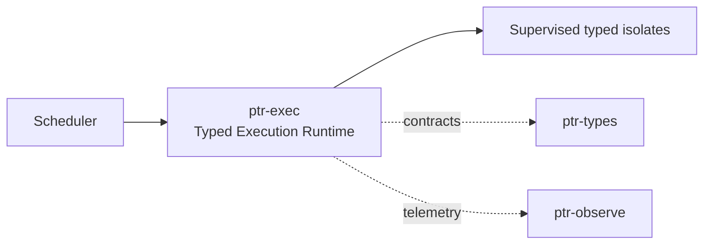

# ptr-exec — Typed Execution Runtime

> **Role:** Runs PTR subsystems as supervised state machines with bounded typed mailboxes, explicit backpressure, cancellation and replay semantics.  
> **Maturity:** architecture + contract scaffold; production behavior must be proven by the linked experiments and component evaluations.

<!-- PTR:STATUS:BEGIN -->
## Current implementation status

> **Generated section.** Source of truth: [`component.toml`](component.toml). Run `python3 scripts/update_component_docs.py --write` after editing metadata. Do not hand-edit inside this block.

**Maturity:** `prototype`  
**Last reviewed:** 2026-09-18

### Implemented now

- Bounded sync-channel Mailbox
- Explicit Full(T) and Closed(T) send errors preserving ownership
- Isolate<M> state-machine trait
- Explicit Effect<M> and ReplayTrace scaffolds

### Missing for the target architecture

- Async scheduler and isolate task host
- Supervision trees, restart policy and resource ownership
- Deadline/timeout/cancellation propagation
- Deterministic replay engine rather than string trace only
- Typed lifecycle for running/stopped/faulted isolates

### Next milestones

- Implement async bounded mailbox abstraction while retaining ownership semantics
- Add supervisor and cancellation tree
- Benchmark Tokio implementation against alternative execution substrates

### Linked experiments

- [R001](../../experiments/runtime/R001-mailbox-backpressure/README.md) — `planned`
- [E001](../../experiments/system/E001-end-to-end/README.md) — `planned`
- [E003](../../experiments/system/E003-token-efficiency/README.md) — `planned`

### Technology evaluations

- [execution-runtime](../../evaluations/components/execution-runtime/README.md) — `open`

### Decision records

- [ADR-0001-rust-runtime.md](../../research/decisions/ADR-0001-rust-runtime.md)
- [ADR-0006-typed-isolate-runtime.md](../../research/decisions/ADR-0006-typed-isolate-runtime.md)

### Current automated checks

- workspace fmt/check/test/clippy

<!-- PTR:STATUS:END -->

## Position in PTR

Dedicated diagram source: [`docs/diagrams/components/ptr-exec.mmd`](../../docs/diagrams/components/ptr-exec.mmd)

**Upstream:** ptr-router, ptr-model-api  
**Downstream:** ptr-pods, ptr-verifier, ptr-ledger

## Mission

Runs PTR subsystems as supervised state machines with bounded typed mailboxes, explicit backpressure, cancellation and replay semantics.

PTR keeps this responsibility in its own crate so the semantics remain stable even when an external library or implementation is replaced.

## Responsibilities

- isolate lifecycle
- bounded mailboxes
- scheduler contracts
- effects
- supervision
- timeouts/cancellation
- deterministic replay hooks

## Explicit non-responsibilities

- semantic meaning of Pods
- distributed consensus
- model training

## Data flow

| Direction | Contract |
|---|---|
| Input | Typed messages and effects |
| Output | Executed state transitions, receipts, failures and backpressure signals |
| Failure | Explicit typed error / rejected state; no silent fallback that changes semantics |
| Observability | Standard PTR tracing fields and a stable component span |

## Technical approach

- Tokio as default low-level I/O substrate
- Tina-style isolate semantics evaluated as inspiration/alternative
- no hidden unbounded queues

External projects are **candidates**, not architectural authority. The PTR-owned traits and domain types must remain usable with a replacement backend.

## Core invariants

1. A full mailbox returns ownership to the sender.
2. Cancellation is explicit and observable.
3. Isolate state has a single owner.

These invariants should be executable wherever possible through unit, property, lifecycle or chaos tests.

## Failure model

The component must fail closed for semantic or effect-safety violations. Infrastructure failures should surface as typed errors that preserve request, revision, generation and provenance context. Retries must be idempotent whenever the operation may cross a process or network boundary.

## Performance model

Measure before optimizing. Benchmarks should record at least latency distribution, throughput, allocations/resident memory, queue depth or working-set size where relevant, and the cost of verification. Performance optimizations may not bypass generation, revision, capability or evidence checks.

## Security and privacy

- Treat external inputs and backend outputs as untrusted until validated.
- Do not put raw secrets/private evidence into generic tracing or inspection.
- Preserve provenance on every promotion from raw/possible evidence to stronger semantic state.
- External effects pass through `ptr-security` even if this component already performed local validation.

## Technology evaluation

- [execution-runtime](../../evaluations/components/execution-runtime/README.md)

A new candidate should be added with a reproducible benchmark and failure-semantics analysis rather than replacing the default ad hoc.

## Tests required before production use

- Contract/unit tests for all domain transitions.
- Invalid, stale-generation and stale-revision cases.
- Cancellation/retry behavior.
- Property tests for invariants where practical.
- Cross-backend equivalence if more than one backend exists.
- Observability and redaction checks.

## Related architecture

- [System architecture](../../docs/architecture/00-system.md)
- [Technical architecture](../../docs/TECHNICAL_ARCHITECTURE.md)
- [Component contracts](../../docs/COMPONENT_CONTRACTS.md)
- [Global invariants](../../docs/INVARIANTS.md)

