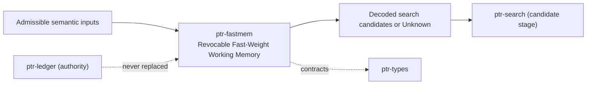

# ptr-fastmem — Revocable Fast-Weight Working Memory

> **Role:** A gated delta-rule associative memory that is a derived, exactly revocable projection of lifecycle-managed semantic inputs.  
> **Maturity:** prototype; claims beyond the automated checks must be proven by the linked experiments and component evaluations.

<!-- PTR:STATUS:BEGIN -->
## Current implementation status

> **Generated section.** Source of truth: [`component.toml`](component.toml) plus code-derived metrics from `src/`. Run `python3 scripts/update_component_docs.py --write` after editing implementation metadata. Do not hand-edit inside this block.

**Maturity:** `prototype`  
**Last reviewed:** 2026-09-25  
**Code footprint:** 9 Rust source files · 1681 nonblank source lines · 4 integration-test files · 46 `#[test]` markers

### Implemented now

- Multi-head matrix state updated by the gated delta rule in its Kimi Delta Attention form, with scalar, per-channel or no decay, read by o = S^T q
- Every write names its semantic input, generation and input digest; a read is admitted only while every source is admissible
- In-process journal of admitted writes (keys normalised per head) plus checkpoints every C writes; revocation refolds from the last checkpoint before the first revoked write. restore takes the writes as composed (WriteRequest), which the storage keeps: ptr-pg stores each request as f32 bit patterns
- Deterministic f32 fold: the refolded state is bit-identical to a memory that never saw the revoked writes
- binding_digest_of names the ordered folded writes by sequence, source key, generation and input digest (not by key and value bits); ptr-pg recomputes it from the stored journal prefix, refuses to store a checkpoint that does not match and never returns one that no longer does
- Seeded orthogonal key projection and identifier codebook; readouts decode to named capsules or to Unknown below a margin
- PTRFW001 state codec with full f32 cells and a SHA-256 trailer
- Bounded shapes, journal length and checkpoint interval with typed refusals

### Missing for the target architecture

- Learned key and value projections
- Chunked parallel fold for long journals
- Declaration of a memory as a neural-state binding in ptr-runtime

### Next milestones

- Run M008 against a recency buffer and hybrid retrieval
- Run L003 with crash and restore injection through the ptr-pg journal

### Linked experiments

- [M008](../../experiments/model/M008-fast-weight-memory/README.md) — `planned`
- [L003](../../experiments/lifecycle/L003-fastmem-revocation/README.md) — `planned`

### Technology evaluations

- [fast-weight-memory](../../evaluations/components/fast-weight-memory/README.md) — `open`

### Decision records

- [ADR-0018-revocable-fast-weight-memory.md](../../research/decisions/ADR-0018-revocable-fast-weight-memory.md)
- [ADR-0008-derived-search-not-authority.md](../../research/decisions/ADR-0008-derived-search-not-authority.md)

### Current automated checks

- tests/revocation.rs bit-identical refold and admission denial
- tests/journal.rs restore and checkpoint codec
- tests/recall.rs decode, update and Unknown
- ptr-pg postgres test for journal revocation cascade
- workspace fmt/check/test/clippy

<!-- PTR:STATUS:END -->

## Position in PTR

Dedicated diagram source: [`docs/diagrams/components/ptr-fastmem.mmd`](../../docs/diagrams/components/ptr-fastmem.mmd)

**Upstream:** ptr-types, ptr-search  
**Downstream:** ptr-pg (journal and checkpoints), agent loops (search candidates)

## Mission

Give an agent a fast associative working memory without creating a memory that can outlive the facts it was built from.

PTR keeps this responsibility in its own crate so the semantics remain stable even when an external library or implementation is replaced.

## Responsibilities

- delta-rule state and fold
- admission at read time
- exact revocation by refold
- decode into candidates
- state codec

## Explicit non-responsibilities

- authority over facts
- erasure of storage copies
- training of projections

## Data flow

| Direction | Contract |
|---|---|
| Input | WriteRequest with SourceRef, Query, admissibility predicate |
| Output | Readout, Recall (search candidates or Unknown), RevocationReport, encoded state |
| Failure | Explicit typed error / rejected state; no silent fallback that changes semantics |
| Observability | Standard PTR tracing fields and a stable component span |

## Technical approach

- gated delta rule with journaled pure-function gates
- checkpointed refold
- identifier-code decoding with a margin

External projects are **candidates**, not architectural authority. The PTR-owned types must remain usable with a replacement backend.

## Core invariants

1. Every write is attributable to exactly one input generation and digest.
2. A read that depends on an inadmissible input is denied.
3. Revocation refolds bit-identically to the never-saw-it state.

These invariants are executable through the unit and integration tests listed in the status block.

## Failure model

The component fails closed for semantic or effect-safety violations. Infrastructure failures surface as typed errors that preserve revision, generation and provenance context. Retries must be idempotent whenever the operation may cross a process or network boundary.

## Security and privacy

- Treat external inputs and backend outputs as untrusted until validated.
- Do not put raw secrets or private evidence into generic tracing or inspection.
- Derived artifacts are as sensitive as the inputs they were derived from.
- External effects pass through `ptr-security` even if this component already performed local validation.

## Experiments

- [M008](../../experiments/model/M008-fast-weight-memory/README.md)
- [L003](../../experiments/lifecycle/L003-fastmem-revocation/README.md)

## Technology evaluation

- [fast-weight-memory](../../evaluations/components/fast-weight-memory/README.md)

## Related architecture

- [35 — Agentic substrate](../../docs/architecture/35-agentic-substrate.md)
- [System architecture](../../docs/architecture/00-system.md)
- [Component contracts](../../docs/COMPONENT_CONTRACTS.md)
- [Global invariants](../../docs/INVARIANTS.md)
