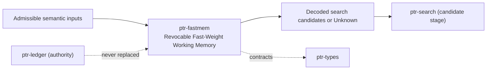

# ptr-fastmem — Revocable Fast-Weight Working Memory

> **Role:** A gated delta-rule associative memory that is a derived, exactly revocable projection of lifecycle-managed semantic inputs.  
> **Maturity:** prototype; claims beyond the automated checks must be proven by the linked experiments and component evaluations.

<!-- PTR:STATUS:BEGIN -->
## Current implementation status

> **Generated section.** Source of truth: [`component.toml`](component.toml) plus code-derived metrics from `src/`. Run `python3 scripts/update_component_docs.py --write` after editing implementation metadata. Do not hand-edit inside this block.

**Maturity:** `prototype`  
**Last reviewed:** 2026-09-27  
**Code footprint:** 9 Rust source files · 3060 nonblank source lines · 4 integration-test files · 82 `#[test]` markers

### Implemented now

- Multi-head matrix state updated by the gated delta rule in its Kimi Delta Attention form, with scalar, per-channel or no decay, read by o = S^T q
- Every write names its semantic input, generation and input digest; a read is admitted only if every source is admissible according to the caller's lifecycle view when the read is made (a revocation committed after that view is not seen, so decoded candidates still pass the lifecycle check at use; ptr-pg source_admission answers a whole source set from one snapshot and names the commit it reflects), and only for a query normalised for the memory's head shape (a Query keeps heads and key_dim; any other shape is a DimensionMismatch)
- A memory is bound when it is created or restored to the IdentifierCodebook (seed and code length, which must be the value length) its values are codes of; its readouts carry that codebook, fact_codes derives candidates from it, FactCode is built only by a codebook and keeps it, and decode_readout refuses a fact code from any other codebook (CodebookMismatch) instead of scoring crosstalk of the right length; a Readout's codebook is private and its values and as_of are read through ReadoutView, to which it dereferences read-only, so values of another read cannot be put under its codebook; ptr-pg restore_memory binds a stored memory to the codebook seed its registration records
- A memory created or restored with the digest of its key projection (FastMemory::with_projection, restore_with_projection) reads only queries that state that digest (Query::project, which refuses a projection of another head shape and records SeededProjection::digest, or Query::with_projection for a raw projected vector) and refuses a query of the right shape from another projection, or one stating none, with ProjectionMismatch; FastMemory::new and restore state no projection and read a query of the head shape from any projection, and write keys are not checked against the projection
- In-process journal of admitted writes (keys normalised per head) plus checkpoints every C writes; revocation asks its predicate once per write, in journal order, and those answers alone decide which writes it removes and the checkpoint it refolds from, the last one before the first write it removes. restore takes the writes as composed (WriteRequest), which the storage keeps: ptr-pg stores each request as f32 bit patterns
- Deterministic f32 fold: the refolded state is bit-identical to a memory that never saw the revoked writes
- binding_digest_of names the ordered folded writes by sequence, source key, generation and input digest (not by key and value bits); ptr-pg recomputes it from the stored journal prefix, refuses to store a checkpoint that does not match and never returns one that no longer does
- Seeded orthogonal key projection (at most MAX_HEADS * MAX_HEAD_DIM rows, the row count computed with checked arithmetic, from an embedding at most MAX_EMBEDDING_DIM = 8,192 wide, refused before allocating; every configuration check_config admits has a key and a value projection from every such width that is at least its head width; each coordinate is summed in f64 and rounded once, and one beyond f32's range is refused as NonFinite rather than returned infinite) and identifier codebook (codes no longer than MAX_HEADS * MAX_HEAD_DIM, the longest value vector); readouts decode to named capsules or to Unknown below a margin; constraint and procedure sources shape the state but are never decode candidates (IdentifierCodebook::fact refuses a constraint: or procedure: target with ReservedTarget, by the one test fact_codes filters sources with, and decode_readout refuses a fact naming one), and a decode policy that would fail open (zero limit, NaN or negative threshold) or a nonfinite score is refused
- PTRFW001 state codec with full f32 cells and a SHA-256 trailer
- Public-field records are plain data that no function of the crate takes back: WriteReceipt, RevocationReport, Recall and ReadoutView state what FastMemory::write, FastMemory::revoke, decode_readout and a readout guarantee, not what every value holds, and decode_readout takes a Readout, never a ReadoutView; every public-field input (FastMemoryConfig, ProjectionSpec, DecodePolicy, WriteRequest) is validated where it is used
- Bounded shapes (at most MAX_STATE_CELLS = 16 Mi cells, whose raw f32 bytes are 64 MiB; the PTRFW001 encoding adds 68 bytes, so the largest states encode to more than ptr-runtime's 64 MiB payload bound), journal length (MAX_WRITES = 65,536, the binding item count; source key lengths and their total are not bounded, so the count alone does not make a memory declarable as a neural-state binding), checkpoint interval and sequence numbers (restore requires strictly increasing numbers and accepts gaps, which revocations leave, so OutOfOrderWrite never reports a lost row; a memory takes no number at or above its limit, u64::MAX unless FastMemory::with_sequence_limit lowered it, and refuses the write that would take one before folding it, so a journal ends below the limit; ptr-pg restores every memory with its journal's limit, i64::MAX; a memory never takes a number twice, revoke keeping its next number, and FastMemory::with_sequence_high_water numbers a restored memory's next write above the largest number its store ever journaled for it, revoked writes included, as the live memory numbers it; ptr-pg restores every memory with the mark its registration keeps) with typed refusals; a shape's lengths saturate at usize::MAX instead of overflowing, so a shape check_config refuses never wraps to a plausible length; public validate_write shares restore admission rules
- Value cells are bounded by MAX_VALUE_MAGNITUDE (2^24) at admission, independently of the state, and every key head that is not all zero is normalised to unit length at any scale (divided by its largest magnitude before its norm is taken, so no square underflows or overflows), so every fold of admitted writes stays finite whatever their order or subset and refolds after revocation admit exactly the same writes

### Missing for the target architecture

- Learned key and value projections
- Chunked parallel fold for long journals
- Declaration of a memory as a neural-state binding in ptr-runtime

### Next milestones

- Run M008 against a recency buffer and hybrid retrieval
- Restore from the newest checkpoint plus the journal suffix, and extend L003 to it

### Linked experiments

- [M008](../../experiments/model/M008-fast-weight-memory/README.md) — `planned`
- [L003](../../experiments/lifecycle/L003-fastmem-revocation/README.md) — `completed`

### Technology evaluations

- [fast-weight-memory](../../evaluations/components/fast-weight-memory/README.md) — `open`

### Decision records

- [ADR-0018-revocable-fast-weight-memory.md](../../research/decisions/ADR-0018-revocable-fast-weight-memory.md)
- [ADR-0008-derived-search-not-authority.md](../../research/decisions/ADR-0008-derived-search-not-authority.md)

### Current automated checks

- tests/revocation.rs bit-identical refold and admission denial
- tests/journal.rs restore and checkpoint codec, gaps accepted and a number not above its predecessor refused (an_out_of_order_refusal_names_the_smallest_number_a_gapped_journal_would_accept), and the sequence limit and high-water mark a store restores a memory with (a_memory_with_a_sequence_limit_refuses_the_write_that_would_reach_it_before_folding, a_memory_restored_below_its_store_s_high_water_mark_numbers_its_next_write_above_it)
- unit tests: the largest state's cells are 64 MiB and its encoding adds 68 bytes (the_largest_state_s_cells_are_64_mib_and_its_encoding_adds_68_bytes), the journal bound is a count only; compile_fail doctests: a Readout's values can be neither assigned nor mutated in place
- tests/recall.rs decode, update, Unknown, the codebook a readout decodes against, constraint and procedure targets refused as explicit fact candidates, and the key projection a bound memory reads queries from
- ptr-pg postgres test for journal revocation cascade
- L003 revocation exactness through the ptr-pg journal (ptr-bench fastmem-revocation): five seeds on PostgreSQL 18, 16 of 16 planted defects detected
- workspace fmt/check/test/clippy

<!-- PTR:STATUS:END -->

## Position in PTR

```mermaid
flowchart LR
    A["Admissible semantic inputs"] --> B["ptr-fastmem\nRevocable Fast-Weight Working Memory"]
    B --> C["Decoded search candidates or Unknown"]
    C --> D["ptr-search (candidate stage)"]
    B -. "contracts" .-> T["ptr-types"]
    L["ptr-ledger (authority)"] -. "never replaced" .-> B
```

Dedicated diagram source: [`docs/diagrams/components/ptr-fastmem.mmd`](../../docs/diagrams/components/ptr-fastmem.mmd)

**Upstream:** ptr-types, ptr-search  
**Downstream:** ptr-pg (journal and checkpoints), agent loops (search candidates)

## Mission

Give an agent a fast associative working memory without creating a memory that can outlive the facts it was built from.

PTR keeps this responsibility in its own crate so the semantics remain stable even when an external library or implementation is replaced.

## Responsibilities

- delta-rule state and fold
- admission at read time
- exact revocation by refold
- decode into candidates
- state codec

## Explicit non-responsibilities

- authority over facts
- erasure of storage copies
- training of projections

## Data flow

| Direction | Contract |
|---|---|
| Input | WriteRequest with SourceRef, Query, admissibility predicate |
| Output | Readout, Recall (search candidates or Unknown), RevocationReport, encoded state |
| Failure | Explicit typed error / rejected state; no silent fallback that changes semantics |
| Observability | Standard PTR tracing fields and a stable component span |

## Technical approach

- gated delta rule with journaled pure-function gates
- checkpointed refold
- identifier-code decoding with a margin

External projects are **candidates**, not architectural authority. The PTR-owned types must remain usable with a replacement backend.

## Core invariants

1. Every write is attributable to exactly one input generation and digest.
2. A read that depends on an inadmissible input is denied.
3. Revocation refolds bit-identically to the never-saw-it state.

These invariants are executable through the unit and integration tests listed in the status block.

## Failure model

The component fails closed for semantic or effect-safety violations. Infrastructure failures surface as typed errors that preserve revision, generation and provenance context. Retries must be idempotent whenever the operation may cross a process or network boundary.

## Security and privacy

- Treat external inputs and backend outputs as untrusted until validated.
- Do not put raw secrets or private evidence into generic tracing or inspection.
- Derived artifacts are as sensitive as the inputs they were derived from.
- External effects pass through `ptr-security` even if this component already performed local validation.

## Experiments

- [M008](../../experiments/model/M008-fast-weight-memory/README.md)
- [L003](../../experiments/lifecycle/L003-fastmem-revocation/README.md)

## Technology evaluation

- [fast-weight-memory](../../evaluations/components/fast-weight-memory/README.md)

## Related architecture

- [35 — Agentic substrate](../../docs/architecture/35-agentic-substrate.md)
- [System architecture](../../docs/architecture/00-system.md)
- [Component contracts](../../docs/COMPONENT_CONTRACTS.md)
- [Global invariants](../../docs/INVARIANTS.md)
