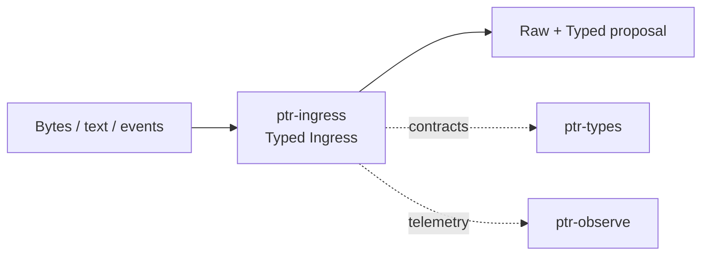

# ptr-ingress — Typed Ingress

> **Role:** Preserves raw evidence while building a provisional typed interpretation that can be cross-verified before reasoning.  
> **Maturity:** architecture + contract scaffold; production behavior must be proven by the linked experiments and component evaluations.

{BEGIN}
## Current implementation status

> **Generated section.** Source of truth: [`component.toml`](component.toml). Run `python3 scripts/update_component_docs.py --write` after editing metadata. Do not hand-edit inside this block.

**Maturity:** `scaffold`  
**Last reviewed:** 2026-09-18

### Implemented now

- RawInput variants for text, bytes and artifact references
- ArtifactKind taxonomy
- SemanticProposal label scores and semantic issues
- Basic raw↔typed cross-check status function

### Missing for the target architecture

- infer MIME adapter and encoding_rs normalization
- GLiClass-rs classifier adapter and deterministic parser stack
- Span-level provenance back to raw bytes/text
- Risk/disagreement-driven verification policy

### Next milestones

- Implement byte→artifact→normalized-text pipeline
- Add pluggable semantic classifier contract
- Create corruption/ambiguity benchmark cases for raw↔typed disagreement

### Linked experiments

- - [E001](../../experiments/system/E001-end-to-end/README.md) — `planned`
- - [E004](../../experiments/system/E004-long-horizon/README.md) — `planned`

### Technology evaluations

- - [ingress-classifier](../../evaluations/components/ingress-classifier/README.md) — `open`

### Decision records

- - [ADR-0003-raw-and-typed.md](../../research/decisions/ADR-0003-raw-and-typed.md)
- - [ADR-0004-backend-independence.md](../../research/decisions/ADR-0004-backend-independence.md)

### Current automated checks

- workspace fmt/check/test/clippy

{END}

## Position in PTR

Dedicated diagram source: [`docs/diagrams/components/ptr-ingress.mmd`](../../docs/diagrams/components/ptr-ingress.mmd)

**Upstream:** external world  
**Downstream:** ptr-semdb, ptr-security

## Mission

Preserves raw evidence while building a provisional typed interpretation that can be cross-verified before reasoning.

PTR keeps this responsibility in its own crate so the semantics remain stable even when an external library or implementation is replaced.

## Responsibilities

- raw input capture
- artifact/MIME and encoding normalization
- cheap semantic classification
- raw↔typed disagreement detection

## Explicit non-responsibilities

- authoritative semantic state
- long-horizon memory
- external action execution

## Data flow

| Direction | Contract |
|---|---|
| Input | Text, bytes, files, events, API requests |
| Output | Raw representation plus typed semantic proposal and verification signals |
| Failure | Explicit typed error / rejected state; no silent fallback that changes semantics |
| Observability | Standard PTR tracing fields and a stable component span |

## Technical approach

- infer for MIME candidate
- encoding_rs for deterministic decoding
- GLiClass-rs candidate for low-cost classification
- deterministic parsers/rules where appropriate

External projects are **candidates**, not architectural authority. The PTR-owned traits and domain types must remain usable with a replacement backend.

## Core invariants

1. Raw evidence is retained and never replaced by the typed proposal.
2. Uncertainty and ambiguity are explicit.
3. Untrusted context never promotes directly to Known<T>.

These invariants should be executable wherever possible through unit, property, lifecycle or chaos tests.

## Failure model

The component must fail closed for semantic or effect-safety violations. Infrastructure failures should surface as typed errors that preserve request, revision, generation and provenance context. Retries must be idempotent whenever the operation may cross a process or network boundary.

## Performance model

Measure before optimizing. Benchmarks should record at least latency distribution, throughput, allocations/resident memory, queue depth or working-set size where relevant, and the cost of verification. Performance optimizations may not bypass generation, revision, capability or evidence checks.

## Security and privacy

- Treat external inputs and backend outputs as untrusted until validated.
- Do not put raw secrets/private evidence into generic tracing or inspection.
- Preserve provenance on every promotion from raw/possible evidence to stronger semantic state.
- External effects pass through `ptr-security` even if this component already performed local validation.

## Technology evaluation

- [ingress-classifier](../../evaluations/components/ingress-classifier/README.md)

A new candidate should be added with a reproducible benchmark and failure-semantics analysis rather than replacing the default ad hoc.

## Tests required before production use

- Contract/unit tests for all domain transitions.
- Invalid, stale-generation and stale-revision cases.
- Cancellation/retry behavior.
- Property tests for invariants where practical.
- Cross-backend equivalence if more than one backend exists.
- Observability and redaction checks.

## Related architecture

- [System architecture](../../docs/architecture/00-system.md)
- [Technical architecture](../../docs/TECHNICAL_ARCHITECTURE.md)
- [Component contracts](../../docs/COMPONENT_CONTRACTS.md)
- [Global invariants](../../docs/INVARIANTS.md)

