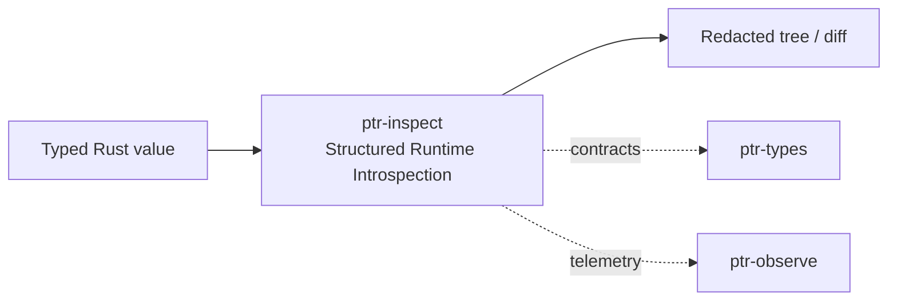

# ptr-inspect — Structured Runtime Introspection

> **Role:** Allows generic inspection and rendering of typed Rust values without collapsing the runtime into untyped JSON.  
> **Maturity:** architecture + contract scaffold; production behavior must be proven by the linked experiments and component evaluations.

<!-- PTR:STATUS:BEGIN -->
## Current implementation status

> **Generated section.** Source of truth: [`component.toml`](component.toml) plus code-derived metrics from `src/`. Run `python3 scripts/update_component_docs.py --write` after editing implementation metadata. Do not hand-edit inside this block.

**Maturity:** `scaffold`  
**Last reviewed:** 2026-09-25  
**Code footprint:** 1 Rust source files · 44 nonblank source lines · 1 integration-test files · 3 `#[test]` markers

### Implemented now

- Generic InspectNode tree
- Inspectable trait
- Secret<T> that always renders Redacted, prints Secret([redacted]) through Debug for any T, and keeps its value in a private field reached only through expose/into_inner

### Missing for the target architecture

- Valuable bridge and generic visitor
- Struct/list/map traversal for arbitrary PTR domain types
- Structured diff
- Private<T>/RawEvidence<T> redaction wrappers
- ptrctl rendering and tracing bridge

### Next milestones

- Implement Valuable adapter behind feature flag
- Add inspection-tree diff and redaction tests
- Expose read-only ptrctl inspect command

### Linked experiments

- [E001](../../experiments/system/E001-end-to-end/README.md) — `planned`

### Technology evaluations

- [introspection](../../evaluations/components/introspection/README.md) — `open`

### Decision records

- [ADR-0004-backend-independence.md](../../research/decisions/ADR-0004-backend-independence.md)
- [ADR-0010-component-docs-as-code.md](../../research/decisions/ADR-0010-component-docs-as-code.md)

### Current automated checks

- Debug and alternate Debug of a Secret, alone and nested in a derived Debug, never contain the value
- workspace fmt/check/test/clippy

<!-- PTR:STATUS:END -->

## Position in PTR

Dedicated diagram source: [`docs/diagrams/components/ptr-inspect.mmd`](../../docs/diagrams/components/ptr-inspect.mmd)

**Upstream:** domain crates  
**Downstream:** ptrctl, ptr-observe, debugging

## Mission

Allows generic inspection and rendering of typed Rust values without collapsing the runtime into untyped JSON.

PTR keeps this responsibility in its own crate so the semantics remain stable even when an external library or implementation is replaced.

## Responsibilities

- inspection tree
- value visitors
- state diffs
- redaction-aware rendering
- CLI/debug adapters

## Explicit non-responsibilities

- serialization authority
- semantic verification
- telemetry transport

## Data flow

| Direction | Contract |
|---|---|
| Input | Inspectable domain objects |
| Output | Structured inspection tree, diff or redacted render |
| Failure | Explicit typed error / rejected state; no silent fallback that changes semantics |
| Observability | Standard PTR tracing fields and a stable component span |

## Technical approach

- tokio-rs/valuable candidate
- custom PTR visitor layer
- serde bridge only at explicit external boundaries

External projects are **candidates**, not architectural authority. The PTR-owned traits and domain types must remain usable with a replacement backend.

## Core invariants

1. Secret<T>, Private<T> and RawEvidence<T> never render plaintext by default.
2. Inspection does not confer semantic validity.
3. Unknown runtime types remain safely traversable or opaque.

These invariants should be executable wherever possible through unit, property, lifecycle or chaos tests.

## Failure model

The component must fail closed for semantic or effect-safety violations. Infrastructure failures should surface as typed errors that preserve request, revision, generation and provenance context. Retries must be idempotent whenever the operation may cross a process or network boundary.

## Performance model

Measure before optimizing. Benchmarks should record at least latency distribution, throughput, allocations/resident memory, queue depth or working-set size where relevant, and the cost of verification. Performance optimizations may not bypass generation, revision, capability or evidence checks.

## Security and privacy

- Treat external inputs and backend outputs as untrusted until validated.
- Do not put raw secrets/private evidence into generic tracing or inspection.
- Preserve provenance on every promotion from raw/possible evidence to stronger semantic state.
- External effects pass through `ptr-security` even if this component already performed local validation.

## Technology evaluation

- [introspection](../../evaluations/components/introspection/README.md)

A new candidate should be added with a reproducible benchmark and failure-semantics analysis rather than replacing the default ad hoc.

## Tests required before production use

- Contract/unit tests for all domain transitions.
- Invalid, stale-generation and stale-revision cases.
- Cancellation/retry behavior.
- Property tests for invariants where practical.
- Cross-backend equivalence if more than one backend exists.
- Observability and redaction checks.

## Related architecture

- [System architecture](../../docs/architecture/00-system.md)
- [Technical architecture](../../docs/TECHNICAL_ARCHITECTURE.md)
- [Component contracts](../../docs/COMPONENT_CONTRACTS.md)
- [Global invariants](../../docs/INVARIANTS.md)

