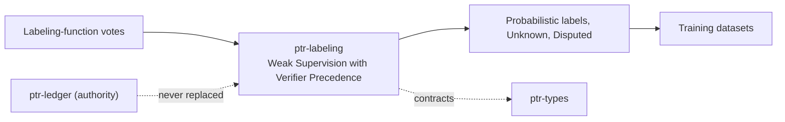

# ptr-labeling — Weak Supervision with Verifier Precedence

> **Role:** Turns labeling-function votes into calibrated probabilistic labels in which verifiers veto and are never outvoted.  
> **Maturity:** prototype; claims beyond the automated checks must be proven by the linked experiments and component evaluations.

<!-- PTR:STATUS:BEGIN -->
## Current implementation status

> **Generated section.** Source of truth: [`component.toml`](component.toml) plus code-derived metrics from `src/`. Run `python3 scripts/update_component_docs.py --write` after editing implementation metadata. Do not hand-edit inside this block.

**Maturity:** `prototype`  
**Last reviewed:** 2026-09-25  
**Code footprint:** 6 Rust source files · 785 nonblank source lines · 1 integration-test files · 8 `#[test]` markers

### Implemented now

- Label schemas, labeling functions by kind (verifier, heuristic, model, agent) and a vote matrix with abstention
- Verifier-backed functions cast vetoes only; a verifier class vote is refused
- Dawid-Skene EM label model with configurable iterations and tolerance and identifiability warnings for fewer than three modelled functions
- Resolution to Determined (every other class vetoed), Estimated at or above a required probability, Unknown, or Disputed when every class is vetoed
- Gold labels record source (oracle or human with annotator) and sampling (uniform or active); only uniform gold estimates population accuracy and calibration, while active gold reports accuracy on the sampled items and no calibration
- Evaluation with Brier score and expected calibration error from ptr-analytics
- Acquisition ranking by posterior entropy or margin that never proposes an item verifiers already determined

### Missing for the target architecture

- Annotator agreement over multi-annotator gold (ptr_analytics::krippendorff_alpha_nominal exists; this crate does not call it yet)
- A dependency-aware model for correlated labeling functions
- Annotator reliability modelling
- Label snapshot registration through ptr-pg

### Next milestones

- Run F002 against majority vote on uniform gold
- Add a labeling adapter to ptr-pg over the existing work schema

### Linked experiments

- [F002](../../experiments/feedback/F002-weak-supervision/README.md) — `planned`

### Technology evaluations

- [label-model](../../evaluations/components/label-model/README.md) — `open`

### Decision records

- [ADR-0019-adapter-lineage-and-weak-supervision.md](../../research/decisions/ADR-0019-adapter-lineage-and-weak-supervision.md)

### Current automated checks

- tests/label_model.rs recovery, veto, dispute and identifiability cases
- workspace fmt/check/test/clippy

<!-- PTR:STATUS:END -->

## Position in PTR

Dedicated diagram source: [`docs/diagrams/components/ptr-labeling.mmd`](../../docs/diagrams/components/ptr-labeling.mmd)

**Upstream:** ptr-types, ptr-analytics  
**Downstream:** training datasets, ptr-pg (work schema tables)

## Mission

Produce labels whose confidence can be trusted and whose conflicts with verifiers are impossible.

PTR keeps this responsibility in its own crate so the semantics remain stable even when an external library or implementation is replaced.

## Responsibilities

- vote representation
- label model fitting
- resolution with verifier precedence
- gold-based evaluation
- annotation ranking

## Explicit non-responsibilities

- running labeling functions
- storing datasets
- training models

## Data flow

| Direction | Contract |
|---|---|
| Input | LabelSchema, labeling functions, VoteMatrix, gold labels |
| Output | LabelModel, LabelOutcome per item, EvaluationReport, annotation ranking |
| Failure | Explicit typed error / rejected state; no silent fallback that changes semantics |
| Observability | Standard PTR tracing fields and a stable component span |

## Technical approach

- Dawid-Skene expectation maximisation
- asymmetric verifier vetoes
- uniform-versus-active gold separation
- entropy or margin acquisition

External projects are **candidates**, not architectural authority. The PTR-owned types must remain usable with a replacement backend.

## Core invariants

1. A verifier veto is never outvoted.
2. Unknown and Disputed are valid outcomes, not errors.
3. A predicted label is never read back as gold.

These invariants are executable through the unit and integration tests listed in the status block.

## Failure model

The component fails closed for semantic or effect-safety violations. Infrastructure failures surface as typed errors that preserve revision, generation and provenance context. Retries must be idempotent whenever the operation may cross a process or network boundary.

## Security and privacy

- Treat external inputs and backend outputs as untrusted until validated.
- Do not put raw secrets or private evidence into generic tracing or inspection.
- Derived artifacts are as sensitive as the inputs they were derived from.
- External effects pass through `ptr-security` even if this component already performed local validation.

## Experiments

- [F002](../../experiments/feedback/F002-weak-supervision/README.md)

## Technology evaluation

- [label-model](../../evaluations/components/label-model/README.md)

## Related architecture

- [35 — Agentic substrate](../../docs/architecture/35-agentic-substrate.md)
- [System architecture](../../docs/architecture/00-system.md)
- [Component contracts](../../docs/COMPONENT_CONTRACTS.md)
- [Global invariants](../../docs/INVARIANTS.md)
