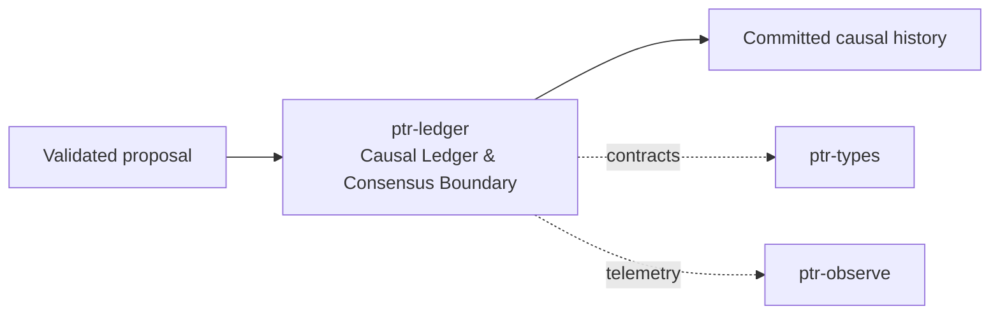

# ptr-ledger — Causal Ledger & Consensus Boundary

> **Role:** Records the authoritative ordered lifecycle of semantic changes and, in cluster mode, applies distributed consensus before state materialization.  
> **Maturity:** architecture + contract scaffold; production behavior must be proven by the linked experiments and component evaluations.

<!-- PTR:STATUS:BEGIN -->
## Current implementation status

> **Generated section.** Source of truth: [`component.toml`](component.toml) plus code-derived metrics from `src/`. Run `python3 scripts/update_component_docs.py --write` after editing implementation metadata. Do not hand-edit inside this block.

**Maturity:** `prototype`  
**Last reviewed:** 2026-09-18  
**Code footprint:** 1 Rust source files · 307 nonblank source lines · 0 `#[test]` markers

### Implemented now

- Lifecycle LedgerEvent enum
- CommittedEvent with CommitIndex
- Ledger trait and in-memory reference implementation
- CompactionBarrier scaffold
- Durable reference FileLedger with length-prefixed event encoding, fsync and crash-tail truncation

### Missing for the target architecture

- Production raft-engine durable backend
- raft-rs consensus adapter and state machine integration
- fsync/durability modes and revocation barriers
- Snapshot serialization/recovery/replay
- fail-rs crash/partition test points

### Next milestones

- Define storage/consensus interfaces around existing Ledger contract
- Benchmark reference FileLedger against raft-engine durable backend before cluster consensus
- Run L001 then L002 chaos/recovery experiments

### Linked experiments

- [L001](../../experiments/lifecycle/L001-revocation-crash/README.md) — `planned`
- [L002](../../experiments/lifecycle/L002-raft-recovery/README.md) — `planned`
- [E004](../../experiments/system/E004-long-horizon/README.md) — `planned`

### Technology evaluations

- [consensus](../../evaluations/components/consensus/README.md) — `open`
- [ledger](../../evaluations/components/ledger/README.md) — `open`

### Decision records

- [ADR-0002-authority-hierarchy.md](../../research/decisions/ADR-0002-authority-hierarchy.md)
- [ADR-0009-consensus-ledger-state-separation.md](../../research/decisions/ADR-0009-consensus-ledger-state-separation.md)

### Current automated checks

- FileLedger all-event reopen and partial-tail crash recovery tests
- workspace fmt/check/test/clippy

<!-- PTR:STATUS:END -->

## Position in PTR

Dedicated diagram source: [`docs/diagrams/components/ptr-ledger.mmd`](../../docs/diagrams/components/ptr-ledger.mmd)

**Upstream:** ptr-verifier, ptr-security  
**Downstream:** ptr-state, ptr-events

## Mission

Records the authoritative ordered lifecycle of semantic changes and, in cluster mode, applies distributed consensus before state materialization.

PTR keeps this responsibility in its own crate so the semantics remain stable even when an external library or implementation is replaced.

## Responsibilities

- ledger event model
- commit index
- revocation barriers
- snapshots/compaction barriers
- consensus adapter
- durable log adapter

## Explicit non-responsibilities

- query-friendly state
- search indexes
- network transport implementation

## Data flow

| Direction | Contract |
|---|---|
| Input | Validated semantic proposals and lifecycle events |
| Output | CommittedEvent sequence and durable snapshots |
| Failure | Explicit typed error / rejected state; no silent fallback that changes semantics |
| Observability | Standard PTR tracing fields and a stable component span |

## Technical approach

- raft-rs candidate for consensus
- raft-engine candidate for durable Raft log
- fail-rs for adversarial failure injection

External projects are **candidates**, not architectural authority. The PTR-owned traits and domain types must remain usable with a replacement backend.

## Core invariants

1. Uncommitted events never become authoritative.
2. Revoked generations cannot resurrect after restart.
3. Compaction requires snapshot, consumer and generation safety barriers.

These invariants should be executable wherever possible through unit, property, lifecycle or chaos tests.

## Failure model

The component must fail closed for semantic or effect-safety violations. Infrastructure failures should surface as typed errors that preserve request, revision, generation and provenance context. Retries must be idempotent whenever the operation may cross a process or network boundary.

## Performance model

Measure before optimizing. Benchmarks should record at least latency distribution, throughput, allocations/resident memory, queue depth or working-set size where relevant, and the cost of verification. Performance optimizations may not bypass generation, revision, capability or evidence checks.

## Security and privacy

- Treat external inputs and backend outputs as untrusted until validated.
- Do not put raw secrets/private evidence into generic tracing or inspection.
- Preserve provenance on every promotion from raw/possible evidence to stronger semantic state.
- External effects pass through `ptr-security` even if this component already performed local validation.

## Technology evaluation

- [consensus](../../evaluations/components/consensus/README.md)
- [ledger](../../evaluations/components/ledger/README.md)

A new candidate should be added with a reproducible benchmark and failure-semantics analysis rather than replacing the default ad hoc.

## Tests required before production use

- Contract/unit tests for all domain transitions.
- Invalid, stale-generation and stale-revision cases.
- Cancellation/retry behavior.
- Property tests for invariants where practical.
- Cross-backend equivalence if more than one backend exists.
- Observability and redaction checks.

## Related architecture

- [System architecture](../../docs/architecture/00-system.md)
- [Technical architecture](../../docs/TECHNICAL_ARCHITECTURE.md)
- [Component contracts](../../docs/COMPONENT_CONTRACTS.md)
- [Global invariants](../../docs/INVARIANTS.md)

