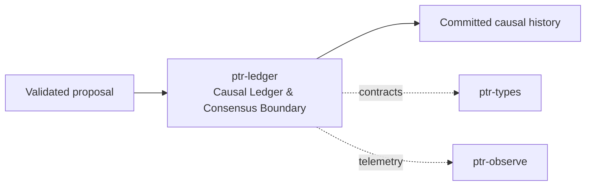

# ptr-ledger — Causal Ledger & Consensus Boundary

> **Role:** Records the authoritative ordered lifecycle of semantic changes and, in cluster mode, applies distributed consensus before state materialization.  
> **Maturity:** architecture + contract scaffold; production behavior must be proven by the linked experiments and component evaluations.

<!-- PTR:STATUS:BEGIN -->
## Current implementation status

> **Generated section.** Source of truth: [`component.toml`](component.toml) plus code-derived metrics from `src/`. Run `python3 scripts/update_component_docs.py --write` after editing implementation metadata. Do not hand-edit inside this block.

**Maturity:** `prototype`  
**Last reviewed:** 2026-09-21  
**Code footprint:** 9 Rust source files · 4144 nonblank source lines · 11 integration-test files · 85 `#[test]` markers

### Implemented now

- EffectAttempted/EffectSettled/EffectReconciled records (tags 9-11, beside the unchanged 0-8) carry an execution audit: the attempt is addressed by its own commit index, and a settled response keeps its digest unconditionally and its bytes up to MAX_RETAINED_RESPONSE
- Effect and VerificationLevel are written through explicit code tables rather than discriminant casts, so inserting an enum variant breaks a build instead of renumbering records already stored
- Rustdoc covers the protected-anchor, acknowledgment, compaction and erasure APIs plus their integrity and serialization helpers
- LogPaths::orphans claims a file only when log_path of the floor its name encodes is that same path, so a neighbouring log set sharing the directory can never have its live log reclaimed as this set's orphan
- InMemoryLedger::append is fallible and uses checked arithmetic: an exhausted commit index is refused with PTR_LEDGER_INDEX_EXHAUSTED and nothing is stored, rather than saturating and handing the same index out twice
- PTRLOG02 bounded SHA-256 record chain with checked header, sequence, payload and trailer
- Strict nonmutating open; independently anchored rollback checks and explicit partial-tail recovery
- Create-new checked-log restore and guarded explicit legacy inspection/migration
- Explicit RAII unlock prevents duplicate-descriptor retention across concurrent process spawn
- SemanticDeltaCommitted tag 8 preserves base/result revisions and opaque transaction bytes; legacy event tags are unchanged
- PTRANC01 protected anchor storage: HMAC-SHA256 under a host-held key, fixed-length record, atomic rename publication, monotonic epoch/index/digest and carried chain origin
- Retained-epoch witness rejects rollback of the anchor file itself; authenticity alone is documented as insufficient for freshness
- AcknowledgedLedger log-first append/acknowledge ordering with writer fencing when anchor publication fails
- RecoverableLog classifies every log/anchor split under one held lock and repairs only the tail per explicit TailPolicy
- integrity scan/encode/decode accept a trusted compaction floor so a log need not begin at index 1
- LogPaths floor-in-filename addressing: the protected anchor alone names the live log, so a cutover is unambiguous on both sides of its commit point
- RetentionPolicy/CompactionBarrier planning capped by snapshot coverage and blocked by lagging consumers or unresolved revocations
- Create-new compaction cutover with the anchor advance as commit point, revalidated plans and explicit orphan reclamation
- Erasure audit over live and superseded logs: byte-level presence search biased toward still-retained, with host-retained artifacts folded in explicitly
- Two audit entry points: the live log is read through its owning handle when a ledger is open, since mandatory Windows locks make an independent handle unusable there
- Named permanent erasure boundaries (host-retained artifacts, storage residue, model-derived state) reported by every audit rather than as situational caveats
- Cross-process single-writer advisory lock retained for FileLedger handle lifetime
- Poisoned writer after ambiguous append failure; reopen/replay required before subsequent writes
- Lifecycle LedgerEvent enum
- CommittedEvent with CommitIndex
- Ledger trait and in-memory reference implementation, with an optional compaction-floor offset so restored records keep their committed indices
- CompactionBarrier scaffold
- Durable reference FileLedger with checked versioned frames, file synchronization and anchor-required tail recovery
- Feature-gated fail-rs injection points around record write/payload/fsync/memory-commit boundaries
- Feature-gated raft-engine 0.4.2 durable adapter stores ordered PTR ledger events with synchronous writes and reopen validation
- Feature-gated raft-rs 0.7 single-node consensus harness proposes and commits PTR LedgerEvents through RawNode, over durable state rather than MemStorage: a reopened node replays its committed prefix and tells raft what it already applied
- RaftNode is one member that hands its outbound messages back instead of dropping them, with no knowledge of transport: ticks are a count rather than a duration, so a partition, a leader change and a duplicated message are testable without a timer
- Raft's message type is re-exported so a transport can name it without declaring its own raft dependency: two pins would be two wire formats for the very messages they exchange
- Raft messages have a bounded wire encoding; a frame that does not decode is dropped rather than partially stepped, and SingleNodeRaftConsensus is a thin wrapper over the same node so there is one place where entries are persisted, hard state flushed and committed entries applied
- FileRaftStorage keeps term, vote, commit, configuration, log and snapshot position on disk: the state file is rewritten atomically, entries and hard state are flushed before anything depending on them could leave the node, and a conflicting append truncates the log so the file is always a prefix of one history
- Raft log records carry an explicit entry-type code and a per-record digest, and indexes must be consecutive from the snapshot position, so a changed record and a removed or duplicated one are separate refusals; a snapshot older than raft asks for is refused rather than fabricated at the requested index

### Missing for the target architecture

- Hardware power-loss evidence; anchor key custody, rotation and hardware-backed sealing
- A composition of RaftNode over ptr-net transport on ALPN_RAFT: the group is driven by a test's queue, so there is no framing, no authenticated sender, no bound on what a peer may send and no evidence a real connection carries these messages; ptr-ledger must not depend on transport, so the composition needs its own home
- Membership changes: the configuration is recorded and recovered, but adding or removing a voter is not implemented
- Snapshot transfer to a follower the leader has compacted past, and any relation between raft's own log floor and the ledger's retention floor
- fsync/durability modes and revocation barriers
- Distributed snapshot/compaction protocols and cross-node cutover
- Retention schedule/policy engine and durable snapshot lifecycle tracking; PTR does not enumerate or reclaim host-retained snapshots
- Storage-residue and model-derived-state erasure, so no all-state-deleted declaration is available

### Next milestones

- Define storage/consensus interfaces around existing Ledger contract
- Benchmark FileLedger against raft-engine, then connect raft-rs RawNode to raft-engine persistence and network transport
- Expand L001 failpoint matrix to process-abort and durable-backend cases, then run L002 cluster recovery

### Linked experiments

- [L001](../../experiments/lifecycle/L001-revocation-crash/README.md) — `running`
- [L002](../../experiments/lifecycle/L002-raft-recovery/README.md) — `planned`
- [E004](../../experiments/system/E004-long-horizon/README.md) — `planned`

### Technology evaluations

- [consensus](../../evaluations/components/consensus/README.md) — `open`
- [ledger](../../evaluations/components/ledger/README.md) — `open`

### Decision records

- [ADR-0002-authority-hierarchy.md](../../research/decisions/ADR-0002-authority-hierarchy.md)
- [ADR-0009-consensus-ledger-state-separation.md](../../research/decisions/ADR-0009-consensus-ledger-state-separation.md)

### Current automated checks

- all ten effect and verification codes are pinned to exact bytes, unknown codes are refused at a position located by diffing two records, and invalid presence bytes, truncated digests and trailing bytes are each rejected
- an exhausted anchor epoch refuses both acknowledge and compacted advance without republishing the record
- a neighbouring log set is never reported as this set's orphan, and short, non-numeric, past-u64 and non-canonical floor fields are all rejected
- an exhausted commit index is refused rather than repeated, leaving the ledger unchanged
- Every single-bit mutation of the reference log, independent hashlib golden vector, ordering and hostile-length rejection
- Every partial-frame cut, wrong anchor, complete suffix loss and rehashed alternative-history rejection
- Create-new destination safety, guarded legacy migration and duplicate-descriptor unlock regression
- RFC 4231 HMAC-SHA256 known answers, constant-time comparison and redacted key Debug output
- Every single-bit mutation and every length variation of the 168-byte anchor record rejected
- Every log/anchor split outcome: aligned, unacknowledged, lost suffix, rehashed divergence, foreign origin and base mismatch
- Stale-witness anchor rollback, interrupted publication and fenced writer after failed acknowledgment
- Retention bounds, barrier blocking and snapshot-coverage capping of the proposed floor
- Cutover interrupted on both sides of its commit point, orphan reclamation and exact retained-suffix reconstruction
- Stale, non-advancing, above-tail and wrong-digest plans refused without mutation; destination never overwritten
- Logical deletion asserted to leave history intact; erasure requires both the raised floor and orphan reclamation
- Host-retained snapshot defeats erasure once folded in; destroying the anchor key removes verifiability only
- Reading the live log through the writer restores the append position, proven by appending and re-verifying afterwards
- FileLedger all-event reopen and partial-tail crash recovery tests
- FileLedger strict open never truncates; explicit recovery requires an independent matching prefix anchor
- fail-rs panic-after-length-prefix recovery test
- raft-engine durable append/reopen ordering integration test
- raft-rs single-node proposal/commit ordering integration test
- a reopened node holds exactly the history it committed, index by index, and continues the same sequence; the term and the vote it recorded survive the process and a new election is a later term
- a three-member group elects exactly one leader with its followers in the same term; a majority commits while a minority decides nothing; a member that knows no leader refuses a write outright and a partitioned follower's forwarded proposal never resurfaces after healing
- a deposed leader appends but cannot commit and the entry only it held is overwritten rather than resurrected; a leader change leaves one total order with indexes exactly 1..n; duplicated and stale messages change nothing; a restarted member restores exactly the leader's committed state
- a conflicting append truncates on disk rather than splicing two histories; a gap, a non-consecutive batch, a damaged record digest, a damaged length field, a removed middle record, a torn state file, a snapshot ahead of the commit index and a snapshot older than requested are each refused
- workspace fmt/check/test/clippy

<!-- PTR:STATUS:END -->

## Position in PTR

Dedicated diagram source: [`docs/diagrams/components/ptr-ledger.mmd`](../../docs/diagrams/components/ptr-ledger.mmd)

**Upstream:** ptr-verifier, ptr-security  
**Downstream:** ptr-state, ptr-events

## Mission

Records the authoritative ordered lifecycle of semantic changes and, in cluster mode, applies distributed consensus before state materialization.

PTR keeps this responsibility in its own crate so the semantics remain stable even when an external library or implementation is replaced.

## Responsibilities

- ledger event model
- commit index
- revocation barriers
- snapshots/compaction barriers
- consensus adapter
- durable log adapter

## Explicit non-responsibilities

- query-friendly state
- search indexes
- network transport implementation

## Data flow

| Direction | Contract |
|---|---|
| Input | Validated semantic proposals and lifecycle events |
| Output | CommittedEvent sequence and durable snapshots |
| Failure | Explicit typed error / rejected state; no silent fallback that changes semantics |
| Observability | Standard PTR tracing fields and a stable component span |

## Technical approach

- raft-rs candidate for consensus
- raft-engine candidate for durable Raft log
- fail-rs for adversarial failure injection

External projects are **candidates**, not architectural authority. The PTR-owned traits and domain types must remain usable with a replacement backend.

## Core invariants

1. Uncommitted events never become authoritative.
2. Revoked generations cannot resurrect after restart.
3. Compaction requires snapshot, consumer and generation safety barriers.

These invariants should be executable wherever possible through unit, property, lifecycle or chaos tests.

## Failure model

The component must fail closed for semantic or effect-safety violations. Infrastructure failures should surface as typed errors that preserve request, revision, generation and provenance context. Retries must be idempotent whenever the operation may cross a process or network boundary.

## Performance model

Measure before optimizing. Benchmarks should record at least latency distribution, throughput, allocations/resident memory, queue depth or working-set size where relevant, and the cost of verification. Performance optimizations may not bypass generation, revision, capability or evidence checks.

## Security and privacy

- Treat external inputs and backend outputs as untrusted until validated.
- Do not put raw secrets/private evidence into generic tracing or inspection.
- Preserve provenance on every promotion from raw/possible evidence to stronger semantic state.
- External effects pass through `ptr-security` even if this component already performed local validation.

## Technology evaluation

- [consensus](../../evaluations/components/consensus/README.md)
- [ledger](../../evaluations/components/ledger/README.md)

A new candidate should be added with a reproducible benchmark and failure-semantics analysis rather than replacing the default ad hoc.

## Tests required before production use

- Contract/unit tests for all domain transitions.
- Invalid, stale-generation and stale-revision cases.
- Cancellation/retry behavior.
- Property tests for invariants where practical.
- Cross-backend equivalence if more than one backend exists.
- Observability and redaction checks.

## Related architecture

- [System architecture](../../docs/architecture/00-system.md)
- [Technical architecture](../../docs/TECHNICAL_ARCHITECTURE.md)
- [Component contracts](../../docs/COMPONENT_CONTRACTS.md)
- [Global invariants](../../docs/INVARIANTS.md)

## P0.2 semantic journal integration

[Durable semantic-state contract](../../docs/architecture/22-durable-semantic-state.md)
records the new code/codec, ownership and replay boundaries. Publication follows
successful journal append. Typed Pod bytes and source identity participate in
semantic revisions. Logical removals do not erase log history; neural checkpoints
and authenticated framing remain separate gates. Execution evidence is in the PR.

## Persistence contract update

See [P0.3 checked records and replay-backed recovery snapshots](../../docs/architecture/23-persistence-integrity.md)
for strict reopen, explicit legacy migration, independent anchors, create-new
restore and format/API compatibility. Old automatic crash-tail repair is replaced
by explicit anchored recovery. No authority or neural checkpoint is restored.
