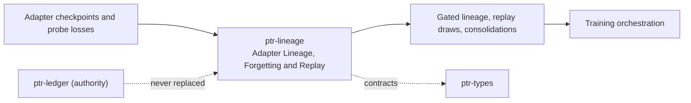

# ptr-lineage — Adapter Lineage, Forgetting and Replay

> **Role:** Models adapter identity, gated lifecycle, subspace interference, forgetting-driven replay and consolidation for continual specialisation.  
> **Maturity:** prototype; claims beyond the automated checks must be proven by the linked experiments and component evaluations.

<!-- PTR:STATUS:BEGIN -->
## Current implementation status

> **Generated section.** Source of truth: [`component.toml`](component.toml) plus code-derived metrics from `src/`. Run `python3 scripts/update_component_docs.py --write` after editing implementation metadata. Do not hand-edit inside this block.

**Maturity:** `prototype`  
**Last reviewed:** 2026-09-26  
**Code footprint:** 8 Rust source files · 2243 nonblank source lines · 4 integration-test files · 70 `#[test]` markers

### Implemented now

- Content-addressed adapter records bound to one exact base model and revision, with origin, parent or consolidation sources and a data manifest; a consolidation must name at least one registered source
- Registration always starts as a candidate; only a passing forgetting gate report bound to that adapter lets it serve
- Forgetting gate with thresholds on average and per-task forgetting, backward transfer and public-suite regression, computed from an accuracy matrix whose summaries never overflow for finite scores (infinite only when the exact value exceeds f64::MAX, never NaN); a nonfinite threshold or public-suite score is refused before anything is evaluated
- Revoking a training input names every adapter, descendant and consolidation that depends on it
- Principal-angle overlap of the column and row spaces of delta_W = B A per layer, computed from the factors without forming the product, against its chance level, plus activation interference; bases, norms, products and interference ratios are computed at a power-of-two scale, so finite factors of any magnitude are measured and only a product entry or ratio beyond f64::MAX is refused; matrix shapes whose size overflows and subspaces of different dimensions are refused, an entry index outside a matrix panics instead of reading another row, and a layer update can only be built with aligned factors
- TIES merge of full updates for consolidation, finite for any finite updates (the sign election and the mean cannot overflow), due when depth or overlap exceeds the policy or when an overlap cannot be compared with it; a report with a NaN overlap is within no limit
- FSRS-4.5 forgetting model on the training clock, lapse tracking with label-audit withholding, and stratified Gumbel-top-k sampling without replacement; model times must be finite (probes, draws and priorities alike) and never precede a sample's last probe, a lapse limit of zero is refused, a draw reserves memory only for the samples it can return, and a probe whose update would store a nonfinite stability or difficulty is refused with the sample unchanged
- Held-out samples cannot enter the replay pool

### Missing for the target architecture

- Adapter promotion and revocation as committed ledger events
- Serving admission through checkpoint binding
- A lineage adapter in ptr-pg over the rest of the work schema (ptr-pg stores interference reports only)

### Next milestones

- Run R004 against a naive chain and a joint retrain
- Define the AdapterPromoted ledger event and its admission rule

### Linked experiments

- [R004](../../experiments/runtime/R004-adapter-lineage/README.md) — `planned`

### Technology evaluations

- [adapter-serving](../../evaluations/components/adapter-serving/README.md) — `open`

### Decision records

- [ADR-0019-adapter-lineage-and-weak-supervision.md](../../research/decisions/ADR-0019-adapter-lineage-and-weak-supervision.md)
- [ADR-0015-continued-pretraining-coding-pod.md](../../research/decisions/ADR-0015-continued-pretraining-coding-pod.md)

### Current automated checks

- tests/lineage.rs gate, lineage and erasure propagation
- tests/interference.rs subspace overlap cases, including rank-deficient factors measured on their product and factors of extreme magnitude
- tests/consolidation.rs TIES merge and forgetting summaries, including inputs whose running sums overflow
- tests/replay.rs forgetting model and sampling, including nonfinite model times and unbounded draw counts
- workspace fmt/check/test/clippy

<!-- PTR:STATUS:END -->

## Position in PTR

Dedicated diagram source: [`docs/diagrams/components/ptr-lineage.mmd`](../../docs/diagrams/components/ptr-lineage.mmd)

**Upstream:** ptr-types  
**Downstream:** training orchestration, adapter serving (evaluated), ptr-pg (work schema tables)

## Mission

Specialise continually without silently forgetting, and always know which adapters a training input reached.

PTR keeps this responsibility in its own crate so the semantics remain stable even when an external library or implementation is replaced.

## Responsibilities

- adapter identity and lifecycle
- forgetting gate
- interference measurement
- replay scheduling
- consolidation

## Explicit non-responsibilities

- training
- serving decisions
- weight storage (ptr-storage)

## Data flow

| Direction | Contract |
|---|---|
| Input | Adapter records, accuracy matrices, low-rank updates, probe losses |
| Output | Gate reports, interference reports, replay draws, consolidated updates, affected-adapter sets |
| Failure | Explicit typed error / rejected state; no silent fallback that changes semantics |
| Observability | Standard PTR tracing fields and a stable component span |

## Technical approach

- gated lifecycle
- principal-angle interference against chance
- FSRS-style forgetting with stratified sampling
- TIES consolidation

External projects are **candidates**, not architectural authority. The PTR-owned types must remain usable with a replacement backend.

## Core invariants

1. No registry row decides serving.
2. Held-out samples never enter replay.
3. Revoking an input names every dependent adapter.

These invariants are executable through the unit and integration tests listed in the status block.

## Failure model

The component fails closed for semantic or effect-safety violations. Infrastructure failures surface as typed errors that preserve revision, generation and provenance context. Retries must be idempotent whenever the operation may cross a process or network boundary.

## Security and privacy

- Treat external inputs and backend outputs as untrusted until validated.
- Do not put raw secrets or private evidence into generic tracing or inspection.
- Derived artifacts are as sensitive as the inputs they were derived from.
- External effects pass through `ptr-security` even if this component already performed local validation.

## Experiments

- [R004](../../experiments/runtime/R004-adapter-lineage/README.md)

## Technology evaluation

- [adapter-serving](../../evaluations/components/adapter-serving/README.md)

## Related architecture

- [35 — Agentic substrate](../../docs/architecture/35-agentic-substrate.md)
- [System architecture](../../docs/architecture/00-system.md)
- [Component contracts](../../docs/COMPONENT_CONTRACTS.md)
- [Global invariants](../../docs/INVARIANTS.md)
