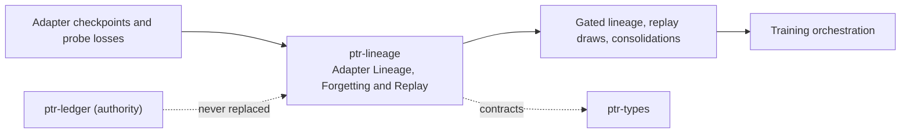

# ptr-lineage — Adapter Lineage, Forgetting and Replay

> **Role:** Models adapter identity, gated lifecycle, subspace interference, forgetting-driven replay and consolidation for continual specialisation.  
> **Maturity:** prototype; claims beyond the automated checks must be proven by the linked experiments and component evaluations.

<!-- PTR:STATUS:BEGIN -->
## Current implementation status

> **Generated section.** Source of truth: [`component.toml`](component.toml) plus code-derived metrics from `src/`. Run `python3 scripts/update_component_docs.py --write` after editing implementation metadata. Do not hand-edit inside this block.

**Maturity:** `prototype`  
**Last reviewed:** 2026-09-27  
**Code footprint:** 8 Rust source files · 3916 nonblank source lines · 5 integration-test files · 102 test markers (`#[test]`, `#[tokio::test]`)

### Implemented now

- Adapter records bound to one exact base model and revision, with origin, parent or consolidation sources and a data manifest, carrying the weights' artifact id and SHA-256 and the training-data fingerprint as the trainer supplies them (recorded, never read or checked here; erasure follows the manifest exactly as declared); a consolidation must name at least one registered source
- Registration always starts as a candidate; only a passing forgetting gate report naming that adapter lets it serve, and only the gate can produce one (it binds the adapter id, not the scores it was given)
- Forgetting gate with thresholds on average and per-task forgetting, backward transfer and public-suite regression, computed from an accuracy matrix whose summaries never overflow for finite scores (infinite only when the exact value exceeds f64::MAX, never NaN) and never underflow on the way to their value: a task's forgetting is its exact change, subnormal or not, and every mean is rounded once, so a summary is zero only when its exact value is at most half of 5e-324; a nonfinite threshold or public-suite score is refused before anything is evaluated
- Revoking a training input names every adapter, descendant and consolidation that depends on it through the registered data manifests
- Principal-angle overlap of the column and row spaces of delta_W = B A per layer, by Gram-Schmidt over the columns and rows of the product, never col(B) and row(A): run in coordinates of orthonormal bases of the factors, in O((d_out + d_in) r^2) time and O((d_out + d_in) r) memory, where the factors are smaller than the product, no factor entry is more than 2^400 below the largest of its factor and the product's largest column and row are at most 2^8 below their size without cancellation, agreeing with the formed product up to rounding; and on the formed product otherwise, in O(d_out d_in r) time, where factorizations whose products are computed as the same matrix give the same bases and a direction left after large terms cancel is kept; each side reported with the chance level of the comparison that produced its overlap, plus activation interference of two updates of one layer (a different layer name or output size is refused); an adapter that updates a layer twice is refused before anything is measured; a report names the candidate adapter measure_interference measured it for, so storing it under another adapter by mistake is refused (ptr-pg), though its fields are public and a report relabelled or built by hand names whatever it was given; bases and norms are computed at a power-of-two scale, and interference effects, the products bases are taken from and every delta_weight product f64 cannot provably form exactly (a running sum that overflows or a term that underflows) with an exponent range f64 does not bound, rounding each step as f64 does and an entry's last step once, straight to f64 (an entry of one term is the f64 product), so finite factors of any magnitude are measured, an entry far smaller than the largest of its matrix keeps its effect, terms that each round to zero still make the subnormal entry they sum to in delta_weight as in the bases, and only a product entry or ratio beyond f64::MAX is refused; matrix shapes whose size overflows and subspaces of different dimensions are refused, an entry index outside a matrix panics instead of reading another row, and a layer update can only be built with aligned factors
- TIES merge of full updates for consolidation, finite for any finite updates (the sign election and the mean cannot overflow, an entry far smaller than entries that cancel exactly still decides the sign, and the mean is rounded once, below the normal range too), due when depth or overlap exceeds the policy or when an overlap cannot be compared with it or lies outside [0, 1]; a report with an overlap that is NaN or outside [0, 1] is within no limit
- FSRS-4.5 forgetting model on the training clock, lapse tracking with label-audit withholding, and stratified Gumbel-top-k sampling without replacement; model times must be finite (probes, draws and priorities alike) and never precede a sample's last probe, a second probe at the model time of a recorded one is refused as a repeat, a priority refuses a hand-built state with a nonfinite or out-of-range difficulty, a stability that is not finite and positive or a nonfinite last probe, a minimum stability above the initial one is refused so a lapse never raises stability, a lapse limit of zero is refused, a draw reserves memory only for the samples it can return, and a probe whose update would store a nonfinite stability or difficulty is refused with the sample unchanged
- Held-out samples cannot enter the replay pool

### Missing for the target architecture

- Adapter promotion and revocation as committed ledger events
- Serving admission through checkpoint binding
- A lineage adapter in ptr-pg over the rest of the work schema (ptr-pg stores interference reports only)
- A training-run record per adapter run once an adapter is actually trained: training chain, adapter produced, run-manifest input fingerprint and adapter data fingerprint (different digests), trigger event, replay and new sample counts, wall-clock and model times, gate result
- Replay samples and probes keyed by the training chain whose weights and clock they were measured on, not by base model and revision, so concurrent chains on one base model keep separate clocks
- An adapter's function_accuracy on uniform gold absent from its data manifest recorded as a metric of its evaluation run and usable as a task score of the forgetting gate

### Next milestones

- Run R004 against a naive chain and a joint retrain
- Define the AdapterPromoted ledger event and its admission rule

### Linked experiments

- [R004](../../experiments/runtime/R004-adapter-lineage/README.md) — `planned`

### Technology evaluations

- [adapter-serving](../../evaluations/components/adapter-serving/README.md) — `open`

### Decision records

- [ADR-0019-adapter-lineage-and-weak-supervision.md](../../research/decisions/ADR-0019-adapter-lineage-and-weak-supervision.md)
- [ADR-0015-continued-pretraining-coding-pod.md](../../research/decisions/ADR-0015-continued-pretraining-coding-pod.md)

### Current automated checks

- tests/lineage.rs gate, lineage and erasure propagation, including digests and manifests registered as given and overlaps outside [0, 1]
- tests/interference.rs subspace overlap cases, including rank-deficient factors measured on their product, factors of extreme magnitude, factors whose product cancels, product terms that underflow, product entries rounded once, chance levels paired with their overlaps, overlaps outside [0, 1], activation interference across layers and a layer updated twice
- tests/interference_cost.rs peak heap of measuring a 2048 x 3072 rank-4 layer, pinned below a sixteenth of its product's size, with bases checked against the formed product
- tests/consolidation.rs TIES merge and forgetting summaries, including inputs whose running sums overflow and subnormal scores
- tests/replay.rs forgetting model and sampling, including nonfinite model times, unbounded draw counts, repeated probes, hand-built memory states and a stability floor above the initial stability
- workspace fmt/check/test/clippy

<!-- PTR:STATUS:END -->

## Position in PTR

```mermaid
flowchart LR
    A["Adapter checkpoints and probe losses"] --> B["ptr-lineage\nAdapter Lineage, Forgetting and Replay"]
    B --> C["Gated lineage, replay draws, consolidations"]
    C --> D["Training orchestration"]
    B -. "contracts" .-> T["ptr-types"]
    L["ptr-ledger (authority)"] -. "never replaced" .-> B
```

Dedicated diagram source: [`docs/diagrams/components/ptr-lineage.mmd`](../../docs/diagrams/components/ptr-lineage.mmd)

**Upstream:** ptr-types  
**Downstream:** training orchestration, adapter serving (evaluated), ptr-pg (work schema tables)

## Mission

Specialise continually without silently forgetting, and always know which adapters a training input reached.

PTR keeps this responsibility in its own crate so the semantics remain stable even when an external library or implementation is replaced.

## Responsibilities

- adapter identity and lifecycle
- forgetting gate
- interference measurement
- replay scheduling
- consolidation

## Explicit non-responsibilities

- training
- serving decisions
- weight storage (ptr-storage)

## Data flow

| Direction | Contract |
|---|---|
| Input | Adapter records, accuracy matrices, low-rank updates, probe losses |
| Output | Gate reports, interference reports, replay draws, consolidated updates, affected-adapter sets |
| Failure | Explicit typed error / rejected state; no silent fallback that changes semantics |
| Observability | Standard PTR tracing fields and a stable component span |

## Technical approach

- gated lifecycle
- principal-angle interference against chance
- FSRS-style forgetting with stratified sampling
- TIES consolidation

External projects are **candidates**, not architectural authority. The PTR-owned types must remain usable with a replacement backend.

## Core invariants

1. No registry row decides serving.
2. Held-out samples never enter replay.
3. Revoking an input names every dependent adapter.

These invariants are executable through the unit and integration tests listed in the status block.

## Failure model

The component fails closed for semantic or effect-safety violations. Infrastructure failures surface as typed errors that preserve revision, generation and provenance context. Retries must be idempotent whenever the operation may cross a process or network boundary.

## Security and privacy

- Treat external inputs and backend outputs as untrusted until validated.
- Do not put raw secrets or private evidence into generic tracing or inspection.
- Derived artifacts are as sensitive as the inputs they were derived from.
- External effects pass through `ptr-security` even if this component already performed local validation.

## Experiments

- [R004](../../experiments/runtime/R004-adapter-lineage/README.md)

## Technology evaluation

- [adapter-serving](../../evaluations/components/adapter-serving/README.md)

## Related architecture

- [35 — Agentic substrate](../../docs/architecture/35-agentic-substrate.md)
- [System architecture](../../docs/architecture/00-system.md)
- [Component contracts](../../docs/COMPONENT_CONTRACTS.md)
- [Global invariants](../../docs/INVARIANTS.md)
