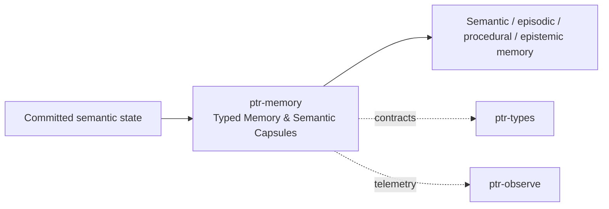

# ptr-memory — Typed Memory & Semantic Capsules

> **Role:** Stores validated semantic, episodic, procedural and epistemic memory as lifecycle-managed domain objects.  
> **Maturity:** architecture + contract scaffold; production behavior must be proven by the linked experiments and component evaluations.

## Position in PTR

Dedicated diagram source: [`docs/diagrams/components/ptr-memory.mmd`](../../docs/diagrams/components/ptr-memory.mmd)

**Upstream:** ptr-state, ptr-semdb, ptr-verifier  
**Downstream:** ptr-search, ptr-core

## Mission

Stores validated semantic, episodic, procedural and epistemic memory as lifecycle-managed domain objects.

PTR keeps this responsibility in its own crate so the semantics remain stable even when an external library or implementation is replaced.

## Responsibilities

- SemanticCapsule
- semantic/episodic/procedural/epistemic memory classes
- consolidation contracts
- provenance and validity metadata

## Explicit non-responsibilities

- fast search implementation
- causal commit ordering
- raw model hidden state

## Data flow

| Direction | Contract |
|---|---|
| Input | Committed/materialized semantic state and verified procedures/episodes |
| Output | Versioned memory objects and projections for retrieval |
| Failure | Explicit typed error / rejected state; no silent fallback that changes semantics |
| Observability | Standard PTR tracing fields and a stable component span |

## Technical approach

- Rust domain model
- derived human-readable mirrors allowed
- multi-vector semantic representations as research path

External projects are **candidates**, not architectural authority. The PTR-owned traits and domain types must remain usable with a replacement backend.

## Core invariants

1. A memory generation is never mutated in place across lifecycle changes.
2. Derived indexes cannot resurrect revoked content.
3. Procedural memory requires verifier and replay evidence before promotion.

These invariants should be executable wherever possible through unit, property, lifecycle or chaos tests.

## Failure model

The component must fail closed for semantic or effect-safety violations. Infrastructure failures should surface as typed errors that preserve request, revision, generation and provenance context. Retries must be idempotent whenever the operation may cross a process or network boundary.

## Performance model

Measure before optimizing. Benchmarks should record at least latency distribution, throughput, allocations/resident memory, queue depth or working-set size where relevant, and the cost of verification. Performance optimizations may not bypass generation, revision, capability or evidence checks.

## Security and privacy

- Treat external inputs and backend outputs as untrusted until validated.
- Do not put raw secrets/private evidence into generic tracing or inspection.
- Preserve provenance on every promotion from raw/possible evidence to stronger semantic state.
- External effects pass through `ptr-security` even if this component already performed local validation.

## Technology evaluation

- No dedicated technology slot yet; architectural alternatives should be added to `evaluations/components/` before lock-in.

A new candidate should be added with a reproducible benchmark and failure-semantics analysis rather than replacing the default ad hoc.

## Tests required before production use

- Contract/unit tests for all domain transitions.
- Invalid, stale-generation and stale-revision cases.
- Cancellation/retry behavior.
- Property tests for invariants where practical.
- Cross-backend equivalence if more than one backend exists.
- Observability and redaction checks.

## Related architecture

- [System architecture](../../docs/architecture/00-system.md)
- [Technical architecture](../../docs/TECHNICAL_ARCHITECTURE.md)
- [Component contracts](../../docs/COMPONENT_CONTRACTS.md)
- [Global invariants](../../docs/INVARIANTS.md)

