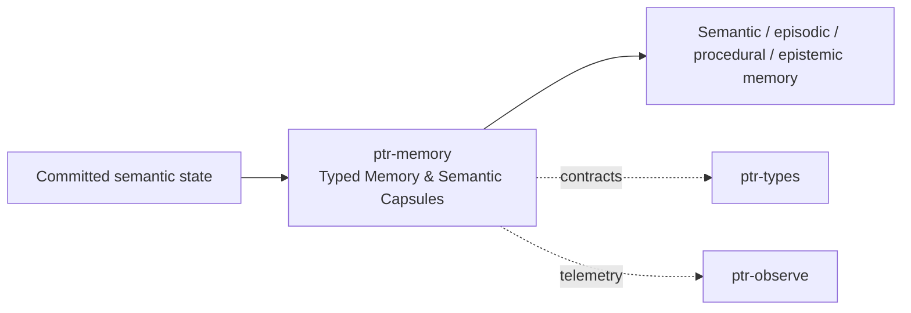

# ptr-memory — Typed Memory & Semantic Capsules

> **Role:** Stores validated semantic, episodic, procedural and epistemic memory as lifecycle-managed domain objects.  
> **Maturity:** architecture + contract scaffold; production behavior must be proven by the linked experiments and component evaluations.

<!-- PTR:STATUS:BEGIN -->
## Current implementation status

> **Generated section.** Source of truth: [`component.toml`](component.toml) plus code-derived metrics from `src/`. Run `python3 scripts/update_component_docs.py --write` after editing implementation metadata. Do not hand-edit inside this block.

**Maturity:** `scaffold`  
**Last reviewed:** 2026-10-03  
**Code footprint:** 6 Rust source files · 1256 nonblank source lines · 2 integration-test files · 19 test markers (`#[test]`, `#[tokio::test]`)

### Implemented now

- MemoryClass taxonomy
- SemanticCapsule with lifecycle/provenance/goal/constraint/known/hypothesis/unknown/relation fields
- VerifiedProcedure scaffold with replay_verified flag
- RawEvent carries a SHA-256 content digest and an optional tool call/result pair; validate_digest and validate_tool_pair return Result<(), RawEventError> and reject tampered content (DigestMismatch) and a result without a call (ToolResultWithoutCall)
- KnowledgeStore (in memory) keeps raw events append-only: replaying the identical event is idempotent, reusing an id for different content is rejected as ConflictingRawEvent
- KnowledgeObject generations are stored under (logical_id, generation) and are immutable: registering different content under an existing key fails with ConflictingKnowledgeGeneration; lifecycle changes are kept as separate revisioned LifecycleRecords, so content_digest() does not change on a lifecycle transition
- KnowledgeStore::admit_object requires every raw source to be present and every dependency to name an existing, non-invalidated exact generation; a generation above 1 must supersede exactly the previous generation
- Lifecycle transitions are restricted to Hot -> Warm -> Cold -> Pod -> Archived, with Invalidated reachable from any state; activating a new generation invalidates the previous one; a transition to Invalidated cascades to dependents exactly like invalidate(), and re-activating a generation keeps its recorded lifecycle and is refused, with nothing changed, when the cascade from the superseded generation would reach it
- Invalidation propagates transitively to every object that depends on the invalidated exact generation (dependents of other generations are untouched)
- RetentionController/decide: pinned objects are always KeepVerbatim, otherwise a result score at or above the threshold keeps the result, else a call score at or above it drops only the result, else drops the call; a model failure or invalid decision falls back to KeepVerbatim; score_candidates rejects duplicate candidates, score-count mismatch and unknown or duplicate scores; RuleRetentionModel is a fixed 0.5/1.0 placeholder, not a trained classifier
- Deterministic context compiler (compile_structured/compile_selected): orders candidates by pinned flag, action rank and object key rather than input order, rejects invalidated objects, missing or dropped dependencies, missing verbatim bytes and token-budget overflow, and returns a SHA-256 digest over the compiled entries
- Ingestion pipeline traits (SemanticTokenizer, EntityExtractor, NamespaceResolver, KnowledgeObjectBuilder) with deterministic reference implementations: whitespace tokenizer, SHA-256-derived entity ids, first-namespace resolver and a builder producing a generation-1 Hot KnowledgeObject with the event as source and provenance; these are placeholders without semantic extraction
- InMemoryKvStateRuntime behind the KvStateRuntime trait: continue_state chains states from a CompiledContext digest, invalidate_dependencies marks matching states and all their descendants Invalidated, an invalidated state cannot be continued and must be recomputed
- KV continuation is authorized only by an opaque KvStateHandle bound to its creating runtime (ForeignHandle for another runtime's handle); callers get read-only KvStateMetadata and cannot submit edited session/revision/model/adapter/dependency fields

### Missing for the target architecture

- Persistent semantic/episodic/procedural/epistemic stores: KnowledgeStore and InMemoryKvStateRuntime are in-memory only
- Lifecycle enforcement and revocation propagation beyond the in-memory KnowledgeStore and KV runtime: nothing is durable and nothing is wired to a ptr-state repository
- Consolidation/promotion policies
- A trained retention model and real semantic tokenization/entity extraction: the reference implementations are deterministic placeholders
- Shared typed semantic objects instead of separate String buckets for goals/constraints/known/hypotheses/unknowns/relations
- Multi-vector/late-interaction representations and human-readable mirror

### Next milestones

- Replace string payload buckets with shared ptr-types semantic-role/epistemic wrappers while keeping SemanticCapsule aggregate ownership in ptr-memory
- Implement capsule lifecycle repository on ptr-state
- Evaluate editable-memory superiority against strong RAG in E002/E004

### Linked experiments

- [Q002](../../experiments/retrieval/Q002-evidence-promotion/README.md) — `planned`
- [E002](../../experiments/system/E002-rag-baselines/README.md) — `planned`
- [E004](../../experiments/system/E004-long-horizon/README.md) — `planned`

### Technology evaluations

- None recorded.

### Decision records

- [ADR-0002-authority-hierarchy.md](../../research/decisions/ADR-0002-authority-hierarchy.md)
- [ADR-0008-derived-search-not-authority.md](../../research/decisions/ADR-0008-derived-search-not-authority.md)

### Current automated checks

- ptr-memory tests/retention.rs: raw_history_is_digest_checked_and_idempotent, raw_history_rejects_tampering_and_conflicting_reuse
- ptr-memory tests/retention.rs: knowledge_generation_is_immutable_and_context_digest_tracks_content, lifecycle_transition_does_not_mutate_immutable_generation_digest, invalidation_propagates_to_dependents, invalidation_is_not_archive, transition_to_invalidated_cascades_like_invalidate, reactivating_a_generation_keeps_its_recorded_demotion, activation_that_would_invalidate_itself_is_refused_without_side_effects
- ptr-memory tests/retention.rs: retention_preserves_pinned_objects, retention_drops_result_before_dropping_call, retention_rejects_duplicate_scores
- ptr-memory tests/retention.rs: context_compiler_rejects_missing_dependencies_and_budget_overflow, dropped_dependency_cannot_satisfy_an_active_object, context_digest_is_independent_of_equal_priority_input_order
- ptr-memory tests/retention.rs: kv_runtime_continues_and_requires_recompute_on_dependency_invalidation, kv_handles_are_owned_by_their_runtime, deterministic_ingestion_builds_typed_knowledge_object
- workspace fmt/check/test/clippy

<!-- PTR:STATUS:END -->

## Position in PTR

```mermaid
flowchart LR
    A["Committed semantic state"] --> B["ptr-memory\nTyped Memory & Semantic Capsules"]
    B --> C["Semantic / episodic / procedural / epistemic memory"]
    B -. "contracts" .-> T["ptr-types"]
    B -. "telemetry" .-> O["ptr-observe"]
```

Dedicated diagram source: [`docs/diagrams/components/ptr-memory.mmd`](../../docs/diagrams/components/ptr-memory.mmd)

**Upstream:** ptr-state, ptr-semdb, ptr-verifier  
**Downstream:** ptr-search, ptr-core

## Mission

Stores validated semantic, episodic, procedural and epistemic memory as lifecycle-managed domain objects.

PTR keeps this responsibility in its own crate so the semantics remain stable even when an external library or implementation is replaced.

## Responsibilities

- SemanticCapsule
- semantic/episodic/procedural/epistemic memory classes
- consolidation contracts
- provenance and validity metadata

## Explicit non-responsibilities

- fast search implementation
- causal commit ordering
- raw model hidden state

## Data flow

| Direction | Contract |
|---|---|
| Input | Committed/materialized semantic state and verified procedures/episodes |
| Output | Versioned memory objects and projections for retrieval |
| Failure | Explicit typed error / rejected state; no silent fallback that changes semantics |
| Observability | Standard PTR tracing fields and a stable component span |

## Technical approach

- Rust domain model
- derived human-readable mirrors allowed
- multi-vector semantic representations as research path

External projects are **candidates**, not architectural authority. The PTR-owned traits and domain types must remain usable with a replacement backend.

## Core invariants

1. A memory generation is never mutated in place across lifecycle changes.
2. Derived indexes cannot resurrect revoked content.
3. Procedural memory requires verifier and replay evidence before promotion.

Knowledge generations are stored under `(logical_id, generation)` and their
content records are immutable. Lifecycle and invalidation changes are recorded
separately and materialized only when a caller requests the current view.
Dependencies identify an exact generation, so a newer generation cannot silently
substitute for a revoked one.

KV continuation is authorized only by an opaque `KvStateHandle` created by its
own runtime. Callers can inspect read-only `KvStateMetadata`, but cannot submit
edited session, revision, model, adapter or dependency fields back to the
runtime.

These invariants should be executable wherever possible through unit, property, lifecycle or chaos tests.

## Failure model

The component must fail closed for semantic or effect-safety violations. Infrastructure failures should surface as typed errors that preserve request, revision, generation and provenance context. Retries must be idempotent whenever the operation may cross a process or network boundary.

## Performance model

Measure before optimizing. Benchmarks should record at least latency distribution, throughput, allocations/resident memory, queue depth or working-set size where relevant, and the cost of verification. Performance optimizations may not bypass generation, revision, capability or evidence checks.

## Security and privacy

- Treat external inputs and backend outputs as untrusted until validated.
- Do not put raw secrets/private evidence into generic tracing or inspection.
- Preserve provenance on every promotion from raw/possible evidence to stronger semantic state.
- External effects pass through `ptr-security` even if this component already performed local validation.

## Technology evaluation

- No dedicated technology slot yet; architectural alternatives should be added to `evaluations/components/` before lock-in.

A new candidate should be added with a reproducible benchmark and failure-semantics analysis rather than replacing the default ad hoc.

## Tests required before production use

- Contract/unit tests for all domain transitions.
- Invalid, stale-generation and stale-revision cases.
- Cancellation/retry behavior.
- Property tests for invariants where practical.
- Cross-backend equivalence if more than one backend exists.
- Observability and redaction checks.

## Related architecture

- [System architecture](../../docs/architecture/00-system.md)
- [Technical architecture](../../docs/TECHNICAL_ARCHITECTURE.md)
- [Component contracts](../../docs/COMPONENT_CONTRACTS.md)
- [Global invariants](../../docs/INVARIANTS.md)
