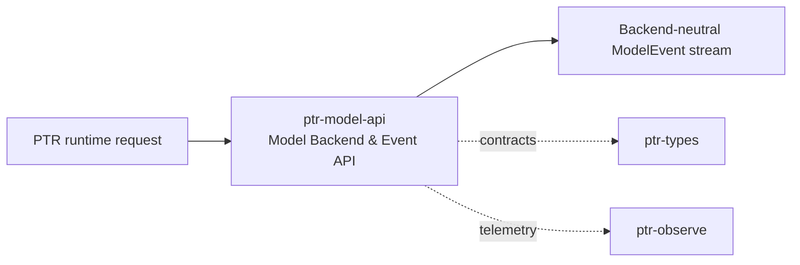

# ptr-model-api — Model Backend & Event API

> **Role:** Keeps the runtime independent of any single inference server or model implementation.  
> **Maturity:** architecture + contract scaffold; production behavior must be proven by the linked experiments and component evaluations.

<!-- PTR:STATUS:BEGIN -->
## Current implementation status

> **Generated section.** Source of truth: [`component.toml`](component.toml) plus code-derived metrics from `src/`. Run `python3 scripts/update_component_docs.py --write` after editing implementation metadata. Do not hand-edit inside this block.

**Maturity:** `scaffold`  
**Last reviewed:** 2026-09-18  
**Code footprint:** 4 Rust source files · 83 nonblank source lines · 2 integration-test files · 2 `#[test]` markers

### Implemented now

- Backend-neutral ModelRequest with request/revision/raw text
- ModelEvent enum for slot, hypothesis, confidence, operator, typed Pod request, candidate, action, token and completion events
- InferenceBackend trait and ModelError
- Deterministic ReferenceEchoBackend for runtime conformance tests
- ModelObservation, ModelResumeRequest and ResumableInferenceBackend continuation contract

### Missing for the target architecture

- Async streaming backend contract
- Backend capability negotiation
- SGLang, vLLM and Burn-native adapters
- Backend checkpoint/state handles beyond observation-based continuation
- Structured cancellation and timeout semantics

### Next milestones

- Convert infer/resume from Vec-returning sync calls to cancellable async streams
- Add backend capability descriptor
- Implement first external model adapter after inference-serving evaluation

### Linked experiments

- [M007](../../experiments/model/M007-model-event-stream/README.md) — `planned`
- [E001](../../experiments/system/E001-end-to-end/README.md) — `planned`
- [E003](../../experiments/system/E003-token-efficiency/README.md) — `planned`

### Technology evaluations

- [inference-serving](../../evaluations/components/inference-serving/README.md) — `open`

### Decision records

- [ADR-0004-backend-independence.md](../../research/decisions/ADR-0004-backend-independence.md)
- [ADR-0007-model-event-stream.md](../../research/decisions/ADR-0007-model-event-stream.md)

### Current automated checks

- reference backend request/event conformance test
- typed PodRequested event contract covered by runtime loop tests
- observation/resume contract covered by runtime multi-step tests
- workspace fmt/check/test/clippy

<!-- PTR:STATUS:END -->

## Position in PTR

Dedicated diagram source: [`docs/diagrams/components/ptr-model-api.mmd`](../../docs/diagrams/components/ptr-model-api.mmd)

**Upstream:** ptr-core or external inference service  
**Downstream:** ptr-exec, ptr-router

## Mission

Keeps the runtime independent of any single inference server or model implementation.

PTR keeps this responsibility in its own crate so the semantics remain stable even when an external library or implementation is replaced.

## Responsibilities

- ModelRequest and ModelEvent contracts
- streaming inference abstraction
- backend capability negotiation
- resume/observation handoff semantics

## Explicit non-responsibilities

- model architecture itself
- provider-specific business logic
- runtime permissions

## Data flow

| Direction | Contract |
|---|---|
| Input | Typed model requests and semantic snapshots |
| Output | Streaming model events |
| Failure | Explicit typed error / rejected state; no silent fallback that changes semantics |
| Observability | Standard PTR tracing fields and a stable component span |

## Technical approach

- Async Rust traits/streams
- vLLM and SGLang remote adapters
- Burn native backend
- future TensorRT/native backends

External projects are **candidates**, not architectural authority. The PTR-owned traits and domain types must remain usable with a replacement backend.

## Core invariants

1. Backends expose capabilities explicitly.
2. The runtime never assumes every backend can emit latent/typed events.
3. Provider output is validated before becoming domain state.

These invariants should be executable wherever possible through unit, property, lifecycle or chaos tests.

## Failure model

The component must fail closed for semantic or effect-safety violations. Infrastructure failures should surface as typed errors that preserve request, revision, generation and provenance context. Retries must be idempotent whenever the operation may cross a process or network boundary.

## Performance model

Measure before optimizing. Benchmarks should record at least latency distribution, throughput, allocations/resident memory, queue depth or working-set size where relevant, and the cost of verification. Performance optimizations may not bypass generation, revision, capability or evidence checks.

## Security and privacy

- Treat external inputs and backend outputs as untrusted until validated.
- Do not put raw secrets/private evidence into generic tracing or inspection.
- Preserve provenance on every promotion from raw/possible evidence to stronger semantic state.
- External effects pass through `ptr-security` even if this component already performed local validation.

## Technology evaluation

- [inference-serving](../../evaluations/components/inference-serving/README.md)

A new candidate should be added with a reproducible benchmark and failure-semantics analysis rather than replacing the default ad hoc.

## Tests required before production use

- Contract/unit tests for all domain transitions.
- Invalid, stale-generation and stale-revision cases.
- Cancellation/retry behavior.
- Property tests for invariants where practical.
- Cross-backend equivalence if more than one backend exists.
- Observability and redaction checks.

## Related architecture

- [System architecture](../../docs/architecture/00-system.md)
- [Technical architecture](../../docs/TECHNICAL_ARCHITECTURE.md)
- [Component contracts](../../docs/COMPONENT_CONTRACTS.md)
- [Global invariants](../../docs/INVARIANTS.md)

