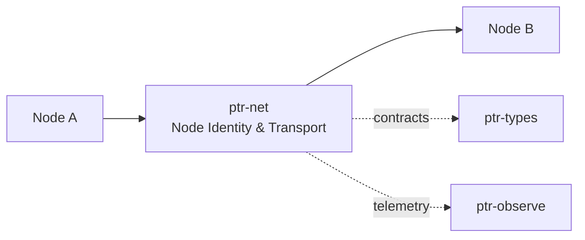

# ptr-net — Node Identity & Transport

> **Role:** Connects PTR nodes and remote Pods with authenticated transport while leaving protocol semantics to ptr-protocol.  
> **Maturity:** architecture + contract scaffold; production behavior must be proven by the linked experiments and component evaluations.

<!-- PTR:STATUS:BEGIN -->
## Current implementation status

> **Generated section.** Source of truth: [`component.toml`](component.toml) plus code-derived metrics from `src/`. Run `python3 scripts/update_component_docs.py --write` after editing implementation metadata. Do not hand-edit inside this block.

**Maturity:** `prototype`  
**Last reviewed:** 2026-09-22  
**Code footprint:** 2 Rust source files · 305 nonblank source lines · 3 integration-test files · 1 `#[test]` markers

### Implemented now

- ALPN constants for raft, PodWire, model, blob, events and execution protocols
- The execution wire has its own ALPN rather than sharing the pod wire's: two protocols on one ALPN is how a request meant for one gets parsed by the other, and the parse that succeeds by accident is the dangerous one
- NodeIdentity scaffold
- Provider-independent Transport trait
- Feature-gated Iroh 1.2 direct QUIC adapter with PTR ALPNs and authenticated peer identity
- Iroh response path keeps the connection alive through peer-observed graceful completion
- Iroh 1.2 optional feature requires Rust 1.91; default runtime core retains a separate Rust 1.85 gate
- The endpoint address type is re-exported, so a composing crate names an address without declaring its own iroh dependency: two pins of a transport would be two wire formats
- PeerBook records where each peer the deployment knows about can be reached, keyed by the id the address itself carries — there is no (peer, address) pair to transpose, so a wrong address lands under its own owner rather than pointing one peer's name at another peer's socket
- PeerBook replaces an address rather than refusing a second one, unlike the admission tables it otherwise mirrors: an address is a fact about where a node is and a node moves, while a grant is a decision that must not change silently
- PeerAddress has no public constructor, so the only address either wire client will accept is one a PeerBook produced: a requester cannot dial an address it was handed by a peer, read out of a payload, or learned from the network
- Nothing in PeerBook reads bytes, which is the mechanism rather than a check: there is no path by which the network can add an entry
- An address that names the right peer at the wrong socket fails rather than reaching whoever is there, because the key at the far end is authenticated — pinned in the handshake, and compared against the id asked for as a second line

### Missing for the target architecture

- Peer discovery/session lifecycle
- Any traffic on ALPN_MODEL, ALPN_BLOB or ALPN_EVENTS: three of the six ALPNs are still declared and unspoken
- Discovery: finding the address for an id nobody told you is a mechanism choice with its own trust question, and iroh's own address lookup is disabled in this build, so turning it on is a decision about trusting a third party rather than a code change
- A journaled peer book, and any re-resolution of a stale address: the book is in memory and a deployment whose nodes move must record the new address
- Retry/idempotency and backpressure behavior
- Raft/PodWire/blob stream adapters; ptr-cluster carries raft batches over ALPN_RAFT, ptr-execwire carries execution requests over ALPN_EXEC and ptr-podwire carries Pod access over ALPN_PODWIRE, all three using the request/response path, and a stream adapter would replace that rather than extend it

### Next milestones

- Extend Iroh adapter from local request/response to reusable connection/session management and Raft/PodWire channels
- Add retry/idempotency/backpressure semantics around authenticated Iroh sessions
- Exercise partition/reconnect behavior in L002

### Linked experiments

- [L002](../../experiments/lifecycle/L002-raft-recovery/README.md) — `planned`
- [E001](../../experiments/system/E001-end-to-end/README.md) — `planned`

### Technology evaluations

- [network](../../evaluations/components/network/README.md) — `open`

### Decision records

- [ADR-0004-backend-independence.md](../../research/decisions/ADR-0004-backend-independence.md)
- [ADR-0009-consensus-ledger-state-separation.md](../../research/decisions/ADR-0009-consensus-ledger-state-separation.md)

### Current automated checks

- Iroh local direct request/response roundtrip verifies authenticated peer identity and ALPN routing
- an address is locatable only under the id it carries, re-recording returns what it replaced, a forgotten peer is refused from the next lookup, and a truthful address from the book reaches its peer as the control
- an address pointing the honest id at an impostor's socket fails and the impostor serves nothing, with the honest node at its true address succeeding in the same test so the failure is about the lie
- compile-fail doctest: PeerAddress cannot be built by a struct literal
- workspace fmt/check/test/clippy

<!-- PTR:STATUS:END -->

## Position in PTR

Dedicated diagram source: [`docs/diagrams/components/ptr-net.mmd`](../../docs/diagrams/components/ptr-net.mmd)

**Upstream:** ptr-protocol, ptr-storage  
**Downstream:** ptr-pods, ptr-ledger, ptr-events

## Mission

Connects PTR nodes and remote Pods with authenticated transport while leaving protocol semantics to ptr-protocol.

PTR keeps this responsibility in its own crate so the semantics remain stable even when an external library or implementation is replaced.

## Responsibilities

- NodeId/identity mapping
- transport sessions
- ALPN allocation
- cluster peer connectivity
- remote channel lifecycle
- **address authority**: where each peer the deployment knows about may be dialled

## An address is not an identity

A `NodeId` is a public key and says *who*. An address says *where*, changes when a
host moves, and on its own is a hint that anyone could answer.

`PeerBook` holds the deployment's answer to *where*. It is keyed by the id the
address itself carries, so there is no `(peer, address)` pair to transpose: an
operator who records the wrong address files it under **its own** owner, and a
requester asking for the intended peer still does not find it. It replaces an
address rather than refusing a second one — unlike the admission tables it otherwise
mirrors — because an address is a fact about where a node is and a node moves, while
a grant is a decision that must not change silently.

`PeerAddress` has no public constructor. Both wire clients accept nothing else, so a
requester cannot dial an address it was handed by a peer, read out of a payload, or
learned from the network.

What the book cannot detect is an address that names the right peer at the wrong
socket. What stops that is the key at the far end being authenticated, so the cost of
a wrong address is a failed request rather than a request served by the wrong node.

Finding the address for an id nobody told you is **discovery**, which this crate
deliberately does not do. See
[`docs/architecture/34-address-authority.md`](../../docs/architecture/34-address-authority.md).

## Explicit non-responsibilities

- PodWire semantics
- Raft state machine
- event semantics

## Data flow

| Direction | Contract |
|---|---|
| Input | Validated protocol frames and blobs |
| Output | Authenticated streams/datagrams and peer events |
| Failure | Explicit typed error / rejected state; no silent fallback that changes semantics |
| Observability | Standard PTR tracing fields and a stable component span |

## Technical approach

- Iroh/QUIC primary candidate
- separate ALPNs for raft, podwire, blobs, model and events

External projects are **candidates**, not architectural authority. The PTR-owned traits and domain types must remain usable with a replacement backend.

## Core invariants

1. Peer identity is cryptographically bound to the session.
2. Transport retry cannot duplicate authoritative effects without higher-layer idempotency.
3. Consensus semantics never depend on gossip alone.

These invariants should be executable wherever possible through unit, property, lifecycle or chaos tests.

## Failure model

The component must fail closed for semantic or effect-safety violations. Infrastructure failures should surface as typed errors that preserve request, revision, generation and provenance context. Retries must be idempotent whenever the operation may cross a process or network boundary.

## Performance model

Measure before optimizing. Benchmarks should record at least latency distribution, throughput, allocations/resident memory, queue depth or working-set size where relevant, and the cost of verification. Performance optimizations may not bypass generation, revision, capability or evidence checks.

## Security and privacy

- Treat external inputs and backend outputs as untrusted until validated.
- Do not put raw secrets/private evidence into generic tracing or inspection.
- Preserve provenance on every promotion from raw/possible evidence to stronger semantic state.
- External effects pass through `ptr-security` even if this component already performed local validation.

## Technology evaluation

- [network](../../evaluations/components/network/README.md)

A new candidate should be added with a reproducible benchmark and failure-semantics analysis rather than replacing the default ad hoc.

## Tests required before production use

- Contract/unit tests for all domain transitions.
- Invalid, stale-generation and stale-revision cases.
- Cancellation/retry behavior.
- Property tests for invariants where practical.
- Cross-backend equivalence if more than one backend exists.
- Observability and redaction checks.

## Related architecture

- [System architecture](../../docs/architecture/00-system.md)
- [Technical architecture](../../docs/TECHNICAL_ARCHITECTURE.md)
- [Component contracts](../../docs/COMPONENT_CONTRACTS.md)
- [Global invariants](../../docs/INVARIANTS.md)

