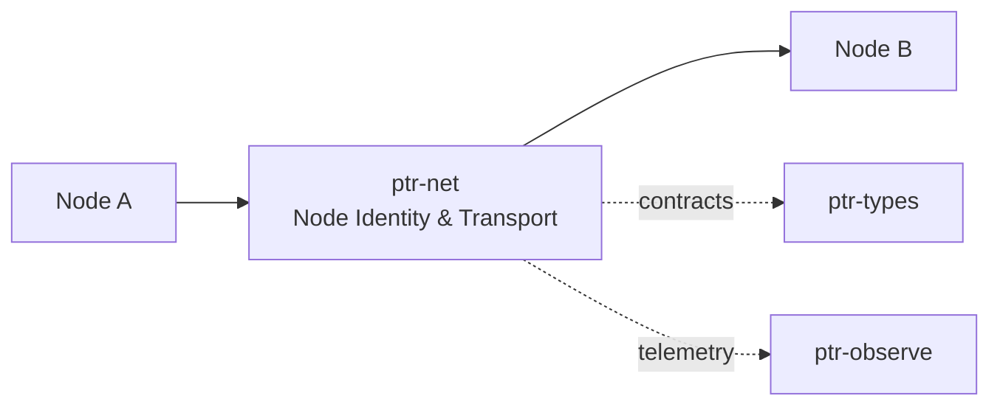

# ptr-net — Node Identity & Transport

> **Role:** Connects PTR nodes and remote Pods with authenticated transport while leaving protocol semantics to ptr-protocol.  
> **Maturity:** architecture + contract scaffold; production behavior must be proven by the linked experiments and component evaluations.

<!-- PTR:STATUS:BEGIN -->
## Current implementation status

> **Generated section.** Source of truth: [`component.toml`](component.toml) plus code-derived metrics from `src/`. Run `python3 scripts/update_component_docs.py --write` after editing implementation metadata. Do not hand-edit inside this block.

**Maturity:** `prototype`  
**Last reviewed:** 2026-10-03  
**Code footprint:** 4 Rust source files · 1320 nonblank source lines · 5 integration-test files · 31 test markers (`#[test]`, `#[tokio::test]`)

### Implemented now

- ALPN constants for raft, PodWire, model, blob, events and execution protocols
- The execution wire has its own ALPN rather than sharing the pod wire's: two protocols on one ALPN is how a request meant for one gets parsed by the other, and the parse that succeeds by accident is the dangerous one
- NodeIdentity scaffold
- Provider-independent Transport trait
- Feature-gated Iroh 1.3 direct QUIC adapter with PTR ALPNs and authenticated peer identity
- Iroh response path keeps the connection alive through peer-observed graceful completion
- The Iroh optional feature builds and is tested on the workspace's Rust 1.99 toolchain, the same one the default runtime core is checked on
- The endpoint address type is re-exported, so a composing crate names an address without declaring its own iroh dependency: two pins of a transport would be two wire formats
- PeerBook records where each peer the deployment knows about can be reached, keyed by the id the address itself carries — there is no (peer, address) pair to transpose, so a wrong address lands under its own owner rather than pointing one peer's name at another peer's socket
- PeerBook replaces an address rather than refusing a second one, unlike the admission tables it otherwise mirrors: an address is a fact about where a node is and a node moves, while a grant is a decision that must not change silently
- PeerAddress has no public constructor, so the only address either wire client will accept is one a PeerBook produced: a requester cannot dial an address it was handed by a peer, read out of a payload, or learned from the network
- Nothing in PeerBook reads bytes, which is the mechanism rather than a check: there is no path by which the network can add an entry
- An address that names the right peer at the wrong socket fails rather than reaching whoever is there, because the key at the far end is authenticated — pinned in the handshake, and compared against the id asked for as a second line
- Iroh reusable sessions (feature iroh-backend): connect_session/accept_session keep one authenticated QUIC connection and open one bidirectional stream per request; connect_session rejects a peer whose authenticated id differs from the requested one and rejects max_in_flight = 0
- IrohSession::request enforces a per-session in-flight cap with a non-blocking semaphore: a request above the cap fails immediately with a backpressure error instead of queueing; there is no retry or automatic reconnect, a closed session rejects requests and the caller opens a fresh session
- RelayMode (Disabled, DirectOnly, DirectWithRelayFallback) and IrohTransport::bind_with_relay_mode: Disabled and DirectOnly map to iroh's relay disabled, DirectWithRelayFallback to iroh's default relay; bind() keeps Disabled. The relay-fallback mode has no test
- MeshRegistry membership model: one-time invitations, accept creates an Active membership at revision 1, revoke marks it Revoked and bumps the revision, endpoint()/endpoint_binding() resolve only Active members and carry a Direct or Relay route; invitations reject cross-network or zero-digest peer identities, and a consumed invitation cannot be reused
- MeshRegistry::apply_event replays ptr-types MeshTunnelLifecycleEvents (activation, revocation, route change) with generation/revision checks that reject stale or conflicting revisions and route changes for revoked peers; the membership revision is the single monotone counter, so a replayed older route change is stale, a revoked membership is not reactivated by a later activation event, and a later activation keeps the key digest of the first admission instead of replacing it (the event carries no key-digest field of its own), so it cannot swap the admitted key but is not rejected either; a revoked peer cannot be re-admitted at all, because invite refuses any existing membership
- Mesh tunnel lifecycle: TunnelProfile/TunnelLease/TunnelState and the MeshTunnelExecutor trait with ReferenceMeshTunnelExecutor (in-memory, fencing-token and profile checks, idempotent release) and WireguardUserspaceExecutor<D>, which drives an injected WireguardDevice (create_interface, configure_peer, remove_peer, remove_interface) through the same admit/establish/rotate/revoke/release lifecycle and refuses a second live lease on the same interface name; revoke removes the interface at once (release then does not remove it again), establish removes the interface it created if peer configuration fails so a retry works (if that removal fails too the lease keeps ownership, and a retry or release removes the leaked interface), and rotate_peer rejects a zero key, configures the new peer before removing the previous one and leaves the lease profile unchanged so the original lease stays valid
- Feature wireguard-uapi-backend (Linux only): LinuxWireguardDevice creates and removes interfaces via the host `ip` utility and configures peers through the WireGuard userspace UAPI; the WireGuard public key must be registered explicitly per network, peer id and identity digest and is never derived from the PTR identity digest, interface names are validated (max 15 chars, alphanumeric, _ or -). Not executed in this environment, described from the code only; the UAPI set request only adds or removes the peer public key (no endpoint, allowed-ips or private key); remove_peer sets the UAPI remove flag and reference-counts identities that share one WireGuard key so a rotation that keeps the key does not remove its replacement; both are tested against a mock UAPI socket only, never a real interface
- Feature wintun-backend (Windows only): WintunDevice loads the Wintun DLL, creates an adapter and session and can probe the driver version; configure_peer only validates the peer and checks that a session exists, so it is a TUN interface without any WireGuard crypto dataplane. Not compiled or run here, described from the code only

### Missing for the target architecture

- Peer discovery/session lifecycle
- Any traffic on ALPN_MODEL, ALPN_BLOB or ALPN_EVENTS: three of the six ALPNs are still declared and unspoken
- Discovery: finding the address for an id nobody told you is a mechanism choice with its own trust question, and iroh's own address lookup is disabled in this build, so turning it on is a decision about trusting a third party rather than a code change
- A journaled peer book, and any re-resolution of a stale address: the book is in memory and a deployment whose nodes move must record the new address
- Retry/idempotency semantics and automatic reconnect: backpressure is only a fail-fast per-session in-flight cap
- Mesh state is in memory and not journaled; MeshRegistry is not connected to Iroh peer admission, and ReferenceMeshTunnelExecutor::rotate_peer still rewrites the stored profile (only the WireGuard executor keeps the lease profile stable)
- Raft/PodWire/blob stream adapters; ptr-cluster carries raft batches over ALPN_RAFT, ptr-execwire carries execution requests over ALPN_EXEC and ptr-podwire carries Pod access over ALPN_PODWIRE, all three using the request/response path, and a stream adapter would replace that rather than extend it

### Next milestones

- Carry Raft/PodWire channels over the reusable IrohSession instead of one connection per request
- Add retry/idempotency and reconnect semantics around authenticated Iroh sessions
- Exercise partition/reconnect behavior in L002

### Linked experiments

- [L002](../../experiments/lifecycle/L002-raft-recovery/README.md) — `planned`
- [E001](../../experiments/system/E001-end-to-end/README.md) — `planned`

### Technology evaluations

- [network](../../evaluations/components/network/README.md) — `open`

### Decision records

- [ADR-0004-backend-independence.md](../../research/decisions/ADR-0004-backend-independence.md)
- [ADR-0009-consensus-ledger-state-separation.md](../../research/decisions/ADR-0009-consensus-ledger-state-separation.md)

### Current automated checks

- Iroh local direct request/response roundtrip verifies authenticated peer identity and ALPN routing
- an address is locatable only under the id it carries, re-recording returns what it replaced, a forgotten peer is refused from the next lookup, and a truthful address from the book reaches its peer as the control
- an address pointing the honest id at an impostor's socket fails and the impostor serves nothing, with the honest node at its true address succeeding in the same test so the failure is about the lie
- compile-fail doctest: PeerAddress cannot be built by a struct literal
- ptr-net tests/iroh.rs (feature iroh-backend): reusable_session_multiplexes_streams_and_enforces_backpressure, session_rejects_work_above_the_in_flight_limit_without_queueing_it, a_closed_session_can_be_replaced_by_a_fresh_session, closed_session_rejects_new_requests_and_a_new_session_recovers
- ptr-net tests/mesh.rs: invitation_acceptance_creates_direct_or_relayable_membership, revoked_membership_cannot_resolve_an_endpoint_or_reuse_invitation, invitation_rejects_cross_network_peer_identity, late_activation_cannot_resurrect_a_revoked_membership, a_later_activation_keeps_the_admitted_key_digest_and_is_not_rejected, stale_route_changes_are_rejected_after_a_newer_route
- ptr-net tests/tunnel.rs: reference_tunnel_is_fenced_and_cleanup_is_idempotent, stale_lease_cannot_revoke_a_new_fenced_lease, invalid_profile_is_rejected_before_tunnel_activation, userspace_executor_binds_device_io_to_the_fenced_lifecycle, revoke_tears_down_the_interface_and_release_does_not_remove_it_twice, rotation_keeps_the_original_lease_valid_and_removes_the_old_peer, rotation_rejects_an_all_zero_key, failed_peer_configuration_does_not_leak_the_interface_and_allows_retry, failed_cleanup_keeps_ownership_so_a_retry_removes_the_leaked_interface, failed_cleanup_can_still_be_released (fake device), and with feature wireguard-uapi-backend on Linux linux_device::{remove_peer_sends_a_remove_request_for_the_registered_key, rotation_that_keeps_the_wireguard_key_does_not_remove_the_replacement, the_same_peer_in_two_networks_keeps_two_keys} against a mock socket; wintun_dll_and_driver_are_loadable_when_provisioned is Windows-only and skips without WINTUN_DLL
- workspace fmt/check/test/clippy

<!-- PTR:STATUS:END -->

## Position in PTR

```mermaid
flowchart LR
    A["Node A"] --> B["ptr-net\nNode Identity & Transport"]
    B --> C["Node B"]
    B -. "contracts" .-> T["ptr-types"]
    B -. "telemetry" .-> O["ptr-observe"]
```

Dedicated diagram source: [`docs/diagrams/components/ptr-net.mmd`](../../docs/diagrams/components/ptr-net.mmd)

**Upstream:** ptr-protocol, ptr-storage  
**Downstream:** ptr-pods, ptr-ledger, ptr-events

## Mission

Connects PTR nodes and remote Pods with authenticated transport while leaving protocol semantics to ptr-protocol.

PTR keeps this responsibility in its own crate so the semantics remain stable even when an external library or implementation is replaced.

## Responsibilities

- NodeId/identity mapping
- transport sessions
- ALPN allocation
- cluster peer connectivity
- remote channel lifecycle
- **address authority**: where each peer the deployment knows about may be dialled

## An address is not an identity

A `NodeId` is a public key and says *who*. An address says *where*, changes when a
host moves, and on its own is a hint that anyone could answer.

`PeerBook` holds the deployment's answer to *where*. It is keyed by the id the
address itself carries, so there is no `(peer, address)` pair to transpose: an
operator who records the wrong address files it under **its own** owner, and a
requester asking for the intended peer still does not find it. It replaces an
address rather than refusing a second one — unlike the admission tables it otherwise
mirrors — because an address is a fact about where a node is and a node moves, while
a grant is a decision that must not change silently.

`PeerAddress` has no public constructor. Both wire clients accept nothing else, so a
requester cannot dial an address it was handed by a peer, read out of a payload, or
learned from the network.

What the book cannot detect is an address that names the right peer at the wrong
socket. What stops that is the key at the far end being authenticated, so the cost of
a wrong address is a failed request rather than a request served by the wrong node.

Finding the address for an id nobody told you is **discovery**, which this crate
deliberately does not do. See
[`docs/architecture/34-address-authority.md`](../../docs/architecture/34-address-authority.md).

## Explicit non-responsibilities

- PodWire semantics
- Raft state machine
- event semantics

## Data flow

| Direction | Contract |
|---|---|
| Input | Validated protocol frames and blobs |
| Output | Authenticated streams/datagrams and peer events |
| Failure | Explicit typed error / rejected state; no silent fallback that changes semantics |
| Observability | Standard PTR tracing fields and a stable component span |

## Technical approach

- Iroh/QUIC primary candidate
- separate ALPNs for raft, podwire, blobs, model and events

External projects are **candidates**, not architectural authority. The PTR-owned traits and domain types must remain usable with a replacement backend.

## Core invariants

1. Peer identity is cryptographically bound to the session.
2. Transport retry cannot duplicate authoritative effects without higher-layer idempotency.
3. Consensus semantics never depend on gossip alone.

These invariants should be executable wherever possible through unit, property, lifecycle or chaos tests.

## Failure model

The component must fail closed for semantic or effect-safety violations. Infrastructure failures should surface as typed errors that preserve request, revision, generation and provenance context. Retries must be idempotent whenever the operation may cross a process or network boundary.

## Performance model

Measure before optimizing. Benchmarks should record at least latency distribution, throughput, allocations/resident memory, queue depth or working-set size where relevant, and the cost of verification. Performance optimizations may not bypass generation, revision, capability or evidence checks.

## Security and privacy

- Treat external inputs and backend outputs as untrusted until validated.
- Do not put raw secrets/private evidence into generic tracing or inspection.
- Preserve provenance on every promotion from raw/possible evidence to stronger semantic state.
- External effects pass through `ptr-security` even if this component already performed local validation.

## Technology evaluation

- [network](../../evaluations/components/network/README.md)

A new candidate should be added with a reproducible benchmark and failure-semantics analysis rather than replacing the default ad hoc.

## Tests required before production use

- Contract/unit tests for all domain transitions.
- Invalid, stale-generation and stale-revision cases.
- Cancellation/retry behavior.
- Property tests for invariants where practical.
- Cross-backend equivalence if more than one backend exists.
- Observability and redaction checks.

## Related architecture

- [System architecture](../../docs/architecture/00-system.md)
- [Technical architecture](../../docs/TECHNICAL_ARCHITECTURE.md)
- [Component contracts](../../docs/COMPONENT_CONTRACTS.md)
- [Global invariants](../../docs/INVARIANTS.md)
## WireGuard adapter

Enable `wireguard-uapi-backend` on Linux to compile `LinuxWireguardDevice`.
It uses the WireGuard userspace UAPI for peer configuration and the host
`ip` utility for interface create/remove; those operations require the
deployment's normal network privileges. The public key is registered
explicitly from admission and is never derived from a PTR identity digest.
Windows Wintun and macOS Network Extension remain separate platform adapters
behind the same `WireguardDevice` contract.
