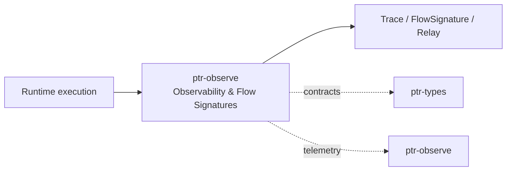

# ptr-observe — Observability & Flow Signatures

> **Role:** Records structured runtime execution without requiring natural-language chain-of-thought logging.  
> **Maturity:** architecture + contract scaffold; production behavior must be proven by the linked experiments and component evaluations.

<!-- PTR:STATUS:BEGIN -->
## Current implementation status

> **Generated section.** Source of truth: [`component.toml`](component.toml) plus code-derived metrics from `src/`. Run `python3 scripts/update_component_docs.py --write` after editing implementation metadata. Do not hand-edit inside this block.

**Maturity:** `scaffold`  
**Last reviewed:** 2026-09-18  
**Code footprint:** 5 Rust source files · 126 nonblank source lines · 2 integration-test files · 2 `#[test]` markers

### Implemented now

- Standard PTR tracing field names including operation/outcome/error/expected/actual/latency fields
- FlowSignature with request/operators/state transitions
- Backend-neutral TraceEvent, TraceLevel and typed TraceValue structures
- TraceSink port with infallible NoopTraceSink reference implementation
- Typed TraceError variants with stable machine-readable error codes

### Missing for the target architecture

- tracing crate adapter plus Subscriber/layer integration
- OpenTelemetry and NeMo Relay exporters
- Plan-vs-execution correlation
- Redaction middleware
- Selective async-backtrace/active-tree diagnostics

### Next milestones

- Implement tracing-crate adapter behind the PTR TraceSink contract
- Instrument request/execution/Pod/verifier boundaries
- Add redaction-safe structured exporter
- Feed FlowSignature + runtime trace into feedback trajectories

### Linked experiments

- [F001](../../experiments/feedback/F001-generate-verify-repair/README.md) — `planned`
- [E003](../../experiments/system/E003-token-efficiency/README.md) — `planned`

### Technology evaluations

- [observability](../../evaluations/components/observability/README.md) — `open`

### Decision records

- [ADR-0001-rust-runtime.md](../../research/decisions/ADR-0001-rust-runtime.md)
- [ADR-0010-component-docs-as-code.md](../../research/decisions/ADR-0010-component-docs-as-code.md)

### Current automated checks

- typed trace event expected/actual value test
- namespaced tracing field test
- workspace fmt/check/test/clippy

<!-- PTR:STATUS:END -->

## Position in PTR

Dedicated diagram source: [`docs/diagrams/components/ptr-observe.mmd`](../../docs/diagrams/components/ptr-observe.mmd)

**Upstream:** all runtime crates  
**Downstream:** ptr-feedback, training, operators

## Mission

Records structured runtime execution without requiring natural-language chain-of-thought logging.

PTR keeps this responsibility in its own crate so the semantics remain stable even when an external library or implementation is replaced.

## Responsibilities

- standard tracing fields
- span hierarchy
- FlowSignature
- OTel/Relay export
- latency and resource telemetry

## Explicit non-responsibilities

- generic object inspection
- business-state persistence
- authorization

## Data flow

| Direction | Contract |
|---|---|
| Input | Runtime spans, events, model/operator metadata |
| Output | Structured traces, flow signatures and exported telemetry |
| Failure | Explicit typed error / rejected state; no silent fallback that changes semantics |
| Observability | Standard PTR tracing fields and a stable component span |

## Technical approach

- tokio-rs/tracing
- OpenTelemetry
- NeMo Relay trajectory export
- async-backtrace for selective diagnostics

External projects are **candidates**, not architectural authority. The PTR-owned traits and domain types must remain usable with a replacement backend.

## Core invariants

1. Sensitive values are redacted before export.
2. Tracing metadata distinguishes plan from actual execution.
3. Observability failure cannot block hard safety checks.

These invariants should be executable wherever possible through unit, property, lifecycle or chaos tests.

## Failure model

The component must fail closed for semantic or effect-safety violations. Infrastructure failures should surface as typed errors that preserve request, revision, generation and provenance context. Retries must be idempotent whenever the operation may cross a process or network boundary.

## Performance model

Measure before optimizing. Benchmarks should record at least latency distribution, throughput, allocations/resident memory, queue depth or working-set size where relevant, and the cost of verification. Performance optimizations may not bypass generation, revision, capability or evidence checks.

## Security and privacy

- Treat external inputs and backend outputs as untrusted until validated.
- Do not put raw secrets/private evidence into generic tracing or inspection.
- Preserve provenance on every promotion from raw/possible evidence to stronger semantic state.
- External effects pass through `ptr-security` even if this component already performed local validation.

## Technology evaluation

- [observability](../../evaluations/components/observability/README.md)

A new candidate should be added with a reproducible benchmark and failure-semantics analysis rather than replacing the default ad hoc.

## Tests required before production use

- Contract/unit tests for all domain transitions.
- Invalid, stale-generation and stale-revision cases.
- Cancellation/retry behavior.
- Property tests for invariants where practical.
- Cross-backend equivalence if more than one backend exists.
- Observability and redaction checks.

## Related architecture

- [System architecture](../../docs/architecture/00-system.md)
- [Technical architecture](../../docs/TECHNICAL_ARCHITECTURE.md)
- [Component contracts](../../docs/COMPONENT_CONTRACTS.md)
- [Global invariants](../../docs/INVARIANTS.md)

