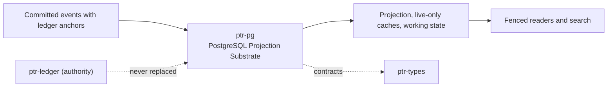

# ptr-pg — PostgreSQL Projection Substrate

> **Role:** Hosts the anchor-verified ledger projection, live-only derived search caches and non-authoritative working state in one PostgreSQL database without creating a second authority.  
> **Maturity:** prototype; claims beyond the automated checks must be proven by the linked experiments and component evaluations.

<!-- PTR:STATUS:BEGIN -->
## Current implementation status

> **Generated section.** Source of truth: [`component.toml`](component.toml) plus code-derived metrics from `src/`. Run `python3 scripts/update_component_docs.py --write` after editing implementation metadata. Do not hand-edit inside this block.

**Maturity:** `prototype`  
**Last reviewed:** 2026-09-26  
**Code footprint:** 16 Rust source files · 4168 nonblank source lines · 2 integration-test files · 23 `#[test]` markers

### Implemented now

- Three schema classes per instance (projection, derived, work) with separate checksummed migration catalogs, per-schema migration tables, an advisory lock held by a session of its own that a cancelled or unwinding migration or rebuild releases when that session closes, drift and newer-build refusal, and LF-normalised checksums
- Projector applies one commit per transaction behind a watermark row lock, deciding the next index with ptr-state classify_next and projecting exactly ptr-state projection_entries
- Every record's anchor is recomputed with ptr-ledger chain_anchors from the stored one and compared with the ledger's; a foreign, rolled-back or re-delivered-but-different record is refused, and a redelivered index counts as a duplicate only when the record itself recomputes to the stored anchor from the one before it
- Lifecycle catalog keyed exactly as the runtime keys it: live generations, an append-only tombstone set, the revision map and an append-only projection event log with consumer offsets and NOTIFY on commit
- Fenced reads that refuse rather than serve a projection behind the requested commit, including every state entry at once in one repeatable-read snapshot
- Derived search documents only for live capsule generations; writers hold the lifecycle row FOR SHARE, and the projector deletes superseded or revoked generations in the same transaction
- Hybrid retrieval in one repeatable-read snapshot: built-in full text plus halfvec cosine search over per-space partial HNSW expression indexes with iterative scans, joined to the lifecycle catalog and fused by capsule and generation
- Work schema for sealed branches, triage logs and append-only outcomes; fast-memory journals and checkpoints; adapter lineage and replay pool; weak-supervision store
- A sealed branch is stored with the base value and base input-set digest of every touched key; a branch stored before input sets were recorded is refused on load (BranchWithoutInputSets) because it cannot be certified and must be re-run, and a branch whose touched keys and input-set digests disagree is refused before any row is written
- Tombstones delete the revoked generation's fast-memory writes, and supersessions every other generation's, with the checkpoints that folded them, in the projector's transaction; appends validate requests against the locked memory configuration and are refused for inadmissible sources and read the journal only after taking the memory row lock; a memory is registered only if ptr-fastmem accepts its configuration
- A checkpoint is stored only when its binding digest matches the one recomputed from the journal prefix it folds, and latest_checkpoint skips any that no longer match
- The projector, cache writers, journal appends and checkpoint stores run at an explicit READ COMMITTED whatever the session default, which the lock ordering needs
- Strings PostgreSQL text cannot hold (NUL) are refused with a typed error before anything is written; the projector refuses such a record and stops there
- Logged triage rows and outcomes are never updated or deleted on their own (only with their branch), and a branch is adjudicated once
- Every vector query uses iterative strict-order scans and an ef_search of at least its limit (pgvector 0.8 required), so results are not truncated at the default candidate list; queries refuse zero limits and nonfinite or negative fusion parameters
- Migrations bound DDL with SET LOCAL lock_timeout in driver-managed transactions that roll back on failure; a rebuild drops and recreates under the migration lock
- Platform metrics compiled from ptr-analytics definitions to SQL over the work schema only, including revert share and a trailing window of days; each metric counts a branch once, windowed on the one record that puts it into the denominator (the conflict rate on its first outcome)
- Recorded triage policies with their rule, levels and calibration set (record_policy, load_policy, adjudicated_samples); triage rows logged from work version 5 on cite a recorded policy by a foreign key added NOT VALID, so a schema holding older rows still upgrades; a policy is refused unless every calibration branch is an adjudicated calibration-slice branch and its rule, rerun on their stored adjudications, chooses its threshold; policies and calibration sets are never rewritten or deleted, a calibration set is complete when its policy commits and never grows, and a branch a policy was calibrated on cannot be deleted
- Interference reports of adapter candidates stored once per adapter under a header row, complete when they commit, and never rewritten, as ptr-lineage measured them; a second report (identical, overlapping or disjoint) and an empty one are refused (record_interference, load_interference)
- A model labeling function may name its adapter in the catalog; any other kind is refused by a column constraint
- Capability probe that never creates an extension; refusal of every non-loopback host and hostaddr because the build links no TLS connector
- Rebuild drops projection and derived schemas and replays; working state survives

### Missing for the target architecture

- TLS connector, role separation and row-level security
- Connection pooling and a logical-replication change feed
- Adapters for the rest of the lineage catalog and for the labeling tables (interference reports and triage policies have them)
- Effect applier for business tables through the effect boundary

### Next milestones

- Run L004 against PostgreSQL 16 and 17 and with readers concurrent with the projector
- Run Q003 against the reference retrieval baselines
- Add TLS and separate projector, reader and migrator roles

### Linked experiments

- [L004](../../experiments/lifecycle/L004-projection-equivalence/README.md) — `completed`
- [Q003](../../experiments/retrieval/Q003-postgres-hybrid/README.md) — `planned`

### Technology evaluations

- [relational-substrate](../../evaluations/components/relational-substrate/README.md) — `open`
- [materialized-state](../../evaluations/components/materialized-state/README.md) — `open`
- [lexical-search](../../evaluations/components/lexical-search/README.md) — `open`
- [local-vector-search](../../evaluations/components/local-vector-search/README.md) — `open`
- [event-streaming](../../evaluations/components/event-streaming/README.md) — `open`

### Decision records

- [ADR-0016-postgres-projection-substrate.md](../../research/decisions/ADR-0016-postgres-projection-substrate.md)
- [ADR-0002-authority-hierarchy.md](../../research/decisions/ADR-0002-authority-hierarchy.md)
- [ADR-0008-derived-search-not-authority.md](../../research/decisions/ADR-0008-derived-search-not-authority.md)
- [ADR-0009-consensus-ledger-state-separation.md](../../research/decisions/ADR-0009-consensus-ledger-state-separation.md)

### Current automated checks

- unit tests for identifiers, catalogs, capability parsing, lifecycle mapping and metric SQL
- tests/postgres.rs against a real server behind postgres-backend (CI job state-postgres)
- L004 projection equivalence (ptr-bench projection-equivalence): five seeds on PostgreSQL 18, 17 of 17 planted defects detected
- workspace fmt/check/test/clippy

<!-- PTR:STATUS:END -->

## Position in PTR

Dedicated diagram source: [`docs/diagrams/components/ptr-pg.mmd`](../../docs/diagrams/components/ptr-pg.mmd)

**Upstream:** ptr-ledger, ptr-state, ptr-types, ptr-semdb, ptr-search, ptr-branch, ptr-fastmem, ptr-analytics  
**Downstream:** agent services reading projections, search candidates and working state

## Mission

Give the platform one operationally simple database for projections, search and working state while keeping the ledger the only authority.

PTR keeps this responsibility in its own crate so the semantics remain stable even when an external library or implementation is replaced.

## Responsibilities

- schemas and migrations
- anchor-verified projection
- fenced reads
- live-only derived caches and hybrid retrieval
- working-state storage
- metric queries

## Explicit non-responsibilities

- causal order (ptr-ledger)
- semantic interpretation (ptr-semdb)
- creating extensions
- business-table effects

## Data flow

| Direction | Contract |
|---|---|
| Input | CommittedEvent with LogAnchor, search documents, sealed branches, fast-memory writes |
| Output | Fenced projection reads, search candidates, stored working state, metric rows |
| Failure | Explicit typed error / rejected state; no silent fallback that changes semantics |
| Observability | Standard PTR tracing fields and a stable component span |

## Technical approach

- tokio-postgres behind a feature
- one commit per transaction with anchor verification
- row-lock ordering between projector and cache writers
- partial HNSW expression indexes per embedding space

External projects are **candidates**, not architectural authority. The PTR-owned types must remain usable with a replacement backend.

## Core invariants

1. The projection advances one verified commit per transaction.
2. Derived rows exist only for live, unrevoked generations.
3. Working state is never read as authority.
4. Driver types never cross the crate boundary.

These invariants are executable through the unit and integration tests listed in the status block.

## Failure model

The component fails closed for semantic or effect-safety violations. Infrastructure failures surface as typed errors that preserve revision, generation and provenance context. Retries must be idempotent whenever the operation may cross a process or network boundary.

## Security and privacy

- Treat external inputs and backend outputs as untrusted until validated.
- Do not put raw secrets or private evidence into generic tracing or inspection.
- Derived artifacts are as sensitive as the inputs they were derived from.
- External effects pass through `ptr-security` even if this component already performed local validation.

## Experiments

- [L004](../../experiments/lifecycle/L004-projection-equivalence/README.md)
- [Q003](../../experiments/retrieval/Q003-postgres-hybrid/README.md)

## Technology evaluation

- [relational-substrate](../../evaluations/components/relational-substrate/README.md)
- [materialized-state](../../evaluations/components/materialized-state/README.md)
- [lexical-search](../../evaluations/components/lexical-search/README.md)
- [local-vector-search](../../evaluations/components/local-vector-search/README.md)
- [event-streaming](../../evaluations/components/event-streaming/README.md)

## Related architecture

- [35 — Agentic substrate](../../docs/architecture/35-agentic-substrate.md)
- [System architecture](../../docs/architecture/00-system.md)
- [Component contracts](../../docs/COMPONENT_CONTRACTS.md)
- [Global invariants](../../docs/INVARIANTS.md)
