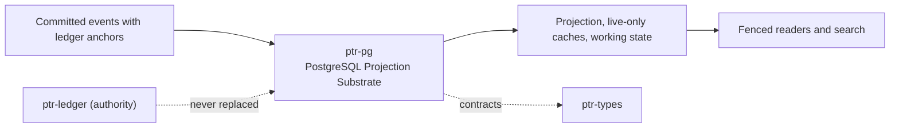

# ptr-pg — PostgreSQL Projection Substrate

> **Role:** Hosts the anchor-verified ledger projection, live-only derived search caches and non-authoritative working state in one PostgreSQL database without creating a second authority.  
> **Maturity:** prototype; claims beyond the automated checks must be proven by the linked experiments and component evaluations.

<!-- PTR:STATUS:BEGIN -->
## Current implementation status

> **Generated section.** Source of truth: [`component.toml`](component.toml) plus code-derived metrics from `src/`. Run `python3 scripts/update_component_docs.py --write` after editing implementation metadata. Do not hand-edit inside this block.

**Maturity:** `prototype`  
**Last reviewed:** 2026-09-26  
**Code footprint:** 16 Rust source files · 5058 nonblank source lines · 2 integration-test files · 25 `#[test]` markers

### Implemented now

- An instance is the three schemas SchemaSet::with_prefix makes of one prefix, never pg or a prefix beginning pg_, whose names PostgreSQL reserves for system schemas and would refuse to create; connect_with refuses any other set (InvalidSchemaSet) before it connects, so the names are distinct and no two instances share a schema, and a rebuild, a migration or the projector never touches another instance's
- Identifiers are [a-z][a-z0-9_]{0,39} and never a keyword PostgreSQL 16 to 18 reserves (pg_get_keywords categories R and T), so every schema and space name interpolates into DDL unquoted
- Three schema classes per instance (projection, derived, work) with separate checksummed migration catalogs, per-schema migration tables, an advisory lock held by a session of its own that a cancelled or unwinding migration or rebuild releases when that session closes, taken with retried pg_try_advisory_lock so a migration cancelled while waiting leaves no session queued on it, kept from idle_session_timeout and confirmed held before every migration and rebuild drop commits (a lost lock rolls the change back with MigrationLockLost), drift and newer-build refusal, and LF-normalised checksums
- Projector applies one commit per transaction behind a watermark row lock, deciding the next index with ptr-state classify_next and projecting exactly ptr-state projection_entries
- Every record's anchor is recomputed with ptr-ledger chain_anchors from the stored one and compared with the ledger's; a foreign, rolled-back or re-delivered-but-different record is refused, and a redelivered index counts as a duplicate only when the record itself recomputes to the stored anchor from the one before it
- Lifecycle catalog keyed exactly as the runtime keys it: live generations, an append-only tombstone set, the revision map and an append-only projection event log with consumer offsets and NOTIFY on commit
- Fenced reads that refuse rather than serve a projection behind the requested commit, including every state entry at once in one repeatable-read snapshot
- Derived search documents only for live capsule generations; writers hold the lifecycle row FOR SHARE, and the projector deletes superseded or revoked generations in the same transaction
- Hybrid retrieval in one repeatable-read snapshot: built-in full text plus halfvec cosine search over per-space partial HNSW expression indexes with iterative scans, joined to the lifecycle catalog (live and not tombstoned, so a revoked generation that is still the live one is never returned, even from a stale cache row) and fused by capsule and generation
- Work schema for sealed branches, triage logs and append-only outcomes; fast-memory journals and checkpoints; adapter lineage and replay pool; weak-supervision store
- A sealed branch is stored with the base value and base input-set digest of every touched key; a branch stored before input sets were recorded is refused on load (BranchWithoutInputSets) because it cannot be certified and must be re-run
- store_branch takes only a SealedBranch, which exists only once ptr_branch::SealedBranch::from_parts has checked every sealing invariant, and rechecks them before any row is written (InvalidBranch); load_branch rebuilds every stored branch through that constructor, so rows changed to write a reserved namespace, overwrite an unread key or break the touched-key bookkeeping, or relying on two generations of one target, are refused as CorruptBranch and a key stored twice as CorruptRow, never returned as a branch to certify; it reads the header and every child table in one read-only repeatable-read snapshot, so a branch deleted while it loads comes back whole or as None, never assembled from partial reads
- record_triage loads the cited policy in the transaction that writes the row and refuses, as InvalidTriage before anything is written, a version no policy is recorded under and a row that policy cannot have produced (ptr_branch::TriagePolicy::explains: decision, slice flag or propensity inconsistent with its threshold and calibration rate for the row's eligibility and score, or a score that is not a probability); the verification report and the calibration draw are not stored, so eligibility and a slice branch's draw remain the caller's word
- record_outcome writes a revert only after the branch's recorded merge and at a greater commit index, reading the merge and inserting the revert in one statement, and refuses any other as InvalidOutcome; the revert share counts a revert only at a commit index after its merge's, so a row written around that check is not counted as reverting a merge it precedes
- Tombstones delete the revoked generation's fast-memory writes, and supersessions every other generation's, with the checkpoints that folded them, in the projector's transaction; appends validate requests against the locked memory configuration and are refused for inadmissible sources and read the journal only after taking the memory row lock; a memory is registered only if ptr-fastmem accepts its configuration, and every loader (load_memory, restore_memory and the registration read by appends and checkpoints) refuses a stored configuration outside check_config's ranges as CorruptRow
- restore_memory reads a registration and its journal in one repeatable-read snapshot and restores the memory bound to the IdentifierCodebook whose seed the registration records, so a memory loaded from PostgreSQL decodes against no other codebook
- source_admission answers the admissibility of a whole source set (live generation and not revoked, is_admissible's rule) in one statement and returns the projection commit index that snapshot reflects, so a caller binds a fast-memory read decision to one lifecycle state; is_admissible answers one source per statement and names no commit
- A checkpoint is stored only when its binding digest matches the one recomputed from the stored journal prefix up to its applied write, and latest_checkpoint skips any whose binding no longer matches; the state cells are the writer's and are never refolded, so the writer stores FastMemory::state with FastMemory::binding_digest of the same memory
- The projector, cache writers, journal appends and checkpoint stores run at an explicit READ COMMITTED whatever the session default, which the lock ordering needs
- Strings PostgreSQL text cannot hold (NUL) are refused with a typed error before anything is written; the projector refuses such a record and stops there
- Logged triage rows and outcomes are never updated or deleted on their own (only with their branch), and a branch is adjudicated once
- Every vector query uses iterative strict-order scans and an ef_search of at least its limit (pgvector 0.8 required), so results are not truncated at the default candidate list; queries refuse, before any SQL, zero limits, nonfinite or negative fusion parameters and weights whose total could fuse to an infinite score (ptr_search::check_rank_fusion)
- Migrations bound DDL with SET LOCAL lock_timeout in driver-managed transactions that roll back on failure; a rebuild drops and recreates under the migration lock
- Platform metrics compiled from ptr-analytics definitions to SQL over the work schema only, including revert share and a trailing window of days; each metric counts a branch once, windowed on the one record that puts it into the denominator (the conflict rate on its first outcome)
- Recorded triage policies with their rule, levels and calibration set (record_policy, load_policy, adjudicated_samples); triage rows logged from work version 5 on cite a recorded policy by a foreign key added NOT VALID, so a schema holding older rows still upgrades; a policy is refused unless every calibration branch is an adjudicated calibration-slice branch and its rule, rerun on their stored adjudications, chooses its threshold; policies and calibration sets are never rewritten or deleted, a calibration set is complete when its policy commits and never grows (its size is checked by counting it once at commit and once per statement that adds to it, so recording N samples in one statement reads O(N) rows), and a branch a policy was calibrated on cannot be deleted
- Interference reports of adapter candidates stored once per adapter under a header row, complete when they commit (the layer count checked by counting the report once at commit and once per statement that adds layers), and never rewritten, as ptr-lineage measured them; a report naming another adapter (InterferenceReport::candidate, whose public field proves no provenance), a second report (identical, overlapping or disjoint) and an empty one are refused (record_interference, load_interference)
- A model labeling function may name its adapter in the catalog; any other kind is refused by a column constraint
- Work migration 9 enforces in the database what the Rust constructors enforce: a stored branch is never rewritten and, at commit, keeps every sealing invariant (a Put or Remove names a read key, an operated key has its base value and input set, a base value is recorded only for an operated key and equals its read, no reserved namespace, non-empty set members, value columns of the operation's kind); triage rows keep the rules every policy shares and a revert needs an earlier merge; a fast memory's state fits MAX_STATE_CELLS, its registration and journal are never rewritten and a write has the lengths its configuration admits; an adapter registers as a candidate on its parent's base and changes only its status along its lifecycle, a consolidated adapter commits with a source, only a consolidated adapter has sources, each on its base, and sources and data manifests are never removed on their own; replay rows are finite and the training clock never runs back; a label schema has two or more distinct non-empty classes and is never rewritten, a labeling function has a non-empty name and is never rewritten, only a verifier vetoes, other kinds vote classes, and every vote and gold label names a class of its schema. Its checks are NOT VALID, so a schema holding older rows still upgrades and the loaders keep refusing them
- Capability probe that never creates an extension; refusal of every non-loopback host and hostaddr because the build links no TLS connector
- Rebuild drops the instance's own projection and derived schemas and replays; working state survives. drop_all, for tests and decommissioning, drops all three without the migration lock, which its caller must serialize

### Missing for the target architecture

- TLS connector, role separation and row-level security
- Connection pooling and a logical-replication change feed
- Adapters for the rest of the lineage catalog and for the labeling tables (interference reports and triage policies have them)
- Effect applier for business tables through the effect boundary
- Replay sample and probe rows keyed by the training chain whose clock they were measured on, added with the replay-table adapter before it reads or writes a replay row
- The verification report and calibration draw behind a logged triage, so storage could check eligibility and slice membership too; record_triage checks only what the row and its cited policy determine
- Fast memories registered only with the principal of the admitted execution session; FastMemoryRecord::principal, like a stored branch's author, is whatever PrincipalId the caller passes

### Next milestones

- Run L004 against PostgreSQL 16 and 17 and with readers concurrent with the projector
- Run Q003 against the reference retrieval baselines
- Add TLS and separate projector, reader and migrator roles

### Linked experiments

- [L004](../../experiments/lifecycle/L004-projection-equivalence/README.md) — `completed`
- [Q003](../../experiments/retrieval/Q003-postgres-hybrid/README.md) — `planned`

### Technology evaluations

- [relational-substrate](../../evaluations/components/relational-substrate/README.md) — `open`
- [materialized-state](../../evaluations/components/materialized-state/README.md) — `open`
- [lexical-search](../../evaluations/components/lexical-search/README.md) — `open`
- [local-vector-search](../../evaluations/components/local-vector-search/README.md) — `open`
- [event-streaming](../../evaluations/components/event-streaming/README.md) — `open`

### Decision records

- [ADR-0016-postgres-projection-substrate.md](../../research/decisions/ADR-0016-postgres-projection-substrate.md)
- [ADR-0002-authority-hierarchy.md](../../research/decisions/ADR-0002-authority-hierarchy.md)
- [ADR-0008-derived-search-not-authority.md](../../research/decisions/ADR-0008-derived-search-not-authority.md)
- [ADR-0009-consensus-ledger-state-separation.md](../../research/decisions/ADR-0009-consensus-ledger-state-separation.md)

### Current automated checks

- unit tests for identifiers, catalogs, capability parsing, lifecycle mapping and metric SQL
- tests/postgres.rs against a real server behind postgres-backend (CI job state-postgres)
- L004 projection equivalence (ptr-bench projection-equivalence): five seeds on PostgreSQL 18, 17 of 17 planted defects detected
- tests/postgres.rs: a raw write breaking each work-schema invariant of migration 9 is refused (a_consolidated_adapter_has_sources_on_its_base_and_only_it_has_them, a_label_schema_needs_two_distinct_non_empty_classes_and_is_never_rewritten, only_a_verifier_vetoes_and_every_vote_names_a_class_of_its_schema, branch_rows_written_directly_keep_every_sealing_invariant, a_triage_row_keeps_the_rules_every_policy_shares, fast_memory_rows_keep_the_shape_their_configuration_admits, replay_rows_are_finite_and_the_training_clock_never_runs_back), and loaders still refuse the same rows written as a store from before it
- tests/postgres.rs: a document of a revoked generation that is still the live one is never returned, even from a stale cache row, and weights whose total could overflow a fused score are refused before SQL
- workspace fmt/check/test/clippy

<!-- PTR:STATUS:END -->

## Position in PTR

Dedicated diagram source: [`docs/diagrams/components/ptr-pg.mmd`](../../docs/diagrams/components/ptr-pg.mmd)

**Upstream:** ptr-ledger, ptr-state, ptr-types, ptr-semdb, ptr-search, ptr-branch, ptr-fastmem, ptr-analytics  
**Downstream:** agent services reading projections, search candidates and working state

## Mission

Give the platform one operationally simple database for projections, search and working state while keeping the ledger the only authority.

PTR keeps this responsibility in its own crate so the semantics remain stable even when an external library or implementation is replaced.

## Responsibilities

- schemas and migrations
- anchor-verified projection
- fenced reads
- live-only derived caches and hybrid retrieval
- working-state storage
- metric queries

## Explicit non-responsibilities

- causal order (ptr-ledger)
- semantic interpretation (ptr-semdb)
- creating extensions
- business-table effects

## Data flow

| Direction | Contract |
|---|---|
| Input | CommittedEvent with LogAnchor, search documents, sealed branches, fast-memory writes |
| Output | Fenced projection reads, search candidates, stored working state, metric rows |
| Failure | Explicit typed error / rejected state; no silent fallback that changes semantics |
| Observability | Standard PTR tracing fields and a stable component span |

## Technical approach

- tokio-postgres behind a feature
- one commit per transaction with anchor verification
- row-lock ordering between projector and cache writers
- partial HNSW expression indexes per embedding space

External projects are **candidates**, not architectural authority. The PTR-owned types must remain usable with a replacement backend.

## Core invariants

1. The projection advances one verified commit per transaction.
2. Derived rows exist only for live, unrevoked generations.
3. Working state is never read as authority.
4. Driver types never cross the crate boundary.

These invariants are executable through the unit and integration tests listed in the status block.

## Failure model

The component fails closed for semantic or effect-safety violations. Infrastructure failures surface as typed errors that preserve revision, generation and provenance context. Retries must be idempotent whenever the operation may cross a process or network boundary.

## Security and privacy

- Treat external inputs and backend outputs as untrusted until validated.
- Do not put raw secrets or private evidence into generic tracing or inspection.
- Derived artifacts are as sensitive as the inputs they were derived from.
- External effects pass through `ptr-security` even if this component already performed local validation.

## Experiments

- [L004](../../experiments/lifecycle/L004-projection-equivalence/README.md)
- [Q003](../../experiments/retrieval/Q003-postgres-hybrid/README.md)

## Technology evaluation

- [relational-substrate](../../evaluations/components/relational-substrate/README.md)
- [materialized-state](../../evaluations/components/materialized-state/README.md)
- [lexical-search](../../evaluations/components/lexical-search/README.md)
- [local-vector-search](../../evaluations/components/local-vector-search/README.md)
- [event-streaming](../../evaluations/components/event-streaming/README.md)

## Related architecture

- [35 — Agentic substrate](../../docs/architecture/35-agentic-substrate.md)
- [System architecture](../../docs/architecture/00-system.md)
- [Component contracts](../../docs/COMPONENT_CONTRACTS.md)
- [Global invariants](../../docs/INVARIANTS.md)
