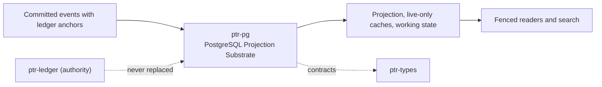

# ptr-pg — PostgreSQL Projection Substrate

> **Role:** Hosts the anchor-verified ledger projection, live-only derived search caches and non-authoritative working state in one PostgreSQL database without creating a second authority.  
> **Maturity:** prototype; claims beyond the automated checks must be proven by the linked experiments and component evaluations.

<!-- PTR:STATUS:BEGIN -->
## Current implementation status

> **Generated section.** Source of truth: [`component.toml`](component.toml) plus code-derived metrics from `src/`. Run `python3 scripts/update_component_docs.py --write` after editing implementation metadata. Do not hand-edit inside this block.

**Maturity:** `prototype`  
**Last reviewed:** 2026-09-28  
**Code footprint:** 17 Rust source files · 6104 nonblank source lines · 2 integration-test files · 30 `#[test]` markers

### Implemented now

- An instance is the three schemas SchemaSet::with_prefix makes of one prefix, never pg or a prefix beginning pg_, whose names PostgreSQL reserves for system schemas and would refuse to create; connect_with refuses any other set (InvalidSchemaSet) before it connects, so the names are distinct and no two instances share a schema, and a rebuild, a migration or the projector never touches another instance's
- Identifiers are a lowercase ASCII letter followed by at most 39 lowercase ASCII letters, digits or underscores, and never a keyword PostgreSQL 16 to 18 reserves (pg_get_keywords categories R and T), so every schema and space name interpolates into DDL unquoted
- Three schema classes per instance (projection, derived, work) with separate checksummed migration catalogs, per-schema migration tables, an advisory lock held by a session of its own that a cancelled or unwinding migration or rebuild releases when that session closes, taken with retried pg_try_advisory_lock so a migration cancelled while waiting leaves no session queued on it, kept from idle_session_timeout and confirmed held before every migration and rebuild drop commits (a lost lock rolls the change back with MigrationLockLost), drift and newer-build refusal, and LF-normalised checksums
- Projector applies one commit per transaction behind a watermark row lock, deciding the next index with ptr-state classify_next and projecting exactly ptr-state projection_entries
- The projection event mapping reads only a semantic record's revisions: its origin changes neither the lifecycle change, the topic nor the subject
- Every record's anchor is recomputed with ptr-ledger chain_anchors from the stored one and compared with the ledger's; a foreign, rolled-back or re-delivered-but-different record is refused, and a redelivered index counts as a duplicate only when the record itself recomputes to the stored anchor from the one before it
- Lifecycle catalog keyed exactly as the runtime keys it: live generations, an append-only tombstone set, the revision map and an append-only projection event log with consumer offsets and NOTIFY on commit; the tombstone set, the applied anchors and the event log refuse UPDATE, DELETE and TRUNCATE (projection migration 2)
- Fenced reads that refuse rather than serve a projection behind the requested commit, including every state entry at once in one repeatable-read snapshot
- Derived search documents only for live capsule generations; writers hold the lifecycle row FOR SHARE, and the projector deletes superseded or revoked generations in the same transaction; a generation is indexed from one content: the same content_digest again re-embeds it, another is refused as DocumentConflict and the stored document kept (that the first digest is the capsule's is its writer's obligation)
- Hybrid retrieval in one repeatable-read snapshot: built-in full text plus halfvec cosine search over per-space partial HNSW expression indexes with iterative scans, each mode keeping only documents live and not tombstoned in that snapshot (so a revoked generation that is still the live one is never returned, even from a stale cache row), applied inside its limited scan so a stale or revoked cache row never takes a live document's place within the limit, and fused by capsule and generation
- register_space writes a space's catalog row, checks it against a stored definition and builds its partial HNSW index (a plain CREATE INDEX, holding a SHARE lock on the documents table while it builds) in one transaction, so an index that cannot be built (a lock timeout, privileges, resources) leaves a new space unregistered rather than registered without its index, and registering the same definition again builds a missing index; the index is found by name only, so a relation already holding that name in the derived schema is taken for it
- Work schema for sealed branches, triage logs and append-only outcomes; fast-memory journals and checkpoints; adapter lineage and replay pool; weak-supervision store
- A sealed branch is stored with the base value and base input-set digest of every touched key, and each set operation with whether its member was in the base (in_base, branch_op.member_in_base); a branch stored before input sets were recorded is refused on load (BranchWithoutInputSets), one stored before set operations recorded in_base (BranchWithoutSetBase), and one whose rows remove a key with a non-empty recorded input set, which sealing produced before it refused such removals (BranchWithDerivedRemoval, not CorruptBranch, when the removal is the only sealing invariant the rows break and no set operation records a base presence, which that sealing never recorded; beside either the rows are CorruptBranch), because none can be certified and each must be re-run
- store_branch takes only a SealedBranch, which exists only once ptr_branch::SealedBranch::from_parts has checked every sealing invariant, and rechecks them before any row is written (InvalidBranch); load_branch rebuilds every stored branch through that constructor, so rows changed to write a reserved namespace, overwrite an unread key or break the touched-key bookkeeping, or relying on two generations of one target, are refused as CorruptBranch and a key stored twice as CorruptRow, never returned as a branch to certify; it reads the header and every child table in one read-only repeatable-read snapshot, so a branch deleted while it loads comes back whole or as None, never assembled from partial reads
- record_triage loads the cited policy in the transaction that writes the row and refuses, as InvalidTriage before anything is written, a version no policy is recorded under and a row that policy cannot have produced (ptr_branch::TriagePolicy::explains: decision, slice flag or propensity inconsistent with its threshold and calibration rate for the row's eligibility and score); a triage no policy produces at all (a score that is not a probability, a slice triage with propensity one) cannot be built to be recorded, since ptr_branch::TriageOutcome::from_parts refuses it; the verification report and the calibration draw are not stored, so eligibility and a slice branch's draw remain the caller's word
- record_outcome writes a merge only when the projection holds the branch's merge key (ptr_state::merged_branch_key, which only a merge record the runtime appends projects) at exactly the claimed commit index, reading the projection and inserting the outcome in one statement, and refuses one it does not hold as MergeNotProjected (PTR_PG_MERGE_NOT_PROJECTED) and one it holds at another index as MergeMismatch (PTR_PG_MERGE_MISMATCH), writing nothing; a rebuilt projection holds no merge until it has caught up. The check is the method's, not the table's (a work-schema trigger would read a projection schema a rebuild drops), so a merged row a raw SQL writer inserts is not checked
- record_outcome writes a revert only after the branch's recorded merge and at a greater commit index, reading the merge and inserting the revert in one statement, and refuses any other as InvalidOutcome; the revert share counts a revert only at a commit index after its merge's, so a row written around that check is not counted as reverting a merge it precedes
- Tombstones delete the revoked generation's fast-memory writes, and supersessions every older generation's (never a later one's, which a rebuilt projection replaying an earlier activation over surviving working state would otherwise delete), with the checkpoints that folded them, in the projector's transaction; appends validate requests against the locked memory configuration and are refused for inadmissible sources and read the journal only after taking the memory row lock; a memory is registered only if ptr-fastmem accepts its configuration, and every loader (load_memory, restore_memory and the registration read by appends and checkpoints) refuses a stored configuration outside check_config's ranges as CorruptRow
- restore_memory reads a registration and its journal in one repeatable-read snapshot and restores the memory bound to the IdentifierCodebook whose seed the registration records and to its projection_digest (FastMemory::restore_with_projection), so a memory loaded from PostgreSQL decodes against no other codebook and reads no query stating another key projection; append_write refuses a sequence number at or below the memory's sequence high-water mark (fastmem_memory.last_seq, the largest number ever journaled for it, which revocation never lowers) or at or above JOURNAL_SEQ_LIMIT (i64::MAX), and restore_memory restores with both (FastMemory::with_sequence_high_water, FastMemory::with_sequence_limit), so a restored memory numbers its next write as the live one does and never takes a number the journal refuses: a revoked write's number is never journaled or handed out again, and once a journal has reached i64::MAX - 1 its memory's next write is refused as SequenceExhausted before it is folded and the registration takes no further write, whatever room its journal has and whatever was revoked since; load_journal returns the rows alone, without the mark; restore_memory and load_journal refuse a row at i64::MAX written before work migration 11 (CorruptRow); neither rechecks a journal row's source lifecycle, which append_write checks and the database does not, so a write journaled around append_write for a revoked or never-live generation is restored and folded, and the read decides admission (FastMemory::read_admitted, answered from source_admission) and refuses it
- source_admission answers the admissibility of a whole source set (live generation and not revoked, is_admissible's rule) in one statement and returns the projection commit index that snapshot reflects, so a caller binds a fast-memory read decision to one lifecycle state; is_admissible answers one source per statement and names no commit
- A checkpoint is stored only when its state has the registered memory's configuration and its binding digest matches the one recomputed from the stored journal prefix up to its applied write; latest_checkpoint skips any whose binding no longer matches and refuses as CorruptRow a matching one whose decoded state has another configuration than the registration or another applied write than its row, so a row written around put_checkpoint is never handed out; FastMemoryCheckpoint's fields are private (read through applied, binding_digest and state), so every one is a checkpoint latest_checkpoint read back with those checks and none can be rebound to another state or digest; the state cells are the writer's and are never refolded, so the writer stores FastMemory::state with FastMemory::binding_digest of the same memory
- The projector, cache writers, journal appends and checkpoint stores run at an explicit READ COMMITTED whatever the session default, which the lock ordering needs
- Strings PostgreSQL text cannot hold (NUL) are refused with a typed error before anything is written; the projector refuses such a record and stops there
- Logged triage rows and outcomes are never updated or deleted on their own (only with their branch: since work migration 13 a delete of one is let through only once its branch row is gone, not whenever it runs below another trigger), and a branch is adjudicated once
- Every vector query uses iterative strict-order scans with ef_search set to its limit clamped to [40, 1000] (pgvector 0.8 required), so results are not cut at the default candidate list; the scan ends when limit rows pass its conditions or at pgvector's own bounds (hnsw.max_scan_tuples, 20,000 visited tuples by default, or hnsw.scan_mem_multiplier times work_mem), so a selective project filter, many stale rows or a large limit can return fewer hits than match, unreported, and the hits are approximate nearest neighbours; queries refuse, before any SQL, zero limits, nonfinite or negative fusion parameters and weights whose total could fuse to an infinite score (ptr_search::check_rank_fusion)
- Migrations bound DDL with SET LOCAL lock_timeout in driver-managed transactions that roll back on failure; a rebuild drops and recreates under the migration lock
- Platform metrics compiled from ptr-analytics definitions to SQL over the work schema only, including revert share and a trailing window of days; each metric counts a branch once, windowed on the one record that puts it into the denominator (the conflict rate on its first outcome), and its numerator counts only branches its denominator counts (the auto-propose share counts eligible branches on both sides, so an ineligible auto-proposal stored before work migration 9's NOT VALID check is in neither); a window of days runs from that many times 24 hours before the query's now() up to now() itself, whatever the session's time zone (the substrate sets none, and a calendar day there is not 24 hours long across a change of its offset), so a record stamped later (explicitly, or on a clock that has since moved back) is in no such window, only in the unwindowed metric, and a zero-day window counts nothing, not even a record stamped at the query's own time
- Recorded triage policies with their rule, levels and calibration set (record_policy, load_policy, adjudicated_samples); triage rows logged from work version 5 on cite a recorded policy by a foreign key added NOT VALID, so a schema holding older rows still upgrades; a policy is refused unless every calibration branch is an adjudicated calibration-slice branch and its rule, rerun on their stored adjudications, chooses its threshold, and the statement that reads those branches, triage rows and verdicts holds them FOR SHARE until the policy commits, so none is erased or rewritten under a policy being recorded (one erased while the read waits for it is not read, and the policy is refused; a concurrent erasure can also end in a deadlock that fails one of the two transactions); adjudicated_samples, record_policy and load_policy rebuild every calibration row through TriageOutcome::from_parts and recheck it against the policy it cites (TriagePolicy::explains), and refuse, as CorruptRow, a row stored before work migration 10 (or 5) that no policy or not its cited policy can have produced, or that cites an unrecorded version, rather than serve it as a calibration sample; policies and calibration sets are never rewritten or deleted, a calibration set is complete when its policy commits and never grows (its size is checked by counting it once at commit and once per statement that adds to it, so recording N samples in one statement reads O(N) rows), and a branch a policy was calibrated on cannot be deleted, not even by a statement that deletes its rows and writes it again under its id before it ends (the calibration row's foreign key is ON DELETE RESTRICT from work migration 13 on); the database holds a policy to its calibration set's size and nothing else, so load_policy checks again what record_policy checks: it reads the policy, its calibration rows and each calibration branch's triage row, verdict and cited policy in one statement, and returns a calibrated policy only when every calibration branch is an adjudicated calibration-slice branch whose row its cited policy explains and the rule, rerun at the policy's levels on exactly those branches, chooses the stored threshold, refusing any other as CorruptRow, so a policy written around record_policy is returned as calibrated only when the verdicts its named branches hold make its rule choose its threshold; for a policy record_policy wrote those verdicts all came before it and are never rewritten, so later adjudications never change what loads, but the database does not record whether a verdict came before or after a policy, so one written around record_policy that names a branch nobody has adjudicated yet is refused until that branch is adjudicated and then loads if the rule on that later verdict chooses its threshold
- Interference reports of adapter candidates stored once per adapter under a header row, complete when they commit (the layer count checked by counting the report once at commit and once per statement that adds layers), and never rewritten; a report naming another adapter (InterferenceReport::candidate, whose public field proves no provenance), a second report (identical, overlapping or disjoint) and an empty one are refused (record_interference, load_interference); the layers are stored as given, the table refusing only an overlap or chance level outside [0, 1], a layer named twice and a layer naming the candidate as its worst overlap, so recording what ptr-lineage measured is the caller's obligation; load_interference refuses a report whose layers are not its recorded count and rechecks nothing else, since every other rule record_interference applies is the table's and binds any writer
- A model labeling function may name its adapter in the catalog; any other kind is refused by a column constraint
- Work migration 9 enforces in the database what the Rust constructors enforce: a stored branch is never rewritten and, at commit, keeps every sealing invariant (a Put or Remove names a read key, an operated key has its base value and input set, a base value is recorded only for an operated key and equals its read, no reserved namespace, non-empty set members, value columns of the operation's kind); triage rows keep the rules every policy shares and a revert needs an earlier merge; a fast memory's state fits MAX_STATE_CELLS, its registration and journal are never rewritten and a write has the lengths its configuration admits; an adapter registers as a candidate on its parent's base and changes only its status along its lifecycle, a consolidated adapter commits with a source, only a consolidated adapter has sources, each on its base, and sources and data manifests are never removed on their own; replay rows are finite and the training clock never runs back; a label schema has two or more distinct non-empty classes and is never updated, a labeling function has a non-empty name and is never updated (from migration 13 neither is deleted while a row names it, not even by a statement that writes it again under its key, so the votes and gold labels checked against one keep its classes and kind), only a verifier vetoes, other kinds vote classes, and every vote and gold label names a class of its schema. Its checks are NOT VALID, so a schema holding older rows still upgrades and the loaders keep refusing them
- Work migration 10 refuses a triage row its cited policy cannot have produced, applying TriagePolicy::explains for that recorded, immutable policy after the table's own checks and the policy's foreign key: an eligible row carries exactly the propensity the policy logs for its score (1 - calibration_rate when the threshold admits it, zero otherwise), a slice row needs a positive rate, and outside the slice a row is auto-proposed exactly when the threshold admits its score, so no raw row written from version 10 on reaches calibration samples or a triage metric under a policy that never logs it (a calibration row stored before is refused by adjudicated_samples, record_policy and load_policy, while the triage metrics still count older rows); a policy's calibration rate is zero or lowers 1 - rate below one, as TriagePolicy::new requires, and a stored policy with a smaller positive rate loads and is cited as a CorruptRow rather than failing a CHECK. The rate check is NOT VALID and the trigger checks rows written from version 10 on
- Work migration 11: a stored branch never grows (its reads, scans, reliances, touched keys and operations are accepted only in the transaction, savepoints included, that writes its header), set operations record in_base and the operations on one member agree on it; a journal row satisfies ptr_fastmem::validate_write for its memory's configuration, decoded from its f32 cells (finite key cells and no all-zero head, finite values within MAX_VALUE_MAGNITUDE, decay factors in (0, 1]), a journal holds at most max_writes rows, counted after a no-change update of the memory row that orders appends at every isolation level, and no write takes sequence number i64::MAX; a registered adapter is never deleted (it is retired); every table whose rows are never removed on their own refuses TRUNCATE; and a check made when a row is written against another row (an adapter's parent or source, a write's memory, a probe's sample, a vote's function and schema, a gold label's schema) refuses the row when that row is missing, rather than leaving it to a foreign key checked at the end of the statement. The member_in_base and sequence checks are NOT VALID, the triggers check rows written from version 11 on
- Work migration 12 keeps each memory's sequence high-water mark (fastmem_memory.last_seq): a journal row's sequence number must exceed it and becomes it, read under the no-change update that orders appends, and the mark never falls, the only column of a registration that changes; a memory registered before starts from its journal's last number (i64::MAX - 1 for a journal holding a row at i64::MAX, whose registration then takes no further write), since the numbers of writes revoked before were not kept; a registration whose state exceeds MAX_STATE_CELLS, which migration 9's NOT VALID check leaves in place and every loader refuses, and one with no journal keep mark 0, since rewriting an oversized row would check that constraint and fail the upgrade (migration 12 was corrected in place before release to skip them)
- Work migration 13: an update that changes a replay sample leaves its last probe at or after every probe stored for it, and a probe locks its sample's row (FOR NO KEY UPDATE) before it is checked (the no-change update of the row it added at the probe's commit is replaced by work migration 14's check); refuse_rewrite no longer lets through a DELETE issued below another trigger (pg_trigger_depth() > 1), which any trigger function could issue: rows of a branch or sample are deleted only once their parent row is gone, as the cascade from it deletes them, and policies, calibration sets, interference reports, adapter sources and data manifests are never deleted. The triggers apply to writes from version 13 on. The calibration row's foreign key to its branch becomes ON DELETE RESTRICT: the NO ACTION key it replaces is checked at the end of the statement and passed one that deleted a calibration branch, then each of its rows (which the removal triggers let go, the branch being gone), and wrote the branch again under its id, after which the opposite verdict could be written under the policy. So do the keys naming a label schema (from label_item and label_snapshot) and a labeling function (from label_vote), which passed one statement that deleted a schema or function a row names and wrote it again with other classes or another kind, leaving stored votes and gold labels with class indices that named other classes and verifiers with class votes; a statement that deletes such a parent together with every row naming it is not refused, nor is deleting one nothing names. Every function of the work schema (trigger functions and the SQL helpers CHECKs call, such as is_finite) now fixes its own search_path to pg_catalog, pg_temp, so its operators and functions no longer resolve through the path of the session that fires it, and an operator a writer creates in a schema of its own and puts first on its path decides none of their comparisons; the setting does not survive a later CREATE OR REPLACE FUNCTION that omits it
- Work migration 14: a probe's transaction commits only once its sample's last probe is at or after every probe stored for the sample (check_replay_clock_reached, an AFTER INSERT constraint trigger, DEFERRABLE INITIALLY DEFERRED, that replaces migration 13's no-change update of the row, which check_replay_clock let through unchecked, so a probe past its sample's last probe committed with the sample left behind it), and every update of a sample is checked against its probes, one that leaves the row as it was included. Probes and sample updates of one sample stay ordered at every isolation level: at READ COMMITTED each waits for the other and checks against what it committed; at REPEATABLE READ or SERIALIZABLE a writer whose snapshot predates a committed sample update, or a committed probe past the sample's last probe (which commits only with an update of the row by its own transaction), fails with a serialization error, and one at the last probe itself leaves nothing such a writer could contradict (the primary key refuses a probe at its model time). A statement that records a probe and updates its sample is stored however it nests the two, a probe written by a function that the UPDATE of its sample calls included, each write checked as it would be in a statement of its own (the check writes no row, so it leaves none changed by a trigger of the current command, which PostgreSQL refuses a later write of with SQLSTATE 27000); a later statement of the probe's transaction may still delete the sample and the probe with it; a writer that sets the check IMMEDIATE with SET CONSTRAINTS has it run at the end of each statement. A probe of a sample stored before migration 9 whose memory state or last probe is not finite is refused at commit as replay_sample_finite (SQLSTATE 23514), as migration 13's rewrite of the row refused it. Stored rows are not checked: a sample a version 13 transaction left behind its probe is caught up by its next write
- Work migration 15: an adapter's consolidation sources and data manifest are written only in the transaction that registers it, in any statement or savepoint of it, so no later transaction adds an input to the manifest erasure propagation starts from or a source to a registered consolidation (two registered consolidations could be made each other's source, a cycle Lineage::register cannot construct). The registering transaction is stamped on the adapter (adapter.registered_xact) by a BEFORE INSERT trigger whatever the INSERT gives, and no update changes the stamp: check_adapter_transition now compares every column but the status. A branch's rows are bound to its header's xmin, which serves because a header is never updated; an adapter's row is updated along its lifecycle, and an update that changes nothing gave a later transaction its xmin. Nor does the stamp alone name the transaction: a transaction id means something only in the cluster that assigned it, and a restore (pg_dump writes a table's rows before its triggers) or a logical-replication subscriber keeps the stamp as data, so in a cluster whose counter was behind it the transaction later given that id passed for the registering one and could extend the manifest or close a cycle. An adapter is registered by a transaction only when its stamp is that transaction's id and that transaction wrote its row (its xmin, in any savepoint), which no logical copy carries over, whichever cluster it goes to; the one transaction whose id a copied stamp repeats cannot update the adapter, which would give the row its xmin. A physical copy keeps the transaction counter with the rows. A source is also refused when it descends from its consolidation through parents and sources, so adapters registered in one transaction form no cycle either. An adapter registered before version 15 has no stamp and gains no row; stored rows are not checked. The migration records for every other foreign key of the work schema (two between the same tables told apart by their columns) whether its rows are sealed (a branch's), counted (a calibration set, an interference report's layers), appendable by design (triage rows of a branch or citing a policy, outcomes, a branch's calibration rows, interference reports of an adapter of any status, a later consolidation's sources naming a registered adapter, fast-memory journals and checkpoints, replay probes, the weak-supervision store) or a column of a row never rewritten (an adapter's parent, a layer's worst overlap, a model labeling function's adapter), and a test holds that list to the schema's foreign keys one by one, columns included
- Work migration 16 and the branch seal key: a substrate given a host-held BranchSealKey (PgSubstrate::with_branch_seal_key) writes, with each branch header it stores, an HMAC-SHA-256 under the key (ptr_ledger::integrity::hmac_sha256) of the domain ptr-pg/branch-seal/v1 and SealedBranch::seal_digest, which covers the id, the author, the base revision and every row (branch.seal_tag, a whole 32-byte tag or NULL); load_branch under the key refuses a branch without a tag, such as one stored before version 16 or by a substrate without a key, as BranchWithoutSealTag before its rows are read, and rows that rebuild into a branch whose tag is not the stored one, compared in constant time, as BranchSealMismatch, so a whole branch deleted and written again with other rows, rows written with the triggers off, a tag copied from another branch and a tag under another key are refused; rows that break a sealing invariant are refused for it first. The key is never stored, its Debug is redacted and its bytes are overwritten on drop (best effort). Without a key nothing is tagged or checked and branches store and load as before
- Capability probe that never creates an extension; refusal, because the build links no TLS connector, of every hostaddr that is not a loopback address and every host that is not a Unix socket, a loopback address or localhost, with localhost never looked up: without a hostaddr it is given 127.0.0.1 as one, which the driver connects to instead of resolving the name
- One server per substrate: a connection string naming more than one host or more than one hostaddr is refused with MultipleHosts before any session opens, so the migration lock's session connects to the loopback address or Unix socket the substrate's session reached, not to another server the driver could try
- Rebuild drops the instance's own projection and derived schemas and replays; working state survives. drop_all, for tests and decommissioning, drops all three without the migration lock, which its caller must serialize

### Missing for the target architecture

- TLS connector, role separation and row-level security
- Connection strings naming several servers (failover or load balancing across hosts): a substrate connects to one host or hostaddr, and localhost without a hostaddr only at 127.0.0.1
- Connection pooling and a logical-replication change feed
- Adapters for the rest of the lineage catalog and for the labeling tables (interference reports and triage policies have them)
- Effect applier for business tables through the effect boundary
- A database check that a merged outcome row names a projected merge: record_outcome checks it, but a work-schema trigger would read a projection schema a rebuild drops, so a merged row written by raw SQL around record_outcome is not checked
- Replay sample and probe rows keyed by the training chain whose clock they were measured on, added with the replay-table adapter before it reads or writes a replay row
- The verification report and calibration draw behind a logged triage, so storage could check eligibility and slice membership too; record_triage and work migration 10 check only what the row and its cited policy determine
- Fast memories registered only with the principal of the admitted execution session; FastMemoryRecord::principal, like a stored branch's author, is whatever PrincipalId the caller passes
- Stored branches bound to their rows without a seal key: a substrate without one writes no tag and checks none, so a writer with the work schema's privileges can delete a whole branch and write other rows under its id in one transaction, and load_branch returns them like sealed ones
- Seal key custody and rotation: a key is the host's, a tag authenticates rows to every substrate holding it, and a branch stored under one key loads under another only once it is stored again; the tag binds the rows to the key holder's store_branch, not to the author, whose PrincipalId is whatever the sealing caller passed
- Database checks of the two sealing rules that compare a digest with the digest of absence or of the empty set (no set member present in a base without its key; a Remove only of a key with no inputs); load_branch refuses rows breaking them

### Next milestones

- Run L004 against PostgreSQL 16 and 17 and with readers concurrent with the projector
- Run Q003 against the reference retrieval baselines
- Add TLS and separate projector, reader and migrator roles

### Linked experiments

- [L004](../../experiments/lifecycle/L004-projection-equivalence/README.md) — `completed`
- [Q003](../../experiments/retrieval/Q003-postgres-hybrid/README.md) — `planned`

### Technology evaluations

- [relational-substrate](../../evaluations/components/relational-substrate/README.md) — `open`
- [materialized-state](../../evaluations/components/materialized-state/README.md) — `open`
- [lexical-search](../../evaluations/components/lexical-search/README.md) — `open`
- [local-vector-search](../../evaluations/components/local-vector-search/README.md) — `open`
- [event-streaming](../../evaluations/components/event-streaming/README.md) — `open`

### Decision records

- [ADR-0016-postgres-projection-substrate.md](../../research/decisions/ADR-0016-postgres-projection-substrate.md)
- [ADR-0002-authority-hierarchy.md](../../research/decisions/ADR-0002-authority-hierarchy.md)
- [ADR-0008-derived-search-not-authority.md](../../research/decisions/ADR-0008-derived-search-not-authority.md)
- [ADR-0009-consensus-ledger-state-separation.md](../../research/decisions/ADR-0009-consensus-ledger-state-separation.md)

### Current automated checks

- a merged outcome is refused before its merge is projected, at another index than the projected one, and for a branch whose id only begins like a merged one's, writing nothing; the projected index is recorded once; after a projection rebuild it is refused until the projection has caught up (a_merged_outcome_must_match_the_projected_merge)
- unit tests for identifiers, catalogs, capability parsing, lifecycle mapping and metric SQL
- tests/postgres.rs against a real server behind postgres-backend (CI job state-postgres)
- L004 projection equivalence (ptr-bench projection-equivalence): five seeds on PostgreSQL 18, 17 of 17 planted defects detected
- tests/postgres.rs: a raw write breaking each work-schema invariant of migration 9 is refused (a_consolidated_adapter_has_sources_on_its_base_and_only_it_has_them, a_label_schema_needs_two_distinct_non_empty_classes_and_is_never_rewritten, only_a_verifier_vetoes_and_every_vote_names_a_class_of_its_schema, branch_rows_written_directly_keep_every_sealing_invariant, a_triage_row_keeps_the_rules_every_policy_shares, fast_memory_rows_keep_the_shape_their_configuration_admits, replay_rows_are_finite_and_the_training_clock_never_runs_back), and loaders still refuse the same rows written as a store from before it
- tests/postgres.rs: a raw triage row is stored exactly when its cited policy explains it, over a grid of decisions, eligibility, slice flags, scores and propensities under three policies (a_raw_triage_row_is_stored_exactly_when_its_cited_policy_explains_it), and a calibration rate too small to lower the propensity is refused by the table and, stored before migration 10, loads as a corrupt row (a_calibration_rate_too_small_to_lower_the_propensity_is_refused_at_storage)
- tests/postgres.rs: a document of a revoked generation that is still the live one is never returned, even from a stale cache row, and weights whose total could overflow a fused score are refused before SQL
- tests/postgres.rs: work migration 11 and projection migration 2 (a_stored_branch_gains_no_row_in_a_later_transaction, set_operations_keep_their_members_base_presence_in_storage, a_journal_holds_at_most_its_memory_s_max_writes_rows_from_any_writer, journal_cells_are_stored_exactly_when_validate_write_admits_them, a_restored_memory_never_takes_a_sequence_number_its_journal_refuses, a_registered_adapter_is_retired_never_deleted, tables_whose_rows_are_never_removed_on_their_own_refuse_truncate, a_row_checked_against_another_is_refused_when_that_row_comes_later_in_its_statement)
- tests/postgres.rs: work migration 12 and branch loading (a_revoked_write_s_sequence_number_is_never_journaled_or_handed_out_again, a_journal_written_before_its_high_water_mark_was_kept_keeps_the_numbers_it_held, a_derived_removal_beside_rows_no_sealing_produced_loads_as_a_corrupt_branch, a_branch_sealed_before_derived_removals_were_refused_loads_as_one_to_re_run)
- tests/postgres.rs: work migration 13 and the loaders' rechecks (a_sample_s_last_probe_never_falls_behind_a_probe_stored_for_it, a_statement_that_records_a_probe_may_then_update_its_sample, a_probe_a_function_writes_inside_an_update_of_its_sample_is_stored, a_row_that_goes_only_with_its_parent_is_never_deleted_by_a_trigger, every_work_function_resolves_names_under_a_fixed_search_path_whatever_the_caller_s, operators_a_writer_puts_first_on_its_search_path_decide_no_work_check, a_work_schema_holding_a_registration_beyond_the_state_bound_still_upgrades, a_calibration_row_its_cited_policy_cannot_have_produced_is_refused_by_every_reader, record_policy_holds_the_rows_it_reruns_its_rule_on_until_it_commits, a_calibration_branch_rewritten_while_its_policy_is_recorded_refuses_the_policy, a_calibration_branch_deleted_and_written_again_in_one_statement_is_refused, a_label_schema_or_function_a_row_names_is_never_deleted_and_written_again, a_checkpoint_whose_state_has_another_shape_than_its_memory_is_a_corrupt_row, an_ineligible_auto_proposal_stored_before_its_check_is_in_neither_count_of_its_share, a_space_whose_index_cannot_be_built_is_left_unregistered)
- tests/postgres.rs: work migration 14 (a_probe_commits_only_once_its_sample_s_last_probe_reaches_it, a_sample_version_13_left_behind_its_probe_catches_up_with_its_next_write, and the migration 13 replay tests, whose committed probes now commit with the update that reaches them)
- tests/postgres.rs: work migration 15 and metric windows (an_adapter_s_sources_and_data_manifest_are_written_only_in_the_transaction_that_registers_it, an_adapter_registered_before_work_version_15_gains_no_source_or_input, an_adapter_stored_with_another_cluster_s_stamp_gains_no_row_in_the_transaction_that_repeats_it, work_migration_15_gives_a_reason_for_every_other_foreign_key_of_the_work_schema, a_window_of_days_counts_no_record_stamped_after_the_query_and_zero_days_count_nothing, a_window_of_days_is_that_many_times_24_hours_whatever_the_session_time_zone; a_consolidated_adapter_has_sources_on_its_base_and_only_it_has_them and a_row_that_goes_only_with_its_parent_is_never_deleted_by_a_trigger now write each manifest entry in the transaction that registers its adapter)
- tests/postgres.rs: a_generation_is_indexed_from_one_content_and_re_embedded_only_with_it, a_stale_cache_row_never_takes_a_live_document_s_place_within_the_vector_limit, the_filtered_vector_query_reads_its_space_s_hnsw_index, a_rebuild_replaying_an_earlier_activation_keeps_the_later_generation_s_journal
- tests/postgres.rs and adapter unit tests: connection targets (a_non_loopback_host_is_refused_without_a_tls_connector, a_hostaddr_that_is_not_loopback_is_refused_whatever_the_host, a_connection_string_naming_more_than_one_server_is_refused, a_target_naming_more_than_one_server_is_refused_before_any_session_opens, localhost_is_connected_at_the_loopback_address_without_being_looked_up, the_driver_connects_to_the_hostaddr_without_looking_up_the_host)
- tests/postgres.rs: work migration 16 (a_tampered_or_injected_branch_is_refused_at_load_under_a_seal_key over a changed value, author and base revision, a copied tag, another key's tag, a removed tag and an untagged injected branch, each a whole-branch rewrite every trigger accepts, plus a row edited with the triggers off; a_branch_stored_before_seal_tags_is_refused_under_a_key; without_a_seal_key_branches_store_and_load_as_before, which pins the tag to the HMAC of the domain and the seal digest; a_loaded_branch_merges_exactly_as_the_sealed_one, through PtrRuntime::merge_branch, the projection and record_outcome), and unit tests of the tag and the key's redacted Debug
- workspace fmt/check/test/clippy

<!-- PTR:STATUS:END -->

## Position in PTR

```mermaid
flowchart LR
    A["Committed events with ledger anchors"] --> B["ptr-pg\nPostgreSQL Projection Substrate"]
    B --> C["Projection, live-only caches, working state"]
    C --> D["Fenced readers and search"]
    B -. "contracts" .-> T["ptr-types"]
    L["ptr-ledger (authority)"] -. "never replaced" .-> B
```

Dedicated diagram source: [`docs/diagrams/components/ptr-pg.mmd`](../../docs/diagrams/components/ptr-pg.mmd)

**Upstream:** ptr-ledger, ptr-state, ptr-types, ptr-semdb, ptr-search, ptr-branch, ptr-fastmem, ptr-analytics  
**Downstream:** agent services reading projections, search candidates and working state

## Mission

Give the platform one operationally simple database for projections, search and working state while keeping the ledger the only authority.

PTR keeps this responsibility in its own crate so the semantics remain stable even when an external library or implementation is replaced.

## Responsibilities

- schemas and migrations
- anchor-verified projection
- fenced reads
- live-only derived caches and hybrid retrieval
- working-state storage
- metric queries

## Explicit non-responsibilities

- causal order (ptr-ledger)
- semantic interpretation (ptr-semdb)
- creating extensions
- business-table effects

## Data flow

| Direction | Contract |
|---|---|
| Input | CommittedEvent with LogAnchor, search documents, sealed branches, fast-memory writes |
| Output | Fenced projection reads, search candidates, stored working state, metric rows |
| Failure | Explicit typed error / rejected state; no silent fallback that changes semantics |
| Observability | Standard PTR tracing fields and a stable component span |

## Technical approach

- tokio-postgres behind a feature
- one commit per transaction with anchor verification
- row-lock ordering between projector and cache writers
- partial HNSW expression indexes per embedding space

External projects are **candidates**, not architectural authority. The PTR-owned types must remain usable with a replacement backend.

## Core invariants

1. The projection advances one verified commit per transaction.
2. Derived rows exist only for live, unrevoked generations.
3. Working state is never read as authority.
4. Driver types never cross the crate boundary.

These invariants are executable through the unit and integration tests listed in the status block.

## Failure model

The component fails closed for semantic or effect-safety violations. Infrastructure failures surface as typed errors that preserve revision, generation and provenance context. Retries must be idempotent whenever the operation may cross a process or network boundary.

## Security and privacy

- Treat external inputs and backend outputs as untrusted until validated.
- Do not put raw secrets or private evidence into generic tracing or inspection.
- Derived artifacts are as sensitive as the inputs they were derived from.
- External effects pass through `ptr-security` even if this component already performed local validation.

## Experiments

- [L004](../../experiments/lifecycle/L004-projection-equivalence/README.md)
- [Q003](../../experiments/retrieval/Q003-postgres-hybrid/README.md)

## Technology evaluation

- [relational-substrate](../../evaluations/components/relational-substrate/README.md)
- [materialized-state](../../evaluations/components/materialized-state/README.md)
- [lexical-search](../../evaluations/components/lexical-search/README.md)
- [local-vector-search](../../evaluations/components/local-vector-search/README.md)
- [event-streaming](../../evaluations/components/event-streaming/README.md)

## Related architecture

- [35 — Agentic substrate](../../docs/architecture/35-agentic-substrate.md)
- [System architecture](../../docs/architecture/00-system.md)
- [Component contracts](../../docs/COMPONENT_CONTRACTS.md)
- [Global invariants](../../docs/INVARIANTS.md)
