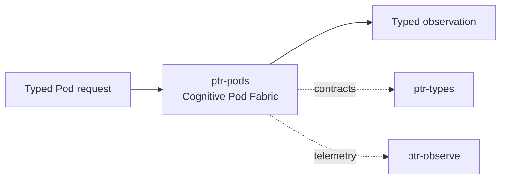

# ptr-pods — Cognitive Pod Fabric

> **Role:** Defines specialist computational modules through semantic contracts rather than fragile tool names.  
> **Maturity:** architecture + contract scaffold; production behavior must be proven by the linked experiments and component evaluations.

<!-- PTR:STATUS:BEGIN -->
## Current implementation status

> **Generated section.** Source of truth: [`component.toml`](component.toml) plus code-derived metrics from `src/`. Run `python3 scripts/update_component_docs.py --write` after editing implementation metadata. Do not hand-edit inside this block.

**Maturity:** `prototype`  
**Last reviewed:** 2026-09-18  
**Code footprint:** 1 Rust source files · 46 nonblank source lines · 0 `#[test]` markers

### Implemented now

- PodManifest with capability, accepted/produced types, effects and protocol version
- Typed Pod associated Input/Output/Error contract
- Ready and Revoked lease typestates
- Revocation consumes Ready lease and produces Revoked lease

### Missing for the target architecture

- Object-safe heterogeneous registry/DynPod adapter
- Async invocation and PodContext
- Process-isolated, remote-Iroh and GPU/DLPack adapters
- Capability/effect validation against runtime policy
- Borrowed/busy/backpressured lease states and cancellation

### Next milestones

- Add TypedPod + object-safe DynPod split
- Implement registry and one native reference Pod
- Run unseen-Pod semantic generalization experiment R002

### Linked experiments

- [R002](../../experiments/runtime/R002-unseen-pod-generalization/README.md) — `planned`
- [E001](../../experiments/system/E001-end-to-end/README.md) — `planned`

### Technology evaluations

- [environment-runtime](../../evaluations/components/environment-runtime/README.md) — `open`

### Decision records

- [ADR-0006-typed-isolate-runtime.md](../../research/decisions/ADR-0006-typed-isolate-runtime.md)
- [ADR-0011-semantic-pod-contracts.md](../../research/decisions/ADR-0011-semantic-pod-contracts.md)

### Current automated checks

- workspace fmt/check/test/clippy

<!-- PTR:STATUS:END -->

## Position in PTR

Dedicated diagram source: [`docs/diagrams/components/ptr-pods.mmd`](../../docs/diagrams/components/ptr-pods.mmd)

**Upstream:** ptr-exec, ptr-router  
**Downstream:** ptr-verifier, ptr-semdb

## Mission

Defines specialist computational modules through semantic contracts rather than fragile tool names.

PTR keeps this responsibility in its own crate so the semantics remain stable even when an external library or implementation is replaced.

## Responsibilities

- Pod trait and manifests
- typed input/output contracts
- capability/effect declarations
- lease and lifecycle state
- local/process/remote/GPU Pod modes

## Explicit non-responsibilities

- global scheduling policy
- semantic authority
- model-specific prompting

## Data flow

| Direction | Contract |
|---|---|
| Input | Validated Pod request and typed input |
| Output | Typed result, observation, receipt or error |
| Failure | Explicit typed error / rejected state; no silent fallback that changes semantics |
| Observability | Standard PTR tracing fields and a stable component span |

## Technical approach

- Native Rust Pods
- process isolation
- Iroh remote transport
- DLPack/CUDA for tensor payloads
- ROCK-style environments for stateful action Pods

External projects are **candidates**, not architectural authority. The PTR-owned traits and domain types must remain usable with a replacement backend.

## Core invariants

1. Revoked leases cannot invoke.
2. Effects declared by the Pod are checked before execution.
3. Pod names are not the semantic contract.

These invariants should be executable wherever possible through unit, property, lifecycle or chaos tests.

## Failure model

The component must fail closed for semantic or effect-safety violations. Infrastructure failures should surface as typed errors that preserve request, revision, generation and provenance context. Retries must be idempotent whenever the operation may cross a process or network boundary.

## Performance model

Measure before optimizing. Benchmarks should record at least latency distribution, throughput, allocations/resident memory, queue depth or working-set size where relevant, and the cost of verification. Performance optimizations may not bypass generation, revision, capability or evidence checks.

## Security and privacy

- Treat external inputs and backend outputs as untrusted until validated.
- Do not put raw secrets/private evidence into generic tracing or inspection.
- Preserve provenance on every promotion from raw/possible evidence to stronger semantic state.
- External effects pass through `ptr-security` even if this component already performed local validation.

## Technology evaluation

- [environment-runtime](../../evaluations/components/environment-runtime/README.md)

A new candidate should be added with a reproducible benchmark and failure-semantics analysis rather than replacing the default ad hoc.

## Tests required before production use

- Contract/unit tests for all domain transitions.
- Invalid, stale-generation and stale-revision cases.
- Cancellation/retry behavior.
- Property tests for invariants where practical.
- Cross-backend equivalence if more than one backend exists.
- Observability and redaction checks.

## Related architecture

- [System architecture](../../docs/architecture/00-system.md)
- [Technical architecture](../../docs/TECHNICAL_ARCHITECTURE.md)
- [Component contracts](../../docs/COMPONENT_CONTRACTS.md)
- [Global invariants](../../docs/INVARIANTS.md)

