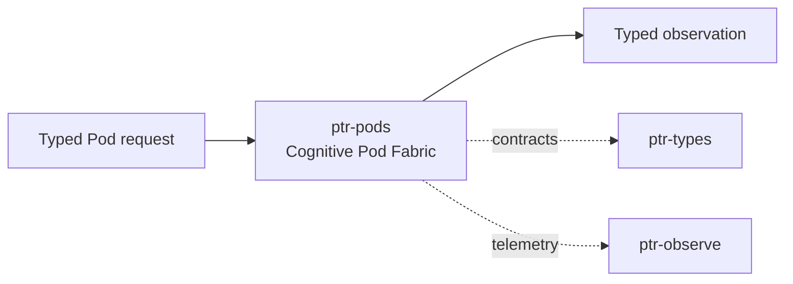

# ptr-pods — Cognitive Pod Fabric

> **Role:** Defines specialist computational modules through semantic contracts rather than fragile tool names.  
> **Maturity:** architecture + contract scaffold; production behavior must be proven by the linked experiments and component evaluations.

<!-- PTR:STATUS:BEGIN -->
## Current implementation status

> **Generated section.** Source of truth: [`component.toml`](component.toml) plus code-derived metrics from `src/`. Run `python3 scripts/update_component_docs.py --write` after editing implementation metadata. Do not hand-edit inside this block.

**Maturity:** `prototype`  
**Last reviewed:** 2026-09-21  
**Code footprint:** 16 Rust source files · 3954 nonblank source lines · 11 integration-test files · 62 test markers (`#[test]`, `#[tokio::test]`)

### Implemented now

- PodRegistry is keyed by project and id, so two projects may register the same Pod id without shadowing and no lookup path exists that takes an id alone
- PodManifest declares the one project a Pod serves; resolution inside another project finds nothing rather than a worse match
- PodManifest with capability, accepted/produced types, effects and protocol version
- Typed Pod associated Input/Output/Error contract
- Ready and Revoked lease typestates
- Revocation consumes Ready lease and produces Revoked lease
- invoke_with_lease requires PodLease<Ready>; compile-fail doctest rejects revoked lease
- Object-safe DynPod and PodRegistry resolve semantic capability plus accepted input type
- PodManifest::digest is a length-prefixed SHA-256 over project, id, capabilities, accepted/produced types, effects and protocol version; NeuralPodAdapter refuses a descriptor whose manifest_hash differs or whose input/output schema the manifest does not list
- PodRegistry::candidates returns only same-project Pod ids in canonical order; bind_registered/resolve_bound pin a (project, id, manifest) binding and resolve_bound returns nothing once the registered manifest differs
- NeuralPodDescriptor validates identity, non-zero manifest hash and generation, schemas, resources, tensor contract, provenance and an Admitted/Prepared/Ready lifecycle; transition_to allows only listed lifecycle edges and terminal states (Released/Revoked/Failed) cannot move on
- NeuralPodAdapter wraps a sync NeuralPodExecutor as a DynPod (activate, infer, release); a failed infer calls executor.abort so the lease is recovered, and an output type outside the manifest is rejected
- NeuralPodLease (Ready/Busy/Released/Revoked) rejects begin while Busy or Revoked; DeviceLease counts active tensors, refuses release while tensors are in use and refuses new tensors once Released, Revoked or Failed
- ReferenceNeuralExecutor is an in-process executor that checks the input type and returns the input bytes typed as the output schema; it is a contract reference, not a model, and ReferenceExecutorFactory builds it from a descriptor
- InMemoryArtifactCatalog admits descriptors by (artifact, generation), rejects a conflicting descriptor for the same generation, rejects invalidated generations and verifies lineage by exact descriptor equality; admit_with_manifest additionally checks manifest digest, pod id and schemas
- InMemoryResourceGovernor reserves RAM, VRAM and concurrency against fixed capacity; release is idempotent for an identical lease and rejects mismatched or unknown leases
- PodWireRequest/PodWireResponse validation binds manifest hash, artifact, generation, input type, protocol version, request id, revision and output type (types and checks only; no wire serialization in this crate)
- PodSemanticManifest validates identity, type contract, role/domain/provenance, resources, Active-needs-protocol and model-variant requirements, with a set-order-independent digest; ExecutionManifest binds lineage and has a canonical encode/decode that detects tampering and duplicate keys; LifecycleGate requires admission checks before Evaluated/Approved/Active
- ProtocolBinding enumerates transport kinds with a ProtocolProfile (pattern, delivery, connection scope, multiplexing, max frame bytes); PodLink validation checks addresses, project/namespace scope, deadline, hop limit, cycles, artifact, capability, ACL, non-zero attestation and egress policy, and validate_against_manifest requires the exact execution-manifest digest
- TcpProtocolExecutor and UdpProtocolExecutor (tokio) send one typed frame (u16 type length, u32 body length, type id, body) to an endpoint that must be on the link egress allow-list, with a timeout, an unexpired deadline and a 1 MiB frame cap; the executors do not themselves run PodLink::validate
- DuplexSession records sequenced, session-bound turn events (commit, interrupt with epoch bump, close) and resumes from a sequence cursor
- PodOutput has a canonical digest that is independent of provenance/dependency order and covers kind, payload, generation, digests, revision and verified flag; validate requires provenance, non-zero digests and the expected type, and rejects StateDelta/VerifiedResult unless promotion is allowed and the output is verified
- PodEvidenceBundle holds a sequence-checked chain of turn events and outputs, seals to a digest, replays deterministically, round-trips through canonical bytes preserving chain order, detects tampering, and carries an Ed25519 signature over the bundle digest via provider-neutral EvidenceSigner/EvidenceVerifier traits
- merge_hypotheses drops hypotheses whose VerificationReport is not Pass, rejects mixed generations, picks the highest-confidence (then lowest-latency, then branch id) output and deduplicates evidence
- PodCache key includes pod identity, semantic revision, execution manifest, capability, input digest, knowledge revision, principal and protocol, and supports predicate invalidation
- KvTensorBackend contract with a CPU InMemoryKvTensorBackend (F32 only): append, truncate, digest-bound snapshot and restore, device and schema checks, and a KvPageTable that reserves and releases logical pages; FP8/NVFP4/MX dtypes are declared but rejected as unsupported
- Feature-gated candle-cuda (off by default, adds optional candle-core with CUDA): CandleDenseExecutor loads an F32 [output, input] weight and optional bias from Safetensors and does a matmul on a CUDA device, and CandleKvTensorBackend keeps per-layer F32 KV tensors on CUDA behind a DeviceLease; this path could not be compiled or run in the review environment (no nvcc), so it is code-reviewed only

### Missing for the target architecture

- Async invocation and PodContext
- Process-isolated, remote-Iroh and GPU/DLPack adapters
- Capability/effect validation against runtime policy
- Borrowed/busy/backpressured lease states and cancellation

### Next milestones

- Extend registry with lifecycle/backpressure and remote/process adapters
- Implement registry and one native reference Pod
- Run unseen-Pod semantic generalization experiment R002

### Linked experiments

- [R002](../../experiments/runtime/R002-unseen-pod-generalization/README.md) — `planned`
- [E001](../../experiments/system/E001-end-to-end/README.md) — `planned`

### Technology evaluations

- [environment-runtime](../../evaluations/components/environment-runtime/README.md) — `open`

### Decision records

- [ADR-0006-typed-isolate-runtime.md](../../research/decisions/ADR-0006-typed-isolate-runtime.md)
- [ADR-0011-semantic-pod-contracts.md](../../research/decisions/ADR-0011-semantic-pod-contracts.md)

### Current automated checks

- ready/wrong-Pod lease integration tests and revoked compile-fail doctest
- semantic capability/type registry resolution test
- ptr-pods integration tests (cargo test -p ptr-pods --locked, all passing without GPU): neural, device_lease, kv, evidence, output, semantic, native_protocol (loopback TCP and UDP) and registry
- tests/candle_cuda.rs (safetensors_matmul_runs_on_cuda_device, failed_cuda_kv_append_releases_tensor_use_for_recovery) exists behind the candle-cuda feature and needs a CUDA device; not run here
- workspace fmt/check/test/clippy

<!-- PTR:STATUS:END -->

## Position in PTR

```mermaid
flowchart LR
    A["Typed Pod request"] --> B["ptr-pods\nCognitive Pod Fabric"]
    B --> C["Typed observation"]
    B -. "contracts" .-> T["ptr-types"]
    B -. "telemetry" .-> O["ptr-observe"]
```

Dedicated diagram source: [`docs/diagrams/components/ptr-pods.mmd`](../../docs/diagrams/components/ptr-pods.mmd)

**Upstream:** ptr-exec, ptr-router  
**Downstream:** ptr-verifier, ptr-semdb

## Mission

Defines specialist computational modules through semantic contracts rather than fragile tool names.

PTR keeps this responsibility in its own crate so the semantics remain stable even when an external library or implementation is replaced.

## Responsibilities

- Pod trait and manifests
- typed input/output contracts
- capability/effect declarations
- lease and lifecycle state
- local/process/remote/GPU Pod modes

## Explicit non-responsibilities

- global scheduling policy
- semantic authority
- model-specific prompting

## Data flow

| Direction | Contract |
|---|---|
| Input | Validated Pod request and typed input |
| Output | Typed result, observation, receipt or error |
| Failure | Explicit typed error / rejected state; no silent fallback that changes semantics |
| Observability | Standard PTR tracing fields and a stable component span |

## Technical approach

- Native Rust Pods
- process isolation
- Iroh remote transport
- DLPack/CUDA for tensor payloads
- ROCK-style environments for stateful action Pods

External projects are **candidates**, not architectural authority. The PTR-owned traits and domain types must remain usable with a replacement backend.

## Core invariants

1. Revoked leases cannot invoke.
2. Effects declared by the Pod are checked before execution.
3. Pod names are not the semantic contract.

These invariants should be executable wherever possible through unit, property, lifecycle or chaos tests.

## Failure model

The component must fail closed for semantic or effect-safety violations. Infrastructure failures should surface as typed errors that preserve request, revision, generation and provenance context. Retries must be idempotent whenever the operation may cross a process or network boundary.

## Performance model

Measure before optimizing. Benchmarks should record at least latency distribution, throughput, allocations/resident memory, queue depth or working-set size where relevant, and the cost of verification. Performance optimizations may not bypass generation, revision, capability or evidence checks.

## Security and privacy

- Treat external inputs and backend outputs as untrusted until validated.
- Do not put raw secrets/private evidence into generic tracing or inspection.
- Preserve provenance on every promotion from raw/possible evidence to stronger semantic state.
- External effects pass through `ptr-security` even if this component already performed local validation.

## Technology evaluation

- [environment-runtime](../../evaluations/components/environment-runtime/README.md)

A new candidate should be added with a reproducible benchmark and failure-semantics analysis rather than replacing the default ad hoc.

## Tests required before production use

- Contract/unit tests for all domain transitions.
- Invalid, stale-generation and stale-revision cases.
- Cancellation/retry behavior.
- Property tests for invariants where practical.
- Cross-backend equivalence if more than one backend exists.
- Observability and redaction checks.

## Related architecture

- [System architecture](../../docs/architecture/00-system.md)
- [Technical architecture](../../docs/TECHNICAL_ARCHITECTURE.md)
- [Component contracts](../../docs/COMPONENT_CONTRACTS.md)
- [Global invariants](../../docs/INVARIANTS.md)

