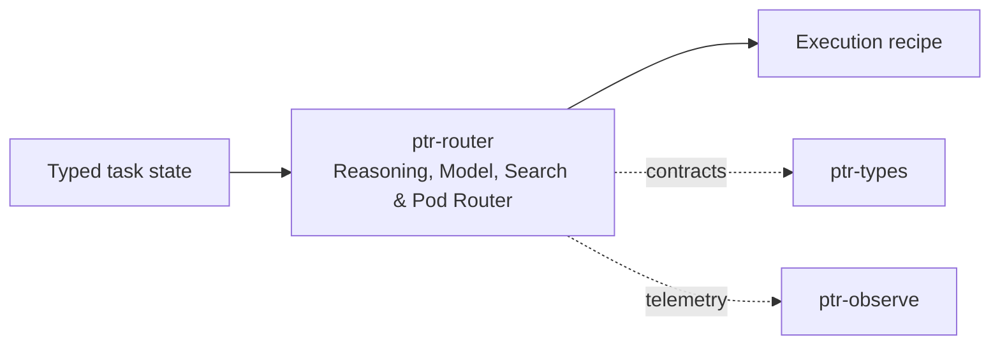

# ptr-router — Reasoning, Model, Search & Pod Router

> **Role:** Chooses how a task should be solved: neural reasoning, search, statistics, simulation, symbolic methods, Pods or combinations.  
> **Maturity:** architecture + contract scaffold; production behavior must be proven by the linked experiments and component evaluations.

{BEGIN}
## Current implementation status

> **Generated section.** Source of truth: [`component.toml`](component.toml). Run `python3 scripts/update_component_docs.py --write` after editing metadata. Do not hand-edit inside this block.

**Maturity:** `scaffold`  
**Last reviewed:** 2026-09-18

### Implemented now

- RouteScore and RouteDecision with deterministic best-score selection
- RoutingPolicy scaffold with max_parallel and uncertainty_trigger

### Missing for the target architecture

- Typed ExecutionRecipe
- Separate reasoning/model/search/Pod routing policies
- Cost, latency, uncertainty and capability-aware constraints
- Learned router head integration and replayable routing telemetry
- Fallback/degradation plan when a backend is unavailable

### Next milestones

- Define typed operator/backend capability graph
- Implement deterministic baseline router
- Train/evaluate model operator routing with M004

### Linked experiments

- - [M004](../../experiments/model/M004-operator-router/README.md) — `planned`
- - [R002](../../experiments/runtime/R002-unseen-pod-generalization/README.md) — `planned`
- - [E003](../../experiments/system/E003-token-efficiency/README.md) — `planned`

### Technology evaluations

- - [inference-serving](../../evaluations/components/inference-serving/README.md) — `open`
- - [distributed-data-compute](../../evaluations/components/distributed-data-compute/README.md) — `open`

### Decision records

- - [ADR-0004-backend-independence.md](../../research/decisions/ADR-0004-backend-independence.md)
- - [ADR-0011-semantic-pod-contracts.md](../../research/decisions/ADR-0011-semantic-pod-contracts.md)

### Current automated checks

- workspace fmt/check/test/clippy

{END}

## Position in PTR

Dedicated diagram source: [`docs/diagrams/components/ptr-router.mmd`](../../docs/diagrams/components/ptr-router.mmd)

**Upstream:** ptr-semdb, ptr-core  
**Downstream:** ptr-exec, ptr-search, ptr-pods

## Mission

Chooses how a task should be solved: neural reasoning, search, statistics, simulation, symbolic methods, Pods or combinations.

PTR keeps this responsibility in its own crate so the semantics remain stable even when an external library or implementation is replaced.

## Responsibilities

- reasoning operator policy
- model backend selection
- search strategy selection
- Pod selection
- budget/cost/latency policy

## Explicit non-responsibilities

- performing the selected computation
- authoritative verification
- persistent state

## Data flow

| Direction | Contract |
|---|---|
| Input | Task type, semantic snapshot, uncertainty, resource state and budgets |
| Output | ExecutionRecipe and operator mixture |
| Failure | Explicit typed error / rejected state; no silent fallback that changes semantics |
| Observability | Standard PTR tracing fields and a stable component span |

## Technical approach

- Heuristic policies first
- learned router later
- RLlib/GEPA-style policy optimization as experiments
- semantic-router only as an infrastructure-side deployment router

External projects are **candidates**, not architectural authority. The PTR-owned traits and domain types must remain usable with a replacement backend.

## Core invariants

1. Hard safety invariants are not learnable policy knobs.
2. Router decisions are observable and replayable.
3. Unavailable capabilities cannot receive positive executable weight.

These invariants should be executable wherever possible through unit, property, lifecycle or chaos tests.

## Failure model

The component must fail closed for semantic or effect-safety violations. Infrastructure failures should surface as typed errors that preserve request, revision, generation and provenance context. Retries must be idempotent whenever the operation may cross a process or network boundary.

## Performance model

Measure before optimizing. Benchmarks should record at least latency distribution, throughput, allocations/resident memory, queue depth or working-set size where relevant, and the cost of verification. Performance optimizations may not bypass generation, revision, capability or evidence checks.

## Security and privacy

- Treat external inputs and backend outputs as untrusted until validated.
- Do not put raw secrets/private evidence into generic tracing or inspection.
- Preserve provenance on every promotion from raw/possible evidence to stronger semantic state.
- External effects pass through `ptr-security` even if this component already performed local validation.

## Technology evaluation

- [inference-serving](../../evaluations/components/inference-serving/README.md)
- [distributed-data-compute](../../evaluations/components/distributed-data-compute/README.md)

A new candidate should be added with a reproducible benchmark and failure-semantics analysis rather than replacing the default ad hoc.

## Tests required before production use

- Contract/unit tests for all domain transitions.
- Invalid, stale-generation and stale-revision cases.
- Cancellation/retry behavior.
- Property tests for invariants where practical.
- Cross-backend equivalence if more than one backend exists.
- Observability and redaction checks.

## Related architecture

- [System architecture](../../docs/architecture/00-system.md)
- [Technical architecture](../../docs/TECHNICAL_ARCHITECTURE.md)
- [Component contracts](../../docs/COMPONENT_CONTRACTS.md)
- [Global invariants](../../docs/INVARIANTS.md)

