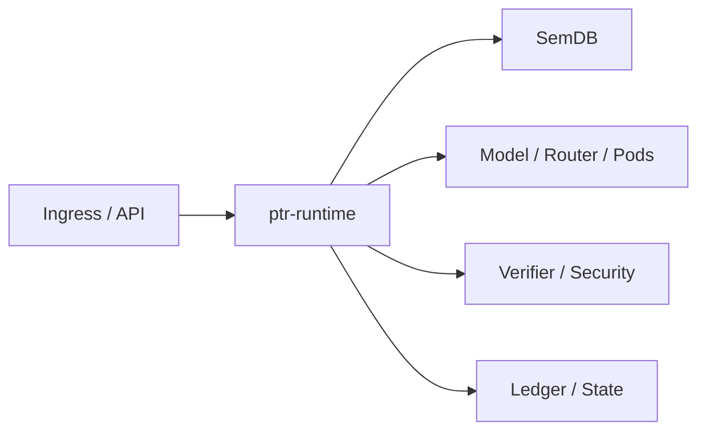

# ptr-runtime — End-to-End Runtime Orchestrator

> **Role:** Compose PTR's semantic, model, execution, verification, security and authority layers into one request lifecycle.

<!-- PTR:STATUS:BEGIN -->
## Current implementation status

> **Generated section.** Source of truth: [`component.toml`](component.toml) plus code-derived metrics from `src/`. Run `python3 scripts/update_component_docs.py --write` after editing implementation metadata. Do not hand-edit inside this block.

**Maturity:** `prototype`  
**Last reviewed:** 2026-09-25  
**Code footprint:** 6 Rust source files · 4166 nonblank source lines · 19 integration-test files · 158 `#[test]` markers

### Implemented now

- bind_checkpoint resolves the slot encoding an artifact records and refuses a definition this build has no implementation of, because weights trained on vectors it cannot recompute are weights it cannot feed; the encoding is deliberately not part of a StateDeclaration, which says which committed facts a state came from rather than how an artifact was constructed
- AdmissionPolicy maps a transport-authenticated peer to one principal and one grant set; admit_peer takes the peer and nothing else, so no caller-supplied parameter can name either, and a second entry for a peer is refused rather than replacing the first
- A session admitted from the policy re-derives its authority at every use, so withdrawing a peer or replacing the policy stops live sessions at once instead of when a TTL runs out; a host-registered session carries no peer and is unaffected
- Pod resolution is scoped by project, and a Pod in another project is unavailable in exactly the same words as one that does not exist, so a refusal is not an existence oracle across the boundary
- Durable execution audit: an effect commits an EffectAttempted record before it is dispatched and an EffectSettled record after, so the window between them is described by committed history rather than by process memory
- The fence is that record: an attempt with no settlement fences execution and commits, is rebuilt on every open, and therefore survives a crash or panic inside the effect window
- reconcile_effect commits what an operator established from the receiving system; it never infers an outcome and never retries a possibly-applied effect
- prepare_execution_once adds an at-most-once key: a retry is answered from history without dispatching again, across restarts, while an attempt reconciled as not applied leaves the key free
- A response is retained up to MAX_RETAINED_RESPONSE and its digest unconditionally, so a retry whose response was not kept is refused rather than re-executed or answered with something else
- A denied preparation writes no effect record, and a fenced runtime yields no journal anchor, so no compaction floor can discard a record saying an effect may have applied
- Rustdoc covers the compacted-snapshot and neural-state APIs plus their canonical framing helpers and admission diagnostics
- Detached dispatch for work that does not finish inside the call: the attempt is committed and left unsettled, so the runtime is fenced from the moment the work is handed over until the adapter answers or a person reconciles it, and a refused dispatch writes no record
- A grant is synchronous or detached when it is issued, and each path refuses the other kind before the attempt is committed; both share one admission sequence, so there is one place where the order of checks and the attempt record is decided
- settle_detached records the adapter's own answer and is available only for an attempt this runtime dispatched; the dispatch kind is deliberately not rebuilt on reopen, so after a restart the fence stands and reconciliation is the way forward
- bind_checkpoint binds a real stored model artifact: it reads the shared CheckpointHeader, refuses an assignment this build cannot reproduce and an artifact whose codebook contradicts the declaration, then binds the opaque payload through the same bind_state path every other neural state uses
- PTRNEU01 neural/KV/checkpoint admission: opaque state bound to an anchored journal position, per-input semantic value digests, lifecycle generations, provenance and codebook version plus assignment fingerprint
- Admission is decided at every use rather than at insertion; a payload is reachable only through an admission decision, and a cache exposes no accessor that bypasses one
- Revocation, supersession, edited or removed inputs, foreign history with identical counters, unverifiable positions, changed codebook assignment and a fenced runtime each deny with their own stable code; failure to verify is a denial rather than an error
- bind_state derives every field from committed state and validates its own output through the same admission rules a later use applies
- PTRCS002 compacted materialized snapshot: committed state at a floor with canonical ascending-key sections, checked framing and an externally retained trusted anchor
- install_admission_policy re-derives every policy-admitted session's grants and principal from the new table, so a replacement that narrows a peer narrows its live session instead of leaving the wider set in force until the TTL; a session whose peer is no longer admitted is kept so the refusal can still name PeerNotAdmitted, and the expiry is never extended
- A compacted snapshot carries the execution obligations a raised floor would otherwise discard (PTREX001): spent at-most-once keys with their outcomes (encoded by byte length, so a retained response up to MAX_RETAINED_RESPONSE round-trips rather than only one under the item bound), and unsettled attempts, so a restored runtime does not execute a spent key a second time. A PTRCS001 snapshot is refused by version rather than read as an empty obligation set
- restore_compacted installs floor state then replays the retained journal through the ordinary lifecycle/semantic validation path, keeping committed indices
- CompactedSnapshot::covers reports only the position it holds, so a compaction barrier cannot claim coverage the snapshot lacks
- Versioned replay-backed recovery snapshots bind complete journal, semantic revision, commit index and independently trusted SHA-256 anchor
- Snapshot validation and semantic/lifecycle replay finish before creating a durable destination; existing destinations are never replaced
- Strict anchored reopen and explicit legacy-to-v2 migration preserve history while restoring no process-local authority
- Ordered semantic journal publication before acknowledgment or model resume
- Semantic payload/dependency/revision reconstruction with schema and transition validation during replay
- Complete typed Pod bytes and source identity are revision-significant
- Fallible ingestion, optimistic base revision and canonical no-op handling
- Scoped synchronous execution gateway with opaque per-runtime sessions, exact grants, frozen ActionIR permits and registered verifier/executor binding
- Consume-time freshness, expiry, ownership and mandatory permission checks; permissions/commit/effect epochs invalidate pending permits
- Executor or ledger ambiguity fences subsequent execution and commits; process-local single-use authority is never replayed
- Ledger-only lifecycle mutation; invalid/rewinding/tombstoned/cross-project transitions rejected before append and during replay
- Central runtime object wiring configuration, SemDB, ledger, materialized state, events and permissions; an in-memory append that runs out of commit indices surfaces as a ledger error rather than a repeated index
- Durable standalone runtime constructor opens/replays FileLedger and reconstructs lifecycle/materialized state across restart
- Text ingestion into revisioned semantic state
- Current-revision, live-generation/revocation and capability/effect checks for ActionIR delegated through typed ptr-security authorization decisions
- Committed-event materialization and runtime event emission
- Committed-event replay rebuilds lifecycle state and preserves revocation
- Reference InferenceBackend request loop runs against a revisioned ModelRequest and emits completion event
- Typed model→PodRegistry→Pod→Verifier→SemDB observation loop for Pure/Read cognitive Pods
- Bounded multi-step model resume loop after verified Pod observations advances semantic revision before continuation
- apply_verified_semantic_delta prepares a delta, hands the verifier a view of the post-state and appends only on a Pass at the required level with no hard finding; a refusal writes nothing and names status, level and finding count
- generation_validity combines the tombstone set with generation equality, so a revoked generation that is still the live one reads as Revoked rather than Live
- Neural-state input digests are computed from ptr-semdb canonical_input_bytes, byte-identical to the previous encoding (committed fixtures unchanged)

### Missing for the target architecture

- Durable compacted-snapshot publication and a runtime backed by an AcknowledgedLedger; compacted restore rebuilds an in-memory ledger above the floor and therefore retains no chain base, so it admits no neural state at all
- Any bound on how long detached work may stay outstanding, and any supervision of a detached adapter: there is no timeout, cancellation or retry, because a runtime that decided the work had failed would be deciding something it cannot observe
- A truly concurrent permission or lifecycle race inside one runtime: exclusive access prevents the interleaving by construction, so the concurrent case is two runtimes deciding at once, which ptr-execwire drives over a real connection rather than this crate
- Durable neural-anchor catalog and streamed or memory-mapped payloads; admission checks the producer's declared input set only, so an undeclared dependency stays invisible
- A trainer that binds a checkpoint as it saves one: bind_checkpoint attaches committed facts after the fact, so an artifact between saving and binding carries its assignment but no position
- An unforgeable peer identity: the NodeId passed to admit_peer is still taken on the caller's word here, and making it constructible only from an authenticated connection would require this crate to depend on ptr-net, which is an open decision; the execution wire itself now exists in ptr-execwire, where the forged-receipt and cross-runtime cases are tested over a real connection
- The admission policy is in memory: it is not journaled, so it does not survive a restart and a replayed history does not describe who was admitted when
- At-most-once memory is bounded by retention: a floor rising past a settled attempt discards its key, and reconciliation is a privileged host API whose caller this crate does not authenticate
- Router-driven operator selection around the implemented bounded Pod-resume loop
- Async isolate scheduler integration
- Configured raft-engine/raft-rs/Turso backend composition for production runtime modes
- Streaming client response lifecycle and cancellation

### Next milestones

- Decide whether peer identity should be constructible only from an authenticated connection, which would make this crate depend on ptr-net; until then ptr-execwire is the one host that passes an authenticated key and nothing else
- Define the PodWire request framing, which is still undefined even though the execution wire is not
- Retaining a NeuralAnchor outside the artifact remains a deployment obligation; nothing here stores one
- Connect evaluated raft-engine/Turso adapters through typed backend config while preserving FileLedger reference mode
- Add opaque backend checkpoint handles and async streaming around the implemented observation resume contract
- Wire ptrd request handling beyond bootstrap ingestion

### Linked experiments

- [E001](../../experiments/system/E001-end-to-end/README.md) — `planned`
- [E003](../../experiments/system/E003-token-efficiency/README.md) — `planned`
- [E004](../../experiments/system/E004-long-horizon/README.md) — `planned`

### Technology evaluations

- None recorded.

### Decision records

- [ADR-0001-rust-runtime.md](../../research/decisions/ADR-0001-rust-runtime.md)
- [ADR-0012-hard-effect-boundary.md](../../research/decisions/ADR-0012-hard-effect-boundary.md)
- [ADR-0013-runtime-orchestrator.md](../../research/decisions/ADR-0013-runtime-orchestrator.md)

### Current automated checks

- the committed checkpoint fixture records the slot encoding it was produced under, and verification names both the codebook and the encoding
- detached work fences the runtime until the adapter answers: the fence names the attempt, no permit can be prepared, no journal anchor or compacted snapshot is produced, and the settlement carries the response digest
- an adapter that would not take the work still leaves the window open, because not accepted is not not-applied; a detached attempt survives a restart as a fence that only reconciliation moves, and the adapter's own answer is refused there
- each dispatch path refuses the other kind of grant with no record written and nothing verified; a settlement for an attempt this runtime did not hand out, and a second settlement of one it did, are refused
- an at-most-once key hands detached work out once: while the first is outstanding the fence refuses a retry by name, and after settlement a retry is answered from history without calling the adapter; an oversize answer keeps its digest without being retained and the next retry is refused rather than answered with something the effect never produced
- withdrawing one peer or replacing the policy in the prepare-to-consume window refuses that permit before the verifier while another session keeps working; a generation superseded or revoked in that window is refused before the verifier; one session's successful effect refuses another's in-flight permit without reaching the executor
- a real ptr-burn-a0 checkpoint binds to committed state, is admitted, seals and reopens with its weights unchanged, and is then refused once the generation it was bound under moves and once the semantic input it read is edited
- a checkpoint whose assignment moved, one whose codebook contradicts the declaration, one whose table width is not its family's cardinality and every prefix of one are each refused, with the intact fixture binding as the control
- an admitted peer executes only its granted action and the audited principal is the policy's; a different operation or project is denied before any check that could depend on what the caller claims
- withdrawing a peer refuses a permit issued beforehand, new preparations and re-admission without the TTL moving; replacing the policy kills live sessions and re-admitting does not revive them
- a Pod in another project is unavailable in a refusal equal to the one for a Pod that does not exist, while the same request inside its own project succeeds
- a runtime reopened after an executor error or panic is still fenced by the unsettled attempt it left, refuses to register a session and refuses to commit
- an applied effect commits its attempt before and its settlement after, with the action digest and admitting verification level asserted field by field
- a retry under an at-most-once key returns the first response without dispatching again, before and after a restart, while a different key does dispatch
- reconciliation lifts the fence for both outcomes and lets a key reconciled as unapplied execute again
- a fenced runtime yields no journal anchor and no compacted snapshot; a denied preparation writes no record
- settlements naming no live attempt, a second live attempt under one key, a malformed key, and a retained response that is oversize or contradicts its digest are each refused before append and during replay
- an empty runtime round-trips at the empty floor; a runtime restored at the index ceiling refuses a commit with PTR_LEDGER_INDEX_EXHAUSTED, stores nothing and fences the retry; revocation outranks every other binding mismatch simultaneously
- an admitted state reproduces the identical inference event sequence after a restart, with binding and opaque payload byte-for-byte equal
- revocation, supersession, edited/removed inputs, foreign history with identical counters, unverifiable position, compacted restore, contradicting revision, unknown/changed codebook, unknown target and a fenced runtime each denied
- every single-bit mutation of a sealed state rejected; wrong outer/binding magic, reserved field, length mismatch, byte removal/insertion and undersize rejected after resealing the digest
- an unrelated commit leaves a state admissible, so dependency-precise binding is asserted in both directions
- compacted reconstruction equals a full replay across semantic payloads, dependencies, supersession, constraints, procedures and revocations
- a revocation below the floor still denies after compaction; every single-bit mutation of a compacted snapshot rejected
- resealed noncanonical sections, reserved fields, length and trusted-identity mismatches, and records not above the floor all rejected
- snapshot exact-state/byte-corruption/rollback/revision/legacy/overwrite/authority rejection tests
- scoped execution positive/negative integration tests and non-forgeability/single-use compile-fail doctests
- runtime ingestion/revision/generation/capability/materialization integration tests
- typed authorization decision exposure and RuntimeError compatibility test
- reference model-loop integration test
- bounded verified Pod-observation resume-loop tests
- revocation replay/restart integration test
- durable FileLedger runtime reopen preserves revocation and materialized commit position
- workspace fmt/check/test/clippy
- tests/verified_delta.rs: a verified delta commits the state its verifier saw; no failing score, shallow level or hard finding gets a delta past verification; a moved revision is refused before verification; revoked, superseded and unknown generations never read as Live

<!-- PTR:STATUS:END -->

## Position in PTR

Dedicated diagram source: [`docs/diagrams/components/ptr-runtime.mmd`](../../docs/diagrams/components/ptr-runtime.mmd)

## Mission

Keep orchestration out of `ptrd` and out of individual domain crates. The runtime coordinates transitions while each component retains ownership of its semantics.

## Current boundary

The executable reference slice now wires configuration, semantic revisioning, a backend-neutral model call, semantic Pod resolution, Pure/Read Pod execution, verifier-gated observation promotion, action authorization, event emission, ledger materialization and durable FileLedger reopen/replay. The new scoped synchronous execution gateway binds opaque sessions and immutable ActionIR permits to host-registered verifiers/executors. Administrative session registration assumes the embedding host has authenticated the principal; it is not an HTTP authentication endpoint. See [P0.1 execution authority](../../docs/architecture/21-scoped-execution.md) for guarantees, counterexamples and the remaining durable/network gates. P0.2 now reconstructs the actual journaled semantic payloads, dependencies and revisions. The next persistence gate is record integrity and verified snapshot/checkpoint admission, not additional backend breadth.

## P0.2 semantic journal integration

[Durable semantic-state contract](../../docs/architecture/22-durable-semantic-state.md)
records the new code/codec, ownership and replay boundaries. Publication follows
successful journal append. Typed Pod bytes and source identity participate in
semantic revisions. Logical removals do not erase log history; neural checkpoints
and authenticated framing remain separate gates. Execution evidence is in the PR.

## Persistence contract update

See [P0.3 checked records and replay-backed recovery snapshots](../../docs/architecture/23-persistence-integrity.md)
for strict reopen, explicit legacy migration, independent anchors, create-new
restore and format/API compatibility. Old automatic crash-tail repair is replaced
by explicit anchored recovery. No authority or neural checkpoint is restored.
