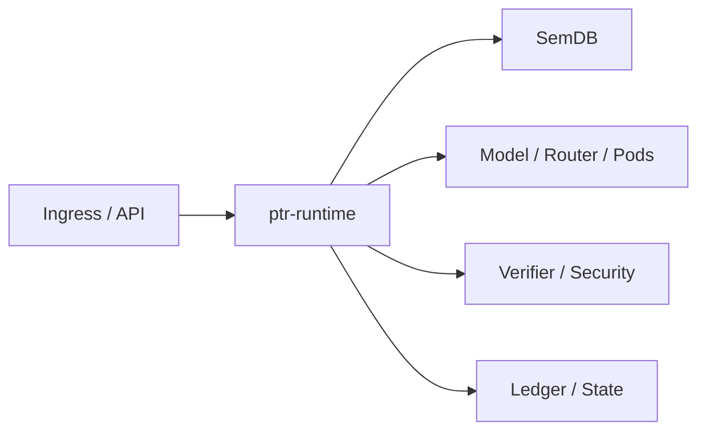

# ptr-runtime — End-to-End Runtime Orchestrator

> **Role:** Compose PTR's semantic, model, execution, verification, security and authority layers into one request lifecycle.

<!-- PTR:STATUS:BEGIN -->
## Current implementation status

> **Generated section.** Source of truth: [`component.toml`](component.toml) plus code-derived metrics from `src/`. Run `python3 scripts/update_component_docs.py --write` after editing implementation metadata. Do not hand-edit inside this block.

**Maturity:** `prototype`  
**Last reviewed:** 2026-09-19  
**Code footprint:** 2 Rust source files · 1145 nonblank source lines · 8 integration-test files · 42 `#[test]` markers

### Implemented now

- Scoped synchronous execution gateway with opaque per-runtime sessions, exact grants, frozen ActionIR permits and registered verifier/executor binding
- Consume-time freshness, expiry, ownership and mandatory permission checks; permissions/commit/effect epochs invalidate pending permits
- Executor or ledger ambiguity fences subsequent execution and commits; process-local single-use authority is never replayed
- Ledger-only lifecycle mutation; invalid/rewinding/tombstoned/cross-project transitions rejected before append and during replay
- Central runtime object wiring configuration, SemDB, ledger, materialized state, events and permissions
- Durable standalone runtime constructor opens/replays FileLedger and reconstructs lifecycle/materialized state across restart
- Text ingestion into revisioned semantic state
- Current-revision, live-generation/revocation and capability/effect checks for ActionIR delegated through typed ptr-security authorization decisions
- Committed-event materialization and runtime event emission
- Committed-event replay rebuilds lifecycle state and preserves revocation
- Reference InferenceBackend request loop runs against a revisioned ModelRequest and emits completion event
- Typed model→PodRegistry→Pod→Verifier→SemDB observation loop for Pure/Read cognitive Pods
- Bounded multi-step model resume loop after verified Pod observations advances semantic revision before continuation

### Missing for the target architecture

- Durable SemDB payload/revision reconstruction and network-authenticated/scoped Pod integration
- Durable execution audit/idempotency, downstream fencing and real snapshot serialization
- Router-driven operator selection around the implemented bounded Pod-resume loop
- Async isolate scheduler integration
- Configured raft-engine/raft-rs/Turso backend composition for production runtime modes
- Streaming client response lifecycle and cancellation

### Next milestones

- Reconstruct actual semantic payloads and dependency revisions durably before adding persistent execution authority
- Connect evaluated raft-engine/Turso adapters through typed backend config while preserving FileLedger reference mode
- Add opaque backend checkpoint handles and async streaming around the implemented observation resume contract
- Wire ptrd request handling beyond bootstrap ingestion

### Linked experiments

- [E001](../../experiments/system/E001-end-to-end/README.md) — `planned`
- [E003](../../experiments/system/E003-token-efficiency/README.md) — `planned`
- [E004](../../experiments/system/E004-long-horizon/README.md) — `planned`

### Technology evaluations

- None recorded.

### Decision records

- [ADR-0001-rust-runtime.md](../../research/decisions/ADR-0001-rust-runtime.md)
- [ADR-0012-hard-effect-boundary.md](../../research/decisions/ADR-0012-hard-effect-boundary.md)
- [ADR-0013-runtime-orchestrator.md](../../research/decisions/ADR-0013-runtime-orchestrator.md)

### Current automated checks

- scoped execution positive/negative integration tests and non-forgeability/single-use compile-fail doctests
- runtime ingestion/revision/generation/capability/materialization integration tests
- typed authorization decision exposure and RuntimeError compatibility test
- reference model-loop integration test
- bounded verified Pod-observation resume-loop tests
- revocation replay/restart integration test
- durable FileLedger runtime reopen preserves revocation and materialized commit position
- workspace fmt/check/test/clippy

<!-- PTR:STATUS:END -->

## Position in PTR

Dedicated diagram source: [`docs/diagrams/components/ptr-runtime.mmd`](../../docs/diagrams/components/ptr-runtime.mmd)

## Mission

Keep orchestration out of `ptrd` and out of individual domain crates. The runtime coordinates transitions while each component retains ownership of its semantics.

## Current boundary

The executable reference slice now wires configuration, semantic revisioning, a backend-neutral model call, semantic Pod resolution, Pure/Read Pod execution, verifier-gated observation promotion, action authorization, event emission, ledger materialization and durable FileLedger reopen/replay. The new scoped synchronous execution gateway binds opaque sessions and immutable ActionIR permits to host-registered verifiers/executors. Administrative session registration assumes the embedding host has authenticated the principal; it is not an HTTP authentication endpoint. See [P0.1 execution authority](../../docs/architecture/21-scoped-execution.md) for guarantees, counterexamples and the remaining durable/network gates. The next component step is actual semantic-payload/revision reconstruction, not additional backend breadth.