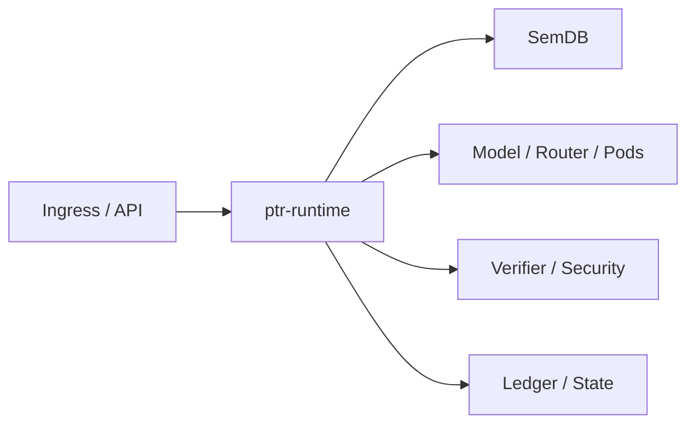

# ptr-runtime — End-to-End Runtime Orchestrator

> **Role:** Compose PTR's semantic, model, execution, verification, security and authority layers into one request lifecycle.

<!-- PTR:STATUS:BEGIN -->
## Current implementation status

> **Generated section.** Source of truth: [`component.toml`](component.toml) plus code-derived metrics from `src/`. Run `python3 scripts/update_component_docs.py --write` after editing implementation metadata. Do not hand-edit inside this block.

**Maturity:** `prototype`  
**Last reviewed:** 2026-09-18  
**Code footprint:** 1 Rust source files · 97 nonblank source lines · 0 `#[test]` markers

### Implemented now

- Central runtime object wiring configuration, SemDB, ledger, materialized state, events and permissions
- Text ingestion into revisioned semantic state
- Current-revision and capability/effect checks for ActionIR
- Committed-event materialization and runtime event emission

### Missing for the target architecture

- Full model/router/Pod/verifier request loop
- Generation-liveness validation at action boundary
- Async isolate scheduler integration
- Durable ledger/state backends
- Streaming client response lifecycle and cancellation

### Next milestones

- Wire baseline InferenceBackend into request lifecycle
- Add verifier-gated observation loop
- Move ptrd composition to PtrRuntime

### Linked experiments

- [E001](../../experiments/system/E001-end-to-end/README.md) — `planned`
- [E003](../../experiments/system/E003-token-efficiency/README.md) — `planned`
- [E004](../../experiments/system/E004-long-horizon/README.md) — `planned`

### Technology evaluations

- None recorded.

### Decision records

- [ADR-0001-rust-runtime.md](../../research/decisions/ADR-0001-rust-runtime.md)
- [ADR-0012-hard-effect-boundary.md](../../research/decisions/ADR-0012-hard-effect-boundary.md)
- [ADR-0013-runtime-orchestrator.md](../../research/decisions/ADR-0013-runtime-orchestrator.md)

### Current automated checks

- runtime ingestion/capability/materialization integration tests
- workspace fmt/check/test/clippy

<!-- PTR:STATUS:END -->

## Position in PTR

Dedicated diagram source: [`docs/diagrams/components/ptr-runtime.mmd`](../../docs/diagrams/components/ptr-runtime.mmd)

## Mission

Keep orchestration out of `ptrd` and out of individual domain crates. The runtime coordinates transitions while each component retains ownership of its semantics.

## Current boundary

The first executable slice wires configuration, semantic revisioning, action authorization, event emission and ledger materialization. Model/Pod/verifier loops remain the next milestone.
