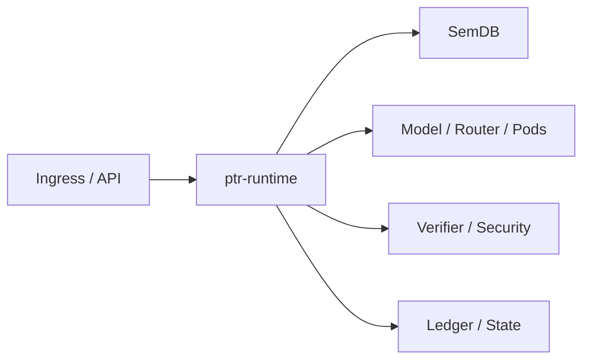

# ptr-runtime — End-to-End Runtime Orchestrator

> **Role:** Compose PTR's semantic, model, execution, verification, security and authority layers into one request lifecycle.

## Position in PTR

Dedicated diagram source: [`docs/diagrams/components/ptr-runtime.mmd`](../../docs/diagrams/components/ptr-runtime.mmd)

## Mission

Keep orchestration out of `ptrd` and out of individual domain crates. The runtime coordinates transitions while each component retains ownership of its semantics.

## Current boundary

The first executable slice wires configuration, semantic revisioning, action authorization, event emission and ledger materialization. Model/Pod/verifier loops remain the next milestone.
