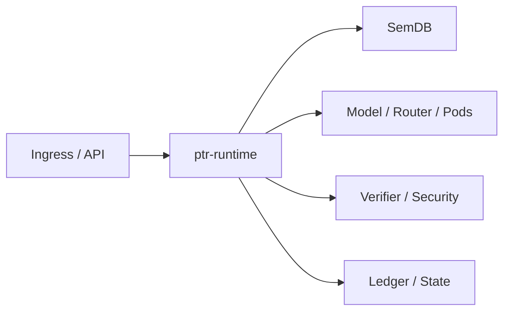

# ptr-runtime — End-to-End Runtime Orchestrator

> **Role:** Compose PTR's semantic, model, execution, verification, security and authority layers into one request lifecycle.

<!-- PTR:STATUS:BEGIN -->
## Current implementation status

> **Generated section.** Source of truth: [`component.toml`](component.toml) plus code-derived metrics from `src/`. Run `python3 scripts/update_component_docs.py --write` after editing implementation metadata. Do not hand-edit inside this block.

**Maturity:** `prototype`  
**Last reviewed:** 2026-09-28  
**Code footprint:** 7 Rust source files · 6163 nonblank source lines · 24 integration-test files · 244 test markers (`#[test]`, `#[tokio::test]`)

### Implemented now

- bind_checkpoint resolves the slot encoding an artifact records and refuses a definition this build has no implementation of, because weights trained on vectors it cannot recompute are weights it cannot feed; the encoding is deliberately not part of a StateDeclaration, which says which committed facts a state came from rather than how an artifact was constructed
- AdmissionPolicy maps a transport-authenticated peer to one principal and one grant set; admit_peer takes the peer and nothing else, so no caller-supplied parameter can name either, and a second entry for a peer is refused rather than replacing the first
- A session admitted from the policy re-derives its authority at every use, so withdrawing a peer or replacing the policy stops live sessions at once instead of when a TTL runs out; a host-registered session carries no peer and is unaffected
- Pod resolution is scoped by project, and a Pod in another project is unavailable in exactly the same words as one that does not exist, so a refusal is not an existence oracle across the boundary
- Durable execution audit: an effect commits an EffectAttempted record before it is dispatched and an EffectSettled record after, so the window between them is described by committed history rather than by process memory
- The fence is that record: an attempt with no settlement fences execution and commits, is rebuilt on every open, and therefore survives a crash or panic inside the effect window
- reconcile_effect commits what an operator established from the receiving system; it never infers an outcome and never retries a possibly-applied effect
- A settlement that cannot be committed after the executor or the adapter reported the effect applied is returned as SettlementNotRecorded naming the attempt, never as the Audit error a failed attempt record returns, because the effect applied and a caller told otherwise could apply it again; the attempt stays unsettled and the runtime fenced: settling or reconciling again in that process is refused, a reopen replays what was written, and an attempt still unsettled there keeps the reopened runtime fenced until it is reconciled, which a ledger with no index or record left refuses too
- prepare_execution_once adds an at-most-once key: a retry is answered from history without dispatching again, across restarts, while an attempt reconciled as not applied leaves the key free
- An applied key is bound to the project, principal, revision, generation and action digest its attempt recorded and to that attempt's index, set when the attempt is settled or reconciled: a permit under it is a retry when its project and principal match and its action digest, taken at the recorded revision and generation, matches the recorded one, so a retry carrying the current revision and generation is answered after either has moved, and any other permit is refused with KeyBoundToAnotherAction before anything is recorded, and a detached retry or a ResponseNotRetained refusal names the attempt that settled its own key rather than one inferred from response bytes or from the first attempt record under the key; a key reconciled as not applied binds nothing
- A response is retained up to MAX_RETAINED_RESPONSE and its digest unconditionally, so a retry whose response was not kept is refused rather than re-executed or answered with something else
- A denied preparation writes no effect record, and a fenced runtime yields no journal anchor, so no compaction floor can discard a record saying an effect may have applied
- Rustdoc covers the compacted-snapshot and neural-state APIs plus their canonical framing helpers and admission diagnostics
- Detached dispatch for work that does not finish inside the call: the attempt is committed and left unsettled, so the runtime is fenced from the moment the work is handed over until the adapter answers or a person reconciles it, and a refused dispatch writes no record
- A grant is synchronous or detached when it is issued, and each path refuses the other kind before the attempt is committed; both share one admission sequence, so there is one place where the order of checks and the attempt record is decided
- settle_detached records the adapter's own answer and is available only for an attempt this runtime dispatched; the dispatch kind is deliberately not rebuilt on reopen, so after a restart the fence stands and reconciliation is the way forward
- bind_checkpoint binds a real stored model artifact: it reads the shared CheckpointHeader, refuses an assignment this build cannot reproduce and an artifact whose codebook contradicts the declaration, then binds the opaque payload through the same bind_state path every other neural state uses
- PTRNEU01 neural/KV/checkpoint admission: opaque state bound to an anchored journal position, per-input semantic value digests, lifecycle generations, provenance and codebook version plus assignment fingerprint
- Admission is decided at every use rather than at insertion; a payload is reachable only through an admission decision, and a cache exposes no accessor that bypasses one
- Revocation, supersession, edited or removed inputs, foreign history with identical counters, unverifiable positions, changed codebook assignment and a fenced runtime each deny with their own stable code; failure to verify is a denial rather than an error
- bind_state derives every field from committed state and validates its own output through the same admission rules a later use applies
- PTRCS004 compacted materialized snapshot (lifecycle section PTRLC002); a PTRCS003 snapshot with a PTRLC001 section, written before attributed records, is still read as one whose history holds none, a PTRLC001 section carrying semdb:attested or a branch-merge: key is refused by version, and so is any other pairing of outer and lifecycle versions: committed state at a floor with canonical ascending-key sections, checked framing and an externally retained trusted anchor; a PTRLC002 section whose key under branch-merge: is not exactly a merged_branch_key, or whose value is not exactly an index and a plan digest as a merge projects them, is refused as noncanonical
- A settled key is written as 1 to MAX_KEY_BYTES (4096) bytes, as PTREX001 wrote it, so prepare_execution_once refuses a longer key this runtime does not already hold with InvalidKey, and commit, through which admission appends its attempts, refuses a keyed EffectAttempted under one with InvalidEffectKey before append (validate_new_record). The project and principal an applied key carries are written at any length, the empty string included, because no build has bounded them: sessions, peers and committed attempts name them as before, and no string of them makes an export fail (the section as a whole is still bounded; see the missing entry on settled keys in total). Replay applies no length bound, only the identifier check every build has made on a key: replay, and through it restore_recovery_snapshot, read_recovery_snapshot, restore_durable_snapshot and migrate_legacy_log; open_durable and open_durable_at; and the records restore_compacted replays above a floor. A log an earlier build wrote with a longer key therefore opens; preparation lets the key through once it has settled here, so the request that spent it is answered from history (its response or ResponseNotRetained) and another is refused as bound to another action, it is never spent again, and every export fails with PTR_COMPACTED_SECTION_LIMIT once it has settled, as it did on the previous build
- install_admission_policy re-derives every policy-admitted session's grants and principal from the new table, so a replacement that narrows a peer narrows its live session instead of leaving the wider set in force until the TTL; a session whose peer is no longer admitted is kept so the refusal can still name PeerNotAdmitted, and the expiry is never extended
- A compacted snapshot carries the execution obligations a raised floor would otherwise discard (PTREX002): spent at-most-once keys with their outcomes, each applied one with the attempt that settled it and the project, principal, revision, generation and action digest that attempt recorded (a retained response encoded by byte length, so one up to MAX_RETAINED_RESPONSE round-trips rather than only one under the item bound), and unsettled attempts with the same five, so a restored runtime neither executes a spent key a second time nor answers another action under it. A PTRCS001 snapshot is refused by version rather than read as an empty obligation set, and a PTRCS002 snapshot or PTREX001 section rather than read as keys bound to no action
- restore_compacted installs floor state then replays the retained journal through the ordinary lifecycle/semantic validation path, keeping committed indices
- CompactedSnapshot::covers reports only the position it holds, so a compaction barrier cannot claim coverage the snapshot lacks
- Versioned replay-backed recovery snapshots bind complete journal, semantic revision, commit index and independently trusted SHA-256 anchor
- Snapshot validation and semantic/lifecycle replay finish before creating a durable destination; existing destinations are never replaced
- Strict anchored reopen and explicit legacy-to-v2 migration preserve history while restoring no process-local authority
- Ordered semantic journal publication before acknowledgment or model resume
- Semantic payload/dependency/revision reconstruction with schema and transition validation during replay
- Every semantic record the runtime writes carries an origin: ingest_text writes a Request record holding exactly the request's raw text and a promoted Pod output a PodOutput record at the level its verifier reported (both ingress, needing no grant); a host write records Host with its principal and attestation; a merge records Merge with the branch, its author, the sealed branch and plan digests, the dependency digest, the rebased keys, the attestation and the authority; commit refuses every semantic record (SemanticRecordOutsideSemanticPath)
- Replay, open_durable, open_durable_at, restore_recovery_snapshot and restore_compacted apply the origin rules every writer also checks before it appends: R1 replays a record without an origin only while the materialized semdb:attested marker is absent (LegacySemanticRecord after it, including below a compacted floor); R2 accepts ingress records only in the exact shape ingress writes; R3 accepts a host write or merge only if it writes, removes, derives and evicts no ingress key (an eviction is checked once the delta is prepared: a key only ingress writes that a record without an origin derived from one the change writes), names valid provenance text (a host write's principal; a merge's branch, author, and reviewer or policy version, with a triage score that is a finite f32 in [0, 1]) and carries an attestation whose weakest level meets its requirement, with 1 to 16 verifiers whose names are distinct and valid and at most 32 soft findings that are sorted, distinct recorded codes; R4 accepts a merge only with no dependency entry, no rebased key removed or reserved to ingress, the plan digest merge_plan_digest gives for its branch, base revision, encoded delta, dependency digest and rebased keys, and a branch not merged before (its branch-merge:<len>:<id> key absent from materialized state); replay also refuses a record the ledger cannot frame, which only a history held in memory (replay, restore_compacted above the floor) can carry
- SemanticGrant is the host's policy for semantic writes that are not ingress: installed once (a second is refused, SemanticGrantInstalled), with 1 to 16 verifiers whose names are distinct identifiers of at most 64 bytes without '/', host writes off until allow_host_writes, an optional merge policy (with_merge_policy, with a calibration seed that is never recorded, returned or printed) and listed reviewers (with_reviewer), the policy version and every reviewer an identifier of at most 256 bytes, and never journaled, so a runtime rebuilt from its log has none; semantic_grant reports its requirement, verifier names, whether host writes are on, the policy version and the reviewers
- Complete typed Pod bytes and source identity are revision-significant
- Fallible ingestion, optimistic base revision and canonical no-op handling
- Scoped synchronous execution gateway with opaque per-runtime sessions, exact grants, frozen ActionIR permits and registered verifier/executor binding
- Consume-time freshness, expiry, ownership and mandatory permission checks; permissions/commit/effect epochs invalidate pending permits
- Executor or ledger ambiguity fences subsequent execution and commits; process-local single-use authority is never replayed
- Ledger-only lifecycle mutation; invalid/rewinding/tombstoned/cross-project transitions rejected before append and during replay
- Central runtime object wiring configuration, SemDB, ledger, materialized state, events and permissions; an in-memory append that runs out of commit indices surfaces as a ledger error rather than a repeated index
- Durable standalone runtime constructor opens/replays FileLedger and reconstructs lifecycle/materialized state across restart
- Text ingestion into revisioned semantic state
- Current-revision, live-generation/revocation and capability/effect checks for ActionIR delegated through typed ptr-security authorization decisions
- Committed-event materialization and runtime event emission
- Committed-event replay rebuilds lifecycle state and preserves revocation
- Reference InferenceBackend request loop runs against a revisioned ModelRequest and emits completion event
- Typed model→PodRegistry→Pod→Verifier→SemDB observation loop for Pure/Read cognitive Pods
- Bounded multi-step model resume loop after verified Pod observations advances semantic revision before continuation
- apply_verified_semantic_delta(expected, delta, principal) is a host write: refused while fenced, with no grant (NoSemanticGrant), when the grant does not allow host writes, for a principal that is not an identifier of at most 256 bytes, against a stale revision, and for an ingress key written, removed or derived (ReservedSemanticNamespace; an ingress key may be a dependency input), or, once the delta is prepared, one it would evict because a record without an origin derived it from a key the write changes (ReservedSemanticNamespace); every grant verifier then judges a SemanticChange (published state before, exact state after, delta, invalidated keys, principal) and it appends only if all pass, the weakest level meets the requirement and no report has a hard finding, refusing otherwise with SemanticVerificationRejected naming hard findings by code, never by message; a finding code that is not an identifier of at most 64 bytes, or more than 32 soft findings, fails closed (InvalidVerificationReport); each verifier's result is emitted as VerifierResult, a verifier whose report fails closed as not passed, and no verifier after it judges
- merge_branch(sealed, authority) is the only way an agent branch reaches semantic state: in order it refuses a fenced runtime, no grant (NoSemanticGrant), Triage under a grant with no merge policy (NoMergePolicy) and Reviewed by a reviewer the grant does not list (UnknownReviewer), a branch id or author that is not an identifier of at most 256 bytes (InvalidProvenanceText), a branch already merged (BranchAlreadyMerged naming where), a branch that does not certify against the runtime's own state now, relied generations included (Certification), under Reviewed a plan whose digest is not the one approved (MergePlanChanged), and a plan that writes, removes, derives or would evict an ingress key (ReservedSemanticNamespace); then every grant verifier judges a SemanticChange whose origin is the sealed branch, the plan and its CertificationKind; a merge the verifiers do not admit is held (VerificationRejected) whatever the authority, one the grant's policy does not auto-propose is held (Escalated) with its triage for review by plan digest, one that changes nothing appends nothing and does not mark the branch merged, and a record too large for the ledger to frame is refused (MergeRecordTooLarge); every refusal and hold comes before append and leaves the runtime unfenced; preview_merge certifies and judges without committing, and merged_at reads where a branch was merged
- A Pod output is promoted, by run_model_with_pods and run_resumable_with_pods alike, only when its verifier reports Pass with no hard finding (a hard finding refuses it even under Pass); no minimum level is required, and the level reported is recorded
- generation_validity combines the tombstone set with generation equality, so a revoked generation that is still the live one reads as Revoked rather than Live; ptr_search::retain_live takes it directly, so search hits are filtered by validity rather than by the live generation
- Neural-state input digests are computed from ptr-semdb canonical_input_bytes, byte-identical to the previous encoding (committed fixtures unchanged)

### Missing for the target architecture

- A way to remove a dependency a record without an origin set up that makes a key only ingress writes derived from a host key: no write since can, and a host write that changes the host key would evict the ingress key and is refused (ReservedSemanticNamespace), so such a host key can no longer be written by a host
- Durable compacted-snapshot publication and a runtime backed by an AcknowledgedLedger; compacted restore rebuilds an in-memory ledger above the floor and therefore retains no chain base, so it admits no neural state at all
- Any bound on how long detached work may stay outstanding, and any supervision of a detached adapter: there is no timeout, cancellation or retry, because a runtime that decided the work had failed would be deciding something it cannot observe
- A truly concurrent permission or lifecycle race inside one runtime: exclusive access prevents the interleaving by construction, so the concurrent case is two runtimes deciding at once, which ptr-execwire drives over a real connection rather than this crate
- Durable neural-anchor catalog and streamed or memory-mapped payloads; admission checks the producer's declared input set only, so an undeclared dependency stays invisible
- A trainer that binds a checkpoint as it saves one: bind_checkpoint attaches committed facts after the fact, so an artifact between saving and binding carries its assignment but no position
- An unforgeable peer identity: the NodeId passed to admit_peer is still taken on the caller's word here, and making it constructible only from an authenticated connection would require this crate to depend on ptr-net, which is an open decision; the execution wire itself now exists in ptr-execwire, where the forged-receipt and cross-runtime cases are tested over a real connection
- The admission policy is in memory: it is not journaled, so it does not survive a restart and a replayed history does not describe who was admitted when
- At-most-once memory is bounded by retention: a floor rising past a settled attempt discards its key, and reconciliation is a privileged host API whose caller this crate does not authenticate
- At-most-once keys scoped per principal or project: the memory is addressed by the key alone, so a refusal under a key tells a principal that another spent it and a principal that spends a key first makes it refused to every other; a caller has to choose keys nobody else can guess
- A spent key is refused at admission, not at validation: an EffectAttempted record a host commits directly under a spent key is accepted and replayed, and the key then holds what that attempt's settlement established
- Bounds on an attempt's target and operation: the materialized projection records both and the lifecycle section writes every materialized value as a string of 1 to 4096 bytes, so an attempt, keyed or not, with an empty or longer one leaves every later export failing; admission requires both to be identifiers but bounds neither's length, so a grant with an operation past 4096 bytes reaches it, and validation bounds no other record's materialized strings either
- A bound on the settled keys in total: every settled key goes into the one execution section, at most MAX_SECTION_BYTES (8 MiB) and 65,536 entries, an applied one with its retained response of up to MAX_RETAINED_RESPONSE (1 MiB) and its attempt's project and principal at whatever length they were recorded, and nothing removes a settled key, so eight keyed effects each settled with a full-size response, 65,537 settled keys, or fewer keys spent under a principal or project the host made long, leave every later export failing with PTR_COMPACTED_SECTION_LIMIT although the fence has cleared; the bound on each key does not reach this. PTREX002 writes each applied key with 64 bytes more than PTREX001 plus its project and principal, so a history whose execution section the previous build could still write can fail every export after the upgrade
- Compaction of a log an earlier build wrote with a key past MAX_KEY_BYTES: it opens and answers the key, but once the key has settled every export fails with PTR_COMPACTED_SECTION_LIMIT, as on the previous build; closing it needs a retention rule, a new layout or a migration that rewrites the key
- Router-driven operator selection around the implemented bounded Pod-resume loop
- Async isolate scheduler integration
- Configured raft-engine/raft-rs/Turso backend composition for production runtime modes
- Streaming client response lifecycle and cancellation

### Next milestones

- Decide whether peer identity should be constructible only from an authenticated connection, which would make this crate depend on ptr-net; until then ptr-execwire is the one host that passes an authenticated key and nothing else
- Define the PodWire request framing, which is still undefined even though the execution wire is not
- Retaining a NeuralAnchor outside the artifact remains a deployment obligation; nothing here stores one
- Connect evaluated raft-engine/Turso adapters through typed backend config while preserving FileLedger reference mode
- Add opaque backend checkpoint handles and async streaming around the implemented observation resume contract
- Wire ptrd request handling beyond bootstrap ingestion

### Linked experiments

- [E001](../../experiments/system/E001-end-to-end/README.md) — `planned`
- [E003](../../experiments/system/E003-token-efficiency/README.md) — `planned`
- [E004](../../experiments/system/E004-long-horizon/README.md) — `planned`

### Technology evaluations

- None recorded.

### Decision records

- [ADR-0001-rust-runtime.md](../../research/decisions/ADR-0001-rust-runtime.md)
- [ADR-0012-hard-effect-boundary.md](../../research/decisions/ADR-0012-hard-effect-boundary.md)
- [ADR-0013-runtime-orchestrator.md](../../research/decisions/ADR-0013-runtime-orchestrator.md)
- [ADR-0017-certified-agent-branches.md](../../research/decisions/ADR-0017-certified-agent-branches.md)
- [ADR-0020-only-the-runtime-merges-an-agent-branch.md](../../research/decisions/ADR-0020-only-the-runtime-merges-an-agent-branch.md)

### Current automated checks

- tests/branch_merge.rs: a sealed branch merges only through merge_branch, under triage or review, with its record naming branch, author, seal, plan, rebased keys, verifiers, level and authority (a_merge_records_branch_author_seal_plan_rebased_keys_verifiers_level_and_authority); a revocation or supersession after sealing or preview, a foreign base and a changed plan refuse it; failed verification holds it under either authority; triage holds escalated and calibration-slice branches and is explained by the granted policy; a branch merges once, also after replay, reopen and compaction; every refusal leaves the runtime unfenced, an oversize record included; a merge that would evict an ingress key a record without an origin derived from a key it writes is refused, and replay refuses such a merge record (a_merge_that_would_evict_an_ingress_key_is_refused); each verifier result of a merge is emitted once per merge, never by a preview, a report that fails closed as not passed; a merge's verifier is shown the branch, the plan the record names and whether it was rebased; a reliance on a generation never published, or a no-op whose relied generation was revoked, refuses the merge under either authority (a_reliance_on_an_unknown_generation_or_a_revoked_no_op_refuses_the_merge), and so does a plan whose delta the journal cannot carry, as its digest is computed (a_plan_whose_delta_the_journal_cannot_carry_is_refused_as_it_is_certified); a plan delta written as a host write is recorded as Host; tests/semantic_provenance.rs refuses a merge record with a mismatched plan digest, a dependency entry, invalid provenance or a second merge of one branch on every rebuild path, and its property test covers clean, rebased, triaged and reviewed merges
- an attestation naming no verifier, 17 verifiers or 33 soft findings is refused by replay and by restore_compacted above its floor, which take records the codec never saw, and exactly the bounds replay on every path (an_attestation_naming_no_verifier_or_more_than_a_record_holds_is_refused); a host write that would evict an ingress key a record without an origin derived from the key it writes is refused before any verifier is asked, and replay refuses such a record below and above a compacted floor (a_host_write_that_would_evict_an_ingress_key_is_refused); a report that fails closed is emitted as not passed and no later verifier judges (a_report_that_fails_closed_is_emitted_as_not_passed_and_stops_the_verifiers_after_it); a Pod output with a hard finding is refused by both Pod loops (a_pod_output_with_a_hard_finding_is_not_promoted)
- the committed checkpoint fixture records the slot encoding it was produced under, and verification names both the codebook and the encoding
- detached work fences the runtime until the adapter answers: the fence names the attempt, no permit can be prepared, no journal anchor or compacted snapshot is produced, and the settlement carries the response digest
- an adapter that would not take the work still leaves the window open, because not accepted is not not-applied; a detached attempt survives a restart as a fence that only reconciliation moves, and the adapter's own answer is refused there
- the same runtime restored with the attempt it wrote and no settlement is still fenced and cannot reconcile on a ledger with no index left; an attempt record the ledger cannot commit returns Audit, reaches no executor and leaves no attempt unsettled, while the runtime is fenced by its own ambiguous append
- an effect whose settlement cannot be committed, on a ledger one index below its ceiling, is returned as SettlementNotRecorded naming the attempt after the executor ran once, and the attempt still fences the runtime: no permit is prepared, no journal anchor is produced and reconciliation is refused in that process; an adapter's answer that cannot be recorded leaves the detached attempt outstanding, and handing it over again is SettlementNotRecorded again rather than a refusal
- each dispatch path refuses the other kind of grant with no record written and nothing verified; a settlement for an attempt this runtime did not hand out, and a second settlement of one it did, are refused; so is an adapter answer for an attempt reconciled in the meantime, which is no longer outstanding, with nothing appended and the runtime left unfenced
- an at-most-once key hands detached work out once: while the first is outstanding the fence refuses a retry by name, and after settlement a retry is answered from history without calling the adapter; an oversize answer keeps its digest without being retained and the next retry is refused rather than answered with something the effect never produced
- withdrawing one peer or replacing the policy in the prepare-to-consume window refuses that permit before the verifier while another session keeps working; a generation superseded or revoked in that window is refused before the verifier; one session's successful effect refuses another's in-flight permit without reaching the executor
- a real ptr-burn-a0 checkpoint binds to committed state, is admitted, seals and reopens with its weights unchanged, and is then refused once the generation it was bound under moves and once the semantic input it read is edited
- a checkpoint whose assignment moved, one whose codebook contradicts the declaration, one whose table width is not its family's cardinality and every prefix of one are each refused, with the intact fixture binding as the control
- an admitted peer executes only its granted action and the audited principal is the policy's; a different operation or project is denied before any check that could depend on what the caller claims
- withdrawing a peer refuses a permit issued beforehand, new preparations and re-admission without the TTL moving; replacing the policy kills live sessions and re-admitting does not revive them
- a Pod in another project is unavailable in a refusal equal to the one for a Pod that does not exist, while the same request inside its own project succeeds
- a runtime reopened after an executor error or panic is still fenced by the unsettled attempt it left, refuses to register a session and refuses to commit
- an applied effect commits its attempt before and its settlement after, with the action digest and admitting verification level asserted field by field
- a retry under an at-most-once key returns the first response without dispatching again, before and after a restart, while a different key does dispatch
- reconciliation lifts the fence for both outcomes and lets a key reconciled as unapplied execute again
- a fenced runtime yields no journal anchor and no compacted snapshot; a denied preparation writes no record
- settlements naming no live attempt, a second live attempt under one key, a malformed key, and a retained response that is oversize or contradicts its digest are each refused before append and during replay
- an empty runtime round-trips at the empty floor; a runtime restored at the index ceiling refuses a commit with PTR_LEDGER_INDEX_EXHAUSTED, stores nothing and fences the retry; revocation outranks every other binding mismatch simultaneously
- an admitted state reproduces the identical inference event sequence after a restart, with binding and opaque payload byte-for-byte equal
- revocation, supersession, edited/removed inputs, foreign history with identical counters, unverifiable position, compacted restore, contradicting revision, unknown/changed codebook, unknown target and a fenced runtime each denied
- every single-bit mutation of a sealed state rejected; wrong outer/binding magic, reserved field, length mismatch, byte removal/insertion and undersize rejected after resealing the digest
- an unrelated commit leaves a state admissible, so dependency-precise binding is asserted in both directions
- compacted reconstruction equals a full replay across semantic payloads, dependencies, supersession, constraints, procedures and revocations
- a revocation below the floor still denies after compaction; every single-bit mutation of a compacted snapshot rejected
- resealed noncanonical sections, reserved fields, length and trusted-identity mismatches, and records not above the floor all rejected
- snapshot exact-state/byte-corruption/rollback/revision/legacy/overwrite/authority rejection tests
- scoped execution positive/negative integration tests and non-forgeability/single-use compile-fail doctests
- runtime ingestion/revision/generation/capability/materialization integration tests
- typed authorization decision exposure and RuntimeError compatibility test
- reference model-loop integration test
- bounded verified Pod-observation resume-loop tests
- revocation replay/restart integration test
- durable FileLedger runtime reopen preserves revocation and materialized commit position
- commit refuses every semantic record, a legacy one included (SemanticRecordOutsideSemanticPath, generic_commit_refuses_semantic_records); a merge record as merge_branch writes it replays on replay, open_durable, open_durable_at, restore_recovery_snapshot and restore_compacted, while one that breaks R3 or R4 (a plan digest that does not match its delta or rebased keys, a dependency entry, invalid provenance or attestation, a second merge of one branch) is refused with InvalidSemanticOrigin at its index on all five, the log left byte for byte; tests/semantic_provenance.rs runs every other origin rule through all five paths, ingress shapes with an extra key, payload, dependency, removal or second dependency entry included, and its property test compares what every path rebuilds (revision, materialized state, every value with its inputs) with the runtime that wrote the history
- a PTRCS003 snapshot with a PTRLC001 section restores at its floor with no attestation key, and with the records above its floor exactly as a full replay does, marker included; the same section holding semdb:attested or a branch-merge: key is refused by version while PTRCS004 restores it as state; PTRCS004 with PTRLC001 and PTRCS003 with PTRLC002 are refused, PTRCS005 and PTRLC003 are unknown versions
- tests/semantic_grant.rs: a second grant is refused and the first stays; a grant with no verifier, a shared name, an invalid name or more than 16 verifiers is refused and exactly 16 installs; host writes need a grant that allows them; an invalid principal and an ingress key written, removed or derived are refused before any verifier runs, while an ingress key as a dependency input is admitted; commit refuses every semantic record; ingest_text needs no grant and writes exactly its raw text as a Request record; a Pod output with a hard finding is not promoted and one with a soft finding is recorded at its reported level; a runtime rebuilt by replay or open_durable has no grant until one is installed
- tests/semantic_provenance.rs: a record without an origin after an attributed one is refused on replay, open_durable, open_durable_at, restore_recovery_snapshot and restore_compacted at every floor, while a log of such records alone replays on all of them; ingress records of any other shape, host writes touching an ingress key or naming an invalid principal, and attestations below their requirement or with invalid, repeated or unrecorded verifiers or findings are each refused on every path; 200 seeded histories of ingress, Pod outputs, host writes with and without findings, derived keys and lifecycle records are all accepted on every path and replay to the same state
- tests/verified_delta.rs: a verifier sees before, after, delta, affected keys and its origin; the weakest verifier level decides and the record names every verifier in grant order; a refusal names hard findings by code, never by message, and admitted soft findings are recorded sorted and distinct; invalid finding codes and too many soft findings fail closed
- workspace fmt/check/test/clippy
- tests/at_most_once_keys.rs: another payload and another principal under a spent key are refused with KeyBoundToAnotherAction, reach no executor and write no record, while the request that spent the key is still answered, and a detached dispatch under a spent key hands nothing out; a key reconciled as applied is bound to its attempt's action and one reconciled as not applied binds nothing; the binding holds for payload and principal after a restart and after a compacted round trip, and for the project, from an attempt written into the log directly, after a restart and after a compacted round trip; a detached retry names the attempt that settled its own key when another key settled equal bytes and after compaction, and a ResponseNotRetained refusal names it when the key was attempted twice and after compaction; a retry carrying the current revision and generation is answered after an unrelated delta moved the revision and after the capsule's generation was superseded, live, after a restart and after a compacted round trip, while another payload and another principal are still refused; the admission policy admits a peer under a 64 KiB principal, and a session registered under one spends a key, after which the runtime still exports, restores and answers the retry while another principal is refused; a keyed attempt committed directly under an empty, a 64 KiB, a padded or a control-character principal, and one under an empty or 64 KiB project, opens with replay, open_durable, open_durable_at and restore_recovery_snapshot however its key ended, and once reconciled as applied exports and restores with the key bound to it; a log an earlier build could have written with such a principal or project reopens however the attempt ended, exports unless fenced, refuses alice's request under the key once applied and binds nothing once reconciled as not applied; a key past MAX_KEY_BYTES, and one of the wire's 64 KiB, is refused by prepare_execution_once and at commit, while a history or log holding it opens however it ended, the request that spent it is answered from history (its response once settled, ResponseNotRetained once reconciled as applied) without running, an attempt under it after it was reconciled as not applied is refused at commit with nothing attempted, and export fails once it has settled either way; the longest allowed opens on each path and is spent, exported, restored and answered; a resealed snapshot whose recorded principal's length runs past the section is refused with PTR_COMPACTED_LENGTH and one whose recorded project is not UTF-8 with PTR_COMPACTED_NONCANONICAL_SECTION; a PTRCS002 snapshot and a PTREX001 section are refused by version after resealing (a_spent_key_is_refused_for_another_principal_rather_than_answered_with_its_receipt, a_retry_is_answered_after_the_revision_and_generation_move_and_another_request_is_still_refused, a_principal_of_any_length_spends_a_key_and_a_snapshot_carries_it, a_keyed_attempt_under_any_principal_is_committed_and_a_snapshot_carries_it, a_key_longer_than_a_snapshot_carries_is_refused_before_it_is_spent_and_a_logged_one_is_still_answered, a_keyed_attempt_under_any_project_is_committed_and_a_snapshot_carries_it, a_snapshot_whose_recorded_project_or_principal_is_malformed_is_refused)
- tests/verified_delta.rs: a verified delta commits the state its verifier saw; no failing score, shallow level or hard finding gets a delta past verification; a moved revision is refused before verification; revoked, superseded and unknown generations never read as Live; search hits filtered by generation_validity drop a revoked live generation

<!-- PTR:STATUS:END -->

## Position in PTR

```mermaid
flowchart LR
  I["Ingress / API"] --> R["ptr-runtime"]
  R --> S["SemDB"]
  R --> M["Model / Router / Pods"]
  R --> V["Verifier / Security"]
  R --> L["Ledger / State"]
```

Dedicated diagram source: [`docs/diagrams/components/ptr-runtime.mmd`](../../docs/diagrams/components/ptr-runtime.mmd)

## Mission

Keep orchestration out of `ptrd` and out of individual domain crates. The runtime coordinates transitions while each component retains ownership of its semantics.

## Current boundary

The executable reference slice now wires configuration, semantic revisioning, a backend-neutral model call, semantic Pod resolution, Pure/Read Pod execution, verifier-gated observation promotion, action authorization, event emission, ledger materialization and durable FileLedger reopen/replay. The new scoped synchronous execution gateway binds opaque sessions and immutable ActionIR permits to host-registered verifiers/executors. Administrative session registration assumes the embedding host has authenticated the principal; it is not an HTTP authentication endpoint. See [P0.1 execution authority](../../docs/architecture/21-scoped-execution.md) for guarantees, counterexamples and the remaining durable/network gates. P0.2 now reconstructs the actual journaled semantic payloads, dependencies and revisions. The next persistence gate is record integrity and verified snapshot/checkpoint admission, not additional backend breadth.

## P0.2 semantic journal integration

[Durable semantic-state contract](../../docs/architecture/22-durable-semantic-state.md)
records the new code/codec, ownership and replay boundaries. Publication follows
successful journal append. Typed Pod bytes and source identity participate in
semantic revisions. Logical removals do not erase log history; neural checkpoints
and authenticated framing remain separate gates. Execution evidence is in the PR.

## Persistence contract update

See [P0.3 checked records and replay-backed recovery snapshots](../../docs/architecture/23-persistence-integrity.md)
for strict reopen, explicit legacy migration, independent anchors, create-new
restore and format/API compatibility. Old automatic crash-tail repair is replaced
by explicit anchored recovery. No authority or neural checkpoint is restored.
