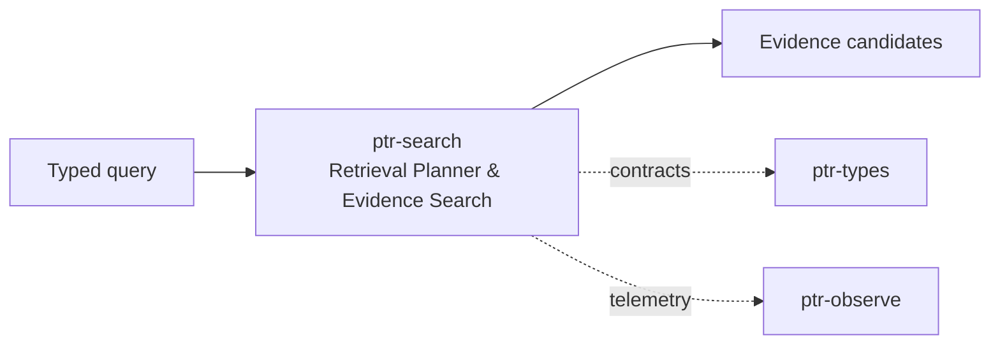

# ptr-search — Retrieval Planner & Evidence Search

> **Role:** Routes queries across lexical, semantic, GPU, multimodal, distributed and structural search backends while keeping retrieval non-authoritative.  
> **Maturity:** architecture + contract scaffold; production behavior must be proven by the linked experiments and component evaluations.

## Position in PTR

Dedicated diagram source: [`docs/diagrams/components/ptr-search.mmd`](../../docs/diagrams/components/ptr-search.mmd)

**Upstream:** ptr-router, ptr-memory  
**Downstream:** ptr-verifier, ptr-core

## Mission

Routes queries across lexical, semantic, GPU, multimodal, distributed and structural search backends while keeping retrieval non-authoritative.

PTR keeps this responsibility in its own crate so the semantics remain stable even when an external library or implementation is replaced.

## Responsibilities

- TypedQuery
- search planner
- backend abstraction
- fusion
- EvidenceCandidate and promotion metadata

## Explicit non-responsibilities

- semantic truth
- long-term object lifecycle
- raw artifact storage

## Data flow

| Direction | Contract |
|---|---|
| Input | Typed query, project scope, retrieval budget |
| Output | Ranked evidence candidates with provenance and index generation |
| Failure | Explicit typed error / rejected state; no silent fallback that changes semantics |
| Observability | Standard PTR tracing fields and a stable component span |

## Technical approach

- Tantivy lexical
- Zvec local vector
- cuVS GPU
- LanceDB multimodal
- Havenask distributed
- GritQL structural code; all candidates remain benchmarkable

External projects are **candidates**, not architectural authority. The PTR-owned traits and domain types must remain usable with a replacement backend.

## Core invariants

1. SearchHit is never Known<T>.
2. Source resolution and generation validation precede promotion.
3. Backend scores are normalized before cross-engine fusion.

These invariants should be executable wherever possible through unit, property, lifecycle or chaos tests.

## Failure model

The component must fail closed for semantic or effect-safety violations. Infrastructure failures should surface as typed errors that preserve request, revision, generation and provenance context. Retries must be idempotent whenever the operation may cross a process or network boundary.

## Performance model

Measure before optimizing. Benchmarks should record at least latency distribution, throughput, allocations/resident memory, queue depth or working-set size where relevant, and the cost of verification. Performance optimizations may not bypass generation, revision, capability or evidence checks.

## Security and privacy

- Treat external inputs and backend outputs as untrusted until validated.
- Do not put raw secrets/private evidence into generic tracing or inspection.
- Preserve provenance on every promotion from raw/possible evidence to stronger semantic state.
- External effects pass through `ptr-security` even if this component already performed local validation.

## Technology evaluation

- [lexical-search](../../evaluations/components/lexical-search/README.md)
- [local-vector-search](../../evaluations/components/local-vector-search/README.md)
- [gpu-vector-search](../../evaluations/components/gpu-vector-search/README.md)
- [distributed-search](../../evaluations/components/distributed-search/README.md)
- [structural-code-search](../../evaluations/components/structural-code-search/README.md)

A new candidate should be added with a reproducible benchmark and failure-semantics analysis rather than replacing the default ad hoc.

## Tests required before production use

- Contract/unit tests for all domain transitions.
- Invalid, stale-generation and stale-revision cases.
- Cancellation/retry behavior.
- Property tests for invariants where practical.
- Cross-backend equivalence if more than one backend exists.
- Observability and redaction checks.

## Related architecture

- [System architecture](../../docs/architecture/00-system.md)
- [Technical architecture](../../docs/TECHNICAL_ARCHITECTURE.md)
- [Component contracts](../../docs/COMPONENT_CONTRACTS.md)
- [Global invariants](../../docs/INVARIANTS.md)

