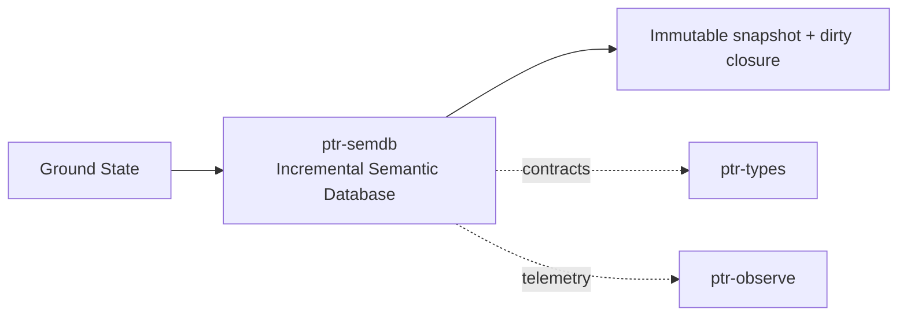

# ptr-semdb — Incremental Semantic Database

> **Role:** Maintains revisioned ground state and dependency-aware derived semantics using an incremental-compiler model.  
> **Maturity:** architecture + contract scaffold; production behavior must be proven by the linked experiments and component evaluations.

## Position in PTR

Dedicated diagram source: [`docs/diagrams/components/ptr-semdb.mmd`](../../docs/diagrams/components/ptr-semdb.mmd)

**Upstream:** ptr-ingress, ptr-state, ptr-verifier  
**Downstream:** ptr-core, ptr-router, ptr-memory

## Mission

Maintains revisioned ground state and dependency-aware derived semantics using an incremental-compiler model.

PTR keeps this responsibility in its own crate so the semantics remain stable even when an external library or implementation is replaced.

## Responsibilities

- ground inputs
- dependency graph
- precise invalidation
- immutable snapshots
- stale-work detection and cancellation
- semantic skeletons

## Explicit non-responsibilities

- durable distributed authority
- vector retrieval
- neural reasoning

## Data flow

| Direction | Contract |
|---|---|
| Input | Validated deltas and observations |
| Output | Immutable SemanticSnapshot<Revision> and affected-query sets |
| Failure | Explicit typed error / rejected state; no silent fallback that changes semantics |
| Observability | Standard PTR tracing fields and a stable component span |

## Technical approach

- Rust-native incremental engine
- rust-analyzer-style host/snapshot architecture
- Salsa and alternative engines remain evaluation candidates

External projects are **candidates**, not architectural authority. The PTR-owned traits and domain types must remain usable with a replacement backend.

## Core invariants

1. Reasoning runs against one immutable revision.
2. Only dependent derived values are invalidated.
3. Revision does not encode semantic-object lifecycle Generation.

These invariants should be executable wherever possible through unit, property, lifecycle or chaos tests.

## Failure model

The component must fail closed for semantic or effect-safety violations. Infrastructure failures should surface as typed errors that preserve request, revision, generation and provenance context. Retries must be idempotent whenever the operation may cross a process or network boundary.

## Performance model

Measure before optimizing. Benchmarks should record at least latency distribution, throughput, allocations/resident memory, queue depth or working-set size where relevant, and the cost of verification. Performance optimizations may not bypass generation, revision, capability or evidence checks.

## Security and privacy

- Treat external inputs and backend outputs as untrusted until validated.
- Do not put raw secrets/private evidence into generic tracing or inspection.
- Preserve provenance on every promotion from raw/possible evidence to stronger semantic state.
- External effects pass through `ptr-security` even if this component already performed local validation.

## Technology evaluation

- [semantic-db](../../evaluations/components/semantic-db/README.md)

A new candidate should be added with a reproducible benchmark and failure-semantics analysis rather than replacing the default ad hoc.

## Tests required before production use

- Contract/unit tests for all domain transitions.
- Invalid, stale-generation and stale-revision cases.
- Cancellation/retry behavior.
- Property tests for invariants where practical.
- Cross-backend equivalence if more than one backend exists.
- Observability and redaction checks.

## Related architecture

- [System architecture](../../docs/architecture/00-system.md)
- [Technical architecture](../../docs/TECHNICAL_ARCHITECTURE.md)
- [Component contracts](../../docs/COMPONENT_CONTRACTS.md)
- [Global invariants](../../docs/INVARIANTS.md)

