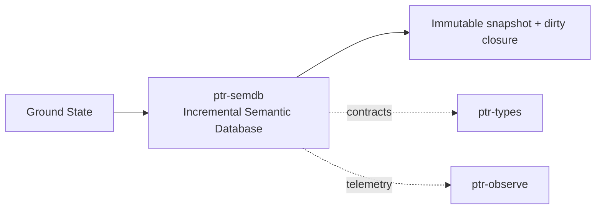

# ptr-semdb — Incremental Semantic Database

> **Role:** Maintains revisioned ground state and dependency-aware derived semantics using an incremental-compiler model.  
> **Maturity:** architecture + contract scaffold; production behavior must be proven by the linked experiments and component evaluations.

<!-- PTR:STATUS:BEGIN -->
## Current implementation status

> **Generated section.** Source of truth: [`component.toml`](component.toml) plus code-derived metrics from `src/`. Run `python3 scripts/update_component_docs.py --write` after editing implementation metadata. Do not hand-edit inside this block.

**Maturity:** `prototype`  
**Last reviewed:** 2026-09-22  
**Code footprint:** 2 Rust source files · 617 nonblank source lines · 3 integration-test files · 24 test markers (`#[test]`, `#[tokio::test]`)

### Implemented now

- SemanticSnapshot::slot_vector is the door between committed semantic state and what a model reads in a slot: a key the snapshot does not hold is refused rather than encoded as zeros, so a payload that reaches it is one the snapshot holds and not an absence dressed as a value. Nothing calls it yet — model/burn-a0 is an isolated workspace no PTR crate depends on, so there is no integrated path from a snapshot to a model and the door is a mechanism rather than a route
- A payload's source deliberately does not participate in its slot vector, because provenance has its own channel into the model and a slot's value must not change when only its origin did; the type does participate, so the insensitivity is to the source specifically
- SemanticValue::Text has no type of its own, so TEXT_TYPE decides in one place what it encodes as — which makes text and the same bytes under that type one claim rather than two, asserted so it stays deliberate
- Symmetric export_state/restore: published state round-trips through the same canonical delta encoding the journal uses, at an exact caller-supplied revision
- Text and typed binary/source values share a revisioned semantic state
- Bounded canonical PTRSD001 delta codec and staged atomic publication
- Transactional dependency replacement and transitive removal of stale derived values
- Host-bound snapshots and prepared changes reject foreign or stale admission
- SemanticDelta upsert/removal model
- Dependency graph and transitive affected-closure calculation
- Revisioned SemanticHost and immutable Arc-backed SemanticSnapshot
- Stale snapshot detection
- ProjectSkeleton scaffold
- Integration regression preserving local dependency closure semantics

### Missing for the target architecture

- Typed query keys beyond the String-key/SemanticValue map
- Memoized derived-query engine with dependency capture
- Cancellation tokens for stale in-flight computation
- Concurrent snapshot/read architecture and persistent/rebuildable caches
- Semantic skeleton derivation from typed state

### Next milestones

- Add typed query keys and automatic dependency capture over SemanticValue
- Implement dependency-recording query execution and cache invalidation
- Run S001/S002 before selecting a third-party incremental engine

### Linked experiments

- [S001](../../experiments/semdb/S001-invalidation/README.md) — `planned`
- [S002](../../experiments/semdb/S002-snapshot-cancellation/README.md) — `planned`
- [E004](../../experiments/system/E004-long-horizon/README.md) — `planned`

### Technology evaluations

- [semantic-db](../../evaluations/components/semantic-db/README.md) — `open`

### Decision records

- [ADR-0003-raw-and-typed.md](../../research/decisions/ADR-0003-raw-and-typed.md)
- [ADR-0005-incremental-semdb.md](../../research/decisions/ADR-0005-incremental-semdb.md)

### Current automated checks

- a committed value yields a vector of the width asked for, a removed or absent key is refused, the same value is stable across later unrelated commits, and a changed value changes its vector
- a payload's source does not change its vector while its type does, and text matches the same bytes under TEXT_TYPE
- an encoding refusal travels out carrying the encoding's own diagnostic code rather than a new one
- a committed value encodes byte-for-byte as the model-side tests encode the same type and bytes, which is the strongest link available across a workspace split that no caller can cross
- exported state restores values, dangling dependency declarations and the exact revision through the canonical codec; restore refuses removals, missing dependencies and cycles; a restore at the revision ceiling stays exhausted
- Compacted-snapshot round trip through export_state/restore reproduces ground values, payload bytes, dependency sets and revision exactly
- local_change_invalidates_only_dependency_closure integration test
- workspace fmt/check/test/clippy

<!-- PTR:STATUS:END -->

## Position in PTR

Dedicated diagram source: [`docs/diagrams/components/ptr-semdb.mmd`](../../docs/diagrams/components/ptr-semdb.mmd)

**Upstream:** ptr-ingress, ptr-state, ptr-verifier  
**Downstream:** ptr-core, ptr-router, ptr-memory

## Mission

Maintains revisioned ground state and dependency-aware derived semantics using an incremental-compiler model.

PTR keeps this responsibility in its own crate so the semantics remain stable even when an external library or implementation is replaced.

## Responsibilities

- ground inputs
- dependency graph
- precise invalidation
- immutable snapshots
- stale-work detection and cancellation
- semantic skeletons

## Explicit non-responsibilities

- durable distributed authority
- vector retrieval
- neural reasoning

## Data flow

| Direction | Contract |
|---|---|
| Input | Validated deltas and observations |
| Output | Immutable SemanticSnapshot<Revision> and affected-query sets |
| Failure | Explicit typed error / rejected state; no silent fallback that changes semantics |
| Observability | Standard PTR tracing fields and a stable component span |

## Technical approach

- Rust-native incremental engine
- rust-analyzer-style host/snapshot architecture
- Salsa and alternative engines remain evaluation candidates

External projects are **candidates**, not architectural authority. The PTR-owned traits and domain types must remain usable with a replacement backend.

## Core invariants

1. Reasoning runs against one immutable revision.
2. Only dependent derived values are invalidated.
3. Revision does not encode semantic-object lifecycle Generation.

These invariants should be executable wherever possible through unit, property, lifecycle or chaos tests.

## Failure model

The component must fail closed for semantic or effect-safety violations. Infrastructure failures should surface as typed errors that preserve request, revision, generation and provenance context. Retries must be idempotent whenever the operation may cross a process or network boundary.

## Performance model

Measure before optimizing. Benchmarks should record at least latency distribution, throughput, allocations/resident memory, queue depth or working-set size where relevant, and the cost of verification. Performance optimizations may not bypass generation, revision, capability or evidence checks.

## Security and privacy

- Treat external inputs and backend outputs as untrusted until validated.
- Do not put raw secrets/private evidence into generic tracing or inspection.
- Preserve provenance on every promotion from raw/possible evidence to stronger semantic state.
- External effects pass through `ptr-security` even if this component already performed local validation.

## Technology evaluation

- [semantic-db](../../evaluations/components/semantic-db/README.md)

A new candidate should be added with a reproducible benchmark and failure-semantics analysis rather than replacing the default ad hoc.

## Tests required before production use

- Contract/unit tests for all domain transitions.
- Invalid, stale-generation and stale-revision cases.
- Cancellation/retry behavior.
- Property tests for invariants where practical.
- Cross-backend equivalence if more than one backend exists.
- Observability and redaction checks.

## Related architecture

- [System architecture](../../docs/architecture/00-system.md)
- [Technical architecture](../../docs/TECHNICAL_ARCHITECTURE.md)
- [Component contracts](../../docs/COMPONENT_CONTRACTS.md)
- [Global invariants](../../docs/INVARIANTS.md)

## P0.2 semantic journal integration

[Durable semantic-state contract](../../docs/architecture/22-durable-semantic-state.md)
records the new code/codec, ownership and replay boundaries. Publication follows
successful journal append. Typed Pod bytes and source identity participate in
semantic revisions. Logical removals do not erase log history; neural checkpoints
and authenticated framing remain separate gates. Execution evidence is in the PR.
