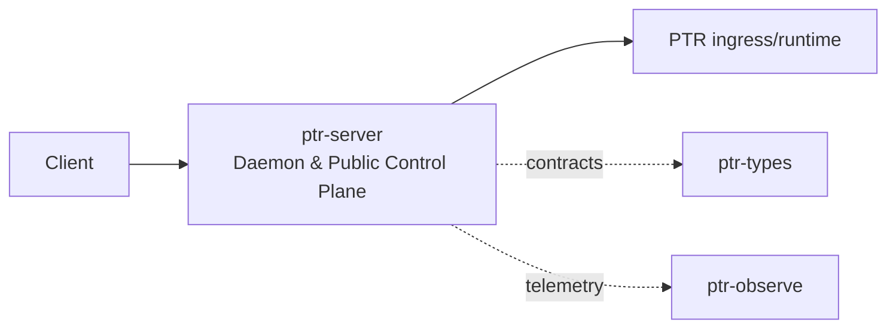

# ptr-server — Daemon & Public Control Plane

> **Role:** Exposes PTR to clients through stable APIs without leaking internal crate boundaries or provider-specific interfaces.  
> **Maturity:** architecture + contract scaffold; production behavior must be proven by the linked experiments and component evaluations.

<!-- PTR:STATUS:BEGIN -->
## Current implementation status

> **Generated section.** Source of truth: [`component.toml`](component.toml) plus code-derived metrics from `src/`. Run `python3 scripts/update_component_docs.py --write` after editing implementation metadata. Do not hand-edit inside this block.

**Maturity:** `scaffold`  
**Last reviewed:** 2026-09-18  
**Code footprint:** 1 Rust source files · 12 nonblank source lines · 0 `#[test]` markers

### Implemented now

- ApiRequest and ApiResponse domain structs with request ID/revision

### Missing for the target architecture

- Axum server and route graph
- Streaming ModelEvent/WebSocket or SSE API
- Authentication/session/policy integration
- Health/readiness/admin endpoints
- Client backpressure and cancellation propagation

### Next milestones

- Implement health endpoint and request streaming skeleton
- Connect one end-to-end request through ingress→SemDB→baseline model
- Add API conformance/integration tests

### Linked experiments

- [E001](../../experiments/system/E001-end-to-end/README.md) — `planned`
- [E003](../../experiments/system/E003-token-efficiency/README.md) — `planned`

### Technology evaluations

- None recorded.

### Decision records

- [ADR-0001-rust-runtime.md](../../research/decisions/ADR-0001-rust-runtime.md)
- [ADR-0004-backend-independence.md](../../research/decisions/ADR-0004-backend-independence.md)

### Current automated checks

- workspace fmt/check/test/clippy

<!-- PTR:STATUS:END -->

## Position in PTR

Dedicated diagram source: [`docs/diagrams/components/ptr-server.mmd`](../../docs/diagrams/components/ptr-server.mmd)

**Upstream:** external clients  
**Downstream:** ptr-ingress, ptr-exec, ptr-observe

## Mission

Exposes PTR to clients through stable APIs without leaking internal crate boundaries or provider-specific interfaces.

PTR keeps this responsibility in its own crate so the semantics remain stable even when an external library or implementation is replaced.

## Responsibilities

- HTTP/WebSocket API
- request/session boundary
- health/readiness endpoints
- streaming response adaptation
- admin/control endpoints

## Explicit non-responsibilities

- core reasoning semantics
- search logic
- distributed consensus

## Data flow

| Direction | Contract |
|---|---|
| Input | Client requests and admin commands |
| Output | API responses and model/runtime event streams |
| Failure | Explicit typed error / rejected state; no silent fallback that changes semantics |
| Observability | Standard PTR tracing fields and a stable component span |

## Technical approach

- Axum primary server framework
- Pingora optional edge/gateway layer
- JSON public API plus binary/streaming options

External projects are **candidates**, not architectural authority. The PTR-owned traits and domain types must remain usable with a replacement backend.

## Core invariants

1. Public API versions are explicit.
2. Authentication/authorization is delegated to hard security policy.
3. Backpressure propagates to clients instead of unbounded buffering.

These invariants should be executable wherever possible through unit, property, lifecycle or chaos tests.

## Failure model

The component must fail closed for semantic or effect-safety violations. Infrastructure failures should surface as typed errors that preserve request, revision, generation and provenance context. Retries must be idempotent whenever the operation may cross a process or network boundary.

## Performance model

Measure before optimizing. Benchmarks should record at least latency distribution, throughput, allocations/resident memory, queue depth or working-set size where relevant, and the cost of verification. Performance optimizations may not bypass generation, revision, capability or evidence checks.

## Security and privacy

- Treat external inputs and backend outputs as untrusted until validated.
- Do not put raw secrets/private evidence into generic tracing or inspection.
- Preserve provenance on every promotion from raw/possible evidence to stronger semantic state.
- External effects pass through `ptr-security` even if this component already performed local validation.

## Technology evaluation

- No dedicated technology slot yet; architectural alternatives should be added to `evaluations/components/` before lock-in.

A new candidate should be added with a reproducible benchmark and failure-semantics analysis rather than replacing the default ad hoc.

## Tests required before production use

- Contract/unit tests for all domain transitions.
- Invalid, stale-generation and stale-revision cases.
- Cancellation/retry behavior.
- Property tests for invariants where practical.
- Cross-backend equivalence if more than one backend exists.
- Observability and redaction checks.

## Related architecture

- [System architecture](../../docs/architecture/00-system.md)
- [Technical architecture](../../docs/TECHNICAL_ARCHITECTURE.md)
- [Component contracts](../../docs/COMPONENT_CONTRACTS.md)
- [Global invariants](../../docs/INVARIANTS.md)

