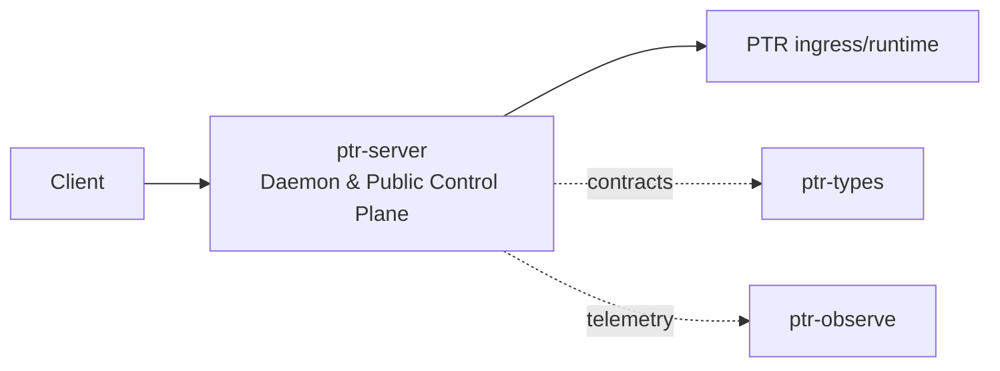

# ptr-server — Daemon & Public Control Plane

> **Role:** Exposes PTR to clients through stable APIs without leaking internal crate boundaries or provider-specific interfaces.  
> **Maturity:** architecture + contract scaffold; production behavior must be proven by the linked experiments and component evaluations.

<!-- PTR:STATUS:BEGIN -->
## Current implementation status

> **Generated section.** Source of truth: [`component.toml`](component.toml) plus code-derived metrics from `src/`. Run `python3 scripts/update_component_docs.py --write` after editing implementation metadata. Do not hand-edit inside this block.

**Maturity:** `prototype`  
**Last reviewed:** 2026-10-03  
**Code footprint:** 1 Rust source files · 432 nonblank source lines · 3 integration-test files · 11 test markers (`#[test]`, `#[tokio::test]`)

### Implemented now

- Versioned JSON ApiRequest/ApiResponse and HealthResponse contracts
- Axum router with GET /health and POST /v1/requests
- Reference runtime/backend request path returns revisioned response
- POST /v1/requests runs run_resumable_with_pods_using_router against an injected ResumableInferenceBackend, PodRouter, PodRegistry and typed-payload Verifier (router_with_dependencies, serve_with_dependencies); ServerState::new and router() keep the ReferenceEchoBackend, an empty registry and an allow-all verifier, and ApiResponse gains verified_evidence (type:length per observation)
- A mutating action returned by that run is executed once through the runtime's session path (authorize_action, register_execution_session, prepare_execution_once, execute_prepared): ApiRequest gains an optional idempotency_key that mutations require (400 without it), and ApiResponse.effect returns an EffectReceipt with the ledger indices of the EffectAttempted and EffectSettled records and the SHA-256 of the output; a repeated key replays the receipt
- Effect failures map to HTTP: a key bound to another action, a fenced runtime or an ambiguous outcome is 409, other execution errors and a missing grant are 422, and a payload that is not UTF-8 or exceeds 4 KiB is 400
- demo_effect_grants installs a single demo.local-note.create grant (Effect::Mutation, Deterministic verification) whose DemoNoteExecutor replaces effects/demo-note.txt under a data directory atomically (temporary file named from process id, clock and a counter and retried on a name collision, sync_all, rename, then a directory fsync on Unix only because a directory cannot be opened as a file on Windows, which was verified in CI rather than locally), so every distinct idempotency key can write and the latest note wins; the default state installs no grants, so effects there are refused

### Missing for the target architecture

- Streaming ModelEvent/WebSocket or SSE API
- Authentication/session/policy integration
- Readiness/admin endpoints beyond basic health
- Client backpressure and cancellation propagation

### Next milestones

- Add streaming ModelEvent SSE/WebSocket endpoint and cancellation propagation
- Replace ReferenceEchoBackend route with configured evaluated backend
- Add authentication/session/policy and concurrent client/backpressure tests

### Linked experiments

- [E001](../../experiments/system/E001-end-to-end/README.md) — `planned`
- [E003](../../experiments/system/E003-token-efficiency/README.md) — `planned`

### Technology evaluations

- None recorded.

### Decision records

- [ADR-0001-rust-runtime.md](../../research/decisions/ADR-0001-rust-runtime.md)
- [ADR-0004-backend-independence.md](../../research/decisions/ADR-0004-backend-independence.md)

### Current automated checks

- scenario_backend_executes_demo_note_once_and_replays_receipt: ScenarioBackend writes the note once, a missing idempotency key is 400, a repeated key returns the same attempt/settlement indices, and the same key with a different request is 409; distinct_idempotency_keys_each_execute_and_malformed_keys_are_rejected_up_front: a second key executes and a blank key or one with edge whitespace is 400 before the model run, judged by PtrRuntime::is_usable_execution_key, the rule prepare_execution_once itself applies (a well-formed identifier within MAX_KEY_BYTES, or a longer one an earlier build already settled), so a new over-long key is refused before inference while a retry under a long key that was settled earlier is still answered from its record. The receipt is the most recent settled attempt for the key paired with its own settlement. Whether a request ends in a mutation, and so needs a key, is only known after the model run
- durable_restart_fences_open_effect_until_explicit_reconciliation: over a durable ledger holding an unsettled EffectAttempted, the same key is 409 after reopen and succeeds only after reconcile_effect
- Axum health/request/bad-request HTTP integration tests matching TypeScript SDK contract
- public ApiRequest smoke test
- workspace fmt/check/test/clippy

<!-- PTR:STATUS:END -->

## Position in PTR

```mermaid
flowchart LR
    A["Client"] --> B["ptr-server\nDaemon & Public Control Plane"]
    B --> C["PTR ingress/runtime"]
    B -. "contracts" .-> T["ptr-types"]
    B -. "telemetry" .-> O["ptr-observe"]
```

Dedicated diagram source: [`docs/diagrams/components/ptr-server.mmd`](../../docs/diagrams/components/ptr-server.mmd)

**Upstream:** external clients  
**Downstream:** ptr-ingress, ptr-exec, ptr-observe

## Mission

Exposes PTR to clients through stable APIs without leaking internal crate boundaries or provider-specific interfaces.

PTR keeps this responsibility in its own crate so the semantics remain stable even when an external library or implementation is replaced.

## Responsibilities

- HTTP/WebSocket API
- request/session boundary
- health/readiness endpoints
- streaming response adaptation
- admin/control endpoints

## Explicit non-responsibilities

- core reasoning semantics
- search logic
- distributed consensus

## Data flow

| Direction | Contract |
|---|---|
| Input | Client requests and admin commands |
| Output | API responses and model/runtime event streams |
| Failure | Explicit typed error / rejected state; no silent fallback that changes semantics |
| Observability | Standard PTR tracing fields and a stable component span |

## Technical approach

- Axum primary server framework
- Pingora optional edge/gateway layer
- JSON public API plus binary/streaming options

External projects are **candidates**, not architectural authority. The PTR-owned traits and domain types must remain usable with a replacement backend.

## Core invariants

1. Public API versions are explicit.
2. Authentication/authorization is delegated to hard security policy.
3. Backpressure propagates to clients instead of unbounded buffering.

These invariants should be executable wherever possible through unit, property, lifecycle or chaos tests.

## Failure model

The component must fail closed for semantic or effect-safety violations. Infrastructure failures should surface as typed errors that preserve request, revision, generation and provenance context. Retries must be idempotent whenever the operation may cross a process or network boundary.

## Performance model

Measure before optimizing. Benchmarks should record at least latency distribution, throughput, allocations/resident memory, queue depth or working-set size where relevant, and the cost of verification. Performance optimizations may not bypass generation, revision, capability or evidence checks.

## Security and privacy

- Treat external inputs and backend outputs as untrusted until validated.
- Do not put raw secrets/private evidence into generic tracing or inspection.
- Preserve provenance on every promotion from raw/possible evidence to stronger semantic state.
- External effects pass through `ptr-security` even if this component already performed local validation.

## Technology evaluation

- No dedicated technology slot yet; architectural alternatives should be added to `evaluations/components/` before lock-in.

A new candidate should be added with a reproducible benchmark and failure-semantics analysis rather than replacing the default ad hoc.

## Tests required before production use

- Contract/unit tests for all domain transitions.
- Invalid, stale-generation and stale-revision cases.
- Cancellation/retry behavior.
- Property tests for invariants where practical.
- Cross-backend equivalence if more than one backend exists.
- Observability and redaction checks.

## Related architecture

- [System architecture](../../docs/architecture/00-system.md)
- [Technical architecture](../../docs/TECHNICAL_ARCHITECTURE.md)
- [Component contracts](../../docs/COMPONENT_CONTRACTS.md)
- [Global invariants](../../docs/INVARIANTS.md)

