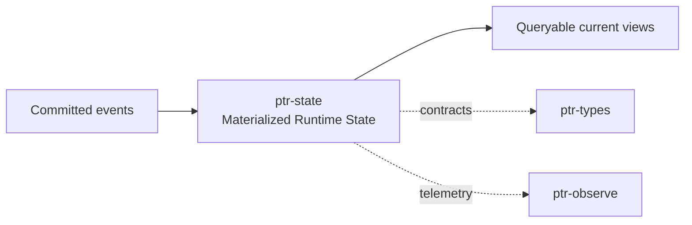

# ptr-state — Materialized Runtime State

> **Role:** Projects committed ledger events into queryable current-state views without replacing the ledger as causal authority.  
> **Maturity:** architecture + contract scaffold; production behavior must be proven by the linked experiments and component evaluations.

<!-- PTR:STATUS:BEGIN -->
## Current implementation status

> **Generated section.** Source of truth: [`component.toml`](component.toml) plus code-derived metrics from `src/`. Run `python3 scripts/update_component_docs.py --write` after editing implementation metadata. Do not hand-edit inside this block.

**Maturity:** `prototype`  
**Last reviewed:** 2026-09-25  
**Code footprint:** 1 Rust source files · 237 nonblank source lines · 3 integration-test files · 3 `#[test]` markers

### Implemented now

- Semantic transaction position and revision materialization without duplicated payload ownership
- MaterializedState reference map with last_applied commit index
- Application of Revoked and HardConstraintCommitted ledger events
- Monotonic materialization with duplicate/out-of-order/gap detection
- All current LedgerEvent variants have deterministic key/value projection semantics
- Effect records project onto the attempt's own commit index, so a settlement overwrites the attempting record's state key instead of adding a second row a reader would have to reconcile
- Feature-gated Turso 0.8.0-pre.11 backend persists atomic projection updates and last_applied state
- classify_next is the one function every backend (reference, Turso, PostgreSQL) uses to decide duplicate, out-of-order, gap or next
- projection_entries is the one event-to-entries mapping, shared by the reference, Turso and ptr-pg so no backend can project an event differently

### Missing for the target architecture

- Rebuild equivalence tests across every backend (the PostgreSQL projection is compared with the reference in ptr-pg; L004 extends it)

### Next milestones

- Add schema migration/versioning and richer typed query views beyond key/value projection
- Extend replay tests to full snapshot/rebuild equivalence
- Benchmark Turso against SQLite/redb candidates under replay and update/delete workloads

### Linked experiments

- [L001](../../experiments/lifecycle/L001-revocation-crash/README.md) — `running`
- [L002](../../experiments/lifecycle/L002-raft-recovery/README.md) — `planned`
- [E004](../../experiments/system/E004-long-horizon/README.md) — `planned`

### Technology evaluations

- [materialized-state](../../evaluations/components/materialized-state/README.md) — `open`

### Decision records

- [ADR-0002-authority-hierarchy.md](../../research/decisions/ADR-0002-authority-hierarchy.md)
- [ADR-0009-consensus-ledger-state-separation.md](../../research/decisions/ADR-0009-consensus-ledger-state-separation.md)

### Current automated checks

- replay ordering/idempotency integration test
- Turso reopen/monotonicity integration test behind turso-backend feature
- workspace fmt/check/test/clippy
- unit test that only the exact next index is applicable and every other index is classified as duplicate, out-of-order or gap
- ptr-pg postgres test replays a mixed log and compares every entry with MaterializedState

<!-- PTR:STATUS:END -->

## Position in PTR

Dedicated diagram source: [`docs/diagrams/components/ptr-state.mmd`](../../docs/diagrams/components/ptr-state.mmd)

**Upstream:** ptr-ledger  
**Downstream:** ptr-memory, ptr-search, ptr-semdb

## Mission

Projects committed ledger events into queryable current-state views without replacing the ledger as causal authority.

PTR keeps this responsibility in its own crate so the semantics remain stable even when an external library or implementation is replaced.

## Responsibilities

- materializers
- current-state schemas
- last-applied commit tracking
- rebuild/replay logic

## Explicit non-responsibilities

- causal ordering
- semantic interpretation of uncommitted data
- retrieval ranking

## Data flow

| Direction | Contract |
|---|---|
| Input | CommittedEvent stream |
| Output | Queryable materialized state |
| Failure | Explicit typed error / rejected state; no silent fallback that changes semantics |
| Observability | Standard PTR tracing fields and a stable component span |

## Technical approach

- Turso/libSQL candidate
- in-memory reference materializer
- CDC hooks for downstream projections

External projects are **candidates**, not architectural authority. The PTR-owned traits and domain types must remain usable with a replacement backend.

## Core invariants

1. Every row/view can be traced to a committed index.
2. Rebuild from ledger yields equivalent current state.
3. Materializers are idempotent across replay.

These invariants should be executable wherever possible through unit, property, lifecycle or chaos tests.

## Failure model

The component must fail closed for semantic or effect-safety violations. Infrastructure failures should surface as typed errors that preserve request, revision, generation and provenance context. Retries must be idempotent whenever the operation may cross a process or network boundary.

## Performance model

Measure before optimizing. Benchmarks should record at least latency distribution, throughput, allocations/resident memory, queue depth or working-set size where relevant, and the cost of verification. Performance optimizations may not bypass generation, revision, capability or evidence checks.

## Security and privacy

- Treat external inputs and backend outputs as untrusted until validated.
- Do not put raw secrets/private evidence into generic tracing or inspection.
- Preserve provenance on every promotion from raw/possible evidence to stronger semantic state.
- External effects pass through `ptr-security` even if this component already performed local validation.

## Technology evaluation

- [materialized-state](../../evaluations/components/materialized-state/README.md)

A new candidate should be added with a reproducible benchmark and failure-semantics analysis rather than replacing the default ad hoc.

## Tests required before production use

- Contract/unit tests for all domain transitions.
- Invalid, stale-generation and stale-revision cases.
- Cancellation/retry behavior.
- Property tests for invariants where practical.
- Cross-backend equivalence if more than one backend exists.
- Observability and redaction checks.

## Related architecture

- [System architecture](../../docs/architecture/00-system.md)
- [Technical architecture](../../docs/TECHNICAL_ARCHITECTURE.md)
- [Component contracts](../../docs/COMPONENT_CONTRACTS.md)
- [Global invariants](../../docs/INVARIANTS.md)

## P0.2 semantic journal integration

[Durable semantic-state contract](../../docs/architecture/22-durable-semantic-state.md)
records the new code/codec, ownership and replay boundaries. Publication follows
successful journal append. Typed Pod bytes and source identity participate in
semantic revisions. Logical removals do not erase log history; neural checkpoints
and authenticated framing remain separate gates. Execution evidence is in the PR.
