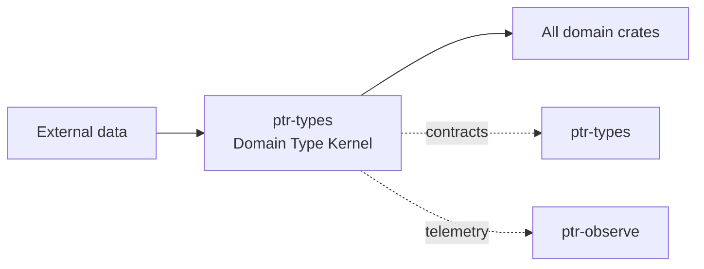

# ptr-types — Domain Type Kernel

> **Role:** Defines PTR's shared cognitive and semantic vocabulary across the neural model, reasoning/router, semantic runtime, memory, verification and action boundaries.  
> **Maturity:** architecture + contract scaffold; production behavior must be proven by the linked experiments and component evaluations.

<!-- PTR:STATUS:BEGIN -->
## Current implementation status

> **Generated section.** Source of truth: [`component.toml`](component.toml) plus code-derived metrics from `src/`. Run `python3 scripts/update_component_docs.py --write` after editing implementation metadata. Do not hand-edit inside this block.

**Maturity:** `foundation`  
**Last reviewed:** 2026-09-18  
**Code footprint:** 1 Rust source files · 188 nonblank source lines · 1 integration-test files · 5 `#[test]` markers

### Implemented now

- Shared SemanticRole taxonomy for goals, constraints, claims, evidence, resources, capabilities, relations, procedures and actions
- Shared EpistemicState and UncertaintyKind axes kept separate from semantic role
- Shared ReasoningOperator taxonomy used across neural core, model API, routing and training
- Strong Revision, Generation and CommitIndex lifecycle newtypes
- Bounded Probability type plus Effect, Validity and VerificationLevel enums
- Epistemic<T>, TypedValue<T>, provenance refs and semantic issues
- Strong identifiers for projects, capsules, artifacts, capabilities, types, Pods, candidates, requests, nodes and evidence
- Unit checks for probability bounds, lifecycle separation and independent cognitive axes

### Missing for the target architecture

- Generic semantic wrappers such as Goal<T>, Constraint<T>, Claim<T>, Evidence<T>, Relation<S,P,O>, Resource<T>, Procedure<T> and ActionIntent<T>
- Estimate/Interval/Distribution value structures and calibration metadata beyond the current axis enums
- Explicit authority/source-authority types kept separate from epistemic and verification state
- Richer provenance/source-span/transform structures
- Richer capability/resource scopes and typed effect payloads
- Serialization/redaction derives coordinated with protocol and inspection layers
- Property tests for cognitive, lifecycle and epistemic invariants

### Next milestones

- Design and evaluate the shared semantic wrapper layer before freezing Goal/Constraint/Claim/Evidence generic shapes
- Split semantic/epistemic/uncertainty/reasoning/lifecycle/provenance/ID concerns into stable modules without changing provider independence
- Make typed attention and training datasets consume the separated cognitive axes
- Add property tests and compile-fail typestate tests where appropriate
- Freeze a v0 semantic compatibility policy only after model/API/SemDB ownership is validated

### Linked experiments

- [M005](../../experiments/model/M005-epistemic-calibration/README.md) — `planned`
- [L001](../../experiments/lifecycle/L001-revocation-crash/README.md) — `running`

### Technology evaluations

- None recorded.

### Decision records

- [ADR-0001-rust-runtime.md](../../research/decisions/ADR-0001-rust-runtime.md)
- [ADR-0003-raw-and-typed.md](../../research/decisions/ADR-0003-raw-and-typed.md)

### Current automated checks

- probability_is_bounded unit test
- lifecycle_versions_are_distinct_concepts unit test
- semantic_role_and_epistemic_state_are_independent_axes unit test
- reasoning_operator_is_a_typed_cross_component_contract unit test
- workspace fmt/check/test/clippy

<!-- PTR:STATUS:END -->

## Position in PTR

Dedicated diagram source: [`docs/diagrams/components/ptr-types.mmd`](../../docs/diagrams/components/ptr-types.mmd)

**Upstream:** none  
**Downstream:** all PTR crates

## Mission

Defines the stable semantic vocabulary shared across model, runtime, storage, verification, and network boundaries.

PTR keeps this responsibility in its own crate so the semantics remain stable even when an external library or implementation is replaced.

## Responsibilities

- semantic roles shared by model, router, runtime and training
- epistemic-state and uncertainty-representation axes
- reasoning-operator identity
- Revision/Generation/lifecycle primitives
- epistemic wrappers, probabilities and verification/validity primitives
- effects, capabilities and provenance identities
- strong IDs used instead of raw strings where practical

## Explicit non-responsibilities

- I/O or persistence
- search, networking, model inference
- policy decisions that depend on runtime state

## Data flow

| Direction | Contract |
|---|---|
| Input | Domain declarations and validated primitive values |
| Output | Strongly typed values consumed by every other PTR crate |
| Failure | Explicit typed error / rejected state; no silent fallback that changes semantics |
| Observability | Standard PTR tracing fields and a stable component span |

## Technical approach

- Pure Rust cognitive/domain types with no model-framework dependency
- orthogonal semantic, epistemic, uncertainty, lifecycle and reasoning axes
- minimal dependency surface
- newtypes/enums/generic wrappers instead of unstructured maps or provider strings
- tensor/latent representations remain in ptr-core

External projects are **candidates**, not architectural authority. The PTR-owned traits and domain types must remain usable with a replacement backend.

## Core invariants

1. Revision and Generation are distinct types and never interchangeable.
2. Invalid probabilities cannot enter the domain layer.
3. Effect and capability semantics remain provider-independent.

These invariants should be executable wherever possible through unit, property, lifecycle or chaos tests.

## Failure model

The component must fail closed for semantic or effect-safety violations. Infrastructure failures should surface as typed errors that preserve request, revision, generation and provenance context. Retries must be idempotent whenever the operation may cross a process or network boundary.

## Performance model

Measure before optimizing. Benchmarks should record at least latency distribution, throughput, allocations/resident memory, queue depth or working-set size where relevant, and the cost of verification. Performance optimizations may not bypass generation, revision, capability or evidence checks.

## Security and privacy

- Treat external inputs and backend outputs as untrusted until validated.
- Do not put raw secrets/private evidence into generic tracing or inspection.
- Preserve provenance on every promotion from raw/possible evidence to stronger semantic state.
- External effects pass through `ptr-security` even if this component already performed local validation.

## Technology evaluation

- No dedicated technology slot yet; architectural alternatives should be added to `evaluations/components/` before lock-in.

A new candidate should be added with a reproducible benchmark and failure-semantics analysis rather than replacing the default ad hoc.

## Tests required before production use

- Contract/unit tests for all domain transitions.
- Invalid, stale-generation and stale-revision cases.
- Cancellation/retry behavior.
- Property tests for invariants where practical.
- Cross-backend equivalence if more than one backend exists.
- Observability and redaction checks.

## Related architecture

- [System architecture](../../docs/architecture/00-system.md)
- [Technical architecture](../../docs/TECHNICAL_ARCHITECTURE.md)
- [Component contracts](../../docs/COMPONENT_CONTRACTS.md)
- [Global invariants](../../docs/INVARIANTS.md)

