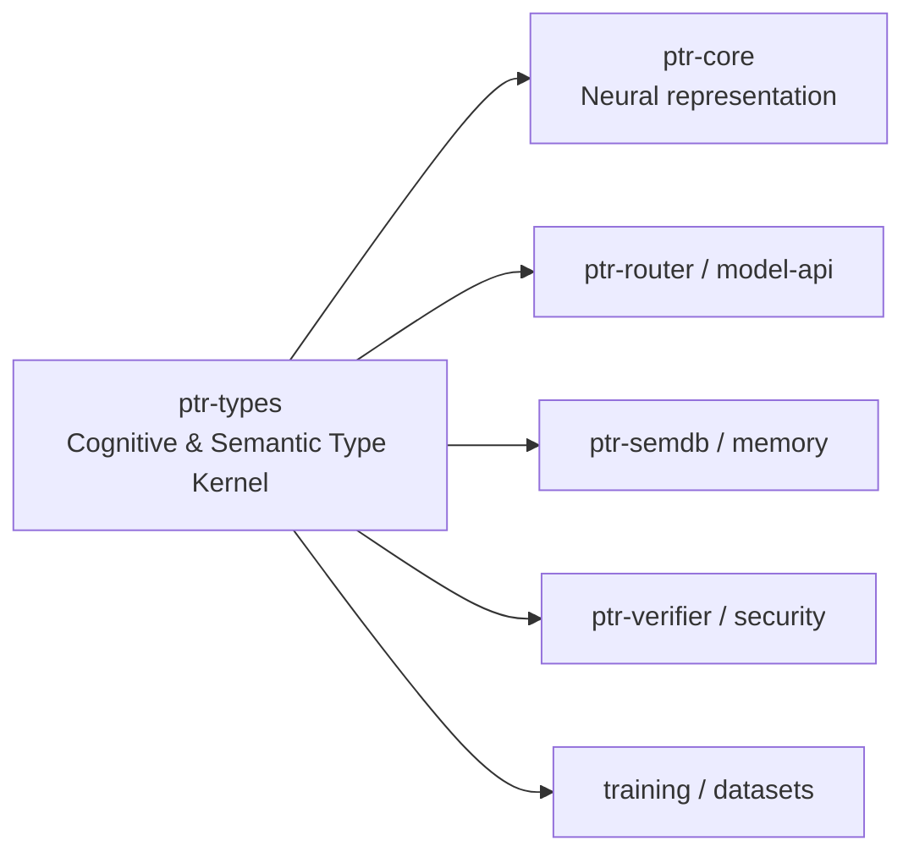

# ptr-types — Cognitive & Semantic Type Kernel

> **Role:** Defines PTR's shared cognitive and semantic vocabulary across the neural model, reasoning/router, semantic runtime, memory, verification and action boundaries.  
> **Maturity:** architecture + contract scaffold; production behavior must be proven by the linked experiments and component evaluations.

<!-- PTR:STATUS:BEGIN -->
## Current implementation status

> **Generated section.** Source of truth: [`component.toml`](component.toml) plus code-derived metrics from `src/`. Run `python3 scripts/update_component_docs.py --write` after editing implementation metadata. Do not hand-edit inside this block.

**Maturity:** `foundation`  
**Last reviewed:** 2026-09-19  
**Code footprint:** 4 Rust source files · 1170 nonblank source lines · 4 integration-test files · 32 `#[test]` markers

### Implemented now

- Versioned cognitive codebook: explicit per-version tables assign dense 0..cardinality codes to SemanticRole, EpistemicState, UncertaintyKind, ReasoningOperator and Validity, never Rust discriminants
- TypeCode is only obtainable against a named CodebookVersion; unknown versions, unassigned codes and unassigned members are three distinct refusals with no defaulting path
- canonical_bytes commits the whole assignment in code order for binding checkpoints, datasets and runs; hashing stays with the caller so this crate keeps no dependencies
- ValidityMask computed from committed lifecycle state: only Live admits, masks narrow and never widen, and attention_bias uses negative infinity so an excluded slot contributes exactly zero after a softmax
- Shared SemanticRole taxonomy for goals, constraints, claims, evidence, resources, capabilities, relations, procedures and actions
- Shared EpistemicState and UncertaintyKind axes kept separate from semantic role
- Shared ReasoningOperator taxonomy used across neural core, model API, routing and training
- Strong Revision, Generation and CommitIndex lifecycle newtypes
- Bounded Probability type plus Effect, Validity and VerificationLevel enums
- Epistemic<T>, TypedValue<T>, provenance refs and semantic issues
- Strong identifiers for projects, capsules, artifacts, capabilities, types, Pods, candidates, requests, nodes and evidence
- Unit checks for probability bounds, lifecycle separation and independent cognitive axes
- ConfidenceTarget and ConfidenceEstimate with target-checked access and diagnostic ConfidenceTargetMismatch errors
- Compile-fail documentation rejects implicit confidence-to-verification/effect conversion and unqualified estimate ordering
- Cognitive contract fixtures cover independent axes, constraints, uncertain claims, conflicting sources and revoked generations

### Missing for the target architecture

- Burn A0 still embeds a learned validity id and a research-local slot_type; applying ValidityMask and SemanticRole codes inside its tensors is a separate change outside this workspace
- Datasets, checkpoints and run manifests do not yet record CodebookVersion or a canonical_bytes fingerprint
- Generic semantic wrappers such as Goal<T>, Constraint<T>, Claim<T>, Evidence<T>, Relation<S,P,O>, Resource<T>, Procedure<T> and ActionIntent<T>
- Estimate/Interval/Distribution value structures and calibration metadata beyond the current axis enums
- Explicit authority/source-authority types kept separate from epistemic and verification state
- Richer provenance/source-span/transform structures
- Richer capability/resource scopes and typed effect payloads
- Serialization/redaction derives coordinated with protocol and inspection layers
- Property tests for cognitive, lifecycle and epistemic invariants
- Migration of existing model/slot/event confidence fields to explicit confidence targets
- Versioned cognitive codebook shared by datasets, tensors and checkpoints

### Next milestones

- Complete the cognitive contract review and first-component test gate before widening scope
- Define the minimum value structures and versioned cognitive codebook as the next component step
- Migrate model/slot/event confidence fields explicitly without guessing legacy target semantics
- Connect typed semantic observations before changing neural mechanisms or running task training

### Linked experiments

- [M005](../../experiments/model/M005-epistemic-calibration/README.md) — `planned`
- [L001](../../experiments/lifecycle/L001-revocation-crash/README.md) — `running`

### Technology evaluations

- None recorded.

### Decision records

- [ADR-0001-rust-runtime.md](../../research/decisions/ADR-0001-rust-runtime.md)
- [ADR-0003-raw-and-typed.md](../../research/decisions/ADR-0003-raw-and-typed.md)

### Current automated checks

- Every exact numeric code for all 33 members of all five families, so a reordered kernel enum breaks the build rather than a checkpoint
- Exhaustive per-family coverage; dense unique codes; unknown version, unassigned code and unassigned member each refused
- canonical_bytes decoded by an independent decoder against the exact expected assignment with every byte accounted for
- Only Live admits with every Validity decided exhaustively; masks narrow and never widen; a revoked slot keeps its codes and still cannot participate
- probability_is_bounded unit test
- lifecycle_versions_are_distinct_concepts unit test
- semantic_role_and_epistemic_state_are_independent_axes unit test
- reasoning_operator_is_a_typed_cross_component_contract unit test
- ConfidenceEstimate constructor and target-identity unit tests
- cognitive_contract integration tests including 162 independent-axis combinations
- ConfidenceEstimate compile-pass and compile-fail doctests
- workspace fmt/check/test/clippy; merge-review formatting normalization

<!-- PTR:STATUS:END -->

## Current component step

[Step 01: cognitive contract](../../docs/architecture/20-cognitive-contract-step-01.md)
defines the first bounded implementation increment and its reference cases.
ConfidenceTarget names the question; ConfidenceEstimate holds its bounded
probability; probability_for checks that a consumer asks the same question.
A role-classification score cannot silently become a truth probability.

The new API is additive. Existing SemanticSlot/ModelEvent confidence fields are
not migrated yet, no cognitive codebook is frozen, and no model-training gain is
claimed. The fixtures demonstrate representation/API contracts, not a working
conflict resolver, lifecycle engine or authorization policy.

## Position in PTR

Dedicated diagram source: [`docs/diagrams/components/ptr-types.mmd`](../../docs/diagrams/components/ptr-types.mmd)

**Upstream:** none  
**Downstream:** all PTR crates

## Mission and ownership

Define shared cognitive meanings without owning tensor layouts, I/O, inference,
persistence, search or policy decisions. SemanticRole, EpistemicState,
UncertaintyKind and ReasoningOperator describe different questions. Revision,
Generation, provenance, effects and capabilities support those meanings.
Component aggregates remain in their owning crates; provider objects never define
PTR's shared contract. The crate has no external dependencies.

## Core invariants

1. Semantic role, value type, epistemic state, uncertainty, lifecycle, verification and authority stay distinct.
2. Revision and Generation are not interchangeable.
3. Invalid probabilities cannot be constructed through Probability::new.
4. Confidence must identify its question; missing confidence is not a guessed default.
5. Neural confidence does not authorize effects or establish committed truth.

## Tests and evidence

Unit tests live beside the implementation. Public contract tests are under
`tests/cognitive_contract.rs`; reusable helpers are under `tests/common/mod.rs`.
Compile-fail doctests reject implicit authority conversions and global estimate
ordering. These are narrow API checks, not proof that every downstream consumer
already enforces the architecture. Use exact-commit CI logs as execution evidence.

Production requirements still include semantic transition/property tests, stale
revision/generation admission checks in their owners, protocol compatibility,
redaction and cross-backend equivalence where relevant. A new backend or wrapper
requires its own evaluation rather than an ad hoc compatibility assumption.

## Related architecture

- [Cognitive contract and sequential gates](../../docs/architecture/20-cognitive-contract-step-01.md)
- [Type system](../../docs/architecture/17-type-system.md)
- [Component contracts](../../docs/COMPONENT_CONTRACTS.md)
- [Global invariants](../../docs/INVARIANTS.md)
