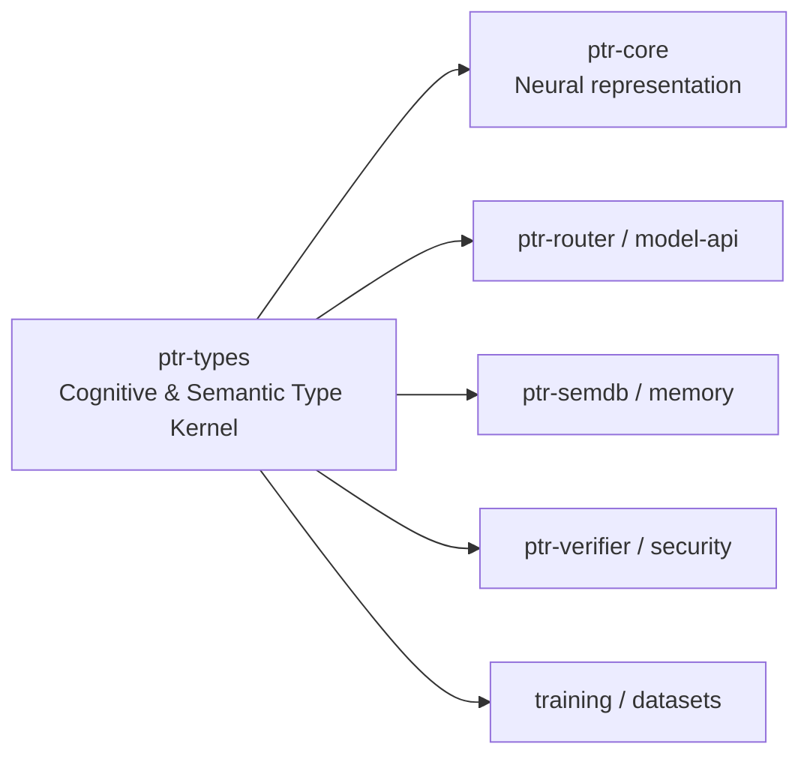

# ptr-types — Cognitive & Semantic Type Kernel

> **Role:** Defines PTR's shared cognitive and semantic vocabulary across the neural model, reasoning/router, semantic runtime, memory, verification and action boundaries.  
> **Maturity:** architecture + contract scaffold; production behavior must be proven by the linked experiments and component evaluations.

<!-- PTR:STATUS:BEGIN -->
## Current implementation status

> **Generated section.** Source of truth: [`component.toml`](component.toml) plus code-derived metrics from `src/`. Run `python3 scripts/update_component_docs.py --write` after editing implementation metadata. Do not hand-edit inside this block.

**Maturity:** `foundation`  
**Last reviewed:** 2026-09-22  
**Code footprint:** 6 Rust source files · 2146 nonblank source lines · 6 integration-test files · 68 `#[test]` markers

### Implemented now

- CheckpointHeader carries a stored model artifact's identity: magic, an explicit format version, the model name, the codebook version, the whole assignment verbatim rather than a digest, the slot-encoding version, and the table widths the weights were built for; thirteen distinct refusals with no defaulting path
- The header records the slot-encoding version because nothing else could: every other identity in it eventually shows up as a tensor shape, while an encoding produces the model's input and no parameters, so a checkpoint run under another definition has tensors that are the right shape all the way down
- CodeFamily::from_name maps a stable family name back through an explicit table in both directions, never a position in ALL, so a reordering cannot silently follow
- EXCEPTIONS records every width a model table is sized by that is deliberately not a code family, with its name, width and the reason it has no members to assign codes to; exception_width is a const fn so a consumer resolves it at compile time and a removed record fails the build rather than falling back to a literal
- A recorded exception stays outside canonical_bytes, because the fingerprint commits to an assignment of codes and an exception assigns none; adding the section left the V1 fingerprint unchanged, so no dataset, checkpoint or run manifest bound to it was invalidated
- The codebook is emitted as datasets/generated/codebook.json by a ptr-types example, so anything outside Rust reads the kernel tables instead of retyping them; a test asserts the committed artifact still carries the canonical bytes this kernel produces
- ValidityMask and the codebook are consumed by the isolated Burn A0 workspace, which depends on this crate directly: A0 applies attention_bias rather than a learned validity embedding, so lifecycle validity is enforced there by construction instead of weighed, and its slot-type, epistemic and router widths are the codebook's cardinalities rather than caller arguments
- Rustdoc covers the codebook and validity-mask APIs, stable diagnostic codes and canonical assignment encoder helpers
- SlotEncoding turns a committed semantic value into the vector a model reads in a slot, versioned like the codebook because weights trained on one definition are fed a differently shaped input by another; SlotVector is only obtainable from it, so the one input to A0 that was a bare tensor now has the provenance every other input already had
- The encoding is specified in full here rather than borrowed: this crate has no dependencies and therefore no hash, and the definition has to be byte-identical in the PTR workspace and the isolated model workspace for as long as any checkpoint trained under it exists, which a third party's version pin cannot promise
- The V1 output values are pinned by a test, so a change to the mixing arithmetic breaks a build rather than a checkpoint somebody loads a year later — the rule codes already follow
- A slot vector is bounded and of unit L2 norm, because it is summed into the same space as the learned metadata embeddings and unbounded values would swamp them
- The encoding commits to identity and not to similarity, stated in the module's first paragraph: two payloads that mean nearly the same thing get unrelated vectors, and making nearby meanings land near each other is a learned encoder and an open decision
- Versioned cognitive codebook: explicit per-version tables assign dense 0..cardinality codes to SemanticRole, EpistemicState, UncertaintyKind, ReasoningOperator and Validity, never Rust discriminants
- TypeCode is only obtainable against a named CodebookVersion; unknown versions, unassigned codes and unassigned members are three distinct refusals with no defaulting path
- canonical_bytes commits the whole assignment in code order for binding checkpoints, datasets and runs; hashing stays with the caller so this crate keeps no dependencies
- ValidityMask computed from committed lifecycle state: only Live admits, masks narrow and never widen, and attention_bias uses negative infinity so an excluded slot contributes exactly zero after a softmax
- Shared SemanticRole taxonomy for goals, constraints, claims, evidence, resources, capabilities, relations, procedures and actions
- Shared EpistemicState and UncertaintyKind axes kept separate from semantic role
- Shared ReasoningOperator taxonomy used across neural core, model API, routing and training
- Strong Revision, Generation and CommitIndex lifecycle newtypes
- Bounded Probability type plus Effect, Validity and VerificationLevel enums
- Epistemic<T>, TypedValue<T>, provenance refs and semantic issues
- Strong identifiers for projects, capsules, artifacts, capabilities, types, Pods, candidates, requests, nodes and evidence
- Unit checks for probability bounds, lifecycle separation and independent cognitive axes
- checkpoint format 2 carries the slot-encoding version, a format-1 header is refused rather than read with its table count taken as an encoding, and a header recording another encoding is refused with the intact header as the control
- Slot-encoding checks: the V1 values pinned exactly, the same payload stable, one-byte differences separated, the type part of the payload with the type-length collision covered, every vector finite bounded and of unit norm, every position a different function of the payload, the domain separated from the undomained arithmetic by a helper that first proves it reproduces the real function, and a zero width, an over-wide width, an over-large payload and an unknown version each refused rather than clamped or truncated
- ConfidenceTarget and ConfidenceEstimate with target-checked access and diagnostic ConfidenceTargetMismatch errors
- Compile-fail documentation rejects implicit confidence-to-verification/effect conversion and unqualified estimate ordering
- Cognitive contract fixtures cover independent axes, constraints, uncertain claims, conflicting sources and revoked generations

### Missing for the target architecture

- A training loop that binds a checkpoint as part of saving it: the header carries the assignment, but attaching committed facts is a separate step a runtime performs afterwards
- A second codebook version, so the version comparison a foreign CodeGrid trips is exercised by a real artifact rather than by a test-only relabel; with one frozen version Codebook::at refuses every other and no genuine foreign grid exists
- Generic semantic wrappers such as Goal<T>, Constraint<T>, Claim<T>, Evidence<T>, Relation<S,P,O>, Resource<T>, Procedure<T> and ActionIntent<T>
- Estimate/Interval/Distribution value structures and calibration metadata beyond the current axis enums
- Explicit authority/source-authority types kept separate from epistemic and verification state
- Richer provenance/source-span/transform structures
- Richer capability/resource scopes and typed effect payloads
- Serialization/redaction derives coordinated with protocol and inspection layers
- Property tests for cognitive, lifecycle and epistemic invariants
- Migration of existing model/slot/event confidence fields to explicit confidence targets

### Next milestones

- Complete the cognitive contract review and first-component test gate before widening scope
- Define the minimum value structures as the next component step
- Migrate model/slot/event confidence fields explicitly without guessing legacy target semantics
- Connect typed semantic observations before changing neural mechanisms or running task training

### Linked experiments

- [M005](../../experiments/model/M005-epistemic-calibration/README.md) — `planned`
- [L001](../../experiments/lifecycle/L001-revocation-crash/README.md) — `running`

### Technology evaluations

- None recorded.

### Decision records

- [ADR-0001-rust-runtime.md](../../research/decisions/ADR-0001-rust-runtime.md)
- [ADR-0003-raw-and-typed.md](../../research/decisions/ADR-0003-raw-and-typed.md)

### Current automated checks

- A checkpoint header round-trips with its payload; every prefix of one is refused; trailing bytes, a short payload, an unknown format, an unknown or duplicated family name and a non-UTF-8 field are each refused with their own code
- An assignment moved at the very same codebook version is refused, with the intact header passing as the control; a table width that is not its family's cardinality is refused in both directions
- Every family name maps back to its own family and five near-miss spellings map to none
- the generated codebook artifact carries this kernel's canonical bytes and every family member; a changed byte and a removed member each fail it
- The artifact carries every recorded exception with its width, checked in both directions so one added in Rust and not regenerated fails, and one the artifact carries and the kernel has dropped fails on the count; an exception name inside the canonical bytes, or shared with a family, is refused
- exception_width answers by name and returns None rather than a default for a name it does not record, so a misspelling yields nothing instead of a plausible number
- Both codebook-version guards in A0's forward are entered from a cfg(test) module that relabels a well-formed grid as version 2, each asserted on its guard's full message because the two share a phrase, with matching versions as the control; removing either guard fails exactly the test aimed at it
- Every exact numeric code for all 33 members of all five families, so a reordered kernel enum breaks the build rather than a checkpoint
- Exhaustive per-family coverage; dense unique codes; unknown version, unassigned code and unassigned member each refused
- canonical_bytes decoded by an independent decoder against the exact expected assignment with every byte accounted for
- Only Live admits with every Validity decided exhaustively; masks narrow and never widen; a revoked slot keeps its codes and still cannot participate
- probability_is_bounded unit test
- lifecycle_versions_are_distinct_concepts unit test
- semantic_role_and_epistemic_state_are_independent_axes unit test
- reasoning_operator_is_a_typed_cross_component_contract unit test
- ConfidenceEstimate constructor and target-identity unit tests
- cognitive_contract integration tests including 162 independent-axis combinations
- ConfidenceEstimate compile-pass and compile-fail doctests
- workspace fmt/check/test/clippy; merge-review formatting normalization

<!-- PTR:STATUS:END -->

## Current component step

[Step 01: cognitive contract](../../docs/architecture/20-cognitive-contract-step-01.md)
defines the first bounded implementation increment and its reference cases.
ConfidenceTarget names the question; ConfidenceEstimate holds its bounded
probability; probability_for checks that a consumer asks the same question.
A role-classification score cannot silently become a truth probability.

The new API is additive. Existing SemanticSlot/ModelEvent confidence fields are
not migrated yet, no cognitive codebook is frozen, and no model-training gain is
claimed. The fixtures demonstrate representation/API contracts, not a working
conflict resolver, lifecycle engine or authorization policy.

## Position in PTR

Dedicated diagram source: [`docs/diagrams/components/ptr-types.mmd`](../../docs/diagrams/components/ptr-types.mmd)

**Upstream:** none  
**Downstream:** all PTR crates

## Mission and ownership

Define shared cognitive meanings without owning tensor layouts, I/O, inference,
persistence, search or policy decisions. SemanticRole, EpistemicState,
UncertaintyKind and ReasoningOperator describe different questions. Revision,
Generation, provenance, effects and capabilities support those meanings.
Component aggregates remain in their owning crates; provider objects never define
PTR's shared contract. The crate has no external dependencies.

## Core invariants

1. Semantic role, value type, epistemic state, uncertainty, lifecycle, verification and authority stay distinct.
2. Revision and Generation are not interchangeable.
3. Invalid probabilities cannot be constructed through Probability::new.
4. Confidence must identify its question; missing confidence is not a guessed default.
5. Neural confidence does not authorize effects or establish committed truth.

## Tests and evidence

Unit tests live beside the implementation. Public contract tests are under
`tests/cognitive_contract.rs`; reusable helpers are under `tests/common/mod.rs`.
Compile-fail doctests reject implicit authority conversions and global estimate
ordering. These are narrow API checks, not proof that every downstream consumer
already enforces the architecture. Use exact-commit CI logs as execution evidence.

Production requirements still include semantic transition/property tests, stale
revision/generation admission checks in their owners, protocol compatibility,
redaction and cross-backend equivalence where relevant. A new backend or wrapper
requires its own evaluation rather than an ad hoc compatibility assumption.

## Related architecture

- [Cognitive contract and sequential gates](../../docs/architecture/20-cognitive-contract-step-01.md)
- [Type system](../../docs/architecture/17-type-system.md)
- [Component contracts](../../docs/COMPONENT_CONTRACTS.md)
- [Global invariants](../../docs/INVARIANTS.md)
