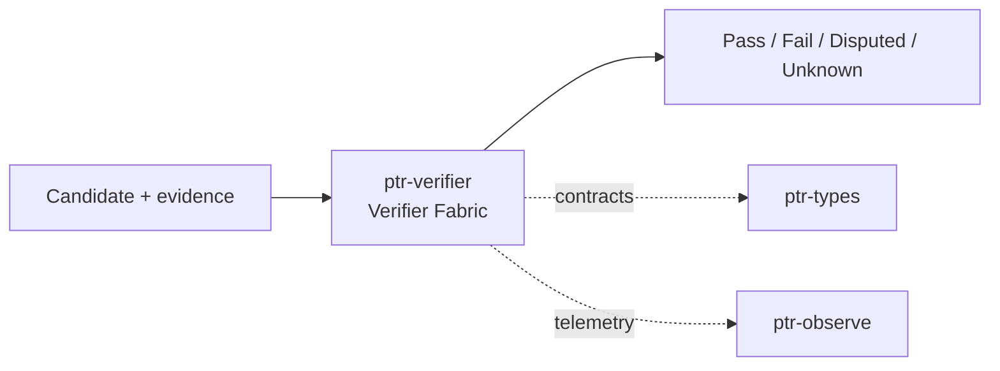

# ptr-verifier — Verifier Fabric

> **Role:** Combines deterministic, executable, statistical and learned checks into explicit verification reports.  
> **Maturity:** architecture + contract scaffold; production behavior must be proven by the linked experiments and component evaluations.

<!-- PTR:STATUS:BEGIN -->
## Current implementation status

> **Generated section.** Source of truth: [`component.toml`](component.toml) plus code-derived metrics from `src/`. Run `python3 scripts/update_component_docs.py --write` after editing implementation metadata. Do not hand-edit inside this block.

**Maturity:** `scaffold`  
**Last reviewed:** 2026-09-18  
**Code footprint:** 1 Rust source files · 24 nonblank source lines · 0 `#[test]` markers

### Implemented now

- Pass/Fail/Disputed/Unknown statuses
- Finding and VerificationReport with level/score/findings
- Generic Verifier<T> contract

### Missing for the target architecture

- Verifier fabric/aggregation and precedence rules
- Type/capability/revision/generation deterministic verifiers
- Source/evidence promotion verifier
- Compiler/test/GritQL/Sentrux adapters
- Calibration/statistical and learned semantic verifiers

### Next milestones

- Implement deterministic hard-boundary verifier set
- Add report aggregation where deterministic contradiction dominates learned scores
- Connect verifier output to F001 repair loop

### Linked experiments

- [F001](../../experiments/feedback/F001-generate-verify-repair/README.md) — `planned`
- [Q002](../../experiments/retrieval/Q002-evidence-promotion/README.md) — `planned`
- [E001](../../experiments/system/E001-end-to-end/README.md) — `planned`

### Technology evaluations

- [code-quality-verifier](../../evaluations/components/code-quality-verifier/README.md) — `open`

### Decision records

- [ADR-0002-authority-hierarchy.md](../../research/decisions/ADR-0002-authority-hierarchy.md)
- [ADR-0012-hard-effect-boundary.md](../../research/decisions/ADR-0012-hard-effect-boundary.md)

### Current automated checks

- workspace fmt/check/test/clippy

<!-- PTR:STATUS:END -->

## Position in PTR

Dedicated diagram source: [`docs/diagrams/components/ptr-verifier.mmd`](../../docs/diagrams/components/ptr-verifier.mmd)

**Upstream:** ptr-feedback, ptr-pods, ptr-search  
**Downstream:** ptr-semdb, ptr-security, ptr-ledger

## Mission

Combines deterministic, executable, statistical and learned checks into explicit verification reports.

PTR keeps this responsibility in its own crate so the semantics remain stable even when an external library or implementation is replaced.

## Responsibilities

- verifier composition
- verification levels
- findings and evidence
- action validation hooks
- semantic and probabilistic checks

## Explicit non-responsibilities

- candidate generation
- state persistence
- search indexing

## Data flow

| Direction | Contract |
|---|---|
| Input | Candidate<T>, evidence, action, source or execution result |
| Output | VerificationReport with status, level, confidence and findings |
| Failure | Explicit typed error / rejected state; no silent fallback that changes semantics |
| Observability | Standard PTR tracing fields and a stable component span |

## Technical approach

- Compiler/tests/GritQL/Sentrux-style executable checks
- source evidence verification
- calibration checks
- learned semantic verifier only when deterministic checks are insufficient

External projects are **candidates**, not architectural authority. The PTR-owned traits and domain types must remain usable with a replacement backend.

## Core invariants

1. Deterministic contradictions dominate learned approval.
2. Unknown is a valid outcome.
3. Verifier confidence is not silently converted to hard truth.

These invariants should be executable wherever possible through unit, property, lifecycle or chaos tests.

## Failure model

The component must fail closed for semantic or effect-safety violations. Infrastructure failures should surface as typed errors that preserve request, revision, generation and provenance context. Retries must be idempotent whenever the operation may cross a process or network boundary.

## Performance model

Measure before optimizing. Benchmarks should record at least latency distribution, throughput, allocations/resident memory, queue depth or working-set size where relevant, and the cost of verification. Performance optimizations may not bypass generation, revision, capability or evidence checks.

## Security and privacy

- Treat external inputs and backend outputs as untrusted until validated.
- Do not put raw secrets/private evidence into generic tracing or inspection.
- Preserve provenance on every promotion from raw/possible evidence to stronger semantic state.
- External effects pass through `ptr-security` even if this component already performed local validation.

## Technology evaluation

- [code-quality-verifier](../../evaluations/components/code-quality-verifier/README.md)

A new candidate should be added with a reproducible benchmark and failure-semantics analysis rather than replacing the default ad hoc.

## Tests required before production use

- Contract/unit tests for all domain transitions.
- Invalid, stale-generation and stale-revision cases.
- Cancellation/retry behavior.
- Property tests for invariants where practical.
- Cross-backend equivalence if more than one backend exists.
- Observability and redaction checks.

## Related architecture

- [System architecture](../../docs/architecture/00-system.md)
- [Technical architecture](../../docs/TECHNICAL_ARCHITECTURE.md)
- [Component contracts](../../docs/COMPONENT_CONTRACTS.md)
- [Global invariants](../../docs/INVARIANTS.md)

