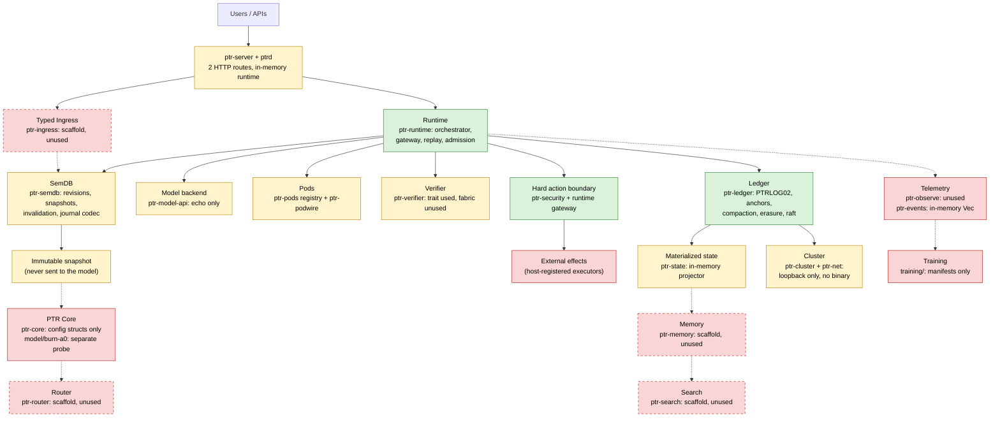
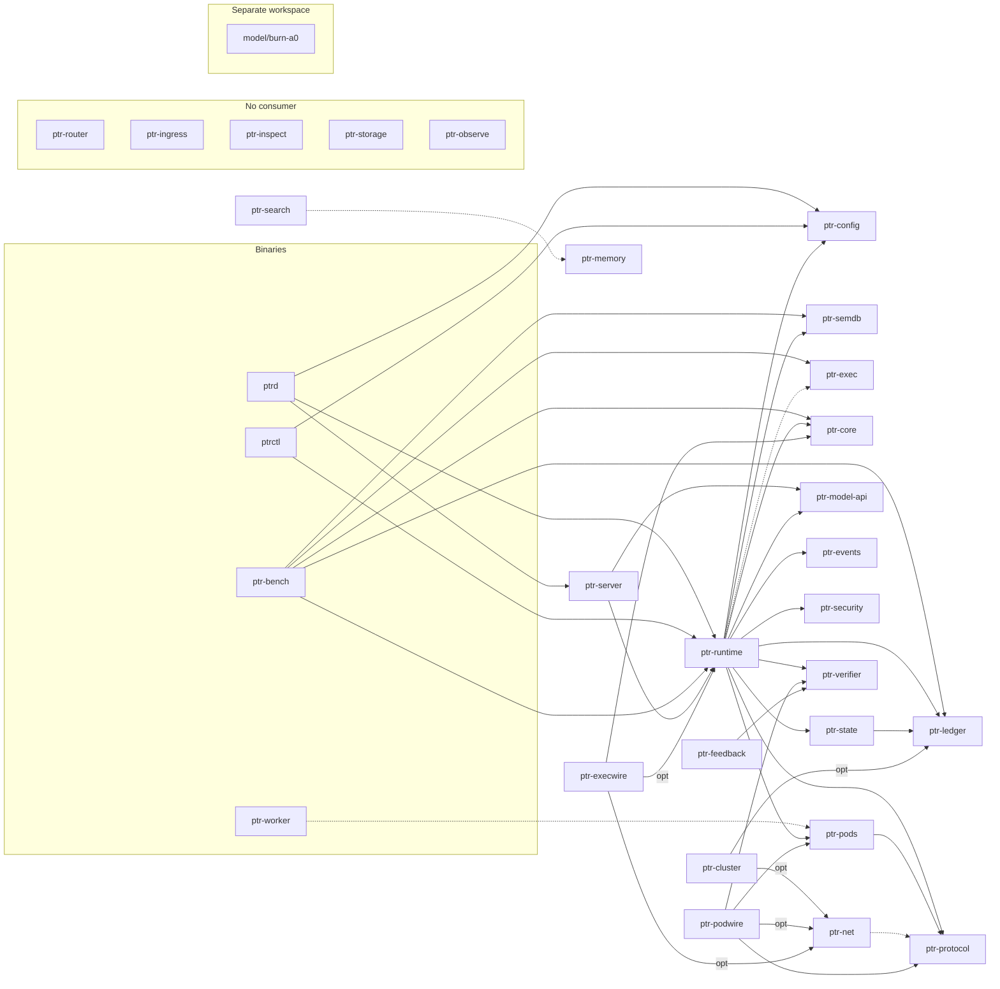

# PTR project map (2026-09-24)

This is a map of the whole repository for someone who has not seen it before. It
says what each part is, where it lives, how the parts connect, and — most
importantly — **what is actually built and tested versus what is only described**.
The repository's own documentation mostly describes the *target* architecture;
this document describes the *current* one.

How it was made (details in [§16](#16-how-this-map-was-made-and-its-limits)): ten
parallel readers mapped every area of the tree at `e93ed99`, an independent
verifier re-checked each map against the code, a completeness critic looked for
unmapped areas and questions, and every CI test suite was run locally. Numbers
marked *static* are counted in source; numbers marked *run* were executed.

The companion document [`RECOMMENDATIONS_20260924.md`](RECOMMENDATIONS_20260924.md)
turns this map into an ordered plan.

**Since this map was taken.** The map describes `e93ed99`. The same branch then fixed
several of the defects it records (recommendations 3.1, 3.4, 4.1–4.4, 4.8, 4.9,
4.11, 4.12, 4.14 and 4.18). Each statement those fixes made historical is marked
*Fixed on this branch* where it appears; the figures around it are still those of
`e93ed99`. It also carried out recommendations 1.1 and 1.3–1.5, and 1.2 in part
(on a new synthetic benchmark, operator-routing v1, and not on the two imported
bundles), as a preregistered A0 mechanism ablation study; the statements
that study changed are marked *Since this map* (results:
[`RESULTS.md`](../research/falsification/A0-ablations-v1/RESULTS.md), A0-internal
evidence only).

## Contents

1. [What PTR is, and what it is today](#1-what-ptr-is-and-what-it-is-today)
2. [The repository at a glance](#2-the-repository-at-a-glance)
3. [Architecture: target versus built](#3-architecture-target-versus-built)
4. [Crate dependency graph](#4-crate-dependency-graph)
5. [Every crate and binary](#5-every-crate-and-binary)
6. [How a request actually flows](#6-how-a-request-actually-flows)
7. [The authority and persistence layer](#7-the-authority-and-persistence-layer)
8. [Networks, wires and the cluster](#8-networks-wires-and-the-cluster)
9. [Model, training and data](#9-model-training-and-data)
10. [Binary formats and protocol identifiers](#10-binary-formats-and-protocol-identifiers)
11. [Global invariants: where each one is enforced](#11-global-invariants-where-each-one-is-enforced)
12. [Architecture documents 00–34 and their real status](#12-architecture-documents-0034-and-their-real-status)
13. [Research apparatus](#13-research-apparatus)
14. [Engineering infrastructure and how to run CI locally](#14-engineering-infrastructure-and-how-to-run-ci-locally)
15. [History, plans and naming schemes](#15-history-plans-and-naming-schemes)
16. [How this map was made, and its limits](#16-how-this-map-was-made-and-its-limits)
17. [Glossary](#17-glossary)
18. [Where to start reading](#18-where-to-start-reading)

---

## 1. What PTR is, and what it is today

**The thesis** (`README.md:32-34`). PTR — *Probabilistically Typed Reasoning* — is a
research-first Rust monorepo for a typed cognitive runtime and model architecture.
It keeps raw language and typed semantics side by side, reasons over a
probabilistically typed latent workspace, routes tasks to the best reasoning
operator or specialist **Pod**, and allows external effects only after a **hard
typed action boundary**. Nine principles support this (`README.md:38-46`):

1. Hard shell, soft core — reasoning may be uncertain; effects require hard validity.
2. Raw is never replaced by typed.
3. Revision is not Generation (world state versus object lifecycle).
4. Search is derived: retrieval produces evidence candidates, not truth.
5. Committed causal state is authoritative.
6. Pods expose semantic contracts, not fragile tool names.
7. Backends are replaceable behind PTR-owned interfaces.
8. Unknown is a valid state.
9. Every architecture claim must be falsifiable through baselines and ablations.

**Where it stands today.**

- The **hard shell** is real and heavily tested:
  - a hash-chained, anchored, compactable ledger;
  - a scoped, verifier-bound execution gateway with a durable audit;
  - semantic replay and snapshots;
  - neural-checkpoint admission;
  - three authenticated network wires (on loopback).
- The **soft core** — the part that carries the thesis — is mostly scaffold:
  - the only model backend echoes its input;
  - the only neural code, `model/burn-a0`, is a single-layer probe that no runtime
    path reaches;
  - 8 of 27 crates have no consumer;
  - no model has been trained, and 20 of 21 experiments are `planned`.
- The one executable daemon, `ptrd`, serves two HTTP routes from an in-memory
  runtime.

Measured on source (`crates/`, non-blank lines under `src/`): **17,325 lines**.
About **73%** (12,707) is in the ledger, runtime, state and wire crates. The ten
cognitive crates hold about **8%** (1,397).

---

## 2. The repository at a glance

| Path | What it is | Size | Real state |
|---|---|---|---|
| `crates/` | 27 Rust library crates (the main workspace) | 17,325 src lines; 485 tests *static* | Authority, durability and wires real; cognitive layer mostly scaffold (§5) |
| `bins/` | `ptrd` daemon, `ptrctl` CLI, `ptr-bench`, `ptr-worker` | 671 src lines; 10 tests | `ptrctl` and `ptr-bench` real; `ptrd` thin; `ptr-worker` is a 3-line stub |
| `model/` | `burn-a0` (separate Cargo workspace), configs, MOD-001..012 hypothesis docs, empty `reference_torch/`, `kernels/`, `artifacts/`, `checkpoints/` | burn-a0 ≈2.5k lines; 43 tests *run* | A0 probe real; everything else is specification or placeholder (§9) |
| `training/` | Python package `ptr_training`, run/stage configs, track directories | ≈600 lines; 32 tests *run* | Manifests, provenance and seal checks only; **no training code** |
| `datasets/` | registry (4 entries), cards, JSON schemas, 2 zip bundles, samples, `generated/codebook.json` | 2 bundles ≈1.2 MB | 2 bundles imported and hash-checked; 2 entries planned with no artifact |
| `experiments/` | 21 experiment manifests (+ results for L001, M001 pilot) | | 20 `planned`, 1 `running` (L001) |
| `evaluations/` | 27 technology slots, 81 candidates | | 7 `evaluating`, 74 `to-evaluate`; no two candidates ever compared |
| `benchmarks/` | 10 suites | 165 lines | Metric-name lists only; no data, scorer or harness |
| `research/` | 15 ADRs, falsification, novelty claims, 3 baselines, 4 catalogs | | 14 ADRs Accepted, 1 Proposed; prior-art matrix empty |
| `integrations/` | 17 categories, 36 technology docs | | 33 are identical 6-line stubs; no adapter code lives here |
| `docs/` | 35 architecture docs, governance docs, 12 system diagrams + 27 crate diagrams, component status | 106 files | Docs 21–34 are contracts backed by code; 00–19 are target designs (§12) |
| `proto/` | 4 `.proto` schemas | 50 lines | Compiled by `ptr-protocol`; nothing speaks them on a wire |
| `sdk/` | JavaScript client with hand-written TypeScript types | 74 lines; 2 tests | Matches the two HTTP routes |
| `docs-site/` | single static landing page | | Not published |
| `scripts/` | 30 Python/shell tools, 15 of them CI gates | ≈4.1k lines; 201 tests *run* | Real and enforced |
| `.github/` | 6 workflows (13 jobs in `ci.yml`), templates, branch-protection template. *This branch removes `one-shot-sync.yml`, leaving 5.* | | Real (§14) |
| `vendor/` | 21 vendored, patched crates + origin/retirement records | ≈520k lines | Patched copies (18 `paste`→`pastey` aliases, 3 raft protobuf migrations) |
| `fuzz/` | 1 fuzz target (separate workspace) | | Targets an unused decoder; not built in CI |
| `hardware/` | 4 hardware profiles | | `default.toml` (used by 20 experiments) is all `unspecified` |
| `release/`, `docker/`, `.devcontainer/`, `tooling/`, `templates/` | release config, dev image, dev container, optional Emacs layer, crate template | | Template real (19 tests); `release/release.toml` read by nothing |

Every directory with a `config.toml` is a "workspace area" and must have a `tests/`
directory (`scripts/check_repo.py`). A `tests/README.md` there is **not** evidence
of implementation; many contain only a placeholder.

---

## 3. Architecture: target versus built

The target architecture (`README.md:7-30`) with each box coloured by what exists.
Green: implemented and tested. Yellow: partial. Red: scaffold or document only.
Dashed border: the crate exists but nothing uses it.



**The three places where the target and the code diverge most:**

1. **Nothing connects the model to typed state (open item C1/G1).**
   `ModelRequest` carries only `{request_id, revision, raw_text}`
   (`crates/ptr-model-api/src/request.rs:4-8`), so no snapshot content ever reaches
   a backend. A0 can consume committed slot payloads
   (`model/burn-a0/tests/semantic_payload.rs`), but no runtime path calls A0.
2. **The model cannot propose actions.** `ModelEvent::ActionReady` carries only
   `operation: String` (`crates/ptr-model-api/src/event.rs:26-28`). The runtime acts
   only on `PodRequested` and `Finished` (`crates/ptr-runtime/src/lib.rs:293-301`).
   The execution gateway only ever receives an `ActionIr` built by host code.
3. **The runtime is not the isolate/mailbox system ADR-0006 describes.** It is one
   synchronous `&mut self` object (`crates/ptr-runtime/src/lib.rs:144-156`). Both
   network hosts wrap it in a single `Mutex`
   (`crates/ptr-server/src/lib.rs:35`, `crates/ptr-execwire/src/endpoint.rs:181`).
   `ptr-runtime` lists `ptr-exec` as a dependency and never imports it.

---

## 4. Crate dependency graph

Normal (non-dev) dependencies from `cargo metadata`. Every crate except
`ptr-config` also depends on `ptr-types`; those edges are omitted. Dotted edges are
declared in `Cargo.toml` but never used in source. `(opt)` edges exist only behind
a feature flag.



- **No consumer at all** (a grep for `<crate>::` outside the crate finds nothing):
  `ptr-router`, `ptr-ingress`, `ptr-inspect`, `ptr-storage`, `ptr-observe`,
  `ptr-memory`, `ptr-search`, `ptr-feedback`.
- **Used only by tests:** `ptr-cluster`, `ptr-execwire` and `ptr-podwire`. They are
  complete compositions that no binary deploys.
- `model/burn-a0` depends only on `ptr-types`, by path. It is outside the root
  workspace and has its own toolchain requirement (Rust 1.95).

---

## 5. Every crate and binary

*Lines* are non-blank lines under `src/`. *Tests (static)* counts `#[test]` and
`#[tokio::test]` in `src/` and `tests/`. *Tests (run)* is what passed on
2026-09-24: first with default features, then in brackets with the crate's feature
on. *Declared* is `maturity` in the crate's `component.toml`. *Verified* is the
maturity this mapping found. *Used by* lists crates that actually import it.

### 5.1 Foundation and configuration

| Crate | Lines | Tests static / run | Declared → Verified | Used by | What it really contains |
|---|---|---|---|---|---|
| `ptr-types` | 2,146 | 68 / 73 (incl. 5 doctests) | foundation → **implemented** | 23 packages + burn-a0 | IDs; `Revision`/`Generation`/`CommitIndex`; bounded `Probability`; the four cognitive axes (`SemanticRole` 9, `EpistemicState` 6, `UncertaintyKind` 3, `ReasoningOperator` 11); `Effect`, `Validity`, `VerificationLevel`; `ConfidenceTarget`/`ConfidenceEstimate`; frozen **Codebook V1** (33 members, 5 families); `ValidityMask`; `SlotEncoding` (an identity hash, not a semantic embedding); `CheckpointHeader` v2 with 13 refusal codes. The confidence API, `Epistemic<T>` and `TypedValue<T>` have no consumer outside the crate. |
| `ptr-config` | 264 | 6 / 6 | prototype → **partial** | runtime, ptrd, ptrctl, bench | TOML config with defaults → file → env → CLI precedence (the order lives in `ptrd`'s `main`). 13 keys; only `server.bind` changes `ptrd`'s behaviour. The 3 `action_boundary.*` flags affect only the diagnostic `authorize_action`. The other 9 are parsed and read by nothing. |
| `ptr-inspect` | 23 | 1 / 1 | scaffold → **scaffold** | none | `InspectNode`, `Inspectable`, `Secret<T>`. `Secret<T>` derives `Debug` with a public field, so `{:?}` prints the secret (`src/lib.rs:19-20`). *Fixed on this branch.* `Debug` prints `Secret([redacted])` and the field is private. |

### 5.2 Authority, persistence and state

| Crate | Lines | Tests static / run | Declared → Verified | Used by | What it really contains |
|---|---|---|---|---|---|
| `ptr-ledger` | 4,479 | 104 / 62 (+37 in CI jobs, +6 `raft_fence` run by no CI job; *in CI from this branch*) | prototype → **implemented** | runtime, state, cluster, bench | `LedgerEvent` (12 tagged variants) and codec; `InMemoryLedger`; `FileLedger` with PTRLOG02 hash-chained framing, strict open, failpoints; HMAC anchors (`PTRANC01`) and `AcknowledgedLedger`; compaction cutover; erasure audit; feature-gated raft-rs group on PTR's own `FileRaftStorage` (fencing token, snapshot transfer, one-voter membership changes); a standalone raft-engine adapter. The runtime uses only `InMemoryLedger` and `FileLedger`. Anchors, compaction and erasure run only in ledger tests. |
| `ptr-state` | 211 | 3 / 2 (+1 Turso) | prototype → **partial** | runtime | Monotonic key/value projector (`try_apply` rejects duplicate, gap, out-of-order). The runtime calls `apply`, which discards those outcomes (`src/lib.rs:38-40`). Feature-gated Turso backend (pre-release pin) not wired into the runtime. |
| `ptr-storage` | 23 | 1 / 1 | scaffold → **scaffold** | none | An in-memory map keyed by a caller-supplied id. No hashing, no content addressing. |

### 5.3 Runtime and execution

| Crate | Lines | Tests static / run | Declared → Verified | Used by | What it really contains |
|---|---|---|---|---|---|
| `ptr-runtime` | 4,053 | 149 / 153 | prototype → **implemented machinery, partial request path** | server, execwire, ptrctl, ptrd, bench | The orchestrator. **Real:** journaled semantic transactions and replay; the scoped execution gateway (host-issued sessions, exact grants, single-use permits, registered verifier/executor, durable `EffectAttempted`/`EffectSettled` audit, fence, at-most-once keys, detached dispatch, peer admission); neural/KV/checkpoint admission (`PTRNEU01`); recovery snapshots (`PTRSN001`); compacted snapshots (`PTRCS002`). **Thin:** the model loop (echo only in production; the Pod and resume loops are reachable only from tests). |
| `ptr-exec` | 46 | 1 / 1 | prototype → **scaffold** | bench only | A sync-channel `Mailbox`, an `Isolate` trait with no implementors, a `ReplayTrace`. The runtime does not import it. |
| `ptr-events` | 16 | 1 / 1 | scaffold → **scaffold** | runtime | A `RuntimeEvent` enum and envelope. The runtime appends to an unbounded in-memory `Vec` that nothing consumes. |
| `ptr-security` | 126 | 8 / 8 | prototype → **partial** | runtime | One pure function, `PermissionSet::authorize`: revision, then generation, then capability, then effect permission. Mandatory for Mutation/External/Irreversible. Returns Allow (diagnostic receipt, discarded by every caller) or a typed Deny. No principal, session, secret or sandbox model. |

### 5.4 Cognitive layer

| Crate | Lines | Tests static / run | Declared → Verified | Used by | What it really contains |
|---|---|---|---|---|---|
| `ptr-semdb` | 617 | 24 / 24 | prototype → **partial** (core implemented) | runtime, bench | Revisioned `String → SemanticValue` state; all-or-nothing prepare/apply deltas; immutable `Arc` snapshots with staleness checks; cycle and missing-input checks; transitive **eviction** (not recomputation) of derived values; the canonical `PTRSD001` delta codec (also used for the ledger journal, compacted snapshots and neural binding). No query engine, cache, cancellation or structural sharing: every snapshot clones the state. |
| `ptr-pods` | 144 | 6 / 7 | prototype → **partial** | runtime, podwire | `PodManifest`, a project-scoped `PodRegistry` (first match on capability and input type), a Ready/Revoked lease typestate. The runtime never uses the lease; the Pure/Read effect gate lives in the runtime and in podwire. |
| `ptr-verifier` | 98 | 2 / 2 | scaffold → **partial** | runtime, podwire, feedback | The `Verifier<T>` trait (used) and a `VerifierFabric` (worst status wins; used only in its own tests). |
| `ptr-model-api` | 83 | 3 / 3 | scaffold → **scaffold** | runtime, server | Synchronous `InferenceBackend`/`ResumableInferenceBackend`, the `ModelEvent` enum and `ReferenceEchoBackend` — whose own doc says it is for conformance tests only, yet it is what `ptrd` serves. |
| `ptr-core` | 211 | 1 / 1 | research-scaffold → **scaffold** | runtime, execwire, bench (all for `ActionIr` only) | Config structs and domain types (`ActionIr`, `SemanticSlot`, `RouterDecision`). No tensor code; A0 does not depend on it. |
| `ptr-protocol` | 121 | 2 / 3 | scaffold → **partial** | runtime, pods, podwire | `TypedPayload` (used on the live semantic path) and prost-generated types for 4 schemas, of which only `PodCall` has a validated conversion (used by tests and the fuzz target only). |
| `ptr-router` | 30 | 1 / 1 | scaffold → **scaffold** | none | Route-score types; target is a `String`. |
| `ptr-ingress` | 45 | 1 / 1 | scaffold → **scaffold** | none | `RawInput`, `SemanticProposal`, a three-arm `cross_check`. Raw preservation actually happens in the runtime (`request:{id}:raw`). |
| `ptr-memory` | 31 | 1 / 1 | scaffold → **scaffold** | none | `MemoryClass`, `SemanticCapsule` with `Vec<String>` fields. |
| `ptr-search` | 94 | 2 / 2 | prototype → **scaffold** | none | An evidence-promotion stage machine (driven by caller-supplied booleans) and a generic reciprocal-rank fusion. The BM25 + dense baseline is Python, in `research/baselines/rag_reference`. |
| `ptr-feedback` | 44 | 2 / 2 | scaffold → **scaffold** | none | A candidate population with a pass-only best-candidate selector. |

### 5.5 Network and wires

| Crate | Lines | Tests static / run | Declared → Verified | Used by | What it really contains |
|---|---|---|---|---|---|
| `ptr-net` | 305 | 7 / 1 (8 with `iroh-backend`) | prototype → **external adapter** | cluster, podwire, execwire (optional) | Six ALPN constants; `IrohTransport` (feature-gated iroh 1.2, needs Rust 1.91); `PeerBook` address authority. Binds only `127.0.0.1` with relays off and a fresh key on every bind (`src/lib.rs:48-52`). The `Transport` trait has no implementor. |
| `ptr-podwire` | 1,486 | 33 / 24 (34 with feature) | prototype → **implemented** (loopback) | none | Pod access protocol on `ptr-podwire/1`: `PTRPWREQ`/`PTRPWANS` frames, per-peer project scope, Pure/Read only, protocol-version check, verifier gate. |
| `ptr-execwire` | 1,447 | 27 / 14 (28 with feature) | prototype → **implemented** (loopback) | none | Execution requests and receipts on `ptr-exec/1` (`PTREXREQ`/`PTREXRCP`) driving the real runtime gateway; the peer is the authenticated QUIC key. |
| `ptr-cluster` | 726 | 15 / 6 (15 with feature) | prototype → **partial** | none | Raft batches on `ptr-raft/1` (`PTRRAFTW`) wrapping ptr-ledger's `RaftNode`. No accept loop; `serve_once` returns messages for other members with no public way to deliver them. |

### 5.6 Edge: observability and server

| Crate | Lines | Tests static / run | Declared → Verified | Used by | What it really contains |
|---|---|---|---|---|---|
| `ptr-observe` | 351 | 12 / 11 (12 with `tracing-adapter`) | scaffold → **scaffold** | none | `TraceEvent`/`TraceSink`, field constants, an unused `FlowSignature`, an optional `tracing` sink that logs every field without redaction. No crate emits traces; nothing installs a subscriber. |
| `ptr-server` | 105 | 4 / 4 | prototype → **partial** | ptrd | Axum: `GET /health`, `POST /v1/requests` (ingest text, echo it back, return the revision). The 409 mapping for stale revisions is unreachable. |

### 5.7 Binaries

| Binary | Lines | Tests | What it does |
|---|---|---|---|
| `ptrd` | 48 | 0 | Loads config (falls back to defaults with a warning if the file cannot be parsed), builds an **in-memory** runtime, serves `ptr-server`. `--mode cluster` is validated and ignored. |
| `ptrctl` | 300 | 8 | `doctor` (layout files, config, tool versions), `layout` (prints a hint), `seal` (binds a neural checkpoint to a journal; opens the journal unanchored and creates an empty one if the path is missing). |
| `ptr-bench` | 320 | 2 | SemDB and mailbox micro-benchmarks, and the L001 crash probes (`ledger-recovery`, `ledger-process-crash`). Exits 0 even when a hard counter is non-zero. *Fixed on this branch.* |
| `ptr-worker` | 3 | 0 | Prints one line. Ships in the release archive. |

---

## 6. How a request actually flows

### 6.1 The production path: `POST /v1/requests {"id":"r1","text":"hello"}`

This is the only request path a binary exposes.

| Step | Crate | What happens | Evidence |
|---|---|---|---|
| 1 | ptrd | Parse CLI, load config (file → env → CLI), `PtrRuntime::new` (**in-memory ledger**), bind `127.0.0.1:8080`, serve | `bins/ptrd/src/main.rs:4-50` |
| 2 | ptr-server | Deserialize `{id, text}`; reject empty values with 400; lock the global `Mutex<PtrRuntime>` | `crates/ptr-server/src/lib.rs:64-75` |
| 3 | ptr-runtime | `run_model_once` → `ingest_text`: build a delta upserting `request:r1:raw = Text("hello")` | `crates/ptr-runtime/src/semantic.rs:77-85` |
| 4 | ptr-semdb | Encode `PTRSD001`, prepare (clone state, check graph), revision 0 → 1 | `crates/ptr-semdb/src/lib.rs:316-384` |
| 5 | ptr-ledger | Append `SemanticDeltaCommitted{0→1}` at index 1 (in memory) | `crates/ptr-runtime/src/lib.rs:561-577` |
| 6 | ptr-semdb / ptr-state / ptr-events | Publish the prepared state; project `semdb:revision = 1`; push `CommitApplied`, `RequestStarted`, `SnapshotOpened` | `crates/ptr-runtime/src/lib.rs:692-787` |
| 7 | ptr-model-api | `ReferenceEchoBackend::infer` returns `[Token("hello"), Finished]`; the revision is passed and ignored | `crates/ptr-model-api/src/backend.rs:18-32` |
| 8 | ptr-server | Respond `200 {"id":"r1","revision":1,"text":"hello"}` | `crates/ptr-server/src/lib.rs:84-96` |

No ingress, router, Pod, verifier, security check or `ptr-exec` code runs on this
path. Repeating the same `id` with the same text is a no-op; the same `id` with new
text overwrites the live raw value. The ledger, the event log and SemDB grow
without bound, and everything is lost on restart.

### 6.2 Paths that exist only in tests

| Path | Entry point | What it does | Tests |
|---|---|---|---|
| **Pod loop** | `run_model_with_pods` | For each `PodRequested`: resolve by (project, capability, input type), refuse non-Pure/Read Pods, invoke, verify (`status == Pass` only), promote the output into SemDB with a dependency on the raw input (a new ledger record and revision). Not atomic across several Pods. | `crates/ptr-runtime/tests/pod_loop.rs` |
| **Resume loop** | `run_resumable_with_pods` | As above, then `backend.resume` with the committed observation at the new revision, for a bounded number of rounds. | `resume_loop.rs`, `durable_semantics.rs` |
| **Action gateway** | `register_execution_session` → `prepare_execution` → `execute_prepared` | Host-built `ActionIr`; checks session, grant scope, project, revision, generation, capability, effect permission, verifier `Pass` + required level + no hard finding; journals `EffectAttempted` **before** the executor runs and `EffectSettled` after. An unsettled attempt fences the runtime until reconciled. | `execution_authority.rs` (21), `execution_audit.rs` (16), `execution_races.rs` (6), `detached_effects.rs` (7), `peer_admission.rs` (9) |
| **Neural admission** | `bind_state` / `bind_checkpoint` / `NeuralStateCache::admit` | Binds model/KV/checkpoint state to a history anchor, the SemDB inputs it read (by digest), live generations and the codebook; re-decides admission on every use. | `neural_admission.rs` (16), `checkpoint_binding.rs` (10) |

No test chains the Pod loop and the action gateway together.

---

## 7. The authority and persistence layer

The authority order (`docs/TECHNICAL_ARCHITECTURE.md:65-71`) is: committed ledger
event > validated semantic state > semantic capsule > materialized view > search
projection > cache > transient model state. No layer promotes itself upward.

| Mechanism | Where | Status |
|---|---|---|
| Hash-chained journal (`PTRLOG02`, frames `PTRHDR02`/`PTRREC02`/`PTRFR002`/`PTREND02`); strict open that refuses damaged files | `crates/ptr-ledger/src/integrity.rs`, `file.rs` | Implemented; used by the runtime's durable mode. Lifetime cap of **100,000 commits** (`integrity.rs:85`) that compaction does not raise. |
| Anchored tail recovery and recovery snapshots (`PTRSN001`) | `file.rs`; `crates/ptr-runtime/src/persistence.rs` | Implemented. `open_durable` (no anchor) cannot detect a truncated suffix; only `open_durable_at` with a trusted anchor can. |
| HMAC anchors (`PTRANC01`) + `AcknowledgedLedger` | `anchor.rs`, `acknowledged.rs` | Implemented and tested; **not used by the runtime**. |
| Compaction cutover + compacted snapshots (`PTRCS002` with `PTRLC001`/`PTREX001` sections) | `compaction.rs`; `crates/ptr-runtime/src/compacted.rs` | Implemented. Export encodes all SemDB state as one delta, so it fails beyond 16,384 items or 4 MiB. |
| Measured erasure (audit that no retained file still holds removed bytes) | `retention.rs` | Implemented; used only by ledger tests. No secure overwrite, by design. |
| Durable raft (`PTRRST02` state, `PTRRLG01`/`PTRRFR01` log), fencing token, snapshot transfer, one-voter membership | `raft_storage.rs`, `raft_node.rs` (feature `raft-rs-backend`) | Implemented behind the feature; 34 tests in CI. The 6 `raft_fence.rs` tests are not run by any CI job (*Fixed on this branch.*). Committed raft events are not materialized anywhere. |
| raft-engine adapter | `crates/ptr-ledger/src/lib.rs:560-661` (feature) | Standalone; 1 test; used by nothing. |
| Materialized state | `ptr-state` | In-memory projector used by the runtime; Turso backend feature-gated and unwired. |
| L001 crash evidence | `experiments/lifecycle/L001-revocation-crash/results/` | 500 in-process + 250 child-process crash cases, 0 false accepts — recorded 2026-09-18, **before** the PTRLOG02 format (`069d4b0`, 2026-09-19); not re-run since. |

---

## 8. Networks, wires and the cluster

| ALPN | Speaker | Frames | Status |
|---|---|---|---|
| `ptr-raft/1` | `ptr-cluster` | `PTRRAFTW` batches carrying raft-rs protobuf messages | Library-level three-member group on loopback; 9 wire tests |
| `ptr-exec/1` | `ptr-execwire` | `PTREXREQ` / `PTREXRCP` | Implemented; 13 wire tests |
| `ptr-podwire/1` | `ptr-podwire` | `PTRPWREQ` / `PTRPWANS` | Implemented; 9 wire + 10 access tests |
| `ptr-model/1`, `ptr-blob/1`, `ptr-events/1` | — | — | Declared constants; no protocol |

- **Common properties:** the sender is always the QUIC-authenticated key, never a
  payload field. Frames are hand-written, bounded and versioned. The protobuf
  schemas in `proto/` are **not** what any wire speaks (docs 07 and TECH_STACK say
  otherwise).
- **Single host only:** the transport binds `127.0.0.1` with relays disabled
  (`crates/ptr-net/src/lib.rs:48-52`). Every bind generates a fresh identity, so a
  restarted node has a new id.
- **No composition:** there is no accept loop, retry policy or connection reuse,
  and no binary composes any of the three wires. `runtime.mode = "cluster"` changes
  nothing.
- **Toolchain:** the iroh-backed features need Rust 1.91. The workspace's declared
  MSRV (1.85) holds only for default features.

---

## 9. Model, training and data

**Burn A0** (`model/burn-a0`, separate workspace, Burn `=0.22.0-pre.3`, Rust 1.95):

- **Architecture:** one cross-attention block with codebook-typed slot embeddings and
  bidirectional raw↔slot attention.
- **Bias and admission:** a learned rank-one typed bias, and validity enforced as a
  `-inf` admission mask computed outside the model.
- **Refinement and routing:** optional shared latent refinement (`latent_steps`
  defaults to 0) and an 11-way operator router.
- **Checkpoints:** carry the shared `CheckpointHeader`, and a committed fixture is
  bound by the runtime.
- **Missing:** a pretrained backbone, an LM head, multi-head attention, a layer stack,
  and action or verifier heads.
- **Tests:** 43 pass on 1.95.0.
- **M001 pilot:** typed accuracy 1.0 versus ablated 0.25 over 5 seeds. By
  construction the ablated arm cannot exceed 0.25, so the pilot is a plumbing check,
  as its README says. It is also stale relative to `0fcf7ab`. *Since this map:* a
  rerun gives 1.0 against 1.0, the pilot is marked superseded, and the A0 ablation
  study replaces it.

**Everything else in `model/`** is specification or placeholder:
- `configs/ptr-a0.toml` (12 layers, 8 heads) and `ablations.toml` are read by no code.
  *Since this map:* `ablations.toml` maps each ablation onto an A0 study arm, and a
  test checks it against the study config and the binary's arm table.
- MOD-001..012 are hypothesis documents that name `crates/ptr-core` as the
  implementation target, but the implementation is in `burn-a0`.
- `reference_torch/`, `kernels/`, `artifacts/` and `checkpoints/` are empty.

**Training** (`training/`):

- **The package:** `ptr_training` builds hashed run manifests covering config, model,
  hardware, dataset, card, lockfiles and codebook identity. It validates two dataset
  record kinds and checks checkpoint seals by file name only.
- **No training:** every backend is `dry-run`, and `--execute` refuses.
- **Empty tracks:** `sft/`, `rl/`, `distillation/`, `gepa/`, `dspy/` and `qat/`.
- **The continued-pretraining track** (ADR-0015, Proposed) cannot even build its
  dry-run manifest: its corpus `own_code_corpus_v0_1` does not exist.
- **Lockfile:** `uv.lock` does not lock the `cpt` extras.

**Datasets:**

| Entry | Status | Notes |
|---|---|---|
| `typed_agent_behavior_v0_2` | imported | zip bundle, hash and size checked |
| `podwire_native_protocol_v0_1` | imported | teaches a text protocol ("PW1") unrelated to `ptr-podwire`'s binary frames |
| `own_code_corpus_v0_1` | planned | no artifact |
| `ptr_future_training_data` | planned | directory path, no hash |

- **Schemas unenforced:** the JSON schemas contradict the records and the validator,
  and no code loads them.
- **Governance unenforced:** the rules in `DATA_GOVERNANCE.md` (leakage checks,
  teacher identification) are not enforced.
- **Not gitignored:** `datasets/private/`. *Fixed on this branch.*

**Hardware:** 4 profiles.
- `default.toml` is used by 20 experiments and is all `unspecified`.
- `dual-rtx3090.toml` is used by R003.
- There is no schema or validator.

---

## 10. Binary formats and protocol identifiers

The code has 24 production magics and domain tags. Each has its own encoder and a
strict decoder that refuses anything it does not know. An earlier version is
refused, never read. The one exception is the magic-less v1 ledger log, which only
an explicit migration step converts, writing a new file.

**Kind:**
- **F:** file or artifact magic.
- **S:** section inside another artifact.
- **W:** wire frame.
- **D:** hash or MAC domain separator.
- **C:** commitment prefix.

| Tag | Kind | Owner | Frames | Version notes |
|---|---|---|---|---|
| `PTRLOG02` | F | ptr-ledger `integrity.rs:9` | Checked journal file; also the chain's genesis digest | v1 (magic-less) only by explicit migration; `PTRLOG03` refused |
| `PTRFR002`, `PTREND02` | S | ptr-ledger `integrity.rs:10-11` | Record header and trailer | move with PTRLOG02 |
| `PTRHDR02`, `PTRREC02` | D | ptr-ledger `integrity.rs:97-99` | Header digest; record/chain digest | — |
| `PTRANC01`, `PTRANC01-MAC` | F, D | ptr-ledger `anchor.rs:26-27` | 168-byte protected anchor and its HMAC domain | — |
| `PTRRST02`, `PTRRLG01`, `PTRRFR01` | F, F, S | ptr-ledger `raft_storage.rs:34-38` | Raft hard state (with fence term); raft log and records | feature `raft-rs-backend`; `PTRRST01` refused |
| `PTRSD001` | F/S | ptr-semdb `codec.rs:8` | Canonical semantic delta; carried in ledger tag 8, in `PTRCS002` and in neural input digests | bounds: 4 MiB, 16,384 items per list, 4,096-byte keys |
| `PTRSN001` | F | ptr-runtime `persistence.rs:14` | Replay-backed recovery snapshot (a whole `PTRLOG02` log inside) | — |
| `PTRCS002`, `PTRLC001`, `PTREX001` | F, S, S | ptr-runtime `compacted.rs:30-32` | Compacted snapshot; lifecycle section; execution-obligation section. Also the raft snapshot payload | `PTRCS001` refused |
| `PTRNEU01`, `PTRNB001`, `PTRNEU01-INPUT` | F, S, D | ptr-runtime `neural.rs:47-55` | Sealed neural state; its binding; per-input digest domain | the checkpoint header is **not** kept inside a sealed artifact |
| `PTREXEC01-ACTION` | D | ptr-runtime `execution.rs:19` | `action_digest` stored in `EffectAttempted` | — |
| `PTRCKPT\0` | F | ptr-types `checkpoint.rs:24` | Model checkpoint header, written by burn-a0 | version is a `u16` after the magic (`FORMAT_V2`); format 1 refused |
| `PTRCODEBOOK\0` | C | ptr-types `codebook.rs:357` | Canonical codebook bytes, fingerprinted into `datasets/generated/codebook.json` | Codebook V1; append-only per version |
| `PTR-SLOT-ENCODING-V1` | D | ptr-types `slot_encoding.rs:223` | Seed of the slot-vector mixer | output values pinned by a test |
| `PTRRAFTW` | W | ptr-cluster `frame.rs:13` | Raft batch on `ptr-raft/1` | `FORMAT_V1` `u16` |
| `PTREXREQ`, `PTREXRCP`, `PTREXW01-REQUEST` | W, W, D | ptr-execwire `frame.rs:24-31` | Execution request, receipt, request digest on `ptr-exec/1` | `FORMAT_V1` `u16` |
| `PTRPWREQ`, `PTRPWANS`, `PTRPW001-REQUEST` | W, W, D | ptr-podwire `frame.rs:33-41` | Pod request, answer, request digest on `ptr-podwire/1` | `FORMAT_V1` `u16` |

**Unwritten policies:**

- **Versioning.** Two conventions are in use, and no document chooses between them:
  - the version is part of the magic (`PTRLOG02`, `PTRCS002`, `PTRRST02`);
  - the magic is fixed and a `u16` format field follows it (`PTRCKPT\0` and the
    three wire frames).
- **`LedgerEvent` has no wire-schema version.** It uses explicit tags 0–11 and is both
  the on-disk journal payload and the raft proposal payload. A node on an older build
  rejects an unknown tag.
- **Diagnostic codes have no registry.** Production code has 176 distinct `PTR_*`
  codes. Uniqueness is tested only within single crates.

---

## 11. Global invariants: where each one is enforced

From `docs/INVARIANTS.md`. *Host path* means the in-process runtime API used by
tests and embedding hosts; *ptrd* means the running daemon.

| # | Invariant | Status | Enforced at | On ptrd? |
|---|---|---|---|---|
| 1 | Raw preservation | partial | raw text under `request:{id}:raw` (`semantic.rs:20-22`); same id overwrites it | partially |
| 2 | Revision isolation | partial | `&mut self` per run; revision checks on writes and effects; the model never sees the snapshot | nominal |
| 3 | Generation safety | implemented (host) | lifecycle validation, permanent tombstones, gateway re-checks, neural re-admission | no |
| 4 | Authority (no uncommitted state exposed) | implemented | validate → prepare → append → apply (`lib.rs:524-577`); fence on ambiguous append | yes, in memory |
| 5 | Derived search cannot self-promote | scaffold | only in the unused `ptr-search` | no |
| 6 | Evidence promotion ladder | scaffold | `ptr-search` stages driven by booleans | no |
| 7 | Hard effect boundary | implemented (host + execwire) | `ptr-security` + gateway (`execution.rs:1012-1165`) | vacuous (no effect route) |
| 8 | Backpressure | scaffold | only in the unused `Mailbox`; runtime event log unbounded | no |
| 9 | Single-owner isolate state | not enforced | the runtime sits in a shared `Mutex` | no |
| 10 | Provider independence | partial (structural) | PTR-owned traits; backends behind features; no conformance tests | echo only |
| 11 | Verifier precedence | partial | gateway only; Pod path accepts any `Pass` | no |
| 12 | Unknown is valid | partial (types) | the runtime treats `Unknown` as rejection | no |
| 13 | Secret redaction | partial | `AnchorKey` redacts; `Secret<T>` leaks through `Debug` (*fixed on this branch*); tracing sink unredacted | weaker (error `Debug` returned to clients) |
| 14 | Replayability | implemented (host durable path) | replay, recovery and compacted snapshots | no (in-memory) |
| 15 | Falsifiability | partial (CI metadata) | manifests need `baseline` and `falsification`; no schema field for ablations | n/a |

---

## 12. Architecture documents 00–34 and their real status

`docs/architecture/00–19` are short target designs with no status line.
`20–34` are numbered contracts written alongside code, each with an owner, a
baseline commit and a "what this does not close" section.

**Labels:**
- **T:** target only.
- **P:** partly implemented.
- **C:** a contract backed by code and tests.
- **X:** contradicted by code or by a later document.

| Doc | Status | Doc | Status | Doc | Status |
|---|---|---|---|---|---|
| 00 system | P | 12 evaluation | T | 24 anchors (P0.4) | C |
| 01 ptr-core | P/X (real code is burn-a0) | 13 data model | P | 25 erasure (P0.5) | C (cites wrong invariant) |
| 02 semdb | P/X (evicts, never recomputes) | 14 request lifecycle | P | 26 codebook (P0.6) | C |
| 03 runtime | X (no isolates) | 15 deployment | T/X (ptrd in-memory) | 27 neural admission (P0.7) | C ("does not close" list stale) |
| 04 pods | P | 16 failure/consistency | P | 28 execution audit (P0.8) | C |
| 05 memory/search | T | 17 type system | C, partly superseded by 26 | 29 peer admission (P0.9) | C |
| 06 consensus/ledger | P/X (raft uses own storage, not raft-engine) | 18 performance | T | 30 third-party notices (P0.10) | C (tooling) |
| 07 network/protocol | P/X (hand-written frames, not protobuf) | 19 research method | T (process) | 31 cluster integrity | P (contradicts itself on fencing) |
| 08 verifier/feedback | T | 20 step 01 confidence | C, partly superseded | 32 execution wire | C |
| 09 training | T (except codebook-bound data) | 21 scoped execution (P0.1) | C | 33 pod wire | C |
| 10 observability | T/X | 22 durable semantics (P0.2) | C | 34 address authority | C |
| 11 security | C, stale | 23 persistence (P0.3) | C | | |

Many documented test counts are out of date. For example, doc 31 says 8
`raft_cluster` tests and there are 21. The only CI check on these documents
confirms that the test *names* they cite exist (`scripts/check_contract_citations.py`).

---

## 13. Research apparatus

### 13.1 Experiments (`experiments/`, 21 manifests)

| Area | ID and question | Status |
|---|---|---|
| Model | M001 typed slots → OOD fidelity · M002 typed biases → constraint retention · M003 latent steps → fewer tokens · M004 learned routing vs LLM-only · M005 epistemic states → less false certainty · M006 PTR-Diff vs autoregressive · M007 interleaved model/runtime execution | all planned (M001 has only the synthetic pilot) |
| SemDB | S001 dependency-aware invalidation · S002 safe cancellation of stale runs | planned |
| Runtime/Pods | R001 bounded mailboxes · R002 unseen Pod names · R003 continued pretraining trust gate (ADR-0015) | planned |
| Lifecycle | **L001 revoked generations never resurrect across crashes** · L002 cluster convergence after partitions | **L001 running** (pre-PTRLOG02 evidence) · L002 planned |
| Retrieval | Q001 retrieval mixtures · Q002 exact-source verification | planned |
| Feedback | F001 repair vs rewrite vs single shot | planned |
| System | E001 full pipeline vs backbone · E002 vs strong RAG/GraphRAG · E003 quality per token · E004 long-horizon state fidelity | planned |

- **The runner.** `scripts/run_experiment.py` runs a declared entrypoint without a
  shell and writes exclusive-create JSON evidence. No committed evidence came
  through it: L001 and the M001 pilot were written by per-experiment aggregators
  that overwrite fixed files.
- **The gate.** `scripts/check_research_gates.py` stops M001–M005 and E002 from being
  *declared* running or completed while their baselines are unpinned. It does not
  stop an execution.

### 13.2 Component evaluations (`evaluations/`, 27 slots, 81 candidates)

- **Slots under evaluation:** 7 candidates are `evaluating`:
  - raft-rs (consensus)
  - raft-engine (ledger)
  - Turso (materialized state)
  - iroh (network)
  - Burn A0 (model framework; its id still names Burn 0.18/ndarray)
  - PTR isolates (execution runtime)
  - PTR incremental SemDB (semantic DB)
- **Evidence behind them:** CI integration tests or one-off smoke micro-benchmarks.
  The SemDB and mailbox smoke files predate the current code.
- **The rest:** 74 candidates are `to-evaluate` with no evidence. No slot has
  compared two candidates, and no decision has come out of an evaluation.
- **Registry gap:** the `training-backend` slot exists as a directory but is missing
  from `evaluations/registry.toml`. *Fixed on this branch.* `check_repo.py` now compares the two.

### 13.3 Benchmarks, baselines, decisions and claims

- **Benchmarks** (10 suites): calibration, lifecycle, long-horizon, ood-pods,
  operator-routing, podwire-protocol, ptr-core, rag-baselines, retrieval,
  semantic-typing. Each is a list of metric names; no experiment references one.
- **Baselines** (`research/baselines/`):
  - `rag_reference`: BM25 + dense RRF in Python; implemented.
  - `strong_rag`: blocked on unpinned model revisions.
  - `plain_model`: backbone unpinned.
  - No GraphRAG, tool-calling, editable-memory or router baseline exists.
- **ADRs** (`research/decisions/`): 0001 Rust runtime · 0002 authority hierarchy ·
  0003 raw and typed · 0004 backend independence · 0005 incremental SemDB ·
  0006 typed isolate runtime · 0007 model event stream · 0008 derived search is not
  authority · 0009 consensus/ledger/state separation · 0010 component docs as code ·
  0011 semantic Pod contracts · 0012 hard effect boundary · 0013 runtime
  orchestrator · 0014 config layer · 0015 continued pretraining for a coding Pod.
  - 0001–0014 are Accepted; 0015 is Proposed.
  - The code contradicts 0006 (no isolates), only partly realizes 0005 (no query
    engine) and 0007 (a returned `Vec`, not a stream, with no capability
    negotiation), and leaves 0008 in an unused crate.
- **Novelty** (`research/novelty/`): six claims marked "NOT YET PROVEN"; the
  prior-art matrix has no rows.
- **Catalogs** (`research/catalogs/`): machine-readable type families, backend slots,
  component contracts and Rust API layout, validated by
  `check_architecture_catalog.py`. Some ports they list (for example
  `RuntimeLedger` as a trait) do not exist as described.

---

## 14. Engineering infrastructure and how to run CI locally

### 14.1 Workflows

| Workflow | Runs on | Jobs |
|---|---|---|
| `ci.yml` | every push and PR | quality (fmt, clippy, rustdoc, template, tracing-adapter) · rust-stable (Linux, Windows) · rust-msrv (1.85) · python-training (3.11, 3.13) · repository-invariants (14 gate scripts + 4 unittest suites) · lifecycle-failpoints · ledger-raft-engine · ledger-raft-rs · state-turso · network-iroh · cluster-wire · execution-wire · pod-wire |
| `burn-a0.yml` | changes under `model/burn-a0/**` or `vendor/**` (**not** `crates/ptr-types/**`, although A0 depends on it; *fixed on this branch*, which adds `crates/ptr-types/**`, the root `Cargo.toml` and the codebook) | stable, msrv 1.95 |
| `sdk.yml` | changes under `sdk/**` | Node 22 and 24 |
| `security.yml` | every push and PR + weekly | cargo-audit, cargo-deny over the four owned workspaces |
| `release.yml` | `v*` tags | Linux build, checksums, CycloneDX SBOM, Sigstore attestations. Never exercised; does not wait for CI. |
| `one-shot-sync.yml` | a change to its own file on `main` | Dormant; can regenerate `Cargo.lock` and push to `main`. *Removed on this branch.* |

### 14.2 The gate scripts (`repository-invariants`)

| Script | Checks |
|---|---|
| `check_component_metadata.py` | A crate's `src/` or `Cargo.toml` changed in the PR range ⇒ its `component.toml` changed too |
| `check_vendor_integrity.py`, `check_vendor_retirement.py` | Vendored files match their recorded hashes; every patch has a retirement record with upstream observations |
| `check_notices.py` | `THIRD-PARTY-NOTICES.md` package set matches all four lockfiles |
| `check_codebook.py` | `datasets/generated/codebook.json` matches the kernel and is tracked by git |
| `update_component_docs.py --check` | Generated README status blocks and `docs/components/STATUS.md` are fresh |
| `check_repo.py` | Required files, every workspace area has `config.toml` + `tests/`, registries resolve, workspace membership |
| `check_msrv_alignment.py` | Each workspace is linted at the MSRV it declares |
| `check_contract_citations.py` | Test names cited in contracts and plans exist |
| `check_architecture_catalog.py` | Catalog consistency |
| `check_rust_conventions.py` | `check_*`/`validate_*`/`ensure_*` return `Result`; no test attributes in `tests/common` |
| `run_experiment.py validate`, `run_component_eval.py validate` | Manifest schemas |
| `check_research_gates.py` | Baseline-pinning gate for M001–M005 and E002 |

**Docs-as-code** (ADR-0010): every crate has a `component.toml` (maturity,
implemented, missing, next, checks, linked experiments/evaluations/ADRs). A
generator renders it — plus line and test counts — into each README's status
block and `docs/components/STATUS.md`. The generator counts only the literal
`#[test]`, so the 41 `#[tokio::test]` tests are invisible to it. *Fixed on this branch.* The hand-written
header line above each generated block is not checked and is often stale.

**Vendoring:** 21 crates, of two kinds:
- 18 `paste` → `pastey` package-alias patches, needed because `paste` is
  unmaintained;
- 3 raft crates migrated to prost-only protobuf.

Each has a hash inventory and a machine-checked retirement record. None can be
retired yet.

### 14.3 Running what CI runs, locally

*On this branch, `make ci-local` (every `ci.yml` job, one `ci-<job>` target each)
and `make a0` replace the list below, and `scripts/tests/test_ci_local.py` keeps
them in step with the workflows. The list stays as the record of what was run on
2026-09-24.*

The documented local lists (`CONTRIBUTING.md`, the PR template, the `Makefile`,
`docs/DEVELOPMENT_ENVIRONMENT.md`) each cover only a subset of CI. They also run on
the pinned 1.85 toolchain, while CI lints on stable. This sequence reproduces every
PR-relevant job:

```bash
# Toolchains: 1.85.0 (pinned), stable, 1.91.0 (iroh features), 1.95.0 (burn-a0)
rustup toolchain install stable 1.91.0 1.95.0 --profile minimal --component rustfmt --component clippy

# repository-invariants (Python 3.11+)
base="$(git merge-base HEAD origin/main)"
python3 scripts/check_component_metadata.py --base "$base"
python3 scripts/check_vendor_integrity.py
python3 scripts/check_vendor_retirement.py --require-observations
python3 scripts/check_notices.py
python3 scripts/check_codebook.py
python3 scripts/update_component_docs.py --check
python3 scripts/check_repo.py
python3 scripts/check_msrv_alignment.py
python3 scripts/check_contract_citations.py
python3 scripts/check_architecture_catalog.py
python3 scripts/check_rust_conventions.py
python3 scripts/run_experiment.py validate
python3 scripts/run_component_eval.py validate
python3 scripts/check_research_gates.py
for d in scripts/tests research/baselines/rag_reference/tests research/baselines/strong_rag/tests docs-site/tests; do
  python3 -m unittest discover -s "$d"
done

# python-training
python3 -m pip install -e training && python3 -m unittest discover -s training/tests
for f in epistemic_calibration ood_pod operator_route; do
  python3 training/src/ptr_training/validate_dataset.py datasets/samples/$f.jsonl
done

# quality, rust-stable, rust-msrv
cargo +stable fmt --all -- --check
cargo +stable clippy --workspace --all-targets --locked -- -D warnings
RUSTDOCFLAGS="-D warnings" cargo +stable doc --workspace --no-deps --locked
cargo +stable test --workspace --locked
cargo +1.85.0 test --workspace --locked
cargo +stable test --manifest-path templates/rust-crate/Cargo.toml --locked
cargo +stable test -p ptr-observe --features tracing-adapter --locked

# feature-gated backends (raft_fence is not in CI; run it anyway)
cargo +stable test -p ptr-ledger --features failpoints --test failpoints --locked
cargo +stable test -p ptr-ledger --features raft-engine-backend --test raft_engine --locked
for t in raft_rs raft_cluster raft_fence; do
  cargo +stable test -p ptr-ledger --features raft-rs-backend --test $t --locked
done
cargo +stable test -p ptr-state --features turso-backend --test turso --locked
for pf in "ptr-net iroh-backend" "ptr-cluster cluster-backend" "ptr-execwire execwire-backend" "ptr-podwire podwire-backend"; do
  set -- $pf; cargo +stable test -p "$1" --features "$2" --locked
done

# burn-a0 (separate workspace; also run it after changing crates/ptr-types)
cargo +1.95.0 test --manifest-path model/burn-a0/Cargo.toml --locked

# sdk (Node 22+)
(cd sdk/typescript && npm ci && npm test)
```

On 2026-09-24 this branch passed every command above. The gate scripts, Python
suites, Rust tests, feature-gated tests and Burn A0 ran locally. `fmt`, `clippy` and
`rustdoc` ran in CI on PR #32. The SDK tests did not run anywhere, because the SDK
workflow triggers only on changes under `sdk/`.
`python3 -m unittest discover -s training/tests` needs `ptr_training` installed, or
`PYTHONPATH=training/src` on the command line.

---

## 15. History, plans and naming schemes

### 15.1 Timeline

The visible history is a shallow clone: 180 commits from 2026-09-18 to 2026-09-22 on `main`, plus this branch.
The graft commit `55b5379` already contains the full 24-crate scaffold.

| Date | PR | What it delivered |
|---|---|---|
| 09-18 | #4, #5 | Durable `FileLedger` in the runtime; typed hard-action authorization |
| 09-18 | direct | Feature-gated raft-engine, raft-rs, Turso, Iroh adapters; M001 mechanism pilot |
| 09-19 | #7, #10 | Executable experiment/evaluation runners; training-run provenance |
| 09-19 | #9, #11 | Architecture catalogs, API style, crate template, shared cognitive kernel; Step 01 confidence contract |
| 09-19 | #14 | Security remediation: vendored patches, clean audit/deny, mandatory hard-effect checks |
| 09-19 | #16, #17, #18 | **P0.1** scoped execution · **P0.2** durable semantic transactions · **P0.3** PTRLOG02 + recovery snapshots |
| 09-20 | #19 | **P0.4–P0.7** anchors, compaction, erasure, cognitive codebook, neural-state admission |
| 09-21 | #22 | Open-items plan and Tier A fixes (A1–A6) |
| 09-22 | #21 | **P0.8–P0.10** execution audit, peer admission, retirement/notices; cluster integrity; ExecWire; PodWire |
| 09-22 | #24 | Address authority (C8); the slot-payload channel for G1 |
| 09-22 | #27–#31 | Continued-pretraining track: hardware profile, dataset entry, ADR-0015, training-backend evaluation, CPT workspace, R003 |
| 09-24 | #32 | This map and the recommendations |

### 15.2 Naming schemes

| Scheme | Meaning | Where |
|---|---|---|
| P0 / P1 / P2 | Priority tiers | `docs/PRIORITIES.md` |
| P0.1 … P0.10 | Numbered release-gate packages; each has contract doc 21–30 | `docs/architecture/21..30` |
| Step 01 | First cognitive increment (confidence contract) | doc 20 |
| Gate 1–4 | Requirement blocks of issues #15/#20 (execution/network trust, cluster integrity, neural lifecycle, dependency retirement) | GitHub issues |
| A1–A6, B1–B5, C1–C9 | Tiers of the open-items plan: done fixes, owner decisions, separate gates | `docs/OPEN_ITEMS_PLAN_20260921.md` |
| G1, G2; D1–D6 | Issue #23's renumbering: G1 = semantic payloads to the model (**open**), G2 = durable cross-node fencing (closed in code; its only tests, `raft_fence.rs`, are run by no CI job; *in CI from this branch*); D1–D6 = owner decisions (all undecided) | issue #23 |
| M/S/R/L/Q/F/E + 3 digits | Experiment ids: model, SemDB, runtime/Pods, lifecycle, retrieval, feedback, end-to-end system | `experiments/registry.toml` |
| ADR-00NN | Architecture decision records | `research/decisions/` |
| Phase A–G | Target roadmap phases | `docs/ROADMAP.md` |
| `PTRxxxNN` | 8-byte format tags (§10) | code |

### 15.3 Plans versus reality

- **The roadmap's cognitive sequence:**
  1. Confidence contract: done.
  2. Codebook: done in substance.
  3. A complete typed source → snapshot → model → observation path: **open**
     (G1).
  4. A0 ablations: only the pilot. *Since this map:* a preregistered 5-seed study
     of A0's own mechanisms has run (A0-internal; the matched baseline comparison
     still waits on the plain-model backbone).
  5. Real training: not started.
  6. Learned-path integration: not started.
- **The roadmap phases:**
  - A (Rust foundation): partial.
  - B (knowledge runtime): mostly scaffold.
  - C (baseline model integration): not started beyond types.
  - D (PTR-Core A0): a prototype.
  - E (learning loops): scaffold.
  - F (distributed lifecycle): the most advanced phase.
  - G (PTR-Diff): documents only.
- **The Definition of Done's 12 criteria:** none is met. "Crash/restart/revocation
  invariants" is partial, and "reproducible artifacts" has its infrastructure in
  place.
- **Stale status documents:** `README.md` and `STATUS.md` were last edited on
  2026-09-19. They list 24 crates (there are 27; *the README's component map is
  fixed on this branch*, `STATUS.md` is not), and they still call several gates
  open that PR #21 and PR #24 closed. The generated `docs/components/STATUS.md` and
  the contract documents 21–34 are the current sources.

---

## 16. How this map was made, and its limits

- **Coverage:** ten readers mapped the ten areas in parallel: types/config,
  durability, runtime, wires, cognitive layer, edge/binaries, model/training/data,
  research apparatus, engineering infrastructure, and roadmap/history.
- **Verification:** each map went to an adversarial verifier that re-checked
  maturity labels, test counts and its most load-bearing claims at the cited
  lines. Of the 225 claims re-checked, 136 (60%) were confirmed as stated. 83 were
  corrected, mostly in citations or counts. 5 were refuted, and 1 could not be
  verified.
- **Gap-filling:** a completeness critic then named six cross-cutting gaps (invariant
  enforcement, docs→code status, an end-to-end trace, local CI, formats, and
  reconciling the recommendations), and one reader answered each.
- **Test runs:** every CI test suite was run locally on 2026-09-24 (results in
  `RECOMMENDATIONS_20260924.md` §5). The SDK's Node tests and the Windows leg were
  not run.
- **Limits:**
  - The history is a shallow clone, so commits before `55b5379` (including the
    SHAs some evidence files record) cannot be checked locally.
  - Line and test counts are static.
  - "Used by" is a grep for `crate::` or `use crate`, which a macro-generated use
    would evade (none was found).
  - The map describes `e93ed99` plus this branch. It will drift like everything
    else, so re-derive the numbers before relying on them.

---

## 17. Glossary

| Term | Meaning |
|---|---|
| **Revision** | Global counter of the semantic world state a computation observed (`Revision(u64)`). |
| **Generation** | Lifecycle version of one object (capsule, constraint, procedure). A revision can advance without any generation changing. |
| **Validity** | Lifecycle state of a generation: Live, Superseded, Revoked, Disputed. Only Live is admitted by a `ValidityMask`. |
| **Tombstone** | A permanent record that a (target, generation) was revoked; survives compaction. |
| **SemDB** | `ptr-semdb`: revisioned semantic state with dependency tracking, immutable snapshots and eviction of stale derived values. |
| **SemanticSnapshot** | Immutable, revision-scoped view of SemDB. |
| **Epistemic state** | How a value is held: Unknown, Assumed, Hypothesis, Observed, Inferred, Verified. Separate from semantic role and uncertainty kind. |
| **Reasoning operator** | One of 11: Semantic, Deductive, Probabilistic, Statistical, Temporal, Causal, Search, Optimization, Simulation, Symbolic, ExternalPod. |
| **Cognitive codebook** | Versioned assignment of integer codes to members of each type family, with a fingerprint. Model tables are sized from it. |
| **Pod** | A specialist module exposed through a semantic contract (`PodManifest`: project, capabilities, accepted/produced types, effects, protocol version), resolved by (project, capability, input type). |
| **ActionIR** | Typed proposed effect: operation, target, capability, effect, input type, generation, revision, payload. The input to the hard boundary. |
| **Effect classes** | Pure, Read, Mutation, External, Irreversible. The last three always get mandatory checks. |
| **Session / grant / permit** | Host-issued execution scope: an opaque session with exact grants; a single-use, non-cloneable permit consumed at dispatch. |
| **Execution fence** | An `EffectAttempted` without `EffectSettled` blocks further execution until reconciled. |
| **Fencing token** | The highest raft term a storage directory has accepted; a lower-term writer is refused (`PTR_RAFT_FENCED`). |
| **At-most-once key** | Optional idempotency key on an effect; a retry returns the original outcome, also across compaction. |
| **Anchor** | An independently retained statement of a log's covered index and digest. A log cannot vouch for itself. |
| **Neural-state admission** | Binding opaque model/KV/checkpoint state to history, inputs, live generations and codebook; re-decided on every use. |
| **A0** | The first trainable model-architecture probe (`model/burn-a0`). Not a pretrained language model. |
| **G1** | The open requirement to connect committed semantic payloads to the model through a runtime path. |
| **Workspace area** | A directory with `config.toml` and `tests/`; the `tests/` README is not evidence of implementation. |

---

## 18. Where to start reading

| If you want to… | Read, in order |
|---|---|
| Understand the idea | `README.md` → `docs/TECHNICAL_ARCHITECTURE.md` → `docs/INVARIANTS.md` → this map §1–3 |
| See what really runs | `bins/ptrd/src/main.rs` → `crates/ptr-server/src/lib.rs` → `crates/ptr-runtime/src/lib.rs` (`run_model_once`) → `semantic.rs` |
| Understand authority and effects | `docs/architecture/21`, `28`, `29` → `crates/ptr-runtime/src/execution.rs` → `crates/ptr-security/src/lib.rs` |
| Understand durability | `docs/architecture/22`–`25` → `crates/ptr-ledger/src/integrity.rs`, `file.rs`, `anchor.rs` → `crates/ptr-runtime/src/persistence.rs`, `compacted.rs` |
| Work on the model | `docs/architecture/26`, `27` → `crates/ptr-types/src/codebook.rs`, `validity_mask.rs`, `slot_encoding.rs` → `model/burn-a0/src/lib.rs` → `experiments/model/M001-semantic-slots/` |
| Work on the network | `docs/architecture/31`–`34` → `crates/ptr-net/src/lib.rs`, `peers.rs` → the three wire crates' `frame.rs` and `endpoint.rs` |
| Add or change a crate | `CONTRIBUTING.md` → `docs/RUST_API_STYLE.md` → `templates/rust-crate/` → your crate's `component.toml` → §14.3 above |
| Decide what to do next | [`RECOMMENDATIONS_20260924.md`](RECOMMENDATIONS_20260924.md) → `docs/PRIORITIES.md` → `docs/OPEN_ITEMS_PLAN_20260921.md` → issue #23 |
