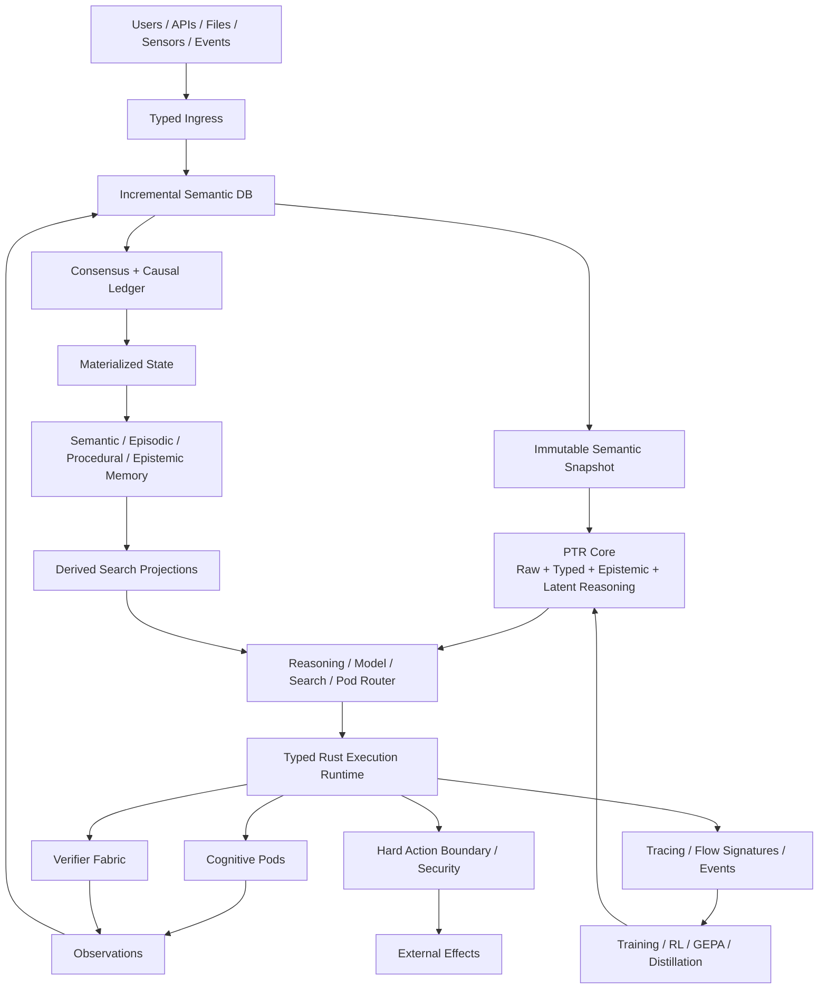
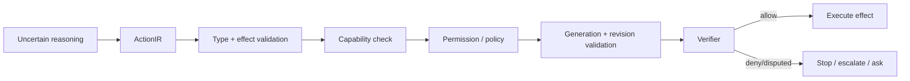

# PTR Technical Architecture

This document is the technical reference for PTR. It complements the per-crate READMEs and the focused documents in `docs/architecture/`.

## 1. Architectural objective

PTR separates **language**, **semantic state**, **uncertainty**, **reasoning method selection**, **external computation**, **verification**, **effects** and **durable authority**. The purpose is to avoid making a single autoregressive token stream responsible for every concern.

## 2. Planes

### Ingress plane
Preserves raw evidence, performs byte/MIME/encoding normalization, proposes typed semantics and records disagreement. The typed view is a revisable interpretation, not a replacement for the source.

### Semantic plane
`ptr-semdb` is an incremental semantic compiler. It stores ground inputs and computes dependency-aware derived values. Every reasoning run receives an immutable snapshot with a `Revision`.

### Cognitive plane
`ptr-core` maintains raw token states and a typed latent workspace. Semantic slots include goal, constraints, facts, hypotheses, distributions, unknowns, capabilities and resources. Latent recurrent steps may update this state without serializing a natural-language chain of thought.

### Routing plane
`ptr-router` decides whether to spend compute on language reasoning, branch/search, probabilistic/statistical operators, symbolic computation, simulation, retrieval or external Pods.

### Execution plane
`ptr-exec` runs typed isolates through bounded mailboxes. Backpressure, cancellation and supervision are explicit. Tokio is an implementation substrate, not the semantic execution model.

### Verification plane
`ptr-verifier` composes deterministic and executable checks before learned evaluation. A candidate may remain `Unknown` or `Disputed`; false certainty is not required for progress.

### Authority plane
Validated proposals become authoritative only after the ledger/consensus path. Cluster mode uses consensus; standalone mode uses the same event/state contracts without distributed agreement.

### Knowledge plane
Typed memory objects are authoritative semantic representations. Search engines are derived projections and must resolve a hit back to a live generation before use.

### Observation/learning plane
Tracing, FlowSignatures and trajectories create a rich record for debugging, evaluation, SFT, verifier training, RL and GEPA-style outer-loop optimization.

## 3. Authority hierarchy

1. committed consensus/ledger event;
2. validated semantic state;
3. lifecycle-managed SemanticCapsule;
4. queryable materialized view;
5. search/graph projection;
6. cache;
7. transient model hidden state.

No layer may promote itself upward without the validation/commit contract of the higher layer.

## 4. Revision vs Generation

**Revision** identifies the global input world observed by a computation.  
**Generation** identifies the lifecycle version of one semantic object.

A snapshot may be `revision=812` while containing `Project@g17`, `Constraint@g4` and `Procedure@g9`. A new unrelated input can advance the revision without changing any of those generations.

## 5. Data representations

| Boundary | Preferred representation | Reason |
|---|---|---|
| Rust domain | strong structs/enums/newtypes | semantic safety |
| Public API | JSON | interoperability/debuggability |
| Network control | Protobuf/prost | versioned binary contract |
| Trusted local hot path | rkyv candidate | zero/low-copy structured access |
| GPU tensors | DLPack/CUDA handles | avoid host copies |
| Large artifacts | content-addressed blob ref | location-independent identity |

Wire compatibility is weaker than semantic compatibility; both are versioned.

## 6. Model event protocol

The long-term model interface is a stream rather than a single string:

- `SemanticSlotUpdate`
- `HypothesisCreated`
- `ConfidenceUpdated`
- `OperatorRequested`
- `PodRequested`
- `CandidateReady`
- `ActionReady`
- `Token`
- `Finished`

Backends that only support text generation can expose a reduced capability set.

## 7. Effect boundary

The core rule is: **reasoning may be soft; effects are hard**.

## 8. Consistency model

- semantic writes: linearized through the authority layer in cluster mode;
- materialized views: derived from committed index;
- search indexes: asynchronous/eventually consistent;
- caches: disposable;
- reasoning snapshots: immutable and revision-scoped.

Search/index lag is safe because every hit must be generation-validated before promotion.

## 9. Failure model

PTR must explicitly test:

- crash before/after log append and fsync;
- crash after commit but before materialization;
- stale search hit after revocation;
- stale reasoning snapshot after a user/policy update;
- duplicated remote Pod request;
- network partition/leader change;
- queue saturation/backpressure;
- verifier disagreement;
- partially available inference/search backends.

`fail-rs` and deterministic replay are intended to make these failures reproducible.

## 10. Replaceability

External systems are evaluated behind PTR-owned contracts. Changing Zvec to another local vector engine, or Iroh to another transport, may change performance/operations but may not change semantic invariants.

See [Component contracts](COMPONENT_CONTRACTS.md) and [Evaluation architecture](architecture/12-evaluation.md).
