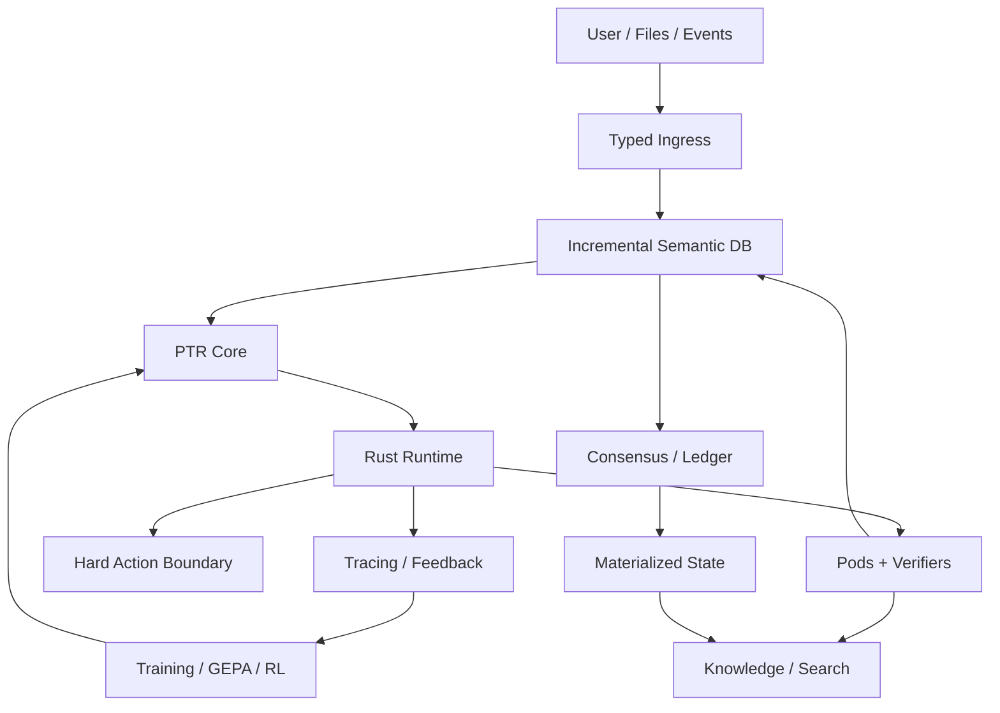

# System Architecture

PTR consists of eight cooperating planes: ingress, incremental semantic state, PTR Core, execution, knowledge/search, causal authority, distributed transport, and learning/observability.

Authority flows downward from committed causal state into semantic state and derived indexes. Fast indexes never become authoritative.
