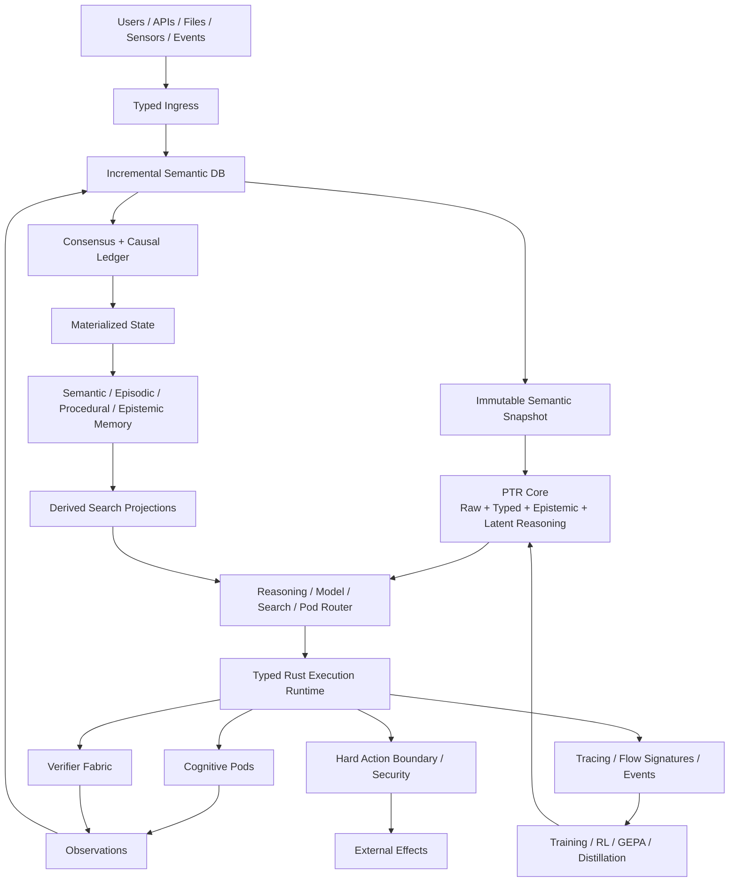

# System Architecture

PTR is split into semantic, cognitive, execution, authority and learning planes rather than treating the LLM as the whole application.

## Planes

1. **Ingress** — preserve raw evidence and produce a typed proposal.
2. **SemDB** — incremental/revisioned semantic world model.
3. **PTR Core** — raw + typed latent cognition.
4. **Router/Execution** — choose and run reasoning operators and Pods.
5. **Verifier/Security** — validate evidence and effects.
6. **Ledger/State** — causal authority and current materialization.
7. **Memory/Search** — lifecycle-managed memory plus derived retrieval.
8. **Observation/Learning** — traces, trajectories, experiments and training.

## Primary dependency direction

Domain semantics should point inward toward `ptr-types`; infrastructure adapters point outward. A search engine, network library or inference server must never become a dependency of the domain vocabulary.

## Truth boundary

See [authority-chain.mmd](../diagrams/authority-chain.mmd) and [Global invariants](../INVARIANTS.md).
