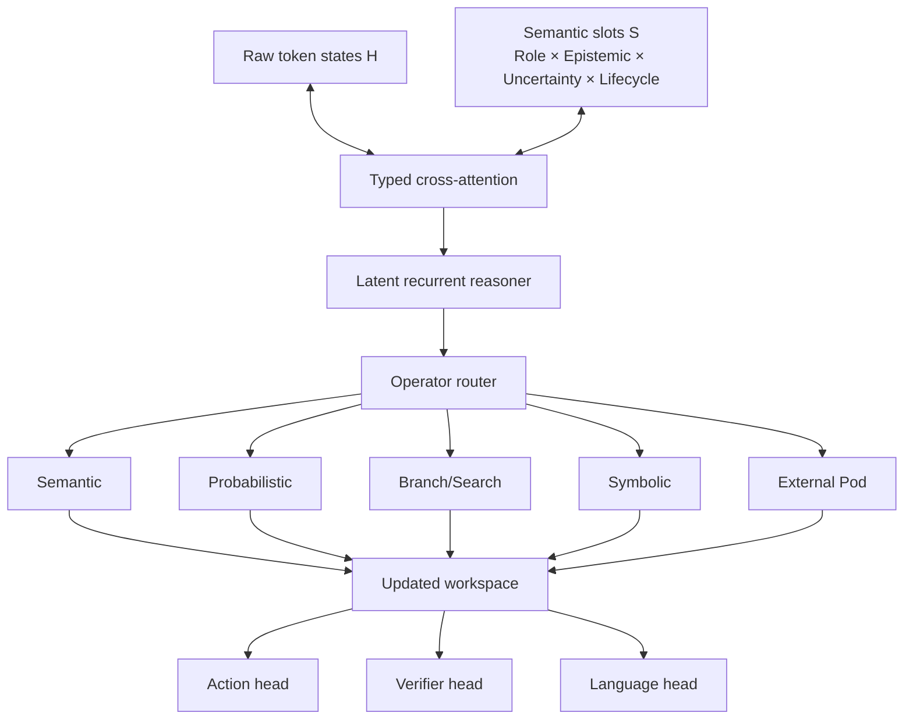

# PTR Core Architecture

PTR Core is the experimental model architecture.

## State

A classical token state `H[N,d]` is complemented by a compact semantic workspace `S[M,d]`. Slots carry orthogonal `SemanticRole`, `EpistemicState`, `UncertaintyKind`, confidence, generation/validity and provenance metadata. The latent vector remains model-owned; the semantic axes come from `ptr-types`.

## Main research modifications

- dual raw + typed representation;
- semantic slots with separated semantic-role / epistemic / uncertainty axes;
- role/epistemic/uncertainty/lifecycle-aware attention;
- recurrent latent reasoning;
- operator routing;
- branch/search and probabilistic primitives;
- ActionIR and verifier heads;
- streaming ModelEvents;
- PTR-AR and PTR-Diff families.

Every item has a spec in `model/modifications/` and must be ablated independently.

## Hard separation

The model proposes. The runtime authorizes. A high-confidence neural state is not a capability grant, ledger commit or verified fact.

## Baselines

Compare against the same backbone with:
- no semantic slots;
- no typed attention;
- no latent recurrence;
- no operator router;
- ordinary tool calling;
- strong RAG/GraphRAG baselines.
