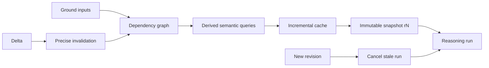

# Incremental Semantic Database

`ptr-semdb` is designed like an incremental compiler.

## Ground state

Only externally observed or committed information is ground state: raw inputs, artifact refs, policy/capability state, Pod manifests, verified observations and committed materialized data.

## Derived queries

Entities, relations, constraints, typed intent, open questions, reasoning requirements and compact project skeletons are derived.

## Snapshot semantics

Reasoning receives `SemanticSnapshot{revision}`. If the host advances while a run is still pending, the old run can be cancelled or required to explicitly reconcile.

## Invalidation

A delta invalidates its dependency closure rather than forcing whole-project recomputation. High-risk and dirty values receive stronger cross-verification.

## Evaluation

Measure invalidation cardinality, recomputation cost, stale-run cancellation latency and correctness under adversarial dependency graphs.
