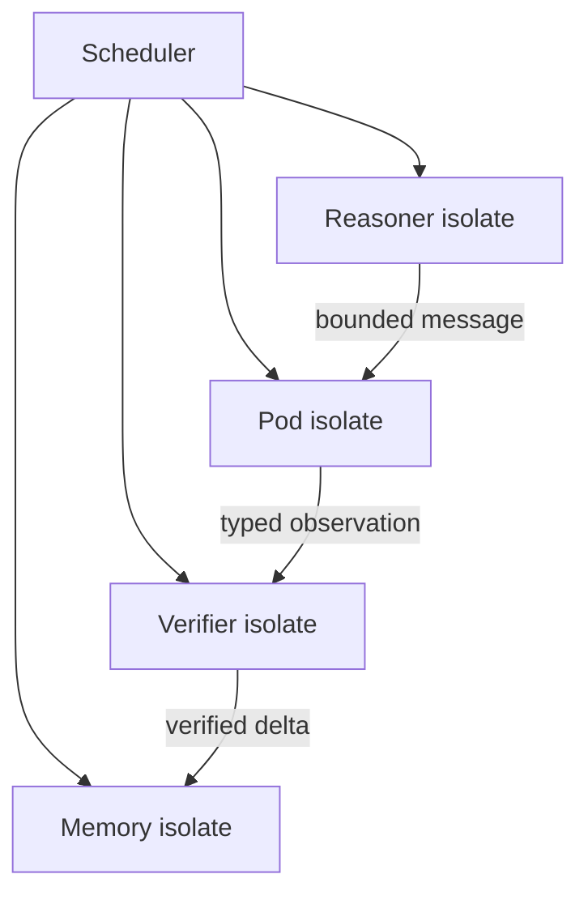

# Rust Execution Runtime

PTR owns execution semantics even if Tokio supplies low-level async I/O.

## Model

- isolated state machines;
- bounded typed mailboxes;
- explicit send failure/backpressure;
- supervision trees;
- cancellation and deadlines;
- replay hooks;
- no default global `Arc<Mutex<Everything>>`.

## Effect execution

Isolates emit explicit effects. The effect path is checked by `ptr-security` before an external mutation.

## Runtime alternatives

Tokio is the default substrate. Tina-style isolate semantics and Compio-style I/O remain benchmarkable alternatives, but mixing async runtimes is avoided without measured benefit.
